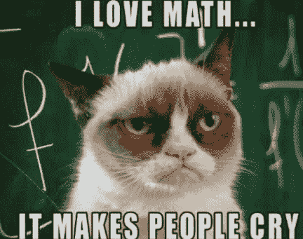
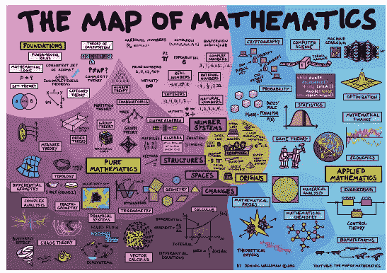
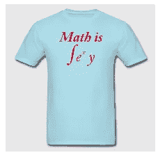
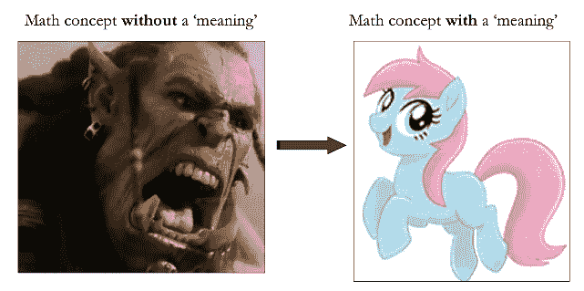
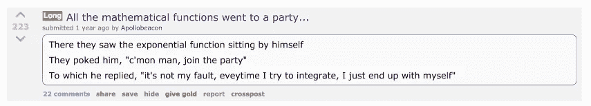
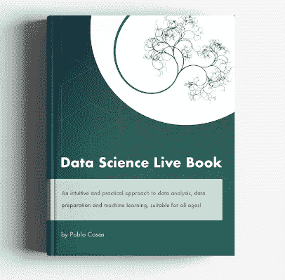

# “我讨厌数学！”—教育和人工智能在我们所做的事情中寻找意义

> 原文：<https://towardsdatascience.com/i-hate-math-part-1-4e793f5a8f72?source=collection_archive---------9----------------------->

你讨厌的是数学的教授方式。

那一大堆方程式、抽象概念和我们不知道的问题的解决方案，我们很难享受那些我们感觉不属于其中的东西。

但是把我们周围世界的一些数学技巧联系起来怎么样？有可能重新发现数学吗？你愿意试一试吗？

这么多问题！让我们和一只可爱的小猫一起放松一下:

可爱的😍！

解数百个方程，解什么“ *X 等于*”……或者，嗯，学习其他数学概念，比如“导数”(【https://en.wikipedia.org/wiki/Derivative】)是有区别的。

同样，我们解决了几十个不同的问题，包括衍生品。我们练习，解答，再解答，过了一会儿，我们忘记了第一次练习的答案。

当然，有些人乐于解决这类问题，开发新的数学定理，或解决费马大定理([http://www . telegraph . co . uk/science/2016/03/20/why-its-so-impressive-that-fermats-last-theorum-has-solved/](http://www.telegraph.co.uk/science/2016/03/20/why-its-so-impressive-that-fermats-last-theorum-has-been-solved/))，这是一个致力于抽象数学的数学分支。姑且称之为*纯数学*。

[放大图像。](https://www.flickr.com/photos/95869671@N08/32264483720/in/photostream/)
来源:[http://dominicwalliman.com/](http://dominicwalliman.com/)

如果你在这一点上喜欢数学，找到了！如果你没有，那我邀请你继续读下去……我们就去*应用数学领域*。

# 我的个人经历

当我在高中和大学以标准的方式学习数学时，我有点不情愿。练习指南以千克为单位称重，学生们成为解决数学问题的熟练忍者，却忘记了所有这些的目的(除了通过考试)，也不知道所有这些的真正用途。

# “我为什么要学这个？”这就是问题所在

在大学里，当我协助一个名为“人工智能和机器人”的研讨会时，一切都开始改变。(好酷的名字！)

一到那里，我就体验到了我以前写过的东西:当演讲者在解释人工神经网络时说:

“人工神经网络可以学习…”🙀哇！

他们的学习得益于一种叫做反向传播的算法。通过使用衍生品！！！

所以导数除了通过考试还有别的用处！让我们来说明这一点:

> “我们害怕我们不了解的东西。”—很多人。

# 数学在实践中！

这种算法(反向传播)与现在深度学习(人工智能)中使用的 TensorFlow 框架下的“梯度下降”高度相关。

deep learning——谷歌推出的神经网络的花哨名字，([https://static . Google user content . com/media/research . Google . com/en//pubs/archive/45530 . pdf](https://static.googleusercontent.com/media/research.google.com/en//pubs/archive/45530.pdf))。

你不需要知道如何求导。但是，了解其背后的原因可以帮助您:

a)训练你的逻辑技能(比如在困难水平下解数独)
b)开发新的算法。
c) *其他*

如果你没有，放松下来，只是保持高水平，同时将过程作为黑盒使用——但是对什么是输入和输出有**深刻的理解**。

—

*免责声明*:我不是衍生品的狂热爱好者；其实我今天连怎么推导都不记得了，只记得“指数函数”因为笑话:

来源: [Reddit 笑话](https://www.reddit.com/r/Jokes/comments/4c0rs5/all_the_mathematical_functions_went_to_a_party)

—

反正我的个人经历**和这里的**不相关。此时最重要的是:

📌当我们学习任何新东西时(抽象的东西更是如此)，通过使用诸如“它对什么有用”、“谁在使用它”、“它与我已经知道的任何东西相似吗”、“背后的直觉是什么”等问题进行研究来找到意义是很方便的

📌我发现学习数学时有用的另一个要点是**通过编码学习**！

📌寻找例子——当然我们周围有很多。通过改变代码的参数来播放和销毁代码。使用**试错**的强大技术。

# 我们公正的朋友:试错法

我们试了一次，结果却犯了一个大错误。我们再次尝试，得到一个较小的误差，最后，我们最后一次尝试产生最小的误差！

这个误差这么小，也算我们学会了！

(这过于简单化了，但这就是深度学习的学习方式😉)

你不知道吗？现在你知道了。这是一个通过直觉学习的例子，通过使用已知的东西。

下面看一个真实的例子。深度学习就是这样学习的(用 R):

来源:[https://keras . r studio . com/articles/training _ visualization . html](https://keras.rstudio.com/articles/training_visualization.html)

在深度学习术语中:

*   这种损失可以看作是错误。
*   准确度是…准确度。
*   每个纪元就是时间。

*在:* [了解深度学习的介绍 https://medium . freecodecamp . org/want-to-know-how-deep-learning-works-heres-a-quick-guide-for-every one-1 adeca 88076](https://medium.freecodecamp.org/want-to-know-how-deep-learning-works-heres-a-quick-guide-for-everyone-1aedeca88076)

## 逆向工程:从人工智能到“现实生活”

当我们为考试而学习时，我们用一个我们知道有结果(蓝线)的练习指南练习几次(epochs)，所以我们学习如何解决那些问题(使准确率更高)。

现在老师设置一个考试，我们不知道结果，她/他用已知答案(橙色线)进行评估。

# 最后的话

当我们学习时，通过联想来做**是很方便的(就像我们在最后几段中做的那样)。**

与其说我们是一个“方程的数据仓库”，不如说我们作为人类更适合将事物互联，**在我们想要探索的知识中寻找目的**，对呈现在我们面前的**提出质疑**。

联系概念，使用你真实的“现实生活”知识，实践，并找到你所做的事情的意义。

这就是这篇文章的主旨。

*哦..还在吗？看看这个*👇

我不能保证它会很容易理解，但我邀请大家阅读我刚刚出版的开源书籍“数据科学活书”📗。

这是我目前从实用和直观的角度教授数据科学的最佳尝试。

这本书可以在[http://livebook.datascienceheroes.com](http://livebook.datascienceheroes.com)获得🚀

谢谢🙂

—

推特: [@pabloc_ds](https://twitter.com/pabloc_ds) 🐦|| [博客](https://blog.datascienceheroes.com/) ✍️.