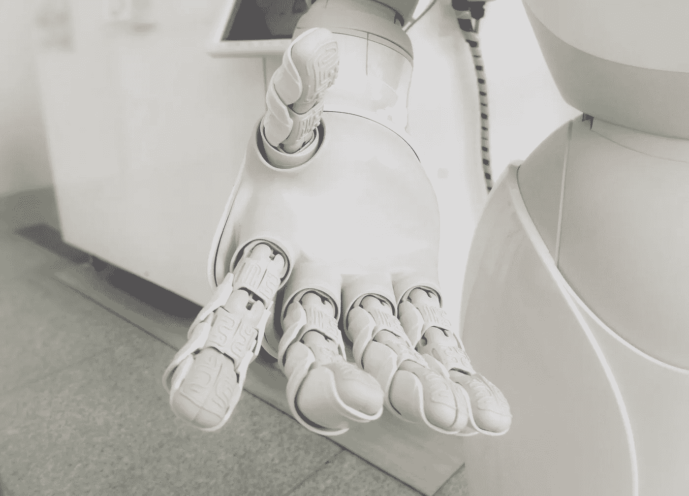

# 我，机器人和人力资源总监

> 原文：<https://towardsdatascience.com/i-robot-and-hr-director-6b1604921870?source=collection_archive---------18----------------------->

人工智能被专注于软技能的部门采用和使用只是时间问题。传统上，人力资源管理是心理学家和其他更具人文精神的专家的领域。计算机能代替多年的经验和人类互动来评估最佳候选人吗？

事实上，人工智能的作用是与人力资源经理和招聘人员并肩工作，向他们伸出援助之手，并承担一些底层工作。采用这一系统有望提高准确性、降低成本并最终加快流程，而现在从开始到结束可能需要几个月的时间和数千美元的成本。

## 工作流程管理

像在其他领域一样，引入自动化工具对各种过程都有积极的影响。第一个变化是速度和节奏的变化。其他改进包括流程标准化和消除偏见。

## 候选人筛选

目前，候选人筛选占据了大部分时间。主要的问题是许多申请人不符合他们申请的职位的条件。Glassdoor 声称大多数候选人在简历中撒谎，或者至少美化他们的简历。另一项[研究](https://www.nationsearch.com/blog/58-of-applicants-lie-on-their-resumes-and-you-dont-know-who-they-are)详细说明了这种详述包括夸大他们的技能、以前的职责、职称、学位、公司和奖励。当然，更严重的隐瞒与他们被解雇的原因和犯罪记录有关。

人工智能通过其检测模式的能力，将成为根据一些预先定义的标准筛选简历的完美工具。在初步筛选排除了第一批不合适的候选人后，进一步的调查可能会发现一些危险信号，比如与以前的经验不匹配的技能、虚假的推荐信等等。

## 改善和规范职位匹配

LinkedIn 等平台以及专有的人力资源管理系统包含大量信息，可用于训练算法，以识别候选人的技能组合、职位甚至成长路径之间的最佳匹配。

更好的工作匹配有大量的长期优势，包括更快乐、更有效率的员工，他们不太可能换工作。[来自 InData Labs](https://indatalabs.com/services/ai-software-development) 的人工智能开发人员声称，随着系统的学习和发展，它将能够通过快速浏览上传的简历来找到合适的候选人，甚至通过搜索公开信息和识别最佳人选来取代猎头。

## 情感分析

如今有很多关于政治正确、行为公正和不偏不倚以及消除任何形式的工作场所歧视的言论。然而，旧习难改，有时一个良好的意图可能会适得其反。人工智能可以帮助识别潜在的性别、种族或职业偏见，并建议更好的词语，以非对抗性的方式表达相同的想法，适合全球化的世界。

这一切都从招聘启事开始，招聘启事需要清晰、简洁，用公司自己的声音写出来。阅读它应该让潜在的候选人感觉到他们的个性和公司的个性是否匹配。情感分析可以指示公告的文本是更有趣、公司还是学术。

## 商业模式

尽管人工智能可以帮助削减一些关键的招聘成本，但它仍然需要定义其工作的商业模式。招聘是一种行为，只有当一个完美的候选人或一份优秀的工作被匹配时，才能为客户创造价值。因此，按成功付费是合理的。

这使得提供此类服务的公司现金流波动，可能很快导致破产，或者至少让它们陷入生存模式，而不是提供增长机会。

为了成功地提供基于人工智能的招聘服务，有必要要么确定对员工需求高且相对容易找到技能的活动部门，要么确定除准时雇佣之外提供价值的方法，以证明经常性费用的合理性。

例如，这样的公司可以创建一个人力资源聊天机器人，取代该部门执行的一些乏味的工作，如回答员工的日常询问，就像银行机器人为客户做的一样。

## 伦理问题

我们之前提到过人工智能是一种消除任何偏见的工具，但这只是在用于训练系统的数据已经针对这些错误进行了检查的情况下。毕竟，人工智能的行为很像一个孩子，无论教它什么，它都会繁殖和延续。

这方面的一个主要例子是微软的 Tay bot，由于用户的输入，它在几个小时内就喷出了恐同和纳粹言论。同样，犯罪预防机制正在根据种族和教育做出假设。这些模式虽然有统计学上的原因支持，但对那些有前途的候选人来说可能是有害的，因为他们是各自阵营中的局外人。

当人工智能成为一种工具时，个人数据安全和隐私也是一个重要的问题。由于它只能通过大量数据来发挥作用，因此可以将 AI 视为对个人隐私的威胁。尽管 GDPR 的法规努力给这种混乱带来一些秩序，并防止未来剑桥分析公司的丑闻，但仍不清楚现有的立法框架是否足够。

## 今后

即使人工智能不会很快让人力资源专家失业，它也会带来一些新的工作和招聘方式。从好的方面来看，人工筛选不合适的候选人可能会节省大量的时间和精力。当然，使用这样的系统需要一定的学习过程，这甚至会降低常规操作的速度。

另一方面，人力资源人员可能会发现他们被从一个乏味的任务重新分配到另一个任务。由于人工智能需要良好的数据来学习，他们可能会陷入标记数据是否合适或排列候选人的枯燥工作中，只是为了给系统提供一组良好的信息。这被称为监督学习，对于人力资源来说，这可能是最好的方法，因为无监督系统会自己做出决定，这可能不一定是成为好同事和好员工的最佳方式。