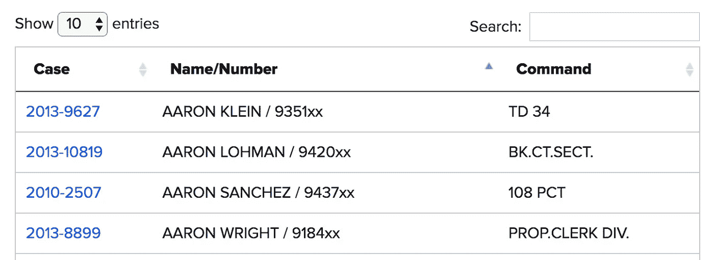
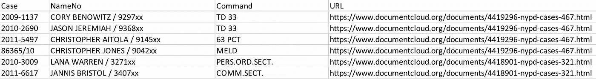
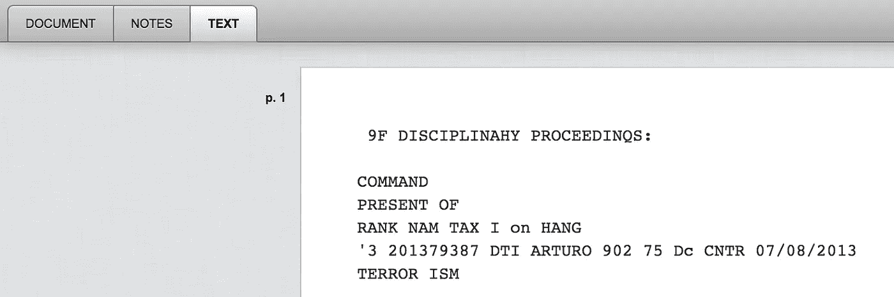
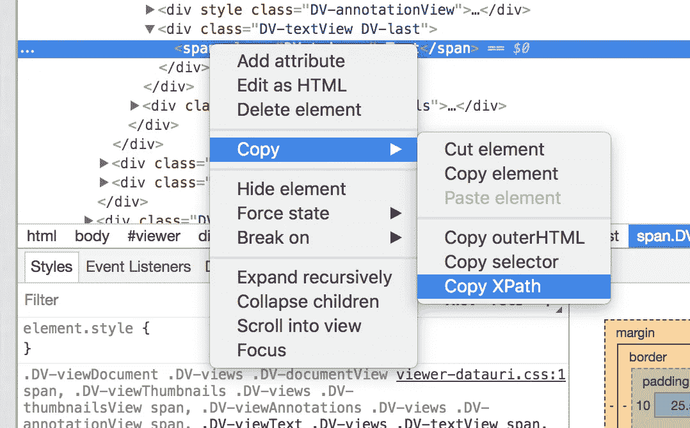

# 我从 BuzzFeed 上搜集了 NYPD 警察纪律案件的数据库

> 原文：<https://towardsdatascience.com/i-scraped-buzzfeeds-database-of-nypd-police-disciplinary-cases-74a30bb5fde8?source=collection_archive---------9----------------------->

## BuzzFeed 的数据很棒，但我们能以一种更有用的格式收集它吗？

Photo by [Dane Tewari](https://unsplash.com/@worldcity?utm_source=medium&utm_medium=referral) on [Unsplash](https://unsplash.com?utm_source=medium&utm_medium=referral)

**TL；博士:** BuzzFeed 今天发布了一组[有趣的数据](https://www.buzzfeed.com/kendalltaggart/nypd-police-misconduct-database-explainer)——大约 1800 名被“指控行为不当”的纽约警察局(NYPD)雇员的纪律案件档案我写了[一个 scraper](https://github.com/joshtemple/nypd-cases) 来下载 PDF 和纯文本格式的数据进行大规模分析。

不幸的是，案例文件的存储方式不便于大规模分析。每个案例文件都以单独的 PDF 格式存储，但是没有明确的方法下载所有的文件。原始文本存储在 JavaScript 界面中的选项卡后面。

我想对这些数据进行一些基于文本的分析，但是为了做到这一点，我需要每个案例文件的原始文本(最好是 pdf)。手动下载每一个都很耗时，所以我决定构建一个刮刀来收集数据。

## 下载 PDF 数据

首先，BuzzFeed 提供了一个有用的 [CSV 文件](http://data.buzzfeed.com/projects/2018-04-nypd/nypd-discipline.csv)，其中包含每个案例文件的 URL。

A few rows from the BuzzFeed CSV.

CSV 中的链接会将您带到存储在 DocumentCloud 上的案例文件。该接口主要是 JavaScript，这使得抓取更具挑战性，因为没有太多的 HTML。

Each case file has been converted to plain text via [optical character recognition (OCR)](https://en.wikipedia.org/wiki/Optical_character_recognition), though the conversion is fairly messy.

我的第一个目标是下载 PDF 格式的所有案例文件。PDF 文件存储在与 BuzzFeed CSV 中的 URL 结构非常相似的 URL 中。通过一点 regex，我能够将 DocumentCloud URLs 转换为 PDF 资产的 URL，并使用 Python 的 [requests](http://docs.python-requests.org/en/master/) 库下载它们。

A few regular expressions format the URL correctly for downloading the PDF.

## 下载文本数据

下载转换后的纯文本更具挑战性。纯文本位于 DocumentCloud JavaScript 界面中，在一个名为 text 的选项卡后面。通过 HTML 抓取文本是不可行的，因为它不存在于页面的常规源代码中。对于 Selenium 这样的 web 驱动程序来说，这是一个自然的用例，它允许您像人类一样与 web 页面进行交互。

为了获取数据，我需要 Selenium 单击 Text 选项卡，以便下载纯文本。我需要一种可靠的方法来访问 Selenium 中的文本选项卡，所以我使用了 Chrome 的开发工具*(在 Chrome 中，右键单击感兴趣的元素，然后单击 Inspect)* 来获取文本选项卡的 XPath。 [XPath](https://en.wikipedia.org/wiki/XPath) 是一种查询语言，它使得在网页上查找特定元素变得更加容易。有时候自己编写 XPath 查询更好，因为这样会更灵活。在这种情况下，Chrome 的 XPath 足以让我每次都能看到文本标签。

Chrome Developer Tools makes XPath easy. Right click on the tag of interest and choose Copy >> Copy XPath.

使用 XPath 查询，我指示 Selenium 单击 Text 选项卡。通过检查 Chrome 开发工具中的文本，不难获得纯文本的 HTML 类的名称。我可以使用 Selenium 的 text 属性将原始文本下载到一个文件中。

最后，我编写了一个循环来为 CSV 中的每个 URL 下载 PDF 和原始文本文件。现在，我有了一个数据语料库，可以对其应用我自己的 OCR 算法或建立文本挖掘分析。

一般来说，没有一种“正确的”方法可以从网络上抓取数据。在这种情况下，我没有使用基于 HTML 的抓取(例如，使用像[请求](http://docs.python-requests.org/en/master/)这样的库)，但是逆向工程 URL 和 Selenium 抓取的结合给了我所需要的。

如果您想下载 BuzzFeed 数据集用于您自己的分析，请在这里克隆我的刮刀[并让我知道它是如何为您工作的！](https://github.com/joshtemple/nypd-cases)