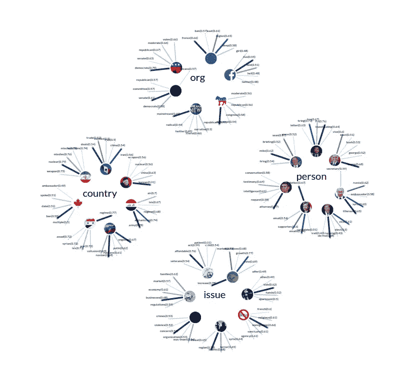
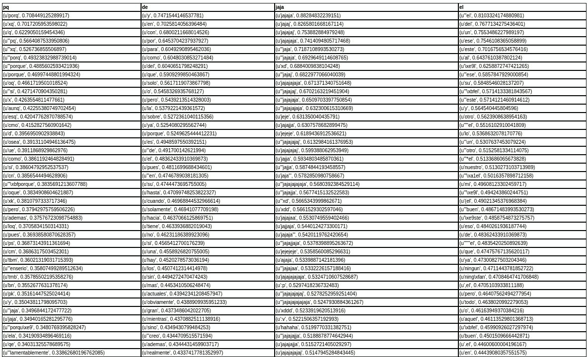

# 我训练了一个严格按照福克斯新闻频道广播饮食的 Word2Vec 模型

> 原文：<https://towardsdatascience.com/i-trained-a-word2vec-model-on-a-strict-diet-of-fox-news-broadcasts-14da0b174b11?source=collection_archive---------7----------------------->

这是它对世界的看法。

Screenshot of my attempt at a visually representing word embeddings. See the original [here.](http://truediggs.com/presdev/neww2v.html)

# 背景

几个月前，我第一次开始尝试 Word2Vec，当时我在 NYU 大学为一门文本分析课程做项目。该项目是一种概念验证，包括收集和分析数百万西班牙语 YouTube 评论，试图检测和测量政治导向的言论。

虽然 Word2Vec 实际上不是我们在本课程中学习的模型之一，但它捕捉单词之间微妙关系的能力给我留下了深刻的印象。

分析用户生成的西班牙语文本的一个主要问题是拼写——尽管有很大程度上的音位拼写，我发现到处都有拼写和语法错误。

不幸的是，目前可用的停用词词典只包括单词的正式拼写，这实际上比某些术语的错误拼写更不常见。更糟糕的是，拼写错误如此之多，以至于无法通过调整词频或缩减采样来消除。

Word2Vec 来救援！通过选取一个常见的拼写错误，并在模型中查询 50 个最相似的单词，我能够构建一个全面的停用词字典来过滤它们。

Fifty common but not super-common variations on the word “haha”? Not funny!

# 那么，为什么是福克斯新闻频道？

上面的实验真正说明了 Word2Vec 揭开语言“个性”的真正力量。我想:如果我训练一个 Word2Vec 语言模型，它以一种非常微妙的方式只代表现实的一种视觉，会怎么样？我唯一能想到的英语候选人是福克斯新闻频道。

# 挑战

## 获取文本

虽然福克斯新闻频道实际上在其网站上制作书面文本，但我想要一个考虑到整个福克斯体验的语料库:嘉宾评论、即兴评论、主持人之间的戏谑等。

我家里没有有线电视，所以我建立了一个网络抓取器，提取了当时福克斯新闻频道网站上所有视频的音频——大约 1150 个剪辑，长度从 1 分钟到 20 分钟不等。虽然一些视频可以追溯到 2015 年，但绝大多数是在过去六个月发布的。

为了转换音频，我使用了谷歌的语音识别 API，因为它产生的结果比任何其他服务都好得多(加上他们给你 300 美元的免费积分)。我在这里解释我是如何做到这一点的[。](https://medium.com/towards-data-science/tutorial-asynchronous-speech-recognition-in-python-b1215d501c64)

## 哦，标点符号…

语音识别模型的一个不幸之处是，它们返回的文本实际上没有任何标点符号。这在使用 Word2Vec 时特别烦人，因为您需要向它输入标记化的句子(需要标点)。

幸运的是，奥托卡·提尔克已经掩护了我。他训练了一个双向递归神经网络模型，可以恢复英语文本中的标点符号。最棒的是，这个了不起的人还创造了一个 [API](http://bark.phon.ioc.ee/punctuator) ，你可以很容易地从 Python 中查询。

## 唐纳德卡车在房子里！

没错。谷歌并非完美无瑕。有时它会误解某些单词和短语，尤其是当人们互相谈论的时候。例如，与[迈克尔·弗林](https://en.wikipedia.org/wiki/Michael_T._Flynn)相关的最常见术语之一是“律师”，但“锦标赛”一词也出现在前 20 名中。

我最初的策略是尝试使用变音编码和模糊字符串匹配来发现这些错误。然而，事实证明这比我原先预计的要花更多的时间，所以我搁置了这个想法。

最终，我能够调整 [Word2Vec](https://radimrehurek.com/gensim/models/word2vec.html) 模型的参数，以最小化不正确术语的影响。

# 结果

该模型接受了约 50 万个术语的训练——对于 Word2Vec 来说，这不是一个庞大的语料库，但结果仍然非常有趣。我列出了大约 24 个与当前事件或政治问题相关的术语，找到了与它们最相关的词，并将它们添加到(蹩脚的)D3js 图中。

不幸的是，Medium 不允许我嵌入 JavaScript vizualiations，所以你必须[在这里](http://truediggs.com/presdev/neww2v.html)查看。

一如既往，我希望听到您的反馈或建议。此外，如果你对我是如何做上述任何事情感到好奇，不要犹豫，伸出手来！