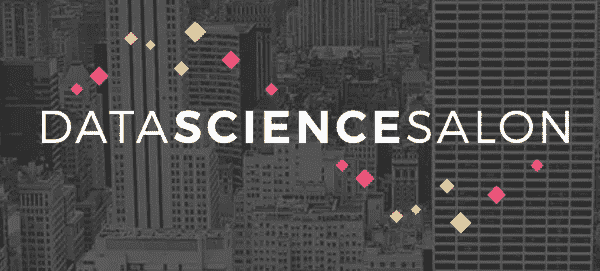

# 我参加了一个超出我能力范围的技术会议，它既令人羞愧又鼓舞人心。洛杉矶数据科学沙龙

> 原文：<https://towardsdatascience.com/i-went-to-a-tech-conference-that-was-over-my-head-it-was-humbling-and-motivating-f18327ec2f2?source=collection_archive---------14----------------------->

**会议前—** 我现在每月都会参加 Python Meetup 小组，尽管我不得不错过下一次会议，因为那天是我妻子的生日……优先事项。一天，meetup 的组织者问 meetup.com 的小组是否有人有兴趣免费参加数据科学会议。对我来说这是一个不需要动脑筋的问题，所以我马上发了电子邮件，因为前三个是先到先得的。我很幸运被选中，所以我在日历上做了标记，然后等了大约一个半月去参加洛杉矶数据科学沙龙。老实说，我从未听说过这个会议，但我很高兴尝试一些新的东西。

关于我和我为什么选择参加一个我知之甚少甚至一无所知的会议。我是计算机科学领域的大器晚成者，更不用说数据科学了。30 岁时，我重返校园，开始全职工作，现在我即将进入大学三年级，但有一个问题仍然困扰着我，我最终想做什么？我希望我能回到过去的十年，更快地进入编程，但我一直把托尼·罗宾斯的话记在脑子里，我会尽可能地转述:

*有人问他需要多长时间才能擅长一件事，他回答说这取决于那个人和他们每天投入的时间。你可以每天花一个小时，在 4 年内变得伟大，或者每天花 4 个小时，在 1 年内变得伟大。*

今天，我知道我正在追赶，这正是为什么我每天都在不断地学习和学习，而且我从来不觉得这是我“必须”做的事情，因为我真的觉得编程是我应该做的，我喜欢它。回到会议上，我仍然在考虑我的所有选择，数据科学一直非常有趣，我觉得这次会议可能是真正的数据科学的展示。

**会议日—** 终于到了参加洛杉矶数据科学沙龙的日子，但首先，如果没有交通，洛杉矶就什么都不是。开车 40 英里花了大约 2 个小时，我比我预期的晚了 20 分钟，因为我想去那里利用那里的停车场，但幸运的是，停车场很充足。

这个节目给我的第一印象是一位名叫 Jorge 的先生，他正在做登记，碰巧是一个非常好的人，非常乐于助人。他的举止肯定让我感觉很受欢迎，这减轻了我去另一个我不认识任何人的会议时的轻微焦虑。这是真的，去一个你不认识任何人的地方，更不用说对他们将要谈论的话题知之甚少，有时会令人生畏，但如果我在 JSConfUS 会议上学到了什么，介绍你自己，问是否可以加入他们，大多数时候，人们是欢迎的。

桌子是站立式的，可以容纳大约 4 个人，碰巧发现一个只有 3 个人一起吃早餐，所以我走近他们，介绍了自己，加入了他们。这将是我一天中第一次与一些极其聪明的人打交道。一个是麻省理工学院的毕业生，另一个在一家大公司的旧金山工作，最后一个有一个迷人的故事，他是如何在 2008 年前成为一名教师的。崩溃发生后，他连续三年被校区解雇，这让他决定从事数据科学方面的职业。他做了一段时间 api 文档的单调工作，最终在一家成功的初创公司找到了一份工作。当我分享的时候，我从我是会员的 meetup 上拿到了票，他说他也是橘子郡的一个 Python 团体的成员，我看着他说，“你是三个中的一个吗？!"。另外两个家伙笑了，因为他认为我的意思是 Python Meetup 中只有三个成员，然后我们都笑了。所以，是的，显然他们中的一个是同事，我们只是没有见过面，但我们现在有了…网络。

**会谈(午餐前)——** 人们去参加会议的第二个原因，除了交流就是会谈，对我来说，我终于要看到数据科学是如何在真实的商业世界中使用的，我不会撒谎，有些概念超出了我的理解。现在我不会谈论太多，因为他们将在网上，还有更多真正可以说的，此外，这么多聪明的头脑，有时太聪明了，我跟不上。我并不觉得这本身令人沮丧，因为你永远也不想成为房间里最聪明的人，因为那样你就没什么可学的了。会议主要关注娱乐行业，一般来说是如何使用他们从作为消费者的我们这里收集的所有数据，并像任何成功的企业一样，调整它以提供更好的服务。如果我不谈一个真正给我留下深刻印象的演讲者，那我就失职了。我希望有一天能成为我所观察的演讲者中的一员，但是要成为一名出色的演讲者，你不仅需要知道你要演讲的主题，还要成为一名出色的演讲者。Jen Walraven 是网飞大学科学与分析的经理，起初它几乎像是照本宣科，但即使她在与观众的随意交谈中，她的演讲和词汇也是如此流畅，这是我打算效仿的一个亮点和例子。

**午餐—** 又到了建立关系网的时刻，我又一次抓起食物，环顾四周，寻找可以加入的人。最后，我和另一组男士坐在一起，我再一次问他们做了什么。一个是大学一年级学生，另一个是研究生，最后一位是来自瑞典的数据科学家博士，现在为一家游戏公司工作。与他交谈是一次非常有启发性的经历，当我站在那里，听他讲述在一家规模虽小但极其成功的游戏公司工作的经历时，我环顾四周，意识到我的同龄人当时的渴望程度。简单地说，学士学位相当于高中文凭。我的意思是说，我周围的这些人都渴望知识，正是这种渴望推动他们取得如此成功。起初，我确实觉得我可能不属于这里，但我改变了我的心态，转而思考我是如何被几十年的经验所包围的，如果有任何时间可以问问题，时间就是那时和那里。最后，我问罗伯特，他是游戏公司的瑞典绅士博士，他会对像我这样的三个人和另外两个还在上学的人说些什么，他给出了具体、务实的建议。他说学习 R 或 Python，学习 SQL 数据库，这促使我问了一个关于 NoSQL 的问题，他的观点是，现在有了 SQL 的新功能，NoSQL 可能会过时。这可能只是一个观点，但尽管如此，这是一个有多年经验的人的观点，至少值得考虑。再说一次，我可能是房间里最笨的，但这意味着我可以问更多的问题，你会发现人们非常愿意给出建议，这次会议也不例外。哦，罗伯特最后成了演讲者之一。

**会谈(午餐后)——** 实际上，在我注册之后，我们就开始了一个关于聊天机器人的研讨会，我对聊天机器人了解不多，所以我认为这将是一个很好的关于它们做什么和如何工作的速成班。教授这个研讨会的先生们设置了一个演示，基本上和我想的一样，但令人惊讶的部分是关于如何使用框架创建自己的机器人的讨论。他漫不经心地说，但对我来说，这是我见过的最神奇的事情之一。我知道机器学习风靡一时，对业内许多人来说，它只不过是一种工具，但对我来说，它仍然是某种正在发生的魔法。不要误解我的意思，我对它的工作原理有一个非常非常一般的想法，但是让我吃惊的是，有人或一些人如此聪明地想到创造这个，这是鼓舞和激励成为那些创造者之一。

研讨会结束后，我们有一个短暂的休息时间，进行了更多的会谈，但在午餐前的会谈中，有一个人坐在两个座位之间，我们互相打了个简短的招呼，但没有更多的交谈。午饭后我又见到了他，这是一个尴尬的时刻，当你见过对方不止一次，大多数人仍然不知道谁应该先打招呼。我伸出手介绍自己，我再一次被他的故事和他为什么会在那里所吸引。他的名字叫乔丹，我记得当主持人问他为什么在那天开始的时候在那里，他说他刚刚完成一门课程，所以我问他这个问题。他的学士学位实际上是经济学，我相信他想真正进入数据科学，所以他参加了数据科学的大会课程。有趣的是，我的妻子一直在考虑 UI/UX 的大会，所以我当然代表她问了所有我能想到要问的问题，他不可能比我更了解情况和更乐于交谈。我告诉他很多事情我都不知道，但是他说因为他一个月前刚刚完成，他真的可以很好地理解，所以我又问了另一个问题。对每个人来说，最基本的话题之一就是回归。显然，我坐在后面，就像这样，是的…回归，显然每个人都知道。我问 Jordan 这是什么，他解释得很简单，就是用你拥有的信息和模式猜测其他变量。我想大会为他提供了很好的服务，实际上他对这个课程非常满意。

最后一位演讲者是珍妮·霍尔姆，她是洛杉矶市长的高级技术顾问。她展示了洛杉矶市如何利用技术来帮助城市变得更好。其中一个项目是 Hack LA，听起来很棒，能够成为帮助当地政府改善城市的团体的一员。我住在奥兰治县，到目前为止，我还没有找到一个类似的地方，但它确实激励我思考我能做些什么来帮助我的城市。去年，我们在火灾期间被疏散，这让我想到，也许我可以创建一个应用程序，可以直接向消防队员发送 SOS，消防队员可以获得 SOS 的 gps 位置，当他们靠近时，他们可以激活一个环，帮助他们定位被困人员。更好的办法是让消防队员利用这项技术来定位彼此。我对今天消防队员用的东西知之甚少，但是我哥哥想加入消防队，我可以问问他。不朽的工程，但现在至少我有一个想法，可以慢慢地建立它。

**闭幕式—** 这一天结束了，现在，因为是洛杉矶，是时候等待交通缓解一些了，所以我决定在附近等一等，做一些网络工作。遇见了安迪，他来自辛辛那提，和他的妻子在一起。他来自克利夫兰，我从他那里学到了宝贵的一课，在辛辛那提，你可以穿任何球队的球衣，除了巴尔的摩，这结束了我的第一次数据科学沙龙 LA conference。参加一个我无法理解的会议的最大好处是，即使你不明白人们在做什么，你也会了解他们是多么的聪明，但在提问的过程中，你会对日常生活有一个实际的了解，这是非常有价值的，尤其是如果数据科学起初看起来很神秘的话。