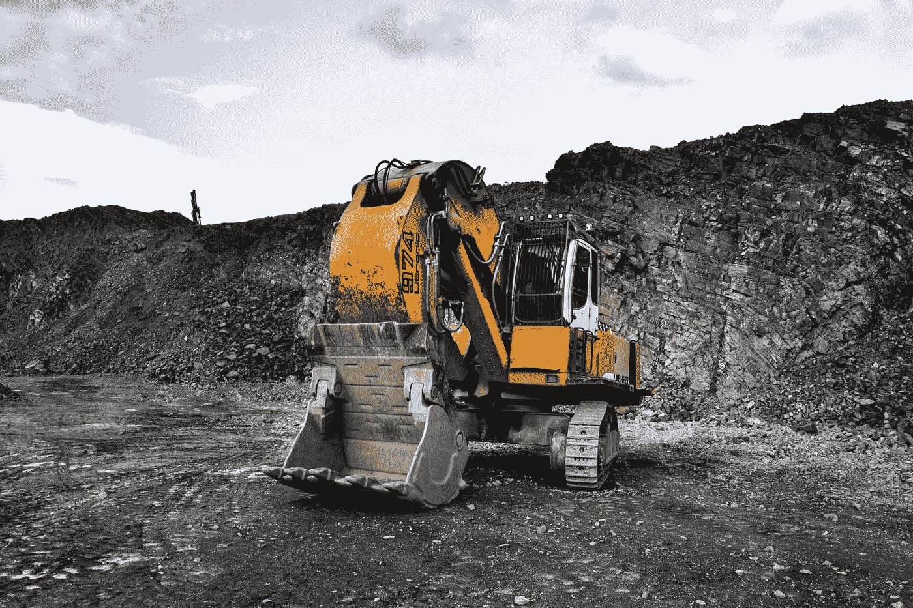

# 作为软件工程师，我和一位数据科学家一起工作。下面是我的经验。

> 原文：<https://towardsdatascience.com/i-worked-with-a-data-scientist-heres-what-i-learned-2e19c5f5204?source=collection_archive---------2----------------------->

## 谈论我作为一名 Java/Kotlin 开发人员与我们的数据科学家一起工作的经历

Photo by [Daniel Cheung](https://unsplash.com/@danielkcheung?utm_source=medium&utm_medium=referral) on [Unsplash](https://unsplash.com?utm_source=medium&utm_medium=referral)

## 背景

2017 年末，我开始对机器学习领域产生兴趣。我[讲了我开始旅行时的经历](https://medium.com/@bendaniel10/hello-machine-learning-cc89b3ccbe4d)。总之，它充满了有趣的挑战和大量的学习。我是一名 Android 工程师，这是我与我们的数据科学家合作 ML 项目的经验。

我记得我试图解决我们的一个应用程序中出现的图像分类问题。我们需要根据一组定义好的规则来区分有效和无效的图像。我立刻从 Deeplearning4J (dl4j)修改了[这个例子](https://github.com/deeplearning4j/dl4j-examples/blob/master/dl4j-examples/src/main/java/org/deeplearning4j/examples/convolution/AnimalsClassification.java)，并尝试用它来处理分类任务。我没有得到我期望的结果，但我保持乐观。

我使用 dl4j 示例代码的方法并不成功，因为我获得的准确性和训练模型的最终大小。这不可能，因为我们需要一个紧凑的文件大小的模型，这对于移动设备特别重要。

## 进入数据科学家

Photo by [rawpixel](https://unsplash.com/@rawpixel?utm_source=medium&utm_medium=referral) on [Unsplash](https://unsplash.com?utm_source=medium&utm_medium=referral)

大约就在这个时候，[我们](https://seamfix.com/)聘请了一位数据科学家，他带来了丰富的相关经验。我后来从他身上学到了很多东西。在我发现大多数 ML 问题可以用 Python 解决之后，我很不情愿地开始学习 Python 的基础知识。我后来发现有些东西在 Python 中更容易实现，因为在 Python 社区中已经有了对 ML 的巨大支持。

我们从小型学习会议开始。此时，我的其他团队成员开始感兴趣，也加入了会议。他给我们介绍了 [Jupyter 笔记本](https://jupyter.org/install)和[云机器学习引擎](https://cloud.google.com/ml-engine/docs/tensorflow/getting-started-training-prediction)。我们很快就开始尝试使用花数据集的例子进行[图像分类。](https://cloud.google.com/ml-engine/docs/tensorflow/flowers-tutorial)

在团队中的每个人都具备了培训和部署模型的基础知识之后，我们直接进入了未完成的任务。作为一名团队成员，我当时专注于两项任务:图像分类问题和分割问题。这两种方法后来都使用卷积神经网络(CNN)来实现。

## 准备培训数据并不容易

Photo by [Jonny Caspari](https://unsplash.com/@jonnysplsh?utm_source=medium&utm_medium=referral) on [Unsplash](https://unsplash.com?utm_source=medium&utm_medium=referral)

这两项任务都需要大量的训练数据。好消息是我们有很多数据。坏消息是它们没有分类/没有注释。我终于明白 ML 专家说的花最多时间准备训练数据而不是训练模型本身。

对于分类任务，我们需要将成千上万的图像分成不同的类别。这是一项乏味的工作。我不得不调用我的 Java Swing 技能来构建使这项任务更容易的 GUI，但是总的来说，这项任务对于参与人工分类的每个人来说都是单调的。

分割过程有点复杂。我们很幸运地找到了一些擅长细分的模型，但不幸的是它们太大了。我们还希望该模型能够在规格非常低的 Android 设备上运行。这位数据科学家灵光一现，建议我们使用巨大的模型来生成训练数据，这些数据将用于构建我们自己的 mobilenet。

## 培养

我们最终换成了 [AWS 深度学习 AMI](https://docs.aws.amazon.com/dlami/latest/devguide/launch-config.html) 。我们已经对 AWS 很满意了，他们提供这样的服务是一个优势。为图像分割训练模型的过程完全由我们的数据科学家处理，我站在他旁边做笔记:)。

Those are not the actual logs, LOL.

训练该模型是一项计算密集型任务。这是我看到在有足够的 GPU 和 RAM 的计算机上训练的重要性的时候。训练所花的时间相当短，因为我们在训练中使用了这样的计算机。如果我们使用一台基本的计算机，即使不是几个月，也要花几个星期。

我负责图像分类模型的训练。我们不需要在云上训练它，事实上，我是在我的 Macbook pro 上训练的。这是因为我只训练了神经网络的最后一层，而不是我们为分割模型所做的完整网络训练。

## 我们成功了

经过严格测试后，这两种型号都进入了我们的生产环境🎉。一名团队成员负责构建 Java 包装库。这样做是为了使模型可以以一种抽象的方式使用，这种方式涉及到向模型提供图像和从概率张量中提取有意义的结果。这是包含模型对单个图像进行预测的结果的数组。在这一点上我也参与了一点，因为我之前写的一些代码在这里被清理和重用了。

## 挑战，挑战无处不在

> 挑战让生活变得有趣。克服它们才是有意义的。—匿名

我还记得我最大的挑战是处理三维数组的时候。我仍然小心翼翼地接近他们。与我们的数据科学家一起从事 ML 项目是我继续 ML 冒险所需要的鼓励。

在从事这些项目时，我面临的最大挑战是尝试使用 Bazel 从源代码中为 32 位系统构建 Tensorflow Java 库。我在这方面一直不成功。

我也经历了其他挑战，其中一个是常见的:将 Python 解决方案翻译成 Java。因为 Python 已经内置了对数据科学任务的支持，所以代码在 Python 中感觉更简洁。我记得当我试图逐字翻译一个命令时，我的头发都被拔了出来:缩放 2D 阵列，并将其作为透明层添加到图像中。我们终于让它工作了，每个人都很兴奋。

现在，在我们的生产环境中，大多数模型都做得很好，但是当它们产生一个错误的结果时，这些错误的结果就大错特错了。这让我想起了我在这篇[精彩帖子](https://www.oreilly.com/ideas/lessons-learned-turning-machine-learning-models-into-real-products-and-services)上看到的关于将 ML 模型转化为真实产品和服务的引言。

> …如果没有新数据的持续输入，模型的质量实际上会下降，而且速度会很快。被称为[概念漂移](https://machinelearningmastery.com/gentle-introduction-concept-drift-machine-learning/)，这意味着随着时间的推移，静态机器学习模型提供的预测变得越来越不准确，越来越没用。在某些情况下，这甚至会在几天内发生。大卫·塔尔比

这意味着我们将不得不不断改进模型，而且没有最终的模型，这很有趣。

我甚至不确定我是否有资格被称为 ML 新手，因为我主要专注于移动开发。今年，我有一次令人兴奋的经历，与一个 ML 团队一起运送帮助解决公司问题的模型。我还想再做一次。