# 【ICLR 2015】力求简单:带交互码的全卷积网【带 TF 的手动背道具】

> 原文：<https://towardsdatascience.com/iclr-2015-striving-for-simplicity-the-all-convolutional-net-with-interactive-code-manual-b4976e206760?source=collection_archive---------7----------------------->

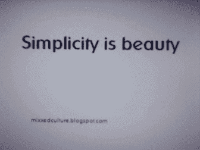

GIF from this [website](https://giphy.com/gifs/beauty-HPfyB1Uc0oS3K)

我已经假设很多人已经知道这篇文章，“力求简单:所有卷积网络 ”它非常有名，目前它是第二个对 CIFAR 10 数据集分类最准确的网络。

Image from this [website](http://rodrigob.github.io/are_we_there_yet/build/classification_datasets_results.html#43494641522d3130)

从上面，我们可以看到全卷积网络是多么有效。在这篇文章中，我们将实现两种不同类型的网络架构，像往常一样，让我们看看所有不同的优化方法进行比较。

*案例 a)具有自动微分动量的 conv pool-CNN
案例 b)具有自动微分动量的 conv pool-CNN
案例 c)具有手动回推*[*AMSGrad*](https://medium.com/@SeoJaeDuk/implementation-of-optimization-for-deep-learning-highlights-in-2017-feat-sebastian-ruder-61e2cbe9b7cb) *案例 d)具有手动回推*[*AMSGrad*](https://medium.com/@SeoJaeDuk/implementation-of-optimization-for-deep-learning-highlights-in-2017-feat-sebastian-ruder-61e2cbe9b7cb)*(*[*扩张*](/outperforming-tensorflows-default-auto-differentiation-optimizers-with-interactive-code-manual-e587a82d340e)

*情况 e)全 CNN 带自动分化动量
情况 f)全 CNN 带自动分化亚当
情况 g)全 CNN 带手动回推*[*AMSGrad*](https://medium.com/@SeoJaeDuk/implementation-of-optimization-for-deep-learning-highlights-in-2017-feat-sebastian-ruder-61e2cbe9b7cb) *情况 h)全 CNN 带手动回推*[*AMSGrad*](https://medium.com/@SeoJaeDuk/implementation-of-optimization-for-deep-learning-highlights-in-2017-feat-sebastian-ruder-61e2cbe9b7cb)*(*[*扩张*](/outperforming-tensorflows-default-auto-differentiation-optimizers-with-interactive-code-manual-e587a82d340e)

***网络架构***

*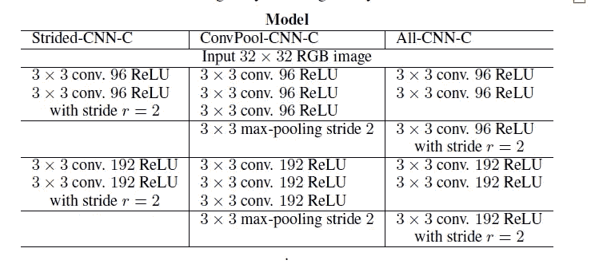*

*从上图中，我们可以看到本文提出的总体架构，因为今天我将只关注 ConvPool-CNN 模型和 All-CNN 模型。值得注意的一个有趣事实是，在最终卷积运算之后会发生什么，如下所示，我们将执行全局平均池运算。*

*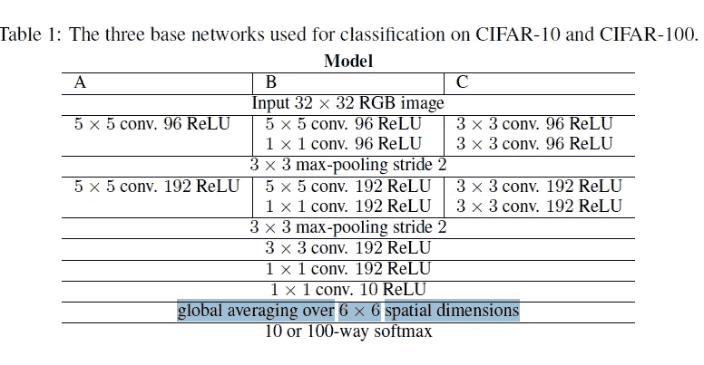*

*Image of General Base Model Presented in the Paper*

***蓝线** →全局平均池操作*

*在继续阅读之前，请注意两件事。
a)我将使用均值池而不是最大池
b)我将执行[数据扩充](https://github.com/aleju/imgaug)和[标准均值归一化](/understanding-batch-normalization-with-examples-in-numpy-and-tensorflow-with-interactive-code-7f59bb126642)。*

*现在，让我们更深入地了解一下这个全局平均池操作是什么。*

***全球平均池***

*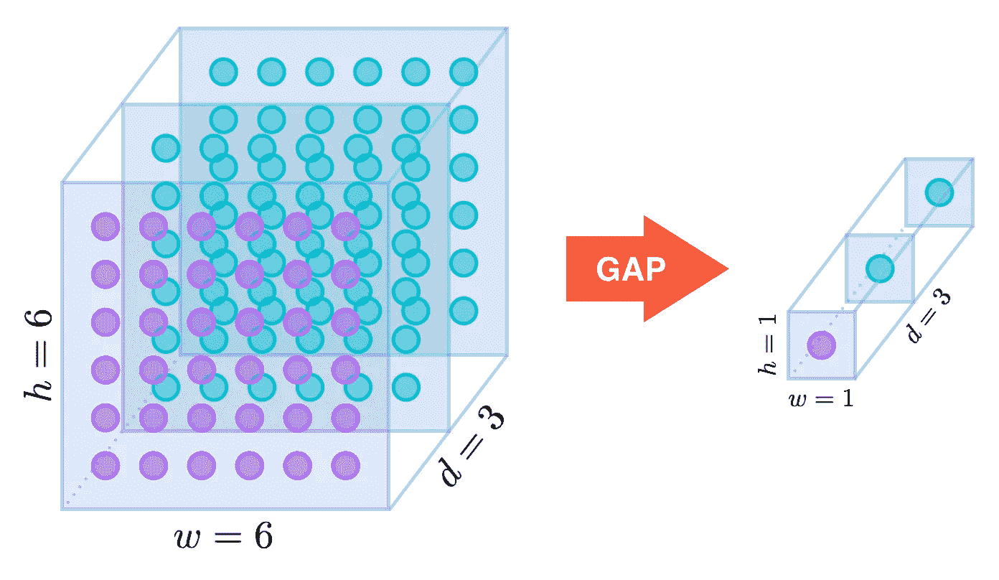*

*Image from this [website](https://alexisbcook.github.io/2017/global-average-pooling-layers-for-object-localization/)*

*如上所述，我们可以观察到全局平均池操作减少了给定输入的维度。所以我们可以怀疑这个操作是平均池操作的极端版本。现在让我们看看如何在 Tensorflow 中实现它。*

*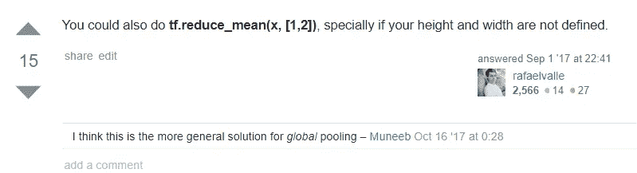*

*Image from this [website](https://stackoverflow.com/questions/42054451/how-do-i-do-global-average-pooling-in-tensorflow)*

*从上图中，我们可以看到如何在 Tensorflow 中实现这个操作。现在让我们看看这个操作做了什么。*

*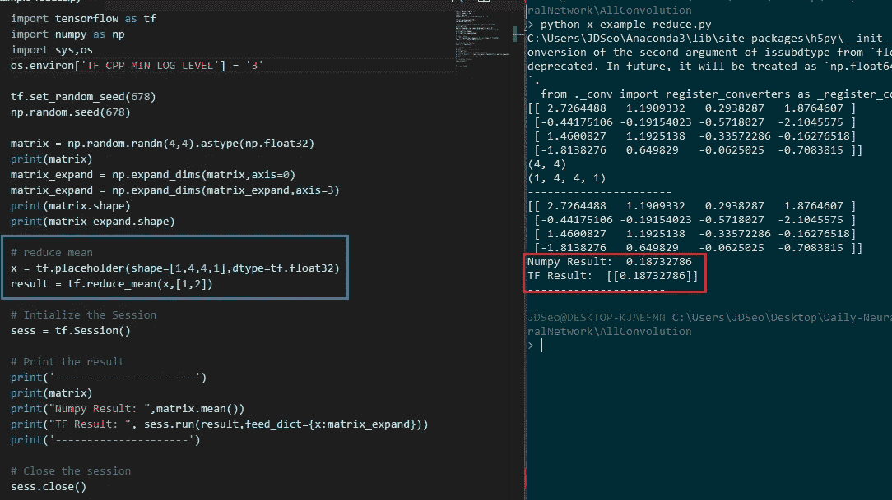*

*如上所述，我们可以观察到全局平均池操作与取矩阵的平均值相同。(因此，通过适当的信道维数，我们可以将矩阵简化为向量。)此外，如果有人感兴趣，请查看这篇[博客文章了解更多信息](https://alexisbcook.github.io/2017/global-average-pooling-layers-for-object-localization/)。([亚历克西斯·库克](https://alexisbcook.github.io/)也做了一项了不起的工作，解释了全球平均汇集[差距]。)此外 [AndersonJo](https://github.com/AndersonJo) 做了一项令人惊叹的工作，解释 GAP 请点击此处或[此处](https://github.com/AndersonJo/global-average-pooling/blob/master/global-average-pooling.ipynb)。(注一是韩语)。*

****结果:案例 a)具有自动微分动量的 conv pool-CNN****

***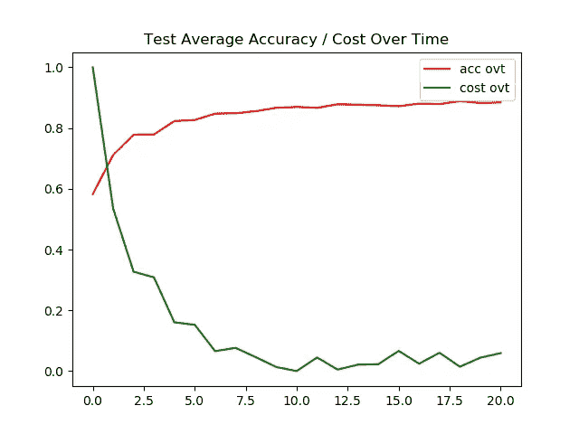*

***左图** →随时间训练精度/随时间成本
**右图** →随时间测试精度/随时间成本*

*如上所述，我们可以看到，只有在 20 个历元之后，我们才能达到 88%的准确度。考虑到训练图像上的准确率仍然是 96 %,有 4%的机会增加，有可能达到 90%的准确率。*

*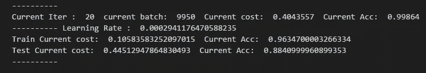*

***结果:*病例 b)具有自动微分的 ConvPool-CNN 亚当****

***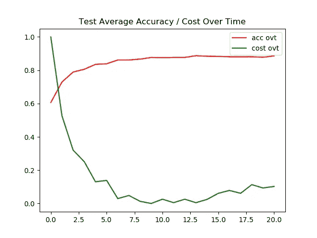*

***左图** →随时间训练精度/随时间成本
**右图** →随时间测试精度/随时间成本*

*对于 Adam，我们可以在测试图像上观察到 88%的相似准确性，当与动量比较时，看到结果如此相似是非常有趣的。(我认为它会非常合适)*

*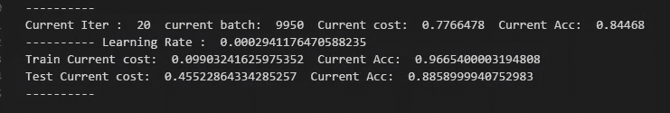*

***结果:*案例 c) ConvPool-CNN 带手动回柱***[***AMSGrad***](https://medium.com/@SeoJaeDuk/implementation-of-optimization-for-deep-learning-highlights-in-2017-feat-sebastian-ruder-61e2cbe9b7cb)*

*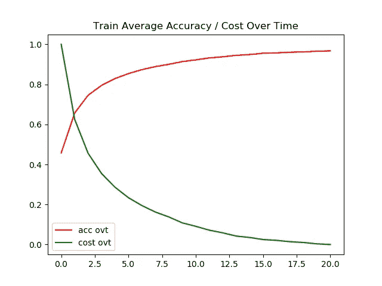**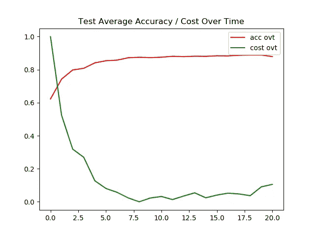*

***左图** →随时间训练精度/随时间成本
**右图** →随时间测试精度/随时间成本*

*与传统的 ADAM 相比，AMS Grad 被认为在正规化方面做得更好，然而对于这个实验来说，情况并非如此。如下所示，该模型能够达到 88%的准确率，同时在训练图像上具有 96%的准确率。*

*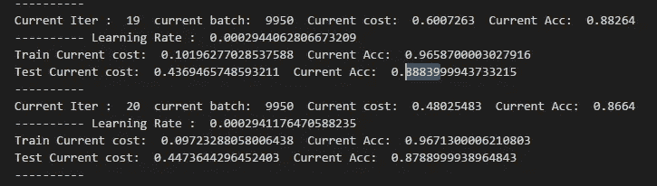*

***蓝线** →第 19 个历元的准确率为 88%。*

***结果:*案例 d) ConvPool-CNN 带手动回柱***[***AMSGrad***](https://medium.com/@SeoJaeDuk/implementation-of-optimization-for-deep-learning-highlights-in-2017-feat-sebastian-ruder-61e2cbe9b7cb)***(***[***散瞳***](/outperforming-tensorflows-default-auto-differentiation-optimizers-with-interactive-code-manual-e587a82d340e)***)****

*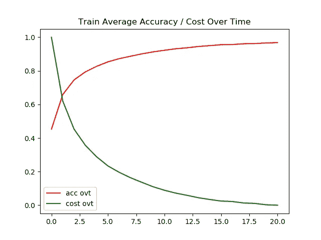**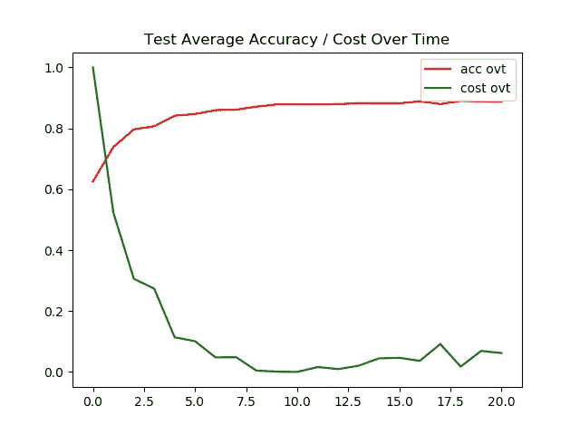*

***左图** →随时间训练精度/随时间成本
**右图** →随时间测试精度/随时间成本*

*对于前馈操作和反向传播的简单膨胀，结果没有显著改善。然而，它能够在第 12 个历元达到 89%的准确率，如下所示。*

*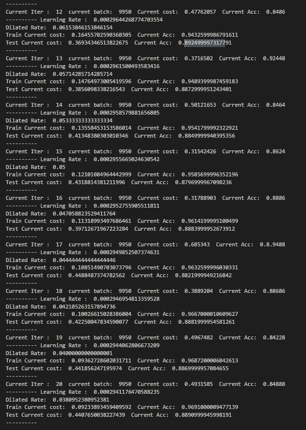*

***结果:*情况 e)具有自动微分动量的全 CNN****

*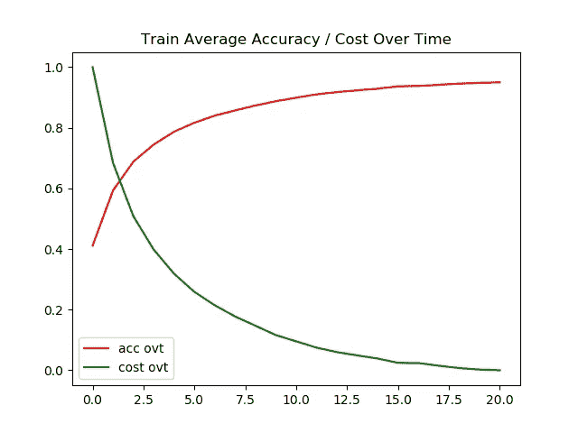**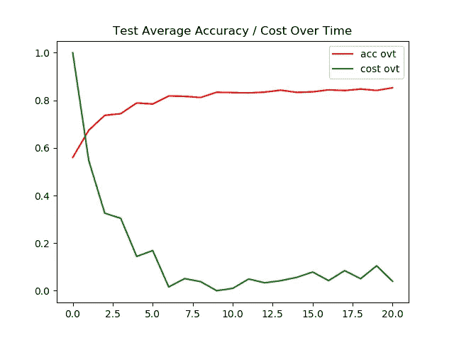*

***左图** →训练随时间的准确性/随时间的成本
**右图** →测试随时间的准确性/随时间的成本*

*当我们用步长为 2 的卷积层替换所有池操作时，我们可以看到精度下降了 3%。(在测试图像上)。*

*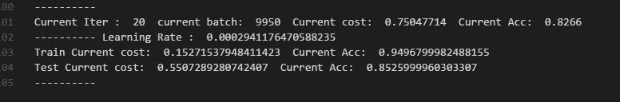*

***结果:*情况 f)具有自动微分的全 CNN Adam****

***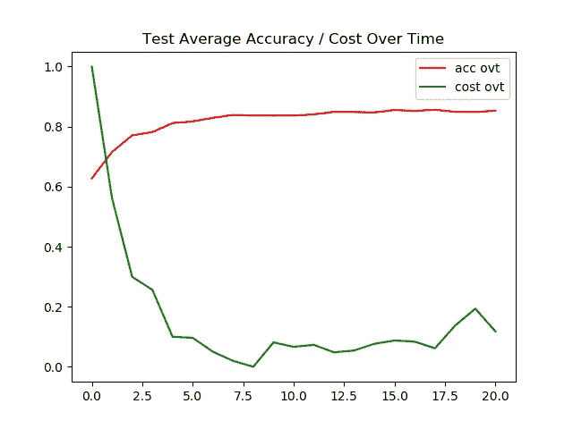*

***左图** →列车随时间的准确性/随时间的成本
**右图** →测试随时间的准确性/随时间的成本*

*即使使用 Adam optimizer，我们也可以观察到，在相同的 epoch 数量下，测试图像的准确性下降了 1 ~ 2%。*

*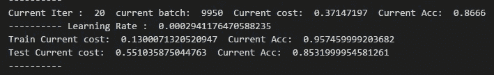*

***结果:*案例 g) All-CNN 带手动回柱***[***AMSGrad***](https://medium.com/@SeoJaeDuk/implementation-of-optimization-for-deep-learning-highlights-in-2017-feat-sebastian-ruder-61e2cbe9b7cb)*

***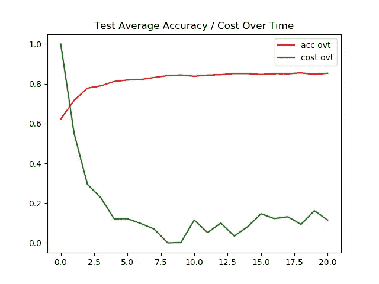*

***左图** →一段时间内的训练精度/一段时间内的成本
**右图** →一段时间内的测试精度/一段时间内的成本*

*AMS Grad 的最高准确率约为 85%。在训练图像上具有相似的精度。*

*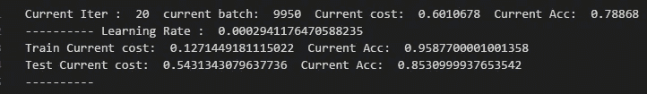*

***结果:*案例 h) All-CNN 带手动背道具***[***AMSGrad***](https://medium.com/@SeoJaeDuk/implementation-of-optimization-for-deep-learning-highlights-in-2017-feat-sebastian-ruder-61e2cbe9b7cb)***(***[***散瞳***](/outperforming-tensorflows-default-auto-differentiation-optimizers-with-interactive-code-manual-e587a82d340e)***)****

*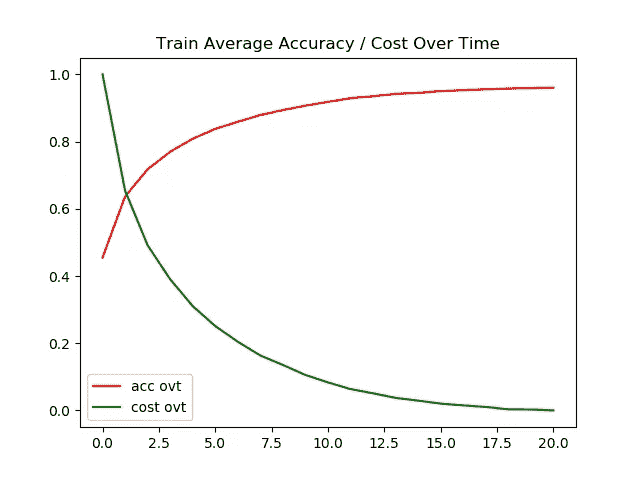**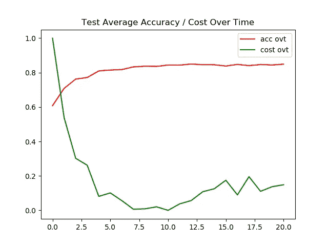*

***左图** →随时间训练精度/随时间成本
**右图** →随时间测试精度/随时间成本*

*最后，对于扩张反向传播的 AMS Grad，它比任何其他方法都差，只能达到 84%的准确性。*

*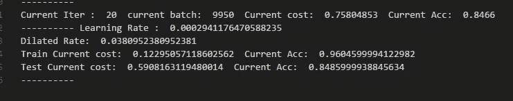*

***交互式代码/透明度***

*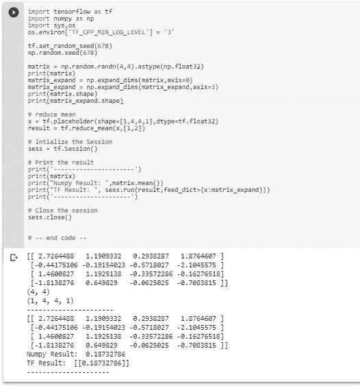*

*对于谷歌 Colab，你需要一个谷歌帐户来查看代码，而且你不能在谷歌 Colab 中运行只读脚本，所以在你的操场上做一个副本。最后，我永远不会请求允许访问你在 Google Drive 上的文件，仅供参考。编码快乐！同样为了透明，我在训练期间上传了所有的日志。*

*要访问全球平均池[的代码，请单击此处。](https://colab.research.google.com/drive/1hL8NTJZfvh0k_UgTKEvOSykxMQ4zOO4r)*

*要访问[案例 a 的代码，请点击此处](https://colab.research.google.com/drive/1pHLEKcr6DOCFLoE-04gXGqnDLu_rAkkc)，要访问[日志，请点击此处。](https://github.com/JaeDukSeo/Daily-Neural-Network-Practice-2/blob/master/NeuralNetwork/AllConvolution/cases/a/casea.txt)
访问[案例 b 的代码请点击此处](https://colab.research.google.com/drive/1WvrTEXqet7p5vtbQX_9jlDIDPy3hqelP)，访问[日志请点击此处。](https://github.com/JaeDukSeo/Daily-Neural-Network-Practice-2/blob/master/NeuralNetwork/AllConvolution/cases/b/caseb.txt)
要访问[案例 c 的代码，请点击此处](https://colab.research.google.com/drive/1iF5dKDTR2QvZj89PMicu_ww5eeHCnZMs)，要访问[日志，请点击此处。](https://github.com/JaeDukSeo/Daily-Neural-Network-Practice-2/blob/master/NeuralNetwork/AllConvolution/cases/c/casec.txt)
要访问[案例 d 的代码，请点击此处](https://colab.research.google.com/drive/1kEOVStpGuKNHtzC8XXoDmj2BLrsh1Wac)，要访问[日志，请点击此处。](https://github.com/JaeDukSeo/Daily-Neural-Network-Practice-2/blob/master/NeuralNetwork/AllConvolution/cases/d/cased.txt)*

*要访问案件 e 的[代码，请点击这里](https://colab.research.google.com/drive/1qPoKOmN4-pxJx_ukeLmOqF528jFMxpcO)，要访问[日志，请点击这里。](https://github.com/JaeDukSeo/Daily-Neural-Network-Practice-2/blob/master/NeuralNetwork/AllConvolution/cases/e/casee.txt)
访问[案例 f 的代码请点击此处](https://colab.research.google.com/drive/10DQkEp4S1ZEA0kBrxVkgmzOlRRHN3lGO)，访问[日志请点击此处。](https://github.com/JaeDukSeo/Daily-Neural-Network-Practice-2/blob/master/NeuralNetwork/AllConvolution/cases/f/casef.txt)
要访问[案例 g 的代码，请点击此处](https://colab.research.google.com/drive/1qPERnFIRH7jO2JS-NuEWBGuUUNc5JUQE)，要访问[日志，请点击此处。](https://github.com/JaeDukSeo/Daily-Neural-Network-Practice-2/blob/master/NeuralNetwork/AllConvolution/cases/g/caseg.txt)
要访问[案例 h 的代码，请点击此处](https://colab.research.google.com/drive/1hKTZc2lTMnAlIz11IsP-UEW-5dPYWEcB)，要访问[日志，请点击此处。](https://github.com/JaeDukSeo/Daily-Neural-Network-Practice-2/blob/master/NeuralNetwork/AllConvolution/cases/h/caseh.txt)*

***最后的话***

*另外，如果你希望看到这个网络的 keras 实现，请查看这个[博客帖子。Mate Labs 在解释这个话题方面做得非常出色！)](https://medium.com/@matelabs_ai/how-these-researchers-tried-something-unconventional-to-came-out-with-a-smaller-yet-better-image-544327f30e72)*

*如果发现任何错误，请发电子邮件到 jae.duk.seo@gmail.com 给我，如果你想看我所有的写作清单，请在这里查看我的网站。*

*同时，在我的 twitter 上关注我[这里](https://twitter.com/JaeDukSeo)，访问[我的网站](https://jaedukseo.me/)，或者我的 [Youtube 频道](https://www.youtube.com/c/JaeDukSeo)了解更多内容。我还实现了[广残网，请点击这里查看博文](https://medium.com/@SeoJaeDuk/wide-residual-networks-with-interactive-code-5e190f8f25ec) t。*

***参考***

1.  *斯普林根贝格，j .，多索维茨基，a .，布罗克斯，t .，&里德米勒，M. (2014)。追求简单:全卷积网。Arxiv.org。检索于 2018 年 5 月 11 日，来自[https://arxiv.org/abs/1412.6806](https://arxiv.org/abs/1412.6806)*
2.  *cy donia 999/all _ 卷积 _net。(2018).GitHub。检索于 2018 年 5 月 11 日，来自[https://github.com/cydonia999/all_convolutional_net](https://github.com/cydonia999/all_convolutional_net)*
3.  *示例:基础— imgaug 0.2.5 文档。(2018).img aug . readthe docs . io . 2018 年 5 月 11 日检索，来自[http://img aug . readthe docs . io/en/latest/source/examples _ basics . html](http://imgaug.readthedocs.io/en/latest/source/examples_basics.html)*
4.  *NumPy . ndarray . dtype—NumPy 1.14 版手册。(2018).Docs.scipy.org。检索于 2018 年 5 月 11 日，来自[https://docs . scipy . org/doc/numpy-1 . 14 . 0/reference/generated/numpy . ndarray . dtype . html](https://docs.scipy.org/doc/numpy-1.14.0/reference/generated/numpy.ndarray.dtype.html)*
5.  *(2018).[在线]可在:[https://www.quora.com/What-is-global-average-pooling](https://www.quora.com/What-is-global-average-pooling)[2018 年 5 月 11 日访问]。*
6.  *池层 Keras 文档。(2018).keras . io . 2018 年 5 月 11 日检索，来自[https://keras.io/layers/pooling/](https://keras.io/layers/pooling/)*
7.  *这些研究人员是如何尝试一些非传统的东西来得到一个更小但更好的图像…(2017).中等。检索于 2018 年 5 月 11 日，来自[https://medium . com/@ mate labs _ ai/how-these-researchers-trying-something-outstanding-to-out-a-small-better-image-544327 f30e 72](https://medium.com/@matelabs_ai/how-these-researchers-tried-something-unconventional-to-came-out-with-a-smaller-yet-better-image-544327f30e72)*
8.  *优化器— Keras 文档。(2018).keras . io . 2018 年 5 月 11 日检索，来自[https://keras.io/optimizers/](https://keras.io/optimizers/)*
9.  *库克，A. (2017)。用于对象本地化的全局平均池层。alexisbcook . github . io . 2018 年 5 月 11 日检索，来自[https://alexisbcook . github . io/2017/global-average-pooling-layers-for-object-localization/](https://alexisbcook.github.io/2017/global-average-pooling-layers-for-object-localization/)*
10.  *TensorFlow？，H. (2018)。如何在 TensorFlow 中进行全球平均池化？。堆栈溢出。检索于 2018 年 5 月 11 日，来自[https://stack overflow . com/questions/42054451/how-do-I-do-global-average-pooling-in-tensor flow](https://stackoverflow.com/questions/42054451/how-do-i-do-global-average-pooling-in-tensorflow)*
11.  *Anderson jo/全球平均池。(2018).GitHub。检索于 2018 年 5 月 11 日，来自[https://github . com/Anderson jo/global-average-pooling/blob/master/global-average-pooling . ipynb](https://github.com/AndersonJo/global-average-pooling/blob/master/global-average-pooling.ipynb)*
12.  *Anderson jo/全球平均池。(2018).GitHub。检索于 2018 年 5 月 11 日，来自[https://github.com/AndersonJo/global-average-pooling](https://github.com/AndersonJo/global-average-pooling)*
13.  *贝嫩森河(2018)。分类数据集结果。rodrigob . github . io . 2018 年 5 月 13 日检索，来自[http://rodrigob . github . io/are _ we _ there _ yet/build/classification _ datasets _ results . html # 43494641522d 3130](http://rodrigob.github.io/are_we_there_yet/build/classification_datasets_results.html#43494641522d3130)*
14.  *误差，A. (2018)。避免 tensorflow 打印在标准错误上。堆栈溢出。检索于 2018 年 5 月 19 日，来自[https://stack overflow . com/questions/35869137/avoid-tensor flow-print-on-standard-error](https://stackoverflow.com/questions/35869137/avoid-tensorflow-print-on-standard-error)*
15.  *2017 年深度学习优化实现亮点(feat。塞巴斯蒂安·鲁德)。(2018).中等。检索于 2018 年 5 月 19 日，来自[https://medium . com/@ SeoJaeDuk/implementation-of-optimization-for-deep-learning-highlights-in-2017-feat-sebastian-ruder-61e 2 CBE 9 b 7 CB](https://medium.com/@SeoJaeDuk/implementation-of-optimization-for-deep-learning-highlights-in-2017-feat-sebastian-ruder-61e2cbe9b7cb)*
16.  *超越 Tensorflow 的默认自动微分优化器，具有交互式代码[手动…(2018).走向数据科学。检索于 2018 年 5 月 19 日，来自[https://towards data science . com/outpering-tensor flows-default-auto-difference-optimizer-with-interactive-code-manual-e 587 a82d 340 e](/outperforming-tensorflows-default-auto-differentiation-optimizers-with-interactive-code-manual-e587a82d340e)*
17.  *aleju/imgaug。(2018).GitHub。检索于 2018 年 5 月 19 日，来自[https://github.com/aleju/imgaug](https://github.com/aleju/imgaug)*
18.  *通过 Numpy 和 Tensorflow 中的示例和交互式代码理解批处理规范化。(2018).走向数据科学。检索于 2018 年 5 月 19 日，来自[https://towards data science . com/understanding-batch-normalization-with-examples-in-numpy-and-tensor flow-with-interactive-code-7f 59 bb 126642](/understanding-batch-normalization-with-examples-in-numpy-and-tensorflow-with-interactive-code-7f59bb126642)*