# 【ICLR 2016】通过带交互代码的指数线性单元(ELUs)进行快速准确的深度网络学习【带 TF 的手动回推】

> 原文：<https://towardsdatascience.com/iclr-2016-fast-and-accurate-deep-networks-learning-by-exponential-linear-units-elus-with-c0cdbb71bb02?source=collection_archive---------11----------------------->

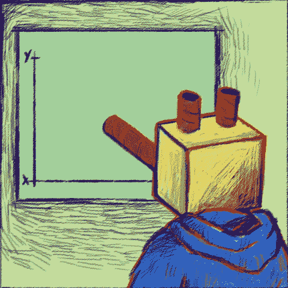

GIF from this [website](https://giphy.com/gifs/yes-math-nodding-l0HlJIp1dIZzimEBq)

我知道这份文件存在的时间最长，但是，直到现在我才有时间来实现这个网络。所以在这里，我终于实现了这个完全卷积神经网络与 ELU。非常简单但性能卓越的网络。

最后，为了好玩，让我们使用不同的方法来训练我们的网络，例如……
情况 a)使用标准反向传播的自动微分
情况 b) [反馈对准](https://medium.com/@SeoJaeDuk/nips-2016-direct-feedback-alignment-provides-learning-in-deep-neural-networks-with-interactive-32d59045e8e)
情况 c) [扩张反向传播](/outperforming-tensorflows-default-auto-differentiation-optimizers-with-interactive-code-manual-e587a82d340e)使用 [L2 正则化](https://msdn.microsoft.com/en-us/magazine/dn904675.aspx)
情况 d)使用反向传播的自动微分、 [L2 正则化](https://msdn.microsoft.com/en-us/magazine/dn904675.aspx)
情况 f) [使用不同优化器的组合的扩张反向传播](/outperforming-tensorflows-default-auto-differentiation-optimizers-with-interactive-code-manual-e587a82d340e)

**指数线性单位**

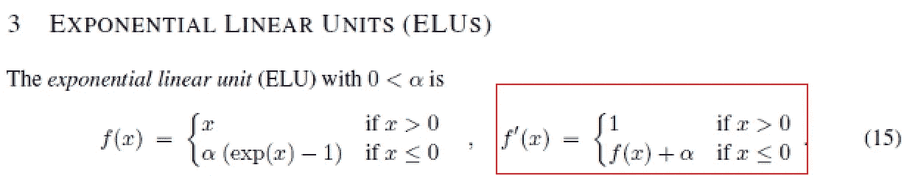

**红框** →激活功能的导数

本文的主要贡献是新颖的激活函数。它可能看起来很简单，但不要让表面水平愚弄你，作者实际上有一个完整的部分来解释为什么这种激活工作得这么好。总之，1)使用负梯度是个好主意，或者 2)激活函数的输入值以零为中心，以避免不必要的偏移。现在让我们看看这个函数在绘图时是什么样子的。

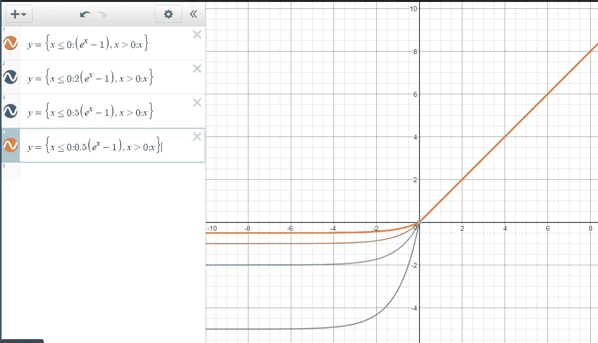

Graph using this [website](https://www.desmos.com/calculator/v9hyi8qj0o)

**红线** → Alpha 值设为 1
**蓝线** → Alpha 值设为 2
**绿线** → Alpha 值设为 5
**橙线** → Alpha 值设为 0.5

根据α值，我们可以观察到负值的陡度彼此不同。这个函数的求导非常简单，正如我们在上面已经看到的，现在让我们来看看实现。

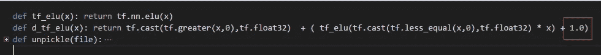

**红框** →为小于 0 的输入增加 Alpha 值

从添加的 alpha 值中，我们可以知道 tensor-flow 的 elu()实现将 alpha 值默认设置为 1。

**数据集(CIFAR 10)**

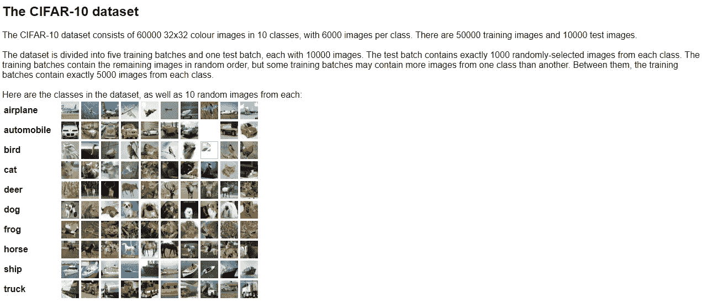

Screen Shot from this [website](https://www.cs.toronto.edu/~kriz/cifar.html)

我们将使用 CIFAR 10 数据集来测试该网络的性能。然而，请注意，本文的作者已经执行了 1) [全局对比度归一化](https://caglarift6266.wordpress.com/) 2) [ZCA 白化](https://martin-thoma.com/zca-whitening/)的预处理，以及进一步的数据增强(填充和翻转)，但我只是要归一化图像的每个通道。

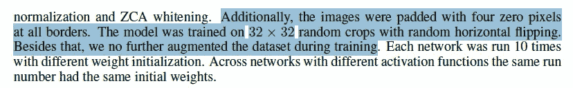

Data Augmentation of the Paper

最后请注意，作者用 CIFAR 10 数据集做了两个实验，一个用 11 个卷积层，另一个用 18 个卷积层。我将实现 11 层网络。

**网络架构**

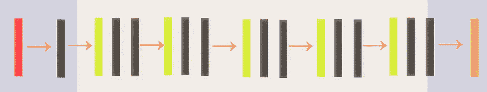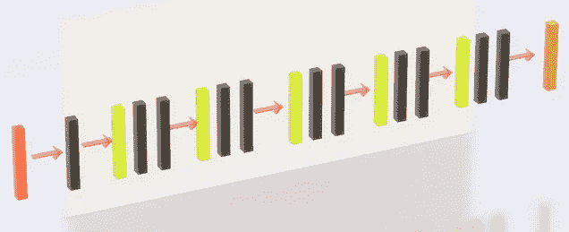

**红色矩形** →输入尺寸为 32 * 32 的图像
**黑色矩形** →与 ELU 激活的卷积运算
**绿色矩形** →均值/最大池运算
**橙色矩形** →用于分类的 Softmax

网络本身并不复杂，它由 11 层组成，但原始论文的作者有特定的超参数设置，如下所示。

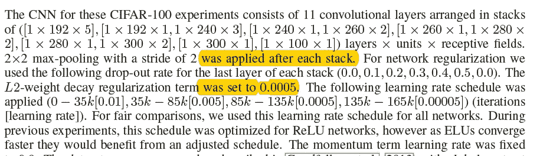

不幸的是，对我来说，为 165，000 次迭代训练一个模型将花费太多的时间。因此，我不打算这样做，但你可以检查交互代码部分，以准确了解我的超级参数是如何设置的。此外，还有一件事让我感到疑惑:2 * 2 max-在每个堆栈之后应用了跨距为 2 的池。如果我们从 32 *32 的图像开始，我们不能有 6 个池操作(这就是为什么我用了 5 个池层，如上所示。).如果有人知道作者的意思，请在下面评论。

**案例 a)使用标准反向传播进行自动微分的结果
(迭代:1K，优化器:动量)**

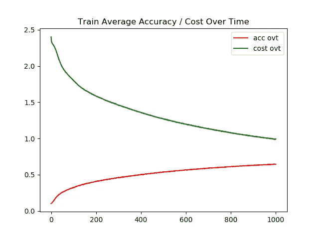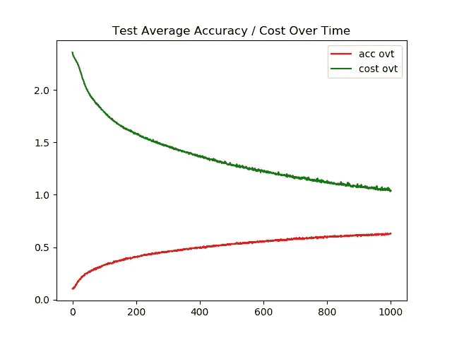

**左图** →一段时间内的训练精度/成本
**右图** →一段时间内的测试精度/成本

使用动量优化器对该模型进行 1k 次迭代训练，如原始论文中所报告的那样设置退出率。即使在 1k 迭代之后，网络也做得不好，训练图像和测试图像的准确率都是 62%。虽然模型没有过度拟合是件好事，但这也表明收敛速度很慢。

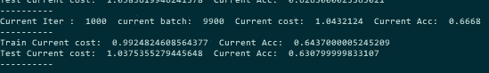

**情况 b)结果为** ****(迭代:85，优化器:Adam)****

**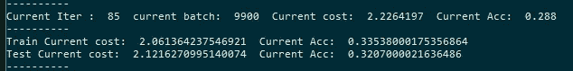**

**我甚至没让模特完成训练。这是因为模型没有学到任何东西。在训练图像上达到 35%的准确率后，模型停止了改进。如果您希望查看培训的详细信息，请[点击此处](https://github.com/JaeDukSeo/Daily-Neural-Network-Practice-2/blob/master/NeuralNetwork/ELU/elc%20b/caseb.txt)查看日志。**

> ****注意**我在这个案例中使用的网络架构与原始论文略有不同。**

****案例 c)结果为** [**扩张反向传播**](/outperforming-tensorflows-default-auto-differentiation-optimizers-with-interactive-code-manual-e587a82d340e) **与** [**L2 正则化**](https://msdn.microsoft.com/en-us/magazine/dn904675.aspx) **(迭代:300，优化器:Adam)****

******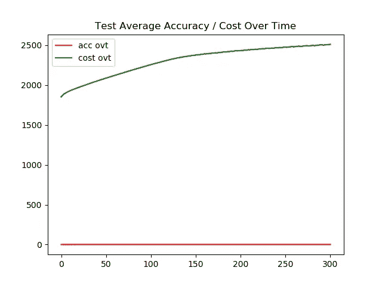**

****左图** →一段时间内的训练精度/成本
**右图** →一段时间内的测试精度/成本**

**请注意两件事，1)我忘记标准化成本，因此图表的 y 轴是如此倾斜 2)这个模型是使用 [Adam 优化器](https://arxiv.org/abs/1412.6980)训练的。然而，再次，该模型并没有表现得像我想的那样好。由于 Adam Optimizer，它能够在训练图像上实现高精度，但它未能泛化，在测试图像上表现不佳。(这是一个严重的过度拟合案例。)**

**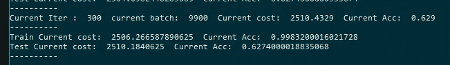**

> ****注意**我在这个案例中使用的网络架构与原始论文略有不同。**

****情况 d)具有反向传播的自动微分的结果，** [**L2 正则化**](https://msdn.microsoft.com/en-us/magazine/dn904675.aspx) **(迭代:200，优化器:Adam)****

**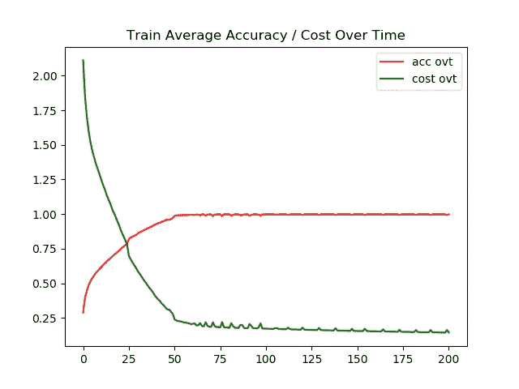****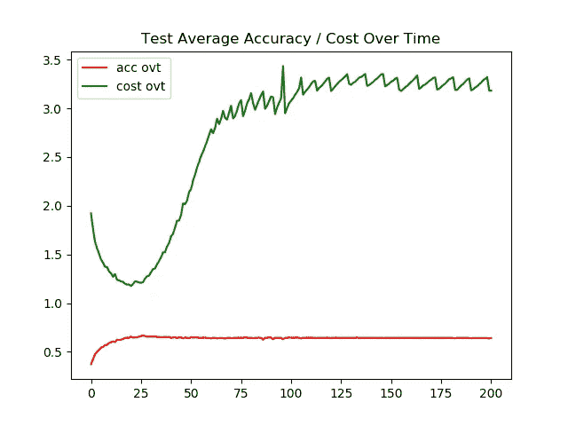**

****左图** →一段时间内的训练精度/成本
**右图** →一段时间内的测试精度/成本**

**即使有了 L2 正则化，当用 Adam optimizer 训练时，网络似乎过度适应。我们可以观察到，在第 25 次迭代之后，测试图像的成本开始增加。**

****

**尽管该网络在测试图像准确性上比其他网络稍好，但是它遭受过拟合。**

> ****注意**我在这个案例中使用的网络架构与原始论文略有不同。**

****情况 d)使用不同优化器组合的** [**扩张反向传播**](/outperforming-tensorflows-default-auto-differentiation-optimizers-with-interactive-code-manual-e587a82d340e) **的结果(迭代:200，优化器:亚当/动量)****

**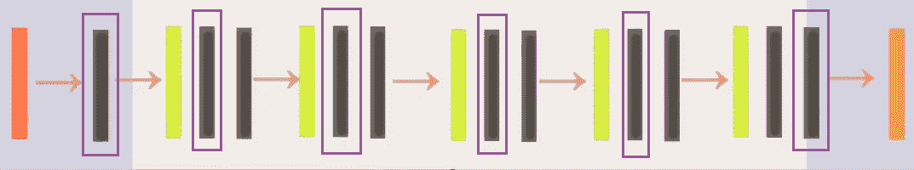**

****紫色框** →使用 Adam 优化器优化的图层**

**对于这个网络，我真的想尝试一些不同的东西，为每一层设置不同的优化器。如上所示，用 Adam optimizer 优化了周围有紫色矩形的层，并使用 momentum optimizer 训练了其他层。**

**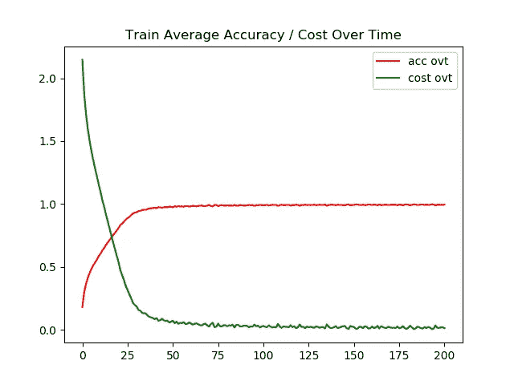****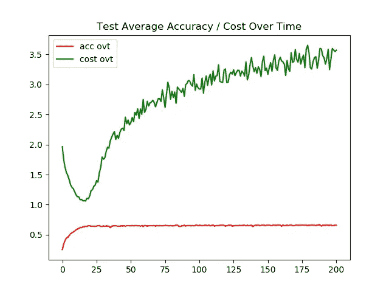**

****左图** →一段时间内的训练精度/成本
**右图** →一段时间内的测试精度/成本**

**该网络的表现不如我所希望的那样好，尽管与情况 c)相比，该模型没有任何正则化技术方法，如 L2 正则化，但该模型能够在测试图像上实现 65%的准确性。**

**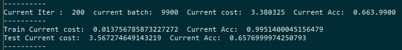**

> ****注意**我在这个案例中使用的网络架构与原始论文略有不同。**

****互动代码/透明度****

**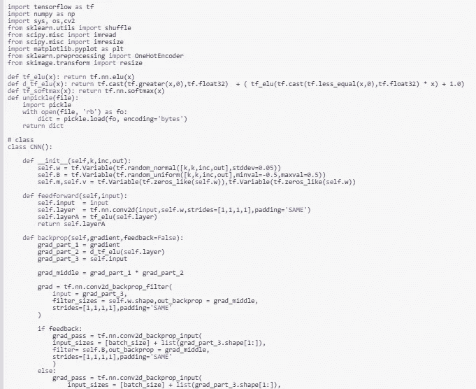**

***对于谷歌 Colab，你需要一个谷歌帐户来查看代码，而且你不能在谷歌 Colab 中运行只读脚本，所以在你的操场上做一个副本。最后，我永远不会请求允许访问你在 Google Drive 上的文件，仅供参考。编码快乐！***

**要访问案例 [a 的代码，请点击此处](https://colab.research.google.com/drive/1zjjy8mE3q82UgiX7Ujj1nHfCx2p9Qv5x)，要访问[的日志，请点击此处。](https://github.com/JaeDukSeo/Daily-Neural-Network-Practice-2/blob/master/NeuralNetwork/ELU/elu%20a/dsadsa.txt)
访问案例 [b 的代码请点击此处，](https://colab.research.google.com/drive/19tCArjCoAU_BJnM4Ae19vpr0x0P22zPI)访问[日志请点击此处。](https://github.com/JaeDukSeo/Daily-Neural-Network-Practice-2/blob/master/NeuralNetwork/ELU/elc%20b/caseb.txt)
要访问案例 [c 的代码，请点击此处](https://colab.research.google.com/drive/17h07qoXvPE9EXjLMmEMHxLXOt9mH4t6Y)，要访问[日志，请点击此处。](https://github.com/JaeDukSeo/Daily-Neural-Network-Practice-2/blob/master/NeuralNetwork/ELU/elu%20c/casec.txt)
要访问案例 [d 的代码，请点击此处](https://colab.research.google.com/drive/1NmQZmHUoRLu9w3UPFRNA9XaqNmCXKt8x)，要访问[日志，请点击此处。](https://github.com/JaeDukSeo/Daily-Neural-Network-Practice-2/blob/master/NeuralNetwork/ELU/elu%20d/case%20d.txt)
要访问案例 [e 的代码请点击此处](https://colab.research.google.com/drive/13Nzp3z7PSpp5UkNQdqU36aigmRVbeUUc)，要访问[日志请点击此处。](https://github.com/JaeDukSeo/Daily-Neural-Network-Practice-2/blob/master/NeuralNetwork/ELU/elu%20e/case%20e.txt)**

****最后的话****

**从这个实验中，我能够看到数据预处理和超参数调整对性能增益的重要性。因为最初的作者能够通过他们的超参数设置获得超过 90%的准确性。**

**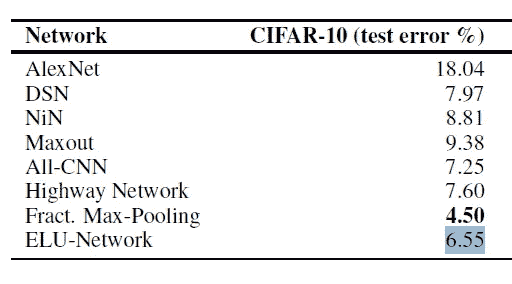**

****蓝线** →在原作者论文上测试 CIFAR 10 的错误率**

**如果发现任何错误，请发电子邮件到 jae.duk.seo@gmail.com 给我，如果你想看我所有写作的列表，请在这里查看我的网站。**

**同时，在我的 twitter 上关注我[这里](https://twitter.com/JaeDukSeo)，访问[我的网站](https://jaedukseo.me/)，或者我的 [Youtube 频道](https://www.youtube.com/c/JaeDukSeo)了解更多内容。我还实现了[广残网，请点击这里查看博文](https://medium.com/@SeoJaeDuk/wide-residual-networks-with-interactive-code-5e190f8f25ec) t。**

****参考****

1.  **Clevert，D. A .，Unterthiner，t .，& Hochreiter，S. (2015 年)。通过指数线性单元(elus)进行快速准确的深度网络学习。 *arXiv 预印本 arXiv:1511.07289* 。**
2.  **作为神经网络激活函数的 ELU。(2018).赛菲克·伊尔金·塞伦吉尔。2018 年 5 月 6 日检索，来自[https://sefiks . com/2018/01/02/elu-as-a-neural-networks-activation-function/](https://sefiks.com/2018/01/02/elu-as-a-neural-networks-activation-function/)**
3.  **tf.nn.elu |张量流。(2018).张量流。检索于 2018 年 5 月 6 日，来自[https://www.tensorflow.org/api_docs/python/tf/nn/elu](https://www.tensorflow.org/api_docs/python/tf/nn/elu)**
4.  **分段。(2018).德斯莫斯图形计算器。检索于 2018 年 5 月 6 日，来自[https://www.desmos.com/calculator/v9hyi8qj0o](https://www.desmos.com/calculator/v9hyi8qj0o)**
5.  **CIFAR-10 和 CIFAR-100 数据集。(2018).Cs.toronto.edu。检索于 2018 年 5 月 6 日，来自[https://www.cs.toronto.edu/~kriz/cifar.html](https://www.cs.toronto.edu/~kriz/cifar.html)**
6.  **托马斯，M. (2017)。ZCA 美白。马丁·托马斯。检索于 2018 年 5 月 6 日，来自[https://martin-thoma.com/zca-whitening/](https://martin-thoma.com/zca-whitening/)**
7.  **aleju/papers。(2018).GitHub。2018 年 5 月 6 日检索，来自[https://github . com/aleju/papers/blob/master/neural-nets/elus . MD](https://github.com/aleju/papers/blob/master/neural-nets/ELUs.md)**
8.  **IFT 6266 H13 博客。(2013).IFT 6266 H13 博客。2018 年 5 月 6 日检索，来自[https://caglarift6266.wordpress.com/](https://caglarift6266.wordpress.com/)**
9.  **aleju/papers。(2018).GitHub。2018 年 5 月 6 日检索，来自[https://github.com/aleju/papers](https://github.com/aleju/papers)**
10.  **Matplotlib . py plot . legend-Matplotlib 2 . 2 . 2 文档。(2018).Matplotlib.org。检索于 2018 年 5 月 6 日，来自[https://matplotlib . org/API/_ as _ gen/matplotlib . py plot . legend . html](https://matplotlib.org/api/_as_gen/matplotlib.pyplot.legend.html)**
11.  **张量流正则化。(2018).ritchieng . github . io . 2018 年 5 月 6 日检索，来自[http://www . ritchieng . com/machine-learning/deep-learning/tensor flow/regulation/](http://www.ritchieng.com/machine-learning/deep-learning/tensorflow/regularization/)**
12.  **Only Numpy:对深度神经网络实施 L1 /L2 范数/正则化的不同组合…(2018).走向数据科学。2018 年 5 月 6 日检索，来自[https://towards data science . com/only-numpy-implementing-different-combination-of-L1-norm-L2-norm-L1-regularity-and-14b 01a 9773 b](/only-numpy-implementing-different-combination-of-l1-norm-l2-norm-l1-regularization-and-14b01a9773b)**
13.  **机器学习的 L1 和 L2 正则化。(2018).Msdn.microsoft.com。检索于 2018 年 5 月 7 日，来自[https://msdn.microsoft.com/en-us/magazine/dn904675.aspx](https://msdn.microsoft.com/en-us/magazine/dn904675.aspx)**
14.  **[ NIPS 2016 ]直接反馈对齐为深度神经网络中的学习提供了交互式学习。(2018).中等。检索于 2018 年 5 月 7 日，来自[https://medium . com/@ SeoJaeDuk/nips-2016-direct-feedback-alignment-provides-learning-in-deep-neural-networks-with-interactive-32d 59045 e8e](https://medium.com/@SeoJaeDuk/nips-2016-direct-feedback-alignment-provides-learning-in-deep-neural-networks-with-interactive-32d59045e8e)**
15.  **超越 Tensorflow 的默认自动微分优化器，具有交互式代码[手动…(2018).走向数据科学。检索于 2018 年 5 月 7 日，来自[https://towards data science . com/outpering-tensor flows-default-auto-difference-optimizer-with-interactive-code-manual-e587 a82d 340 e](/outperforming-tensorflows-default-auto-differentiation-optimizers-with-interactive-code-manual-e587a82d340e)**
16.  **金马博士和巴律师(2014 年)。亚当:一种随机优化方法。Arxiv.org。于 2018 年 5 月 7 日检索，来自[https://arxiv.org/abs/1412.6980](https://arxiv.org/abs/1412.6980)**