# ICLR 2016 —用交互代码在 Tensorflow 中实现上下文模块【用 Tensorflow 手动背道具】

> 原文：<https://towardsdatascience.com/iclr-2016-implementing-context-module-in-tensorflow-with-interactive-code-manual-back-prop-with-a2c84b3ae444?source=collection_archive---------5----------------------->

Image from [pixabay](https://pixabay.com/en/roll-the-dice-craps-board-game-1502706/)

因为我在上一篇文章中提到了[膨胀卷积](/understanding-2d-dilated-convolution-operation-with-examples-in-numpy-and-tensorflow-with-d376b3972b25)运算，所以只有我用它制作了一个网络才有意义。所以我认为我最好实现本文中提出的上下文模块[通过扩张卷积进行多尺度上下文聚合](https://arxiv.org/abs/1511.07122)。在[2016](https://iclr.cc/archive/www/doku.php%3Fid=iclr2016:main.html)国际学习代表大会上发表。

有两件事我想指出来。原始论文的作者使用他们自己的方法初始化权重，对于这篇文章，我将从正态分布初始化。
2。为了好玩，让我们用[扩张反向传播和](https://hackernoon.com/only-numpy-dilated-back-propagation-and-google-brains-gradient-noise-with-interactive-code-3a527fc8003c) l 来训练网络。

**网络架构(表格形式)/实验设置**

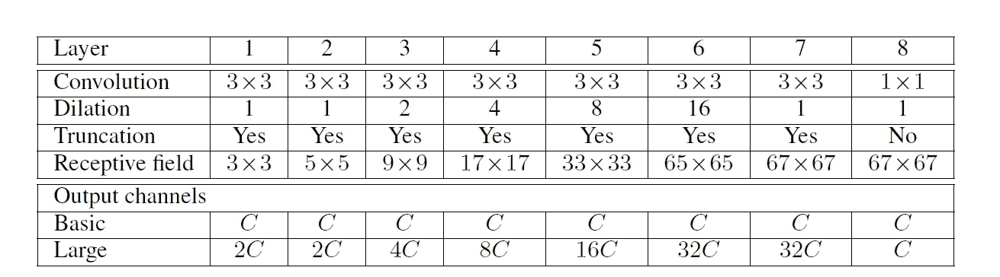

Screen shot from this [paper](https://arxiv.org/abs/1511.07122)

基本上，上下文模块是一个具有扩展卷积运算的全卷积神经网络。我们的实验设置非常简单，我们将对 [MNIST](https://www.tensorflow.org/versions/r1.1/get_started/mnist/beginners) 数据集执行多类分类。为了实现这一点，我们将在上下文模块网络的输出端添加一个完全连接的神经网络。

**网络架构(OOP 形式)**

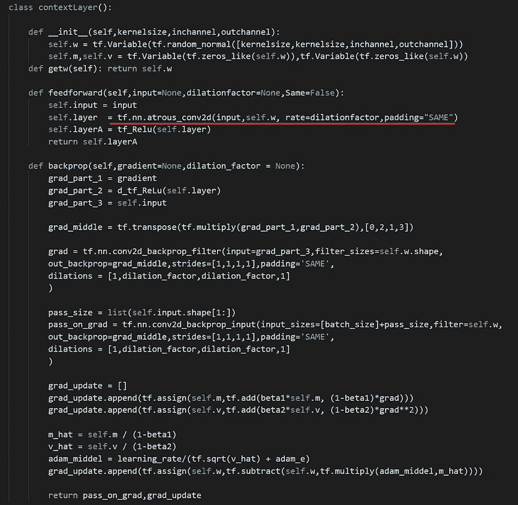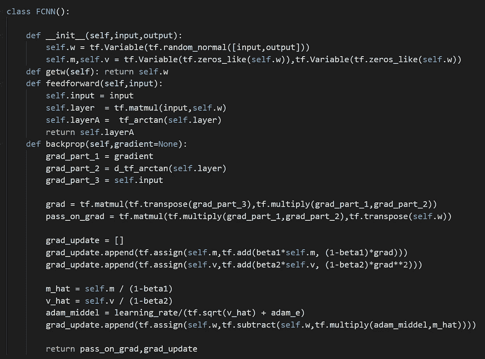

Left Image Context Layer / Right Image Fully Connected Neural Network

**红线→** 扩张卷积运算

除了上面的红线执行扩张卷积运算外，网络架构与卷积神经网络完全相同。其前面有卷积层，后面有完全连接的神经网络。

**膨胀系数/前馈操作**

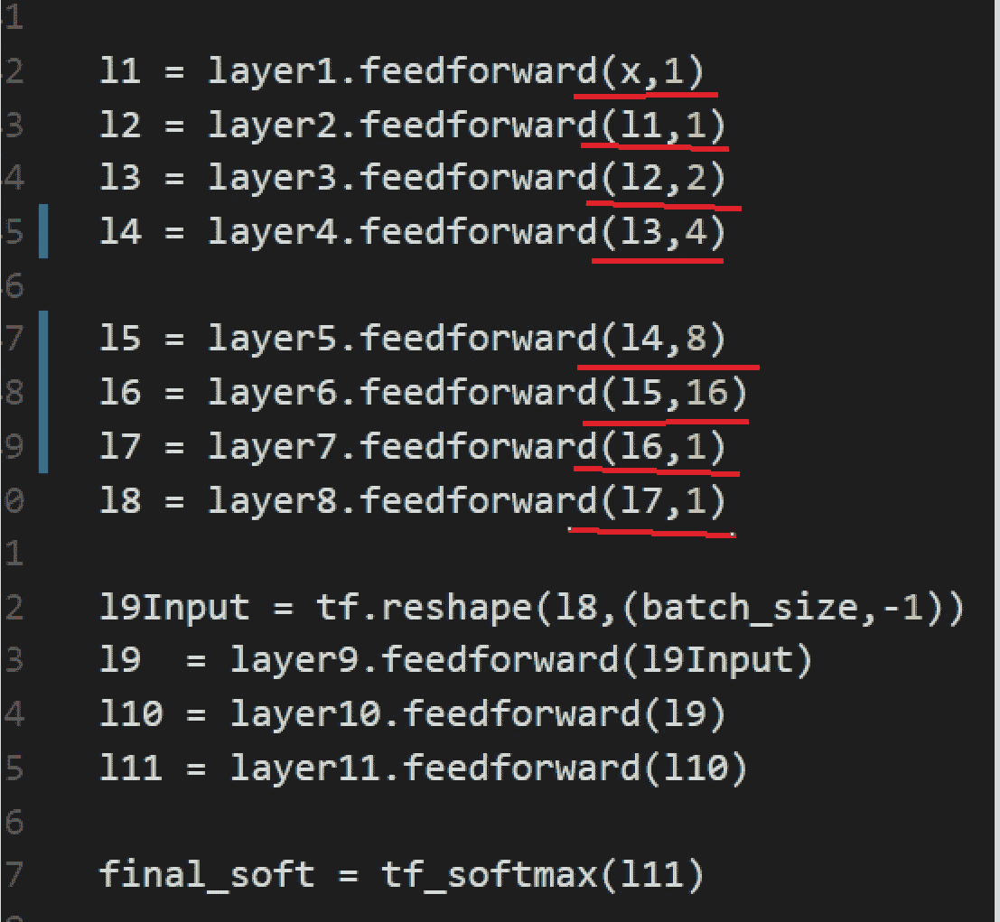

**红线** →放大系数以匹配原稿

因此，为了保持膨胀因子与本文相同，我们将因子分别设置为 1、1、2、4、8、16、1 和 1。

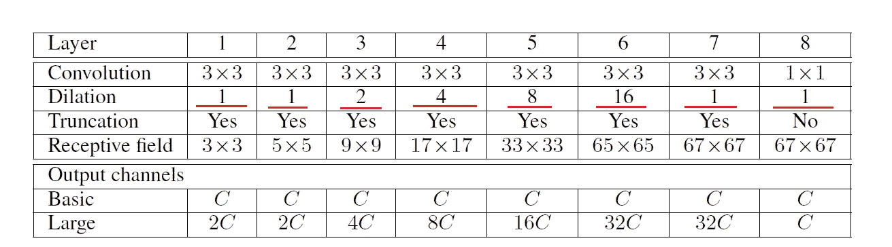

**训练结果自动微分(ADAM 优化器)**

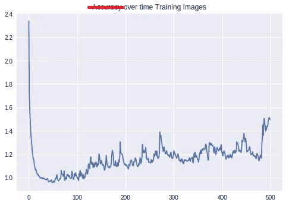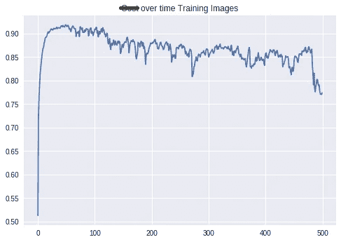

**左图** →训练图像随时间变化的成本图
**右图** →训练图像随时间变化的精度图

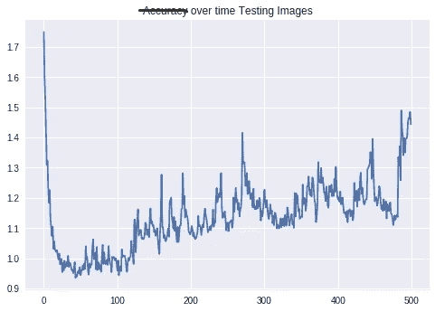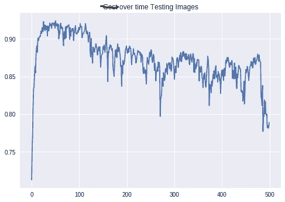

**左图** →测试图像随时间变化的成本图
**右图** →测试图像随时间变化的精度图

这是我见过的最有趣的结果，尤其是对汽车差异化而言。大约在 50 世纪，我们可以看到这个模型表现得非常好。然而过了 100th？)纪元模型的性能开始下降。最终训练和测试图像的准确率都达到了 77%左右。

**训练结果(破损)扩张背道具(ADAM 优化器)**

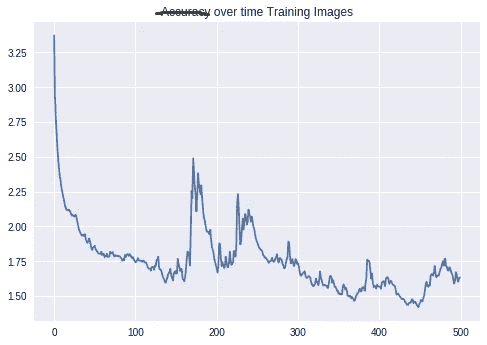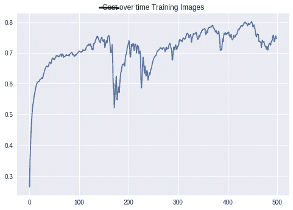

**左图** →训练图像随时间变化的成本图
右图 →训练图像随时间变化的精度图

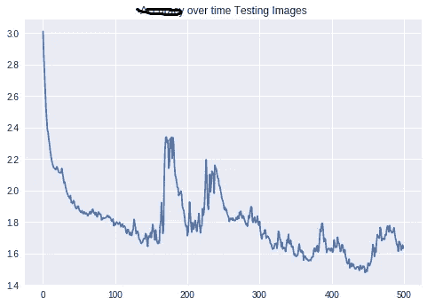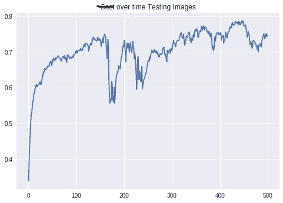

**左图** →测试图像随时间变化的成本图
**右图** →测试图像随时间变化的精度图

在让模型训练的同时，我去了健身房。在我的锻炼过程中，我意识到，我对扩展卷积层的反向传播的实现是错误的。因此，我将这个模型命名为(破碎的)扩张反向传播。然而，非常有趣的是，当这个过程可能被中断时，这个模型仍然能够学习。虽然与自动微分相比，它的表现不尽人意，但它仍能达到约 75%的准确率。

**交互代码**

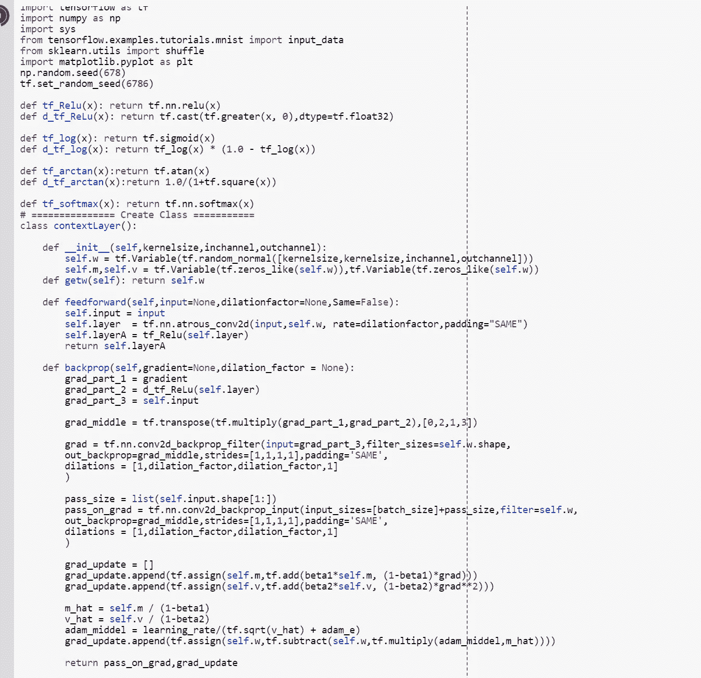

*为了交互代码，我搬到了 Google Colab！所以你需要一个谷歌帐户来查看代码，你也不能在谷歌实验室运行只读脚本，所以在你的操场上做一个副本。最后，我永远不会请求允许访问你在 Google Drive 上的文件，仅供参考。编码快乐！*

要获取(破裂)扩张[反向传播的代码，请点击此处](https://colab.research.google.com/drive/1AHlY8zBQx6MXYLENPVDij9b1_ZqdKx0W)。
要访问自动[区分代码，请点击此处。](https://colab.research.google.com/drive/1b0uMV0k-A92qefFyrYrxlJMIKXfoLpEm)

**最后的话**

因为，这篇文章更多的是关于实现上下文模块，我不会进一步优化它。但是，如果你能够获得更好的结果，请在下面评论，并说明你是如何达到这个结果的。

如果发现任何错误，请发电子邮件到 jae.duk.seo@gmail.com 给我，如果你想看我所有写作的列表，请在这里查看我的网站。

同时，在我的 twitter 上关注我[这里](https://twitter.com/JaeDukSeo)，访问[我的网站](https://jaedukseo.me/)，或者我的 [Youtube 频道](https://www.youtube.com/c/JaeDukSeo)了解更多内容。如果你感兴趣的话，我还做了解耦神经网络[的比较。](https://becominghuman.ai/only-numpy-implementing-and-comparing-combination-of-google-brains-decoupled-neural-interfaces-6712e758c1af)

**参考**

1.  贴标”？，W. (2018)。相对于「分段」和「场景标注」，什么是「语义分段」？。Stackoverflow.com。检索于 2018 年 3 月 12 日，来自[https://stack overflow . com/questions/33947823/what-is-semantic-segmentation-comparated-to-segmentation-and-scene-labeling](https://stackoverflow.com/questions/33947823/what-is-semantic-segmentation-compared-to-segmentation-and-scene-labeling)
2.  于，冯，科尔敦，伏(2015)。基于扩张卷积的多尺度上下文聚合。arXiv 预印本 arXiv:1511.07122。
3.  2017 年深度学习语义分割指南。(2017).Blog.qure.ai .检索于 2018 年 3 月 12 日，来自[http://blog . qure . ai/notes/semantic-segmentation-deep-learning-review # dilation](http://blog.qure.ai/notes/semantic-segmentation-deep-learning-review#dilation)
4.  sk learn . utils . shuffle-sci kit-learn 0 . 19 . 1 文档。(2018).Scikit-learn.org。检索于 2018 年 3 月 12 日，来自[http://sci kit-learn . org/stable/modules/generated/sk learn . utils . shuffle . html](http://scikit-learn.org/stable/modules/generated/sklearn.utils.shuffle.html)
5.  在 Tensorflow 中用 DeepLab 实现语义图像分割。(2018).研究博客。检索于 2018 年 3 月 12 日，来自[https://research . Google blog . com/2018/03/semantic-image-segmentation-with . html](https://research.googleblog.com/2018/03/semantic-image-segmentation-with.html)
6.  使用具有交互代码的神经网络去噪 CT 扫描——第 3 部分，卷积残差神经网络。(2018).走向数据科学。检索于 2018 年 3 月 12 日，来自[https://towards data science . com/de nosing-lung-CT-scans-using-neural-networks-with-interactive-code-part-3-convolutionary-residual-6 dbb 36 b 28 be](/denosing-lung-ct-scans-using-neural-networks-with-interactive-code-part-3-convolutional-residual-6dbb36b28be)
7.  以数值模拟和张量流为例理解 2D 展开卷积运算。(2018).走向数据科学。检索于 2018 年 3 月 12 日，来自[https://towards data science . com/understanding-2d-expanded-convolution-operation-with-examples-in-numpy-and-tensor flow-with-d376b 3972 b25](/understanding-2d-dilated-convolution-operation-with-examples-in-numpy-and-tensorflow-with-d376b3972b25)
8.  于，冯，科尔敦，伏(2015)。基于扩张卷积的多尺度上下文聚合。Arxiv.org。检索于 2018 年 3 月 12 日，来自 https://arxiv.org/abs/1511.07122
9.  TF . nn . conv 2d _ back prop _ filter | tensor flow。(2018).张量流。检索于 2018 年 3 月 12 日，来自[https://www . tensor flow . org/API _ docs/python/TF/nn/conv2d _ back prop _ filter](https://www.tensorflow.org/api_docs/python/tf/nn/conv2d_backprop_filter)
10.  TF . nn . conv 2d _ back prop _ input | tensor flow。(2018).张量流。检索于 2018 年 3 月 12 日，来自[https://www . tensor flow . org/API _ docs/python/TF/nn/conv2d _ back prop _ input](https://www.tensorflow.org/api_docs/python/tf/nn/conv2d_backprop_input)
11.  只有 Numpy:扩张的反向传播和谷歌大脑的梯度噪声与交互代码。(2018).黑客正午。检索于 2018 年 3 月 12 日，来自[https://hacker noon . com/only-numpy-expanded-back-propagation-and-Google-brains-gradient-noise-with-interactive-code-3a 527 fc 8003 c](https://hackernoon.com/only-numpy-dilated-back-propagation-and-google-brains-gradient-noise-with-interactive-code-3a527fc8003c)
12.  价值观？，H. (2018)。如何获取 Tensorflow 张量维数(形状)作为 int 值？。Stackoverflow.com。检索于 2018 年 3 月 13 日，来自[https://stack overflow . com/questions/40666316/how-to-get-tensor flow-tensor-dimensions-shape-as-int-values](https://stackoverflow.com/questions/40666316/how-to-get-tensorflow-tensor-dimensions-shape-as-int-values)