# 【ICLR 2016 /论文摘要】无监督学习的卷积聚类

> 原文：<https://towardsdatascience.com/iclr-2016-paper-summary-convolutional-clustering-for-unsupervised-learning-4741707e4b28?source=collection_archive---------6----------------------->

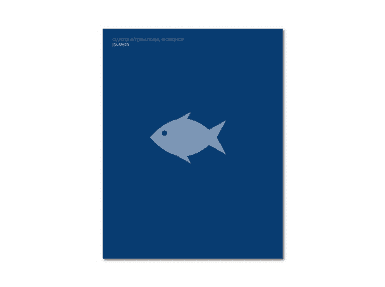

GIF from this [website](https://giphy.com/gifs/cluster-qqo-quattrequattrotto-GdJreNLdTYQx2)

这篇论文是两年前提出的，是利用无监督学习算法学习更高层次结构的另一种方法。(k 表示)

> **请注意，这篇帖子是给未来的自己看的，回顾这篇论文上的材料，而不是从头再看一遍。**

Paper from this [website](https://arxiv.org/pdf/1511.06241.pdf)

**摘要**

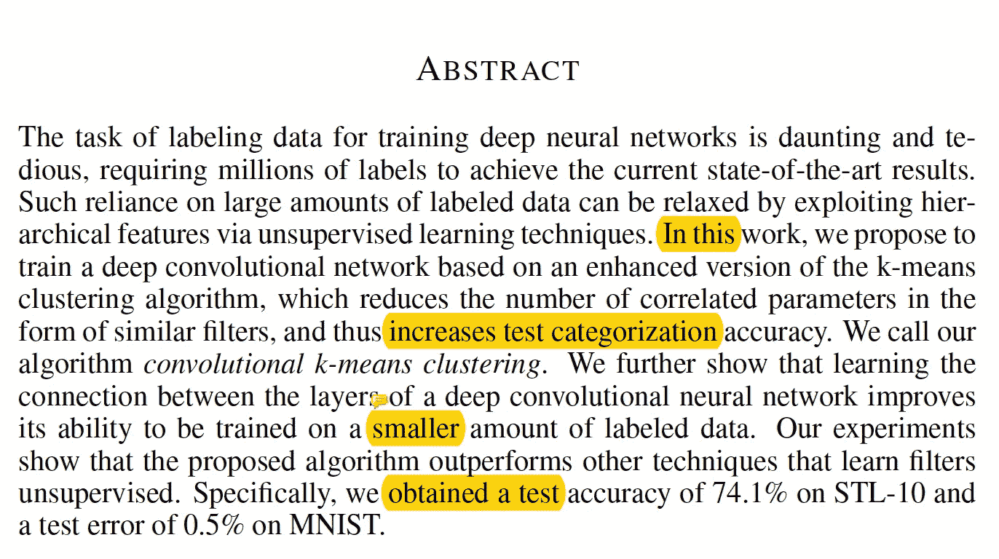

标记给定数据的任务是一个劳动密集型过程，在这项工作中，作者决定利用无监督学习算法来放松这一限制。其中，他们基于 k-means 聚类算法的增强版本来训练深度卷积神经网络，这减少了类似过滤器形式的相关参数的数量，从而提高了测试分类的准确性。他们能够在 STL 和 MNIST 数据集上获得较好的精度。

**简介**

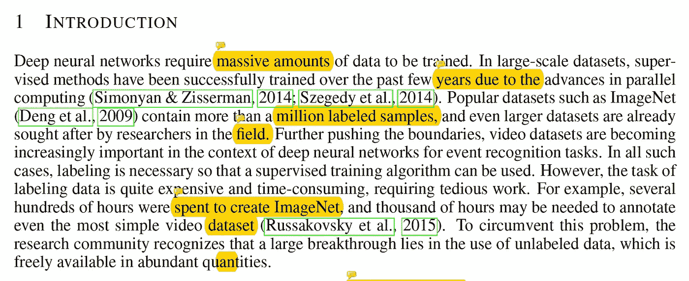

为了使网络运行良好，需要大量的数据，但是标记数据是一个劳动密集型的过程。因此，需要一些方法来利用未标记的数据。(以前需要无监督的预训练来训练非常深的神经网络。).在这项工作中，作者提出了一种改进的无监督聚类算法，允许过滤器学习不同的特征。(稀疏连接并防止算法学习冗余滤波器，这些滤波器基本上是彼此的移位版本。)

**相关工作**

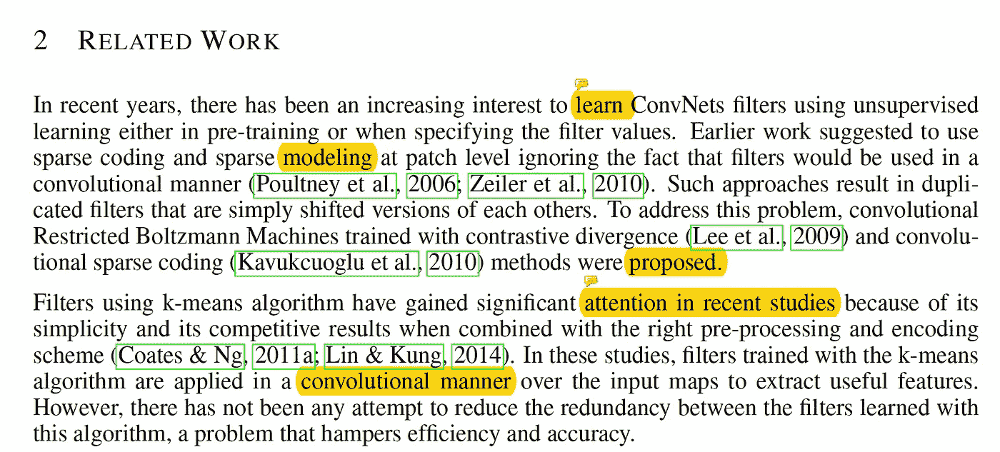

虽然存在不同的无监督学习方法来学习将要使用的滤波器，但是它们忽略了滤波器将以卷积方式使用的事实。这可能导致过滤器学习重复的特征检测器。为了克服这一点，提出了具有对比散度和卷积稀疏编码的卷积限制玻尔兹曼机。最近，使用 k-means 算法的滤波器得到了关注，然而，很少关注减少学习滤波器中的冗余。(已经提出了诸如随机连接或分组相似特征的小工作，但是它们没有提供显著的改进。)在这项工作中，作者通过设计一种优化的学习算法来解决这个问题，该算法避免了相似过滤器的复制。

**学习过滤器**

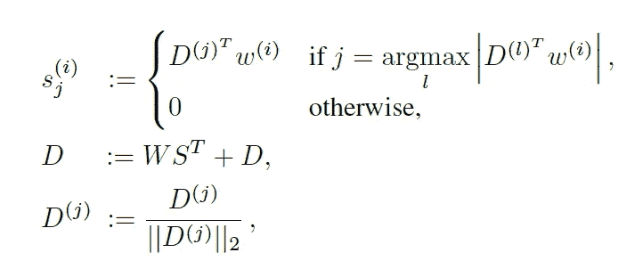

K 意味着算法通过使用上述算法从数据向量 w (N*M)中学习字典 D (N*K)。(S 是与输入 W 相关的码向量，D(j)是字典 D 的第 j 列，矩阵 W 的维数为(N*M ),而 S 的维数为(K*M)。然而，利用 k 均值学习算法，在学习的滤波器之间会有冗余，因此作者提出了卷积 k 均值。

卷积 K 意味着学习算法选择大得多的图像块来执行聚类，具体来说，选择比滤波器大小大两倍的窗口，并从输入图像中随机选择。然后，质心对整个窗口进行卷积，以计算提取区域的每个位置处的相似性度量，并且具有最大激活值的区域意味着是与质心最相似的特征。这从窗口中提取并分配给相应的质心。(修改后的算法见下图。)

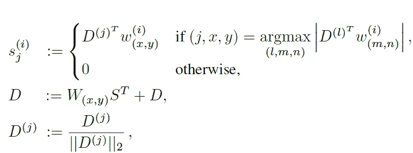

如下所示，当我们比较由两种算法学习的滤波器时，我们可以观察到通过 k 均值算法学习的滤波器之间的冗余，而学习的卷积 k 均值算法学习更多的本质基础。

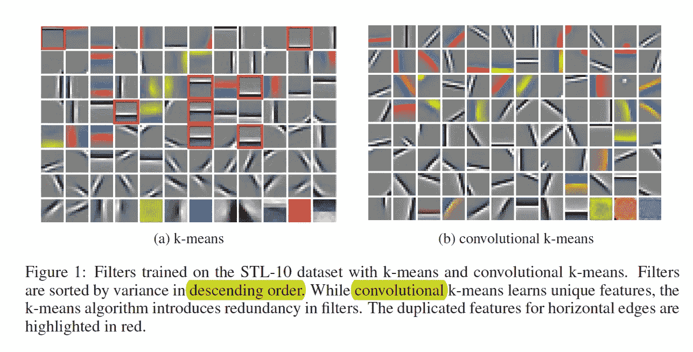

为了比较性能，作者使用 STL 数据集，为了学习过滤器，他们只使用未标记的图像。(对于编码方案，他们对输入图像应用了全局对比度归一化。)

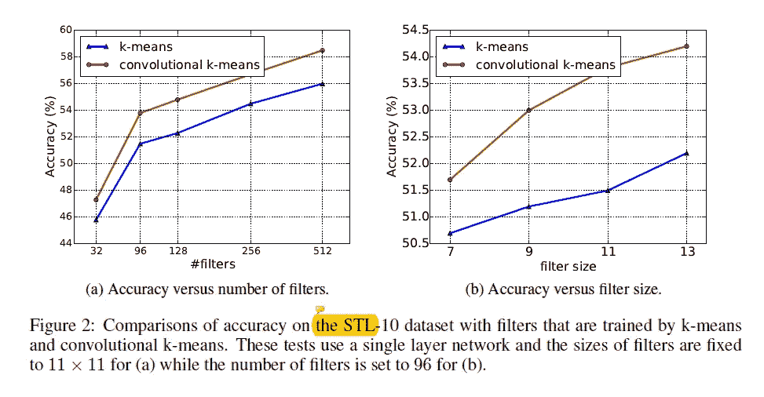

如上所述，当作者比较通过 k 均值和卷积 k 均值学习滤波器的网络性能时。我们可以看到，通过卷积 k-means 学习的网络具有更好的性能。这表明过滤器在从给定图像中提取有用信息方面做得更好。

**学习连接**

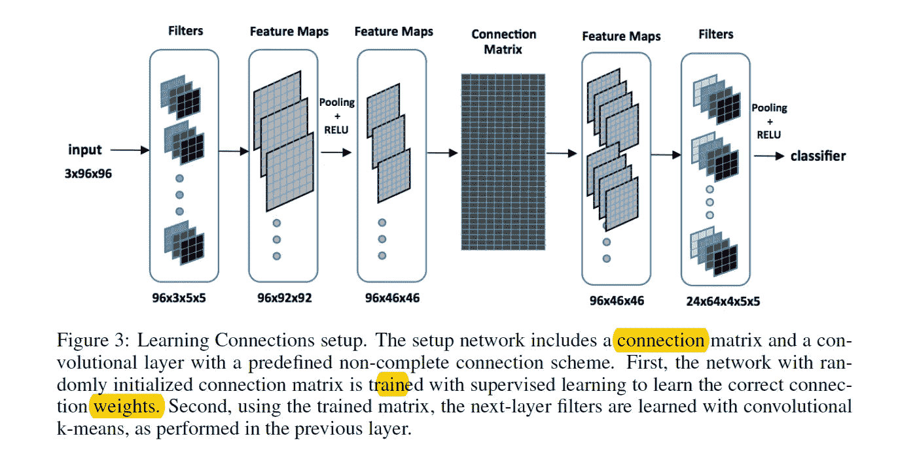

作者还研究了一种学习各层之间联系的方法。虽然完全连接的体系结构完全使用前面各层的所有功能，但非完全连接在计算方面更高效。(作者使用稀疏连接矩阵来实现这一点。).通过限制感受野之间的连接，可以扩展算法。

使用如上所示的架构，作者首先添加了具有预定义的不完全连接的卷积层，并在卷积层之后附加了线性分类器，并使用反向传播算法来训练系统。在这个阶段，通过监督学习来学习连接矩阵，当训练完成时，仅保留连接矩阵，并且通过卷积 k 均值算法来学习卷积滤波器。

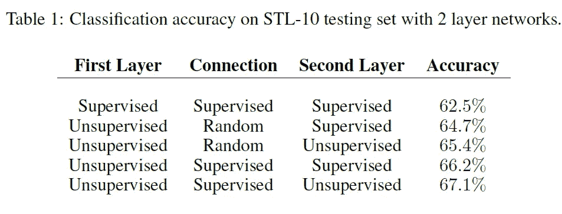

如上所述，当两个卷积层都通过卷积 k 均值算法学习时，会产生最佳结果。

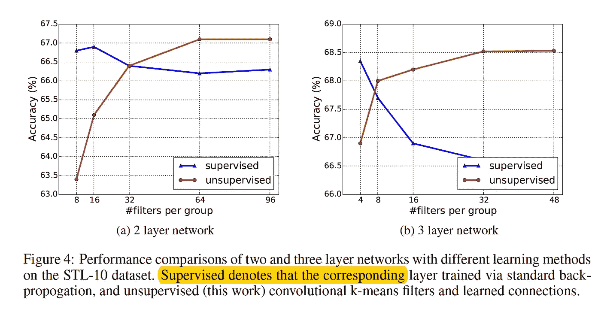

此外，我们可以再次确认卷积 k 均值算法是多么有效。当通过反向传播训练网络时，它过度适应训练数据，因此在测试图像集上具有非常低的性能。

**最终分类结果**

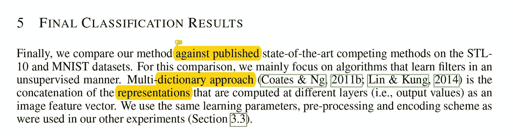

最后，作者比较了他们的方法与其他国家的艺术算法。(对于 STL 和 MNIST 数据集)。

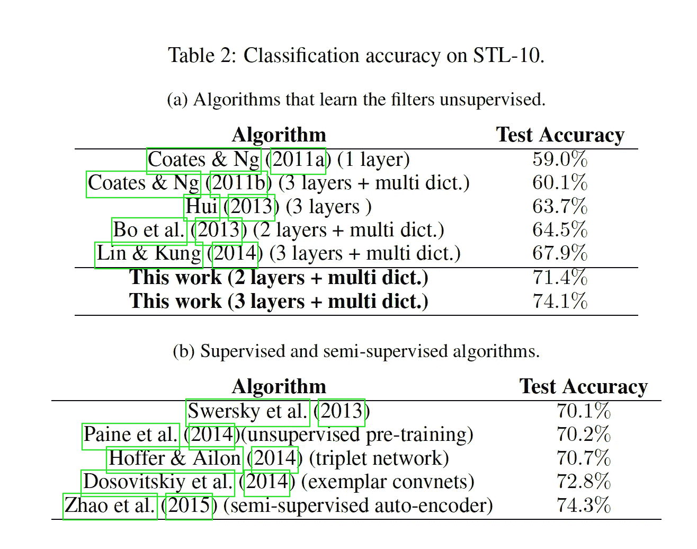

Results for STL

如上所述，当我们比较无监督的学习过滤方法时，我们可以看到作者的方法显著地提高了测试精度。(注意，对于上述算法，作者使用了多字典方法，而不是使用单个字典。).

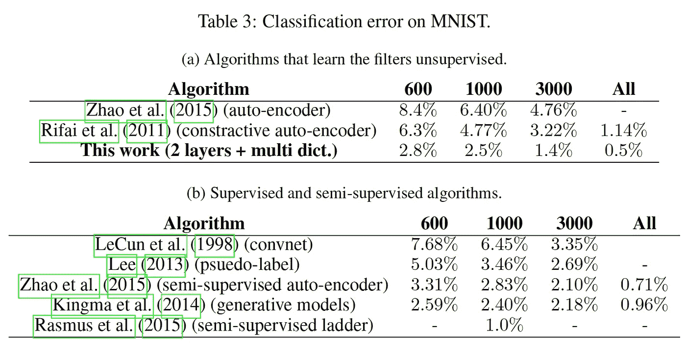

甚至对于 MNIST 数据集，我们可以看到作者的方法已经实现了最低的错误率。

**结论**

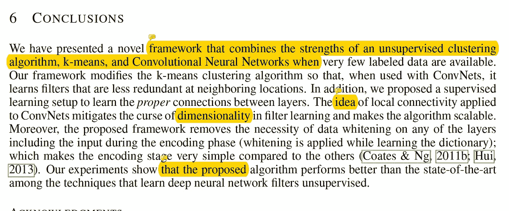

总之，本文作者提出了一种学习算法，该算法结合了监督学习算法和非监督学习算法的优点。作者修改了 k 均值学习算法，减少了网络学习的冗余滤波器。此外，作者提出了一种学习设置来学习层之间的正确连接。与其他无监督学习方法相比，该方法更简单，性能更好。

**最后的话**

这种方法的一个非常好的优点是，我们不需要在执行 k-means 聚类之前白化数据。然而，从与 deco 相关的批量标准化中，我们已经知道创建一个增白层是完全可能的。

如果发现任何错误，请发电子邮件到 jae.duk.seo@gmail.com 给我，如果你希望看到我所有写作的列表，请[在这里查看我的网站](https://jaedukseo.me/)。

同时，在我的 twitter [这里](https://twitter.com/JaeDukSeo)关注我，并访问[我的网站](https://jaedukseo.me/)，或我的 [Youtube 频道](https://www.youtube.com/c/JaeDukSeo)了解更多内容。我也实现了[广残网，请点击这里查看博文 pos](https://medium.com/@SeoJaeDuk/wide-residual-networks-with-interactive-code-5e190f8f25ec) t。

**参考**

1.  Dundar，a .，Jin，j .，& Culurciello，E. (2015 年)。无监督学习的卷积聚类。Arxiv.org。检索于 2018 年 8 月 20 日，来自[https://arxiv.org/abs/1511.06241](https://arxiv.org/abs/1511.06241)