# [ ICLR 2017 /论文摘要]使用强化学习设计神经网络架构

> 原文：<https://towardsdatascience.com/iclr-2017-paper-summary-designing-neural-network-architectures-using-reinforcement-learning-e6f099bcf2ec?source=collection_archive---------13----------------------->

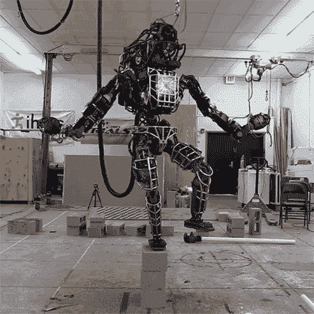

GIF from this [website](https://giphy.com/gifs/Q1LPV0vs7oKqc)

仅仅从名字你就已经知道这种纸有多酷了。

> **请注意，这个姿势是为了我未来的自己回顾和复习这篇论文上的材料，而不是从头再看一遍。**

Paper from this [website](https://arxiv.org/pdf/1611.02167.pdf)

**摘要**

设计新的网络架构不仅需要人类的专业知识，还需要劳动时间。本文的作者介绍了一种可以设计高性能卷积神经网络的代理。并且使用 Q-learning 和 e-greedy 探索策略和经验重放来训练代理。

**简介**

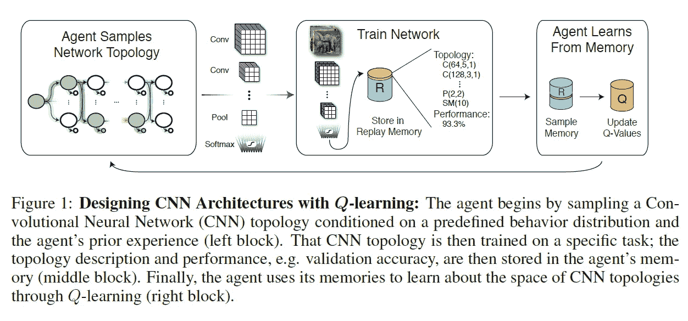

CNN 多年来取得了巨大的成功，典型的 CNN 由卷积层、池层和全连接层组成。(同样由于所有的选项，搜索空间相当大。).本文的作者制作了一个代理，旨在无需人工干预的情况下创建新的卷积神经网络架构。(代理正在对以何种顺序放置何种层做出顺序决策。)最后，他们在 MNIST 和 CIFAR 10 等图像分类数据集上测试了创建的网络。

**相关工作**

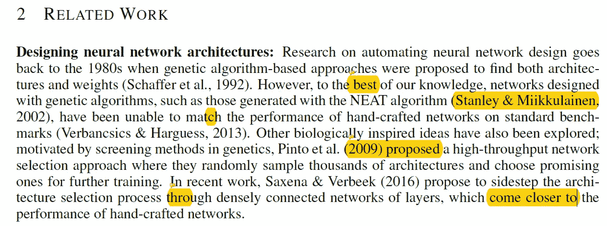

创建新网络架构的自动化在学术界并不是一个新概念，一些相关的作品是“[卷积神经结构](https://arxiv.org/pdf/1606.02492.pdf)”和“[遗传算法和神经网络的组合:技术发展水平的调查](https://ieeexplore.ieee.org/document/273950/)”。然而，不幸的是，通常情况下，手工制作的网络比生成的网络性能更好。最近在强化学习和深度学习的交叉领域有很多工作。其中，Q-learning、e-greedy 策略和经验重放取得了巨大的成功。

**背景**

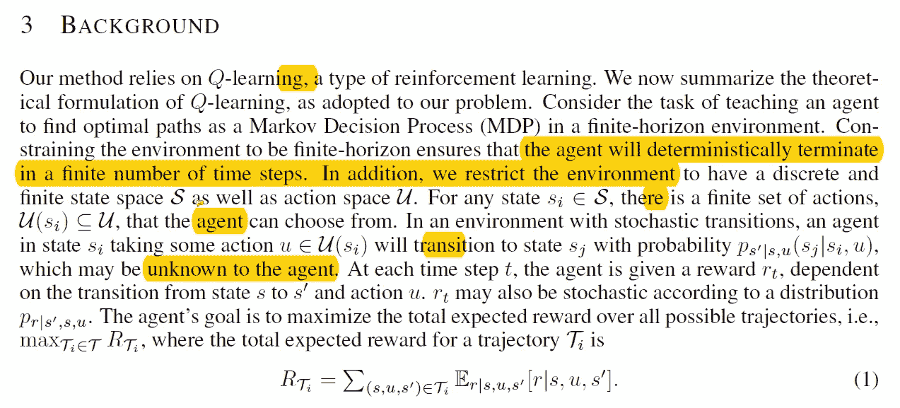

在这一部分，作者很好地解释了马尔可夫决策过程，贴现报酬函数，以及它们是如何结合在一起的。关于这个话题的更简单的解释可以在[这里](https://www.youtube.com/watch?v=2pWv7GOvuf0&list=PLweqsIcZJac7PfiyYMvYiHfOFPg9Um82B)找到。此外，如果您希望了解更多关于贝尔曼方程的信息，请点击[此处](https://www.youtube.com/watch?v=b1GvQcjDwBU)。

**利用 Q-learning 设计神经网络架构**

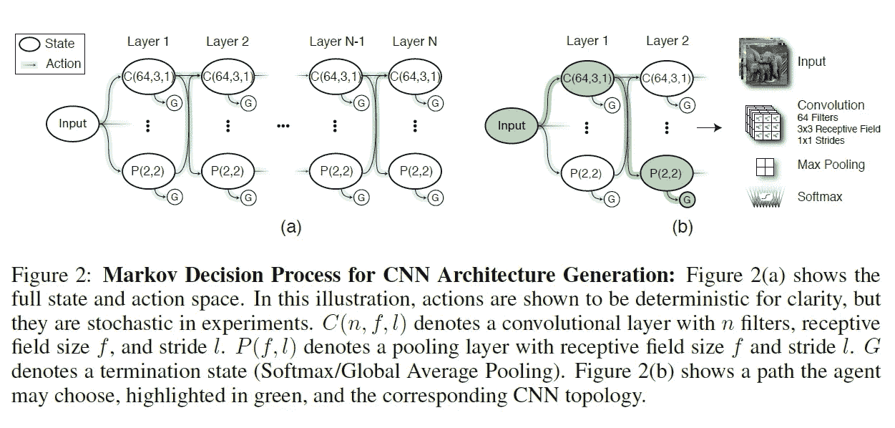

作者为智能体选择的任务是依次选择神经网络层。其中 C(n，f，l)对应于滤波器的数量、感受野大小和步幅，P(f，l)对应于具有相同符号的池层。当代理完成生成不同类型的网络架构时，(换句话说，到达终端状态)，生成的网络得到训练。并且验证准确性充当代理的奖励值，网络体系结构也被存储在代理的重放存储器中，并且经验被周期性地从重放存储器中采样以更新 Q 值。

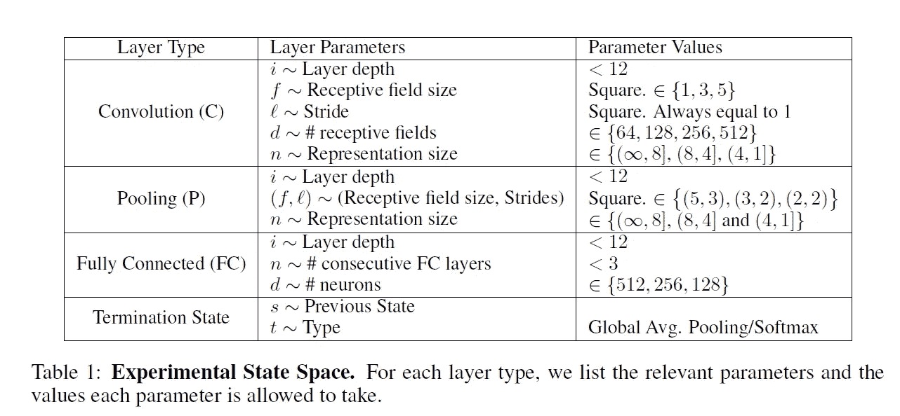

作者描述了每个状态空间、动作空间和 Q-Learning 训练过程的实现/配置细节。其中状态空间通过所有相关层参数的元组来定义。(每个参数的细节可以在上面看到。).对于动作空间，它们限制了完全连接层的数量，并使代理能够在任何给定的时间点移动到终止状态。最后，ε递减时间表如下所示。(Q 学习率为 0.01)。

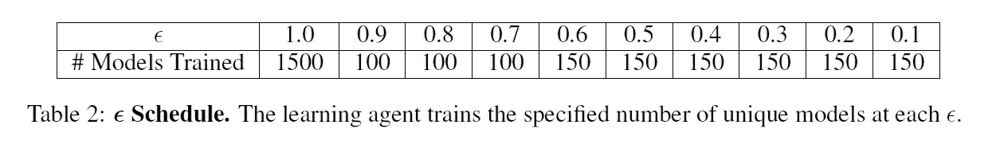

**实验细节**

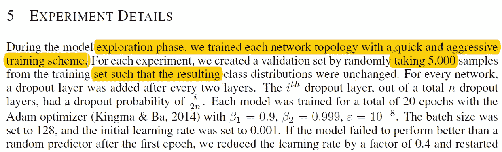

在这里，作者给出了他们在训练网络时选择的超参数的详细描述，以及他们添加了退出层的事实。一个有趣的事实是，如果他们的学习速度不是他们的最佳选择，网络有 5 次机会重新开始他们的训练。(如果他们不能学习，学习率就会降低。而且用了 10 个 nvidia GPU 用了 10 天。)最后，作者描述了他们如何为每个数据集优化超参数。(MNIST、CIFAR 10 和 SVHN。)

**结果**

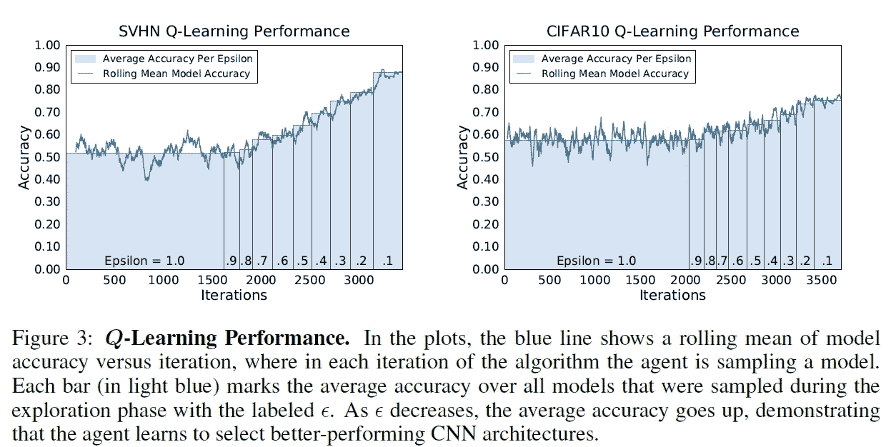

如上所述，随着代理从探索阶段进入开发阶段，每个数据集的模型的准确性开始增加。(特别是对于 SVHN，它从 52%增加到 88%。).一个有趣的事实是，代理通常选择 C(n，1，1)类型的卷积层作为第一层，这作为预处理步骤(即，将 RGB 图像转换为 YUV 图像)。).

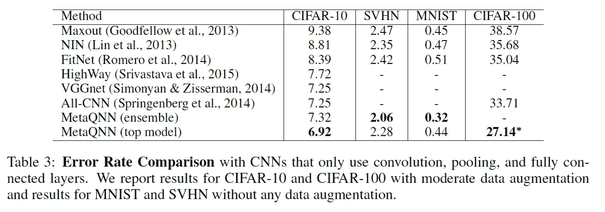

如上所述，我们可以注意到，与类似类型的网络(没有更高级的池层等)相比，代理生成的网络表现良好。甚至当比较由更复杂的网络结构组成的不同网络时，我们可以观察到由代理生成的网络仍然是有竞争力的。

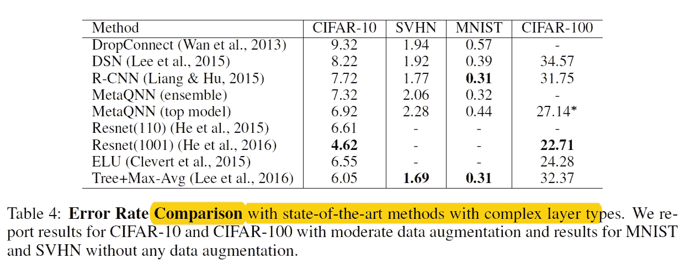

最后，作者还对 MetaQNN 的迁移学习能力做了一些实验。

**结束语**

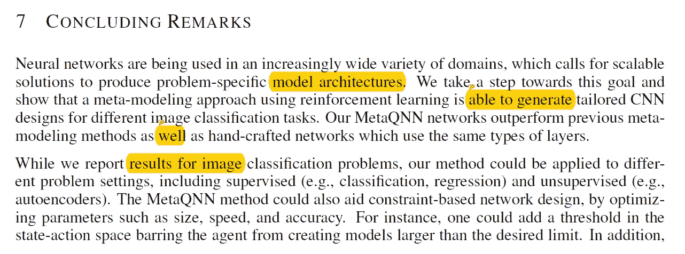

总之，为不同的用例设计网络架构是一项耗时的任务。这篇论文的作者提出了一种新的解决方案，他们训练了一个代理，该代理可以对下一步放置什么层做出顺序决策，以设计一个卷积神经网络。此外，作者指出了在未来更优化版本的代理的可能性。

**遗言**

创建不同类型网络的非常酷的方法。

如果发现任何错误，请发电子邮件到 jae.duk.seo@gmail.com 给我，如果你希望看到我所有写作的列表，请[在这里查看我的网站](https://jaedukseo.me/)。

同时，在我的推特[这里](https://twitter.com/JaeDukSeo)关注我，并访问[我的网站](https://jaedukseo.me/)，或我的 [Youtube 频道](https://www.youtube.com/c/JaeDukSeo)了解更多内容。我也实现了[广残网，请点击这里查看博文 pos](https://medium.com/@SeoJaeDuk/wide-residual-networks-with-interactive-code-5e190f8f25ec) t。

**参考**

1.  b .贝克、o .古普塔、n .纳伊克和 r .拉斯卡尔(2016 年)。使用强化学习设计神经网络结构。Arxiv.org。检索于 2018 年 6 月 28 日，来自[https://arxiv.org/abs/1611.02167](https://arxiv.org/abs/1611.02167)
2.  遗传算法和神经网络的结合:技术现状的调查——IEEE 会议出版物。(2018).Ieeexplore.ieee.org。检索于 2018 年 6 月 28 日，来自[https://ieeexplore.ieee.org/document/273950/](https://ieeexplore.ieee.org/document/273950/)
3.  (2018).Arxiv.org。检索于 2018 年 6 月 28 日，来自[https://arxiv.org/pdf/1606.02492.pdf](https://arxiv.org/pdf/1606.02492.pdf)
4.  David Silver 的 RL 课程—第 1 讲:强化学习简介。(2018).YouTube。检索于 2018 年 6 月 28 日，来自[https://www.youtube.com/watch?v=2pWv7GOvuf0&list = plweqsiczjac 7 pfiyymvyihfpg 9um 82 b](https://www.youtube.com/watch?v=2pWv7GOvuf0&list=PLweqsIcZJac7PfiyYMvYiHfOFPg9Um82B)
5.  贝尔曼方程-1。(2018).YouTube。检索于 2018 年 6 月 28 日，来自[https://www.youtube.com/watch?v=b1GvQcjDwBU](https://www.youtube.com/watch?v=b1GvQcjDwBU)