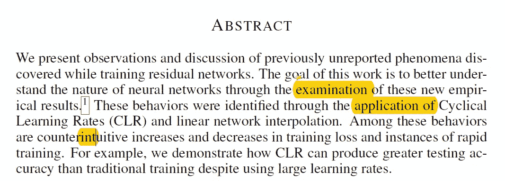
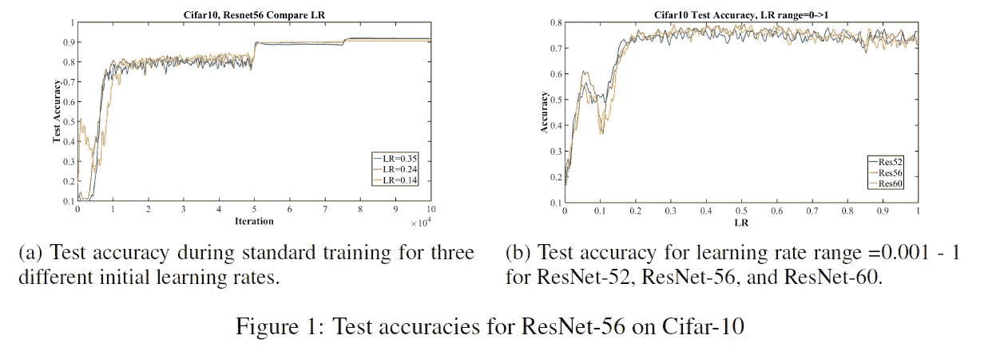
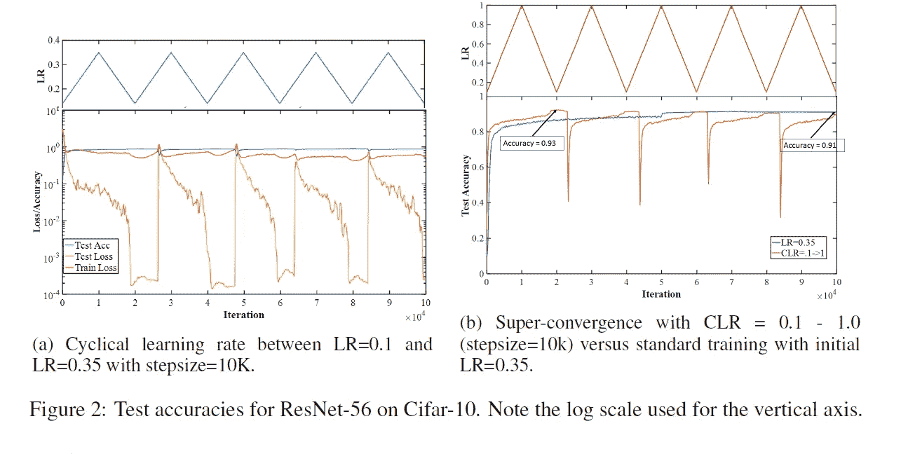
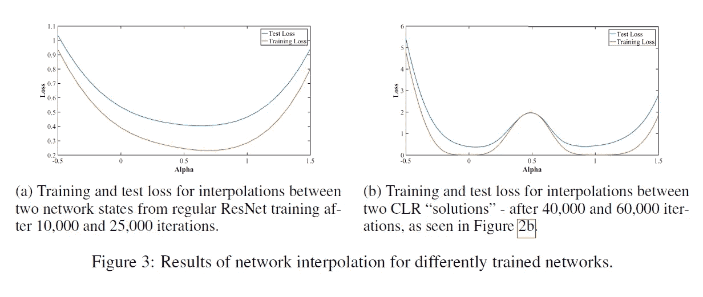
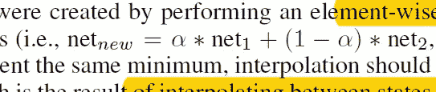
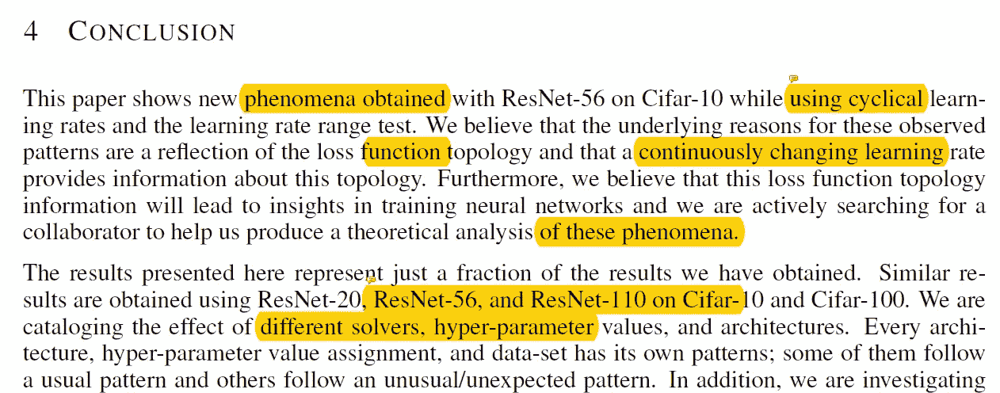

# 【ICLR 2017 /论文摘要】探索具有循环学习率的损失函数拓扑

> 原文：<https://towardsdatascience.com/iclr-2017-paper-summary-exploring-loss-function-topology-with-cyclical-learning-rates-4213655ba65?source=collection_archive---------16----------------------->

GIF from this [website](https://giphy.com/gifs/xUPGcGA2vckFaMUWbK)

我想知道更多关于循环学习率的信息。

> **请注意，这篇帖子是让我未来的自己回顾和回顾这篇论文上的材料，而不是从头再看一遍。**

Paper from this [website](https://arxiv.org/pdf/1702.04283.pdf)

**摘要**

本文作者训练了一个具有循环学习率(CLR)的残差神经网络。使用线性网络插值，他们能够观察到奇怪的现象。他们还发现 CLR 可以产生更高的测试准确度，尽管他们的学习率很高。

**简介**

在大多数神经网络论文中，作者提供了 top-k 准确度分数以及训练/测试进行情况的图表。这篇论文的作者认为，必须报告额外的行为。如上图(左图)所示，当学习率设置为 0.14 时，我们可以观察到一个奇怪的现象。训练开始后，准确性实际上在再次上升之前下降了。在右边的图表中，当学习率设定在 0.25 到 1.0 之间时，网络在这些范围内表现很好。本文作者希望用循环学习率来进一步研究这一现象。

**超收敛**

该论文的作者首先尝试了三角循环学习率(图表的左侧部分)。我们可以观察到，随着学习率从 0.1 增加到 0.35，训练损失急剧增加(当学习率在 0.25 左右时)。此外，我们可以观察到测试准确性和测试损失之间奇怪的分歧行为。

在图表的右边可以看到另一个令人惊讶的结果。我们可以看到，通过循环学习率，网络实际上能够比典型的学习率更快地收敛。其中仅在 20，000 个时期内就达到了 93%的准确率。然而，不幸的是，训练以较低的准确率结束。本文作者创造了术语“超收敛”来指代这种现象，即与传统训练相比，网络被训练到更好的最终测试精度，但迭代次数更少，学习率更高。

**网络插值**

如果网络的权重初始化不同，则有理由认为网络找到的最优解(最小点)可能不同。将每个网络的权重与下面的等式结合起来，我们可以看到这些最佳点是否彼此相似。

正如上文所见(图片和图表)，当作者将两种不同状态下的训练(常规学习率)网络结合起来时，我们可以看到一个单一的凹形，指示相似的最小点。但是，当我们结合使用 CLR 训练的网络的两个不同状态的权重时，我们可以观察到网络找到的最优解是不同的。

**结论**

总之，本文作者报道了用循环学习率训练残差网络时的一些奇怪现象。作者认为这些模式出现的根本原因是损失函数拓扑。令人惊讶的是，这篇论文中报道的现象只是作者所看到的所有现象的一小部分。

**最后的话**

没有多少研究者研究学习速率的动态如何影响网络性能。很高兴看到这些研究正在进行。

**参考**

1.  l .史密斯和 n .托平(2017 年)。探索具有循环学习率的损失函数拓扑。Arxiv.org。检索于 2018 年 6 月 29 日，来自[https://arxiv.org/abs/1702.04283](https://arxiv.org/abs/1702.04283)