# ICLR 2018 海报亮点(第一部分)

> 原文：<https://towardsdatascience.com/iclr-2018-posters-highlight-part-1-386e674f2f9a?source=collection_archive---------5----------------------->

今年的国际学习代表会议(ICLR)在加拿大美丽的温哥华举行，这是我和我的团队分享的一份快速旅行报告。由于我还没有找到任何关于 ICLR2018 的博文，所以我决定在 Medium 上分享这份报告。但在继续阅读之前，请注意，这是通过我的偏见镜头，只对我感兴趣的领域。

你可以在这里观看每一个主题演讲和演讲(谢谢脸书！):[https://www.facebook.com/pg/iclr.cc/videos/?ref=page_internal](https://www.facebook.com/pg/iclr.cc/videos/?ref=page_internal)

下面是我已经做了深入阅读标记的海报。其中大部分是“研讨会”论文。在我看来，“研讨会论文”和“会议论文”实际上是一样的。他们只是在不同的房间，但都同样拥挤。我个人更喜欢“研讨会”论文。

# ***1。在机器学习中放一个 bug:一个蛾的大脑学习阅读 MNIST。***

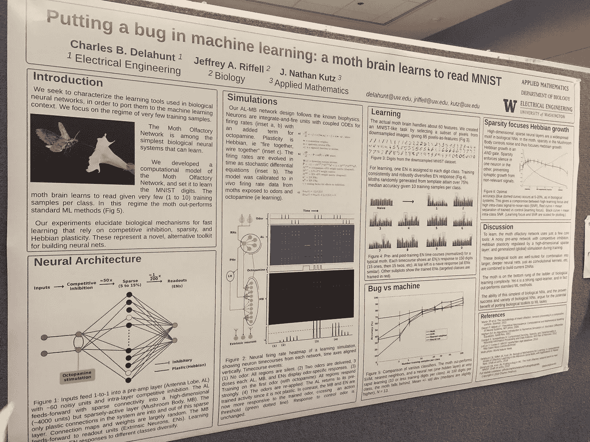

**关键词:**神经网络

> **为什么我觉得这张海报很有趣？**
> 
> 即使是这种最简单的生物神经网络，它也大大优于标准的机器学习方法，如最近邻、SVM 和卷积神经网络(CNN)
> 
> 将生物工具包移植到 ML 任务的潜在好处

**实施细节**

1)给蛾嗅觉(嗅觉)网络的计算模型分配学习阅读 MNIST 数字的任务。“蛾网”与飞蛾已知的生物物理学密切相关。

2)为了学习，MothNet 只使用了生物神经网络工具中广泛存在的一些结构元素:一个嘈杂的前置放大网络，具有由高维稀疏层调节的竞争抑制和可塑性

*   【初学者友好】*“竞争性抑制”或“Hebbian”听起来很花哨，但它们并不是那么难的概念。竞争性抑制*是酶抑制的一种形式，其中抑制剂的结合阻止了酶的目标分子的结合。赫比安法则认为，如果两个神经元同时放电，它们之间的联系可能会得到加强。

# ***2。不衰减学习速率，增加批量***

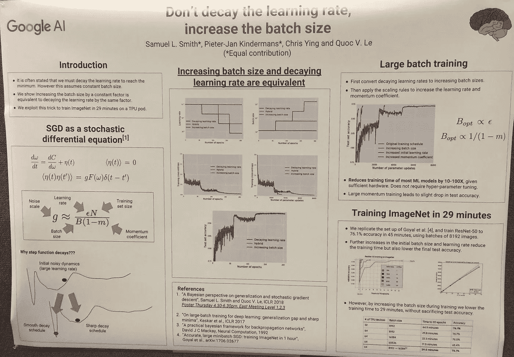

**关键词:**批量大小，学习率

> 为什么我觉得这张海报很有趣？
> 
> 该论文声称，在训练期间以线性速率增加批量大小与学习速率下降一样有效。
> 
> 很好地证明了在 SGD 优化中调整学习率和增加批量之间的等价性
> 
> 它显示了评估势头、Adam 等的努力。

**实施细节**

1.  作者是理论物理博士(！)并且他用他在随机微分方程方面的深入知识(SDE。还记得布朗运动吗？)将随机梯度下降(SGD)解释为 SDE。
2.  如果你看海报，这部作品的核心是左下角的“SGD 作为随机微分方程”一节。其他的都只是展示结果而已。
3.  它定义了“噪声尺度”g = eN/B(1-m)其中 g 是噪声尺度，e 是学习率，N 是训练集大小，B 是批量大小，m 是动量系数。**噪声使 SGD 远离尖锐的最小值**，因此存在一个最佳批量，使测试集精度最大化。这个最佳批量大小与学习率和训练集大小成比例。
4.  这个噪音等级来自于他之前的论文[关于一般化和随机梯度下降的贝叶斯观点](https://arxiv.org/abs/1710.06451)。这是一个相当长的数学推导过程，从 dW/dt = dC/dW+η(t)(该部分的第一个等式)开始，其中 W 是参数，C 是成本函数，η(t)是白噪声。你可以看到 dC/dW 是一个梯度。
5.  然后他引入 F(W)，这是一个描述梯度协方差的矩阵，也是当前参数值的函数。如果我冗长的解释让你感到困惑，看看[中的等式 11、12、13,](https://arxiv.org/abs/1710.06451)关于一般化和随机梯度下降的贝叶斯观点。
6.  最后，它吹嘘用 64 个 TPU 在 29 分钟内训练了 ImageNet)然后我在上面看到了 Quoc Le 这个名字:)

# 3.强化行走:用蒙特卡罗树搜索学习在图中行走

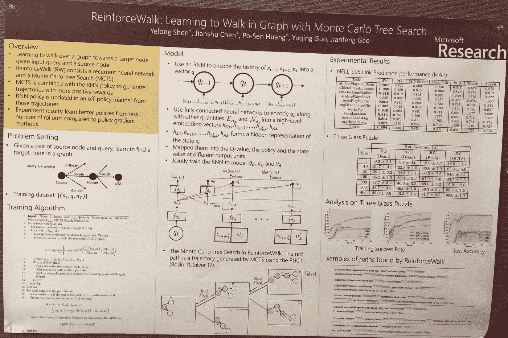

**关键词:**蒙特卡罗树搜索，知识图，强化学习

> **为什么我觉得这张海报很有趣？**
> 
> 因为这是我们团队的论文！我们可以把它做成销售图，然后生产出来。
> 
> 结合 RNN 和 MCTS(蒙特卡罗树搜索)的策略梯度在知识图推理中的新颖应用

**实施细节**

1.  问题定义:学习遍历一个图 G = (N，E)，其中 N 是一组节点，E 是一组边，以便为给定的一对*源节点* Nt ∈ N 和*查询* q 找到一个*目标节点* Nt ∈ N
2.  训练数据集是{(Ns，q，Nt)}
3.  RNN 将先前状态、先前动作和目标节点的历史编码到向量 q 中
4.  用全连接 NN 把 q_t 和 N&E 一起编码成一个高层嵌入向量 h 的(我讨厌介质还是不支持下标。看海报“模特”部分。)
5.  **为什么把 RNN 和 MCTS 结合起来，而不是正常的政策梯度？**策略梯度法一般样本效率较低，尤其是在报酬信号稀疏的情况下，比如在这个问题中，报酬({0，+1})只出现在一个轨迹的末端。MCTS 有助于生成具有更多积极回报的轨迹，我们可以使用这些轨迹来进一步改进政策。

*   [初学者友好]什么是 MCTS？
    非常简单地说:1。建立一个前瞻树(如博弈树。)
    2。使用推广(模拟)来产生奖励。
    3。将类 UCB(置信上限)公式应用于树的内部节点。

# ***4。负责任地预测:通过学会推迟来增加公平性***

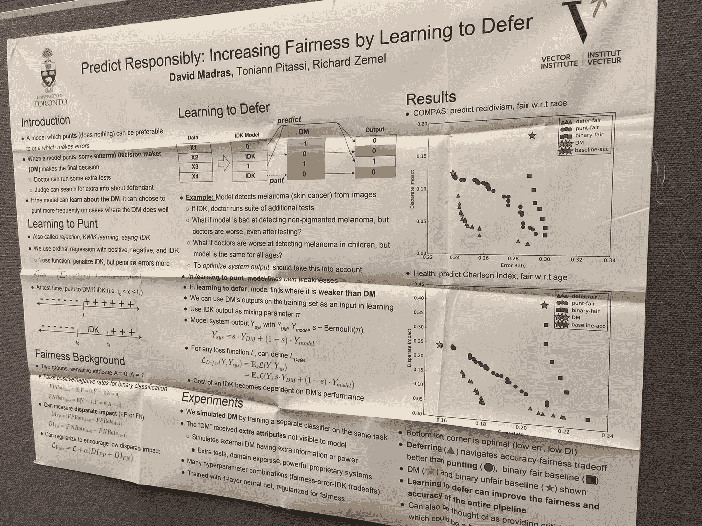

**关键词:**公平，学会推迟

> **为什么我觉得这张海报很有趣？**
> 
> 本文件提出了一个确保分类公平的框架。它探索了学习推迟的模型。
> 
> 把学会推迟作为实现公平的一种手段的想法相当新颖。
> 
> 实验表明，这种策略不仅可以提高预测的准确性，还可以减少决策中的偏差。

**实施细节**

1)看橙色图。当 IDK 模型预测时，系统输出该模型的预测。当模型显示 IDK 时，系统输出决策者的预测。

2)因此，第一阶段是标记疑难案例以供审查。

3)在数学上，我们可以将 IDK 模型描述如下。

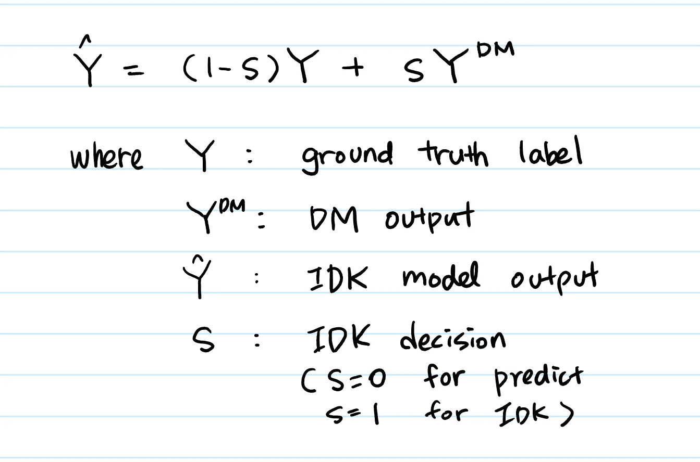

4)然后，该模型可以被训练为使用示例损失函数(例如，分类误差、交叉熵)来最小化以下损失函数。

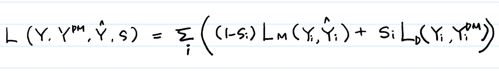

5)我让它听起来很简单，但这并不是本文中数学的终结。它从上述思想中分支出来，建立可微的 IDK 学习模型，并使 s_i 成为“延迟概率”，而不仅仅是 0 和 1。

6)他们选择“完全不同的影响”作为公平标准。

# 5.学习深度模型:临界点和局部开放性

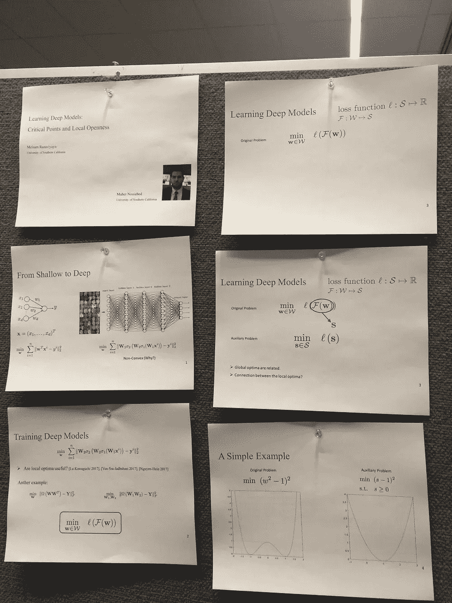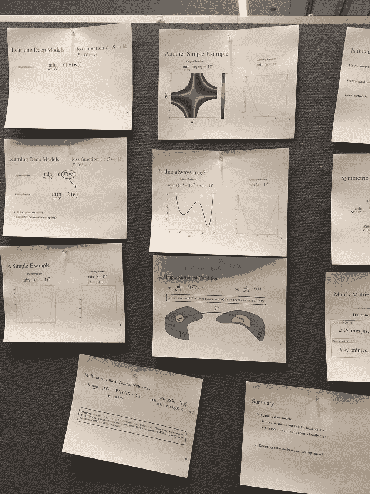

**He was the only author who didn’t bring the proper poster. I liked how indifferent (read: cool) he is being about the presentation.**

**关键词:**非凸优化

> **为什么我觉得这张海报很有趣？**
> 
> 这是一项“理论构建”工作。
> 
> 它使用“局部开”的概念来绘制局部最优和全局最优之间的等价关系。
> 
> 本文不要求对激活函数的可微性进行假设。

**实施细节**

1)为 Burer-Monteiro 的经典结果提供一个简单的证明，并将其推广到非连续损失函数。

2)证明了两层线性网络的每个局部最优解都是全局最优解。与文献中的许多现有结果不同，他们的结果不需要对目标数据矩阵 Y 和输入数据矩阵 x 进行假设。

3)发展多层线性神经网络的局部/全局最优等价的几乎完整的特征。

我没有详细检查这个结果的证明，但它似乎是正确的。

# ***6。隐式模型的梯度估计器***

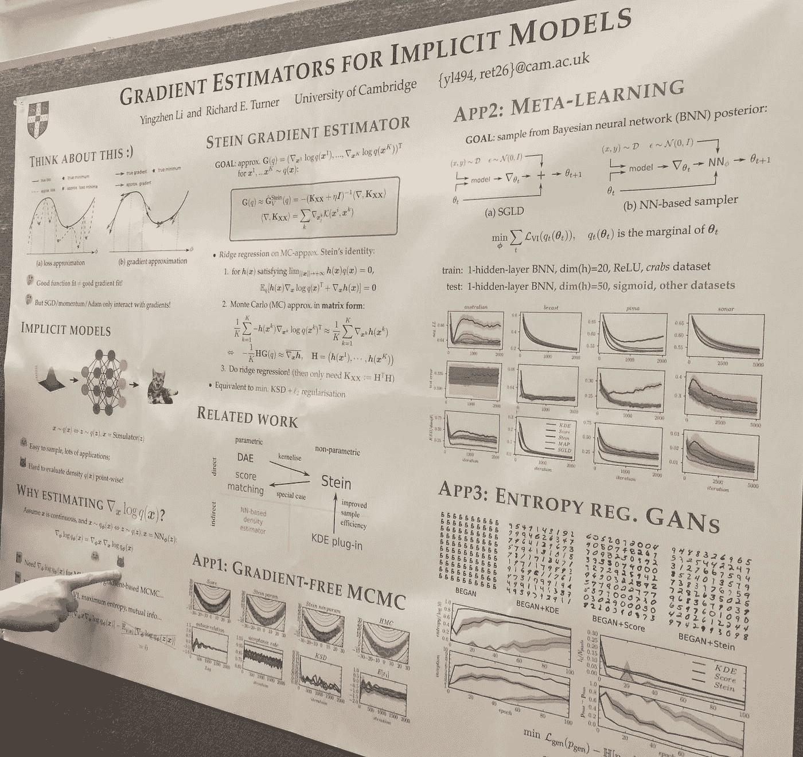

**关键词:**隐性模型

> **为什么我觉得这张海报很有趣？**
> 
> 它为用于数据采样的生成模型(如 GANs)提供了一种估计某些训练目标梯度的方法。
> 
> 想法是这可用于培训程序。
> 
> 提出“Stein 梯度估计器”，直接估计隐式定义分布的得分函数。

**实施细节**

1)隐式概率模型由随机过程定义，该随机过程允许直接生成样本，但不允许评估模型概率。

2)这个想法基于 Stein 的身份:内核化的解决方案。本文介绍了贝叶斯神经网络和遗传神经网络的应用。

3)大多数现有的学习隐式模型的方法依赖于对基于梯度的优化的难以处理的分布或优化目标进行近似，这易于产生不准确的更新，从而产生差的模型

# ***7。TensorFlow*** 中批量学习的弹性反向传播(Rprop)

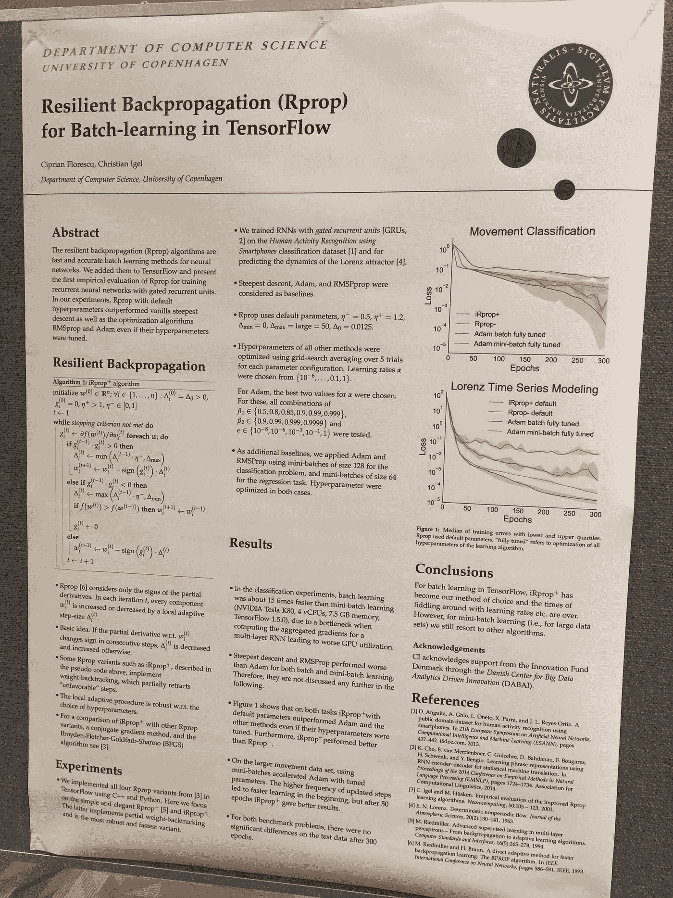

**关键词:**张量流

> **为什么我觉得这张海报很有趣？**
> 
> 它在 Tensorflow 中实现了弹性反向传播(Rprop)算法，并表明在用 RNN 解决简单任务时，它的性能优于 Adam。

**实施细节**

Rprop 算法只考虑要优化的函数 f 的偏导数的符号，而不考虑它们的绝对值

2)在每次迭代中，如果偏导数的符号

# ***8。修剪，还是不修剪:探索模型压缩中修剪的功效***

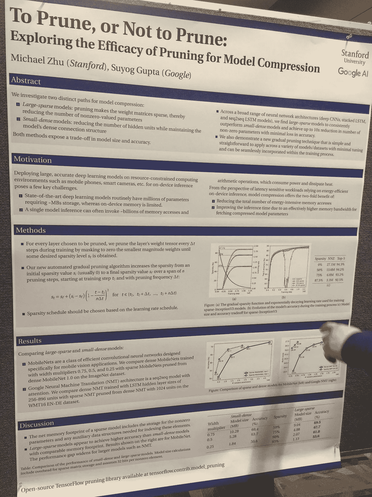

**关键词:**模型稀疏性，模型压缩

> 为什么我觉得这张海报很有趣？
> 
> 这是一个有益的实验。大型稀疏模型(为了减少模型的内存占用而进行修剪的大型模型)被修剪成目标大小。他们表明，这些模型比小型密集模型性能更好。(比简单的缩小模型架构的规模更有效。)
> 
> 结果显示在 conv 模型和 seq2seq 的各种数据集上。
> 
> 作者甚至公开了代码。

**除了我亲手挑选的，这里还有 2018 年 ICLR 最佳论文:**

*   [关于亚当的趋同与超越](https://openreview.net/forum?id=ryQu7f-RZ)
*   [球形 CNN](https://openreview.net/pdf?id=Hkbd5xZRb)
*   [在不稳定和竞争的环境中通过元学习不断适应](https://openreview.net/pdf?id=Sk2u1g-0-)

良好的..今天到此为止！我的手机里还有一些其他的海报照片，所以如果时间允许，我可能会写第二部分。感谢阅读！