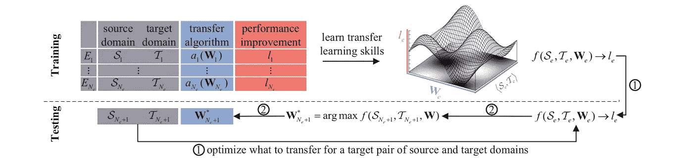
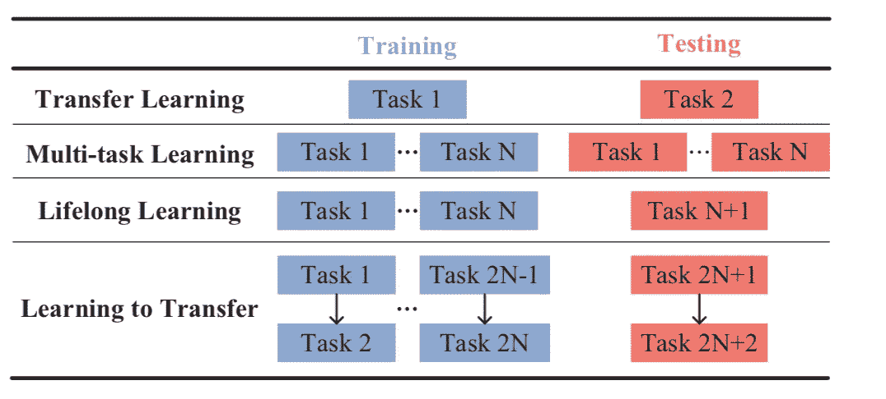
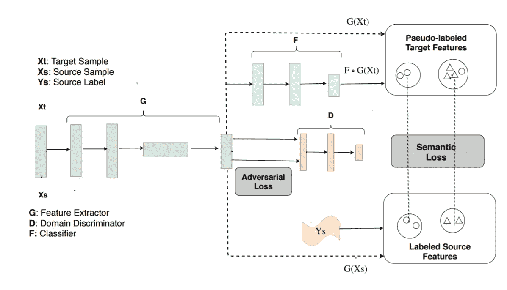
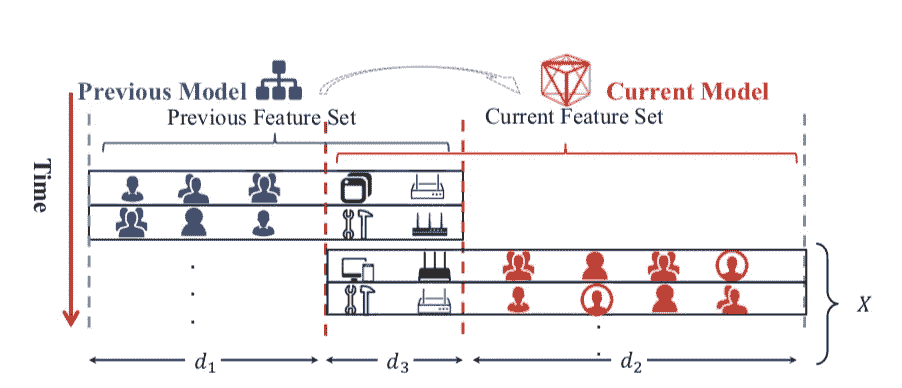

# ICML 2018:转移、多任务和半监督学习的进展

> 原文：<https://towardsdatascience.com/icml-2018-advances-in-transfer-multitask-and-semi-supervised-learning-2a15ef7208ec?source=collection_archive---------5----------------------->

机器学习国际会议于去年 7 月在斯德哥尔摩举行。总之，它展示了机器学习中许多有趣的趋势和方向。由于 ICML 是一个如此大的会议，我将把我的注意力集中在会议上发生的一些有趣的事情上。

具体来说，今年的 ICML 将口头演讲分成了几个不同的“曲目/时段”我很高兴看到其中的三次会议集中在“迁移和多任务学习”上，因为这一直是我感兴趣的领域。此外，大量的海报涉及到这些概念以及其他曲目的一些口述。

缺乏大量干净的标记数据仍然是深度学习潜在影响的障碍。对于许多任务来说，总体上缺乏数据点(例如，预测选举、诊断罕见疾病、翻译成稀有或灭绝的语言……)。在其他情况下，数据是存在的，但有噪音或标记不良(例如，在特定关键字下从 Google 抓取的图像，通过 NLP 分配标签的医疗案例，仅部分注释的文本语料库)。不管是什么原因，找到从有限的或有噪声的(半相关)数据中学习的方法都有明显的好处。

三种这样的方法是迁移学习、多任务(从技术上来说，这是迁移学习的一个子类，就像领域适应一样，但是在本文中，我将它们作为独立的实体对待)和半监督学习。还有其他方法(主动学习、元学习、完全无监督学习)，但本文将集中讨论与这三者相关的 ICML 文章(尤其是前两种)。由于这些领域之间的界限并不总是很清楚，我们也可能会涉足其他一些领域。对于需要复习的读者，这里有一个简单的概述。更详细的概述，请参见 Sebastian Ruder 关于[迁移学习](http://ruder.io/transfer-learning/)和[多任务学习](http://ruder.io/multi-task-learning-nlp/)的精彩博文。

Overview of the various idioms. (As an aside a neat trick I just discovered you can actually render markdown in Medium. So if you have need of nested lists or other things just embed a Github gist with a .md extension).

我总是发现迁移学习和多任务学习是非常重要的工具，不管是在哪个行业或领域。无论您是在医学、金融、旅游还是娱乐领域工作，也无论您是在处理图像、文本、音频还是时间序列数据，您都有可能从采用通用的预训练模型并根据您的特定领域对其进行微调中受益。根据您的数据，也很可能有多个相关的任务，您可以训练您的神经网络来学习联合解决，从而提高整体性能。

那些关注医学深度学习(但对其他人也有用)的人特别感兴趣的是一篇题为“ [**不要喊狼来了:远程监督的多任务学习重症监护**](https://arxiv.org/abs/1802.05027) **”的论文**在 ICU 病房中，经常会出现假警报的问题，以至于护士/医生对它们变得麻木不仁。本论文的重点是使用多任务和半监督学习来检测真正威胁生命的 ICU 事件，而不是虚警。该论文的作者着眼于使用带有辅助任务的多任务学习来提高模型的性能，而不需要花费大量时间进行注释。具体来说，他们的模型“结合了大量远程监督的辅助任务，以显著减少训练所需的昂贵标签的数量。”其次，他们开发了一种新的方法“远程监督多任务学习，自动从多元时间序列中识别大量相关的辅助任务，以从标记和未标记的数据中联合学习。”演讲的视频可以在 YouTube 上找到。

如果你想要多任务学习的好处，但只有一个任务怎么办？论文“ [**伪任务增强:从深度多任务学习到任务内共享——再回到**](https://arxiv.org/abs/1803.04062) ”就是针对这个问题。作者建议利用*伪任务*来帮助提高主任务的性能。这是可能的，因为在基本层面上，多任务学习通常通过在中间层和上层之间共享特征以及学习用于特定任务的特定任务解码器来工作。因此，训练具有多个解码器的模型应该带来相同的好处，即使解码器都用于相同的任务，因为每个解码器以不同的方式学习任务；这些额外的解码器被称为“伪任务”该论文的作者在 CelebrityA 数据集上实现了 SOTA 结果。我很高兴地看到他们也在 IMDB 情感数据集上进行了测试。他们使用了一个基线模型，并通过使用他们的技术进行训练显示出显著的改善。这表明该技术可以潜在地与多种不同的神经网络架构一起工作。

[**GradNorm:深度多任务网络中自适应损耗平衡的梯度归一化**](https://arxiv.org/abs/1711.02257)

本文描述了一种新的多任务神经网络的规范化技术，帮助他们更快地收敛和提高整体性能。它还将需要调整的超参数总数减少到一个。使用 GradNorm，他们在 NYU2 数据集上获得了 SOTA。总体而言，这是一篇有助于降低训练 MLT 算法的复杂性和难度的扎实论文。最后，作者做了有趣的观察，“GradNorm 可能有超出多任务学习的应用。我们希望将 GradNorm 方法扩展到类平衡和序列到序列模型，在所有情况下，梯度信号冲突的问题都会降低模型性能。”

[**通过学习转移学习**](http://proceedings.mlr.press/v80/wei18a/wei18a.pdf)

A diagram from the paper describing how L2T works.

到目前为止，大多数迁移学习论文只研究了从源域到目标域的知识迁移，或者通过预初始化权重和冻结层，或者通过降低学习速率。这篇论文最好被描述为“元迁移学习”或学习如何最好地执行迁移学习任务(L2T)。作者描述说:

> 与 L2T 不同，现有的迁移学习研究都是从零开始，即只考虑感兴趣的领域对，而忽略先前的迁移学习经验。更好的是，L2T 甚至可以收集所有算法的智慧，考虑到上面提到的任何算法都可以应用于迁移学习体验

这自然会引出一个问题，这和“元学习”有什么不同事实上，L2T 可以被视为一种特殊类型的元学习；像元学习一样，它利用过去的历史来改进学习方式。然而，在这个上下文中，历史指的是从源域到目标域的迁移学习任务。

A diagram of the difference between different types of learning. From the article (Figure #)

该论文的作者在 Caltech-256 上评估了 L2T 框架并绘制了数据集草图。该模型改进了以前的 SOTA 结果，特别是在例子很少的情况下。

我很高兴看到**[**用卷积网络进行迁移学习的显性归纳偏差**](https://arxiv.org/abs/1802.01483)**【在被 ICLR 拒绝(我认为不公平)后进入 ICML。本文描述了一种应用正则化来有效地进行迁移学习而不是修改学习速率的方法。作者提出了几种新的正则化方法，这些方法基于预训练模型中的权重应用不同的惩罚。他们取得了很好的实验结果，我目前正致力于将其应用到我的几个医学成像模型中。****

****“ [**通过迁移学习进行课程学习:深度网络的理论和实验**](https://arxiv.org/pdf/1802.03796.pdf) ”主要是一篇研究“课程学习”的理论论文，这是一种借鉴自教育/心理学的学习习语，旨在以渐进和有组织的方式学习更难的概念。具体而言，本文着眼于迁移学习和课程学习之间的关系，以及课程学习和为训练提供的示例顺序之间的关系及其对随机梯度下降的影响。这里需要注意的是，这种类型的转移不同于迄今为止讨论的其他类型。在这种情况下，迁移学习指的是研究“知识从一个分类器到另一个分类器的迁移，如*教师分类器*到*学生分类器。”*因此，在这种类型的迁移学习中，“迁移的不是实例表示，而是训练实例的排序。”作者的结论是，课程学习的学习速度总是更快，有时最终的概括能力会得到提高，特别是对于困难的任务。****

****[**学习无监督领域适应的语义表示**](http://proceedings.mlr.press/v80/xie18c/xie18c.pdf)****

********

****Figure 1 from the paper.****

****(无监督的)域适应中的一个问题是目标和源分布之间的对齐。无监督的领域适应是一种迁移学习。作者在这里开发了一个语义转移网络，它通过对齐标记的源质心和伪标记的目标质心来学习“未标记的目标样本”的表示更简单地说，他们的方法旨在通过语义损失函数，基于最小化源域和目标域之间的整体映射差异来对齐源域和目标域的分布。结果包括在 ImageCLEF-DA 和 Office31 数据集上的 SOTA 性能。他们的代码可以通过[点击这里](https://github.com/Mid-Push/Moving-Semantic-Transfer-Network)在线获得****

****[**用黑盒预测器检测和校正标签偏移**](http://proceedings.mlr.press/v80/lipton18a/lipton18a.pdf) 是另一篇关于领域适应的有趣论文。它的重点是如何检测训练和测试之间 y 分布的变化，这在医学中非常有用，如果某种疾病的流行或爆发会极大地影响分布。****

> ****面对训练集和测试集之间的分布偏移，我们希望*检测到*和*量化*这种偏移，并且*校正*我们没有测试集标签的分类器****

****本文的具体主题主要是协变量转移。作者开发了几个有趣的标签移动模拟，然后应用于 CIFAR-10 数据集和 MINST。与未校正的模型相比，他们的方法能够大大提高精确度。****

****[**用语义映射纠正异构模型**](http://proceedings.mlr.press/v80/han-jia18a/han-jia18a.pdf)****

********

****Diagram from the paper describing the modeling of feature spaces.****

****我发现这篇论文很有意思，因为它结合了最优运输来调整分布。****

> ****最优运输成为改革的主要工具，它具有调整分配的能力****

****总之，本文在人工数据集和真实数据集(包括亚马逊用户点击数据集和学术论文分类数据集)上提出了新颖的观点并取得了良好的结果。****

****这些只是 ICML 2018 的一些有趣的论文；还有许多其他伟大的论文。我确实希望在某个时候总结一下元学习和其他半监督学习论文。我发现这些论文也很吸引人。****

## ******公告******

****我仍在努力完成关于将机器学习模型部署到生产中的系列文章中的下一篇文章。在那篇文章中，我将讨论使用 SeldonCore 和 Kubeflow 以可扩展的方式部署机器学习模型。****

****northern New England Data and Analytics 将于 8 月 15 日举办一次数据会议，我们将在会上通过 Seldon Core 和 Kubeflow 部署一个最近的 NLP 模型，以便在聊天机器人中使用它。Meetup 将[在 Zoom](https://zoom.us/j/445329335) 上进行流媒体播放。****