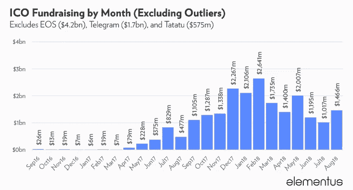
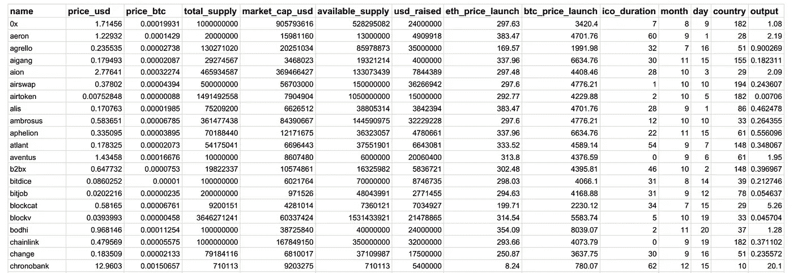
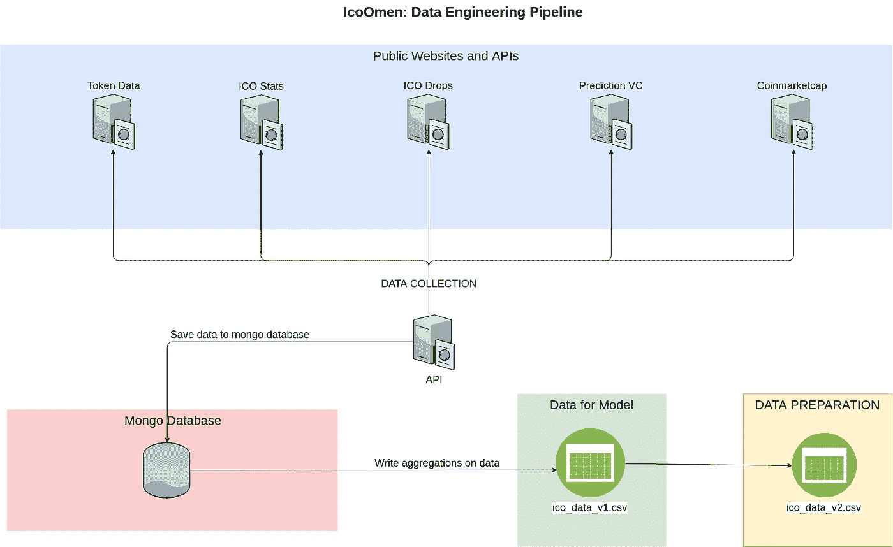
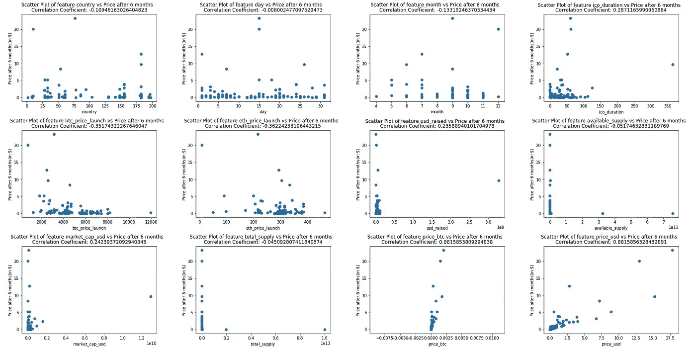
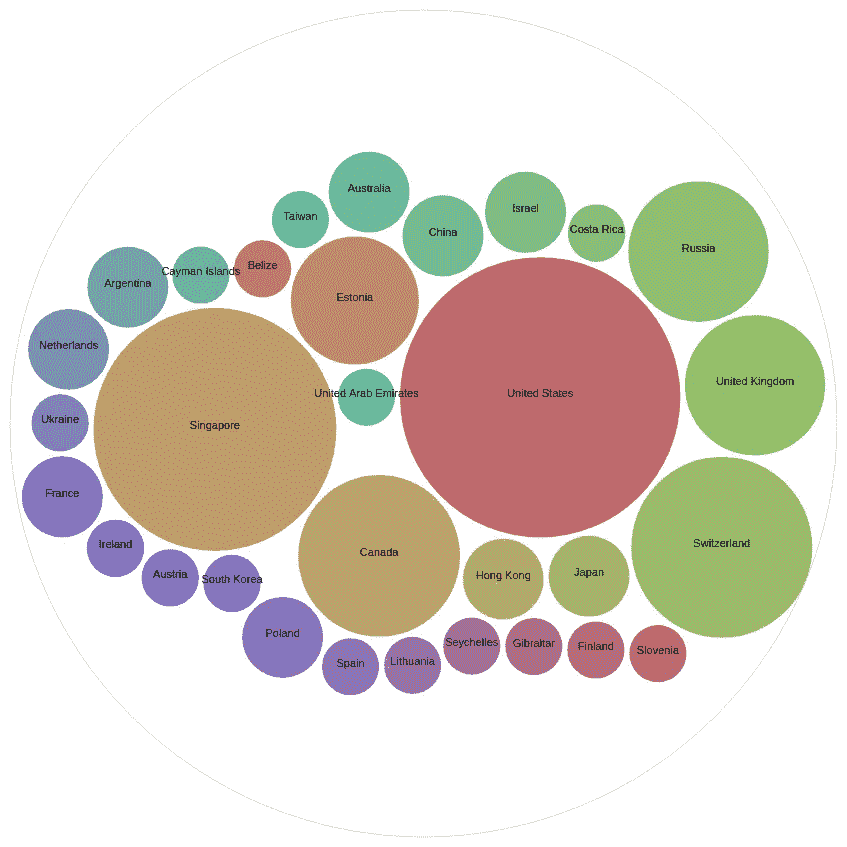
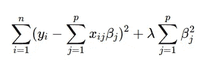
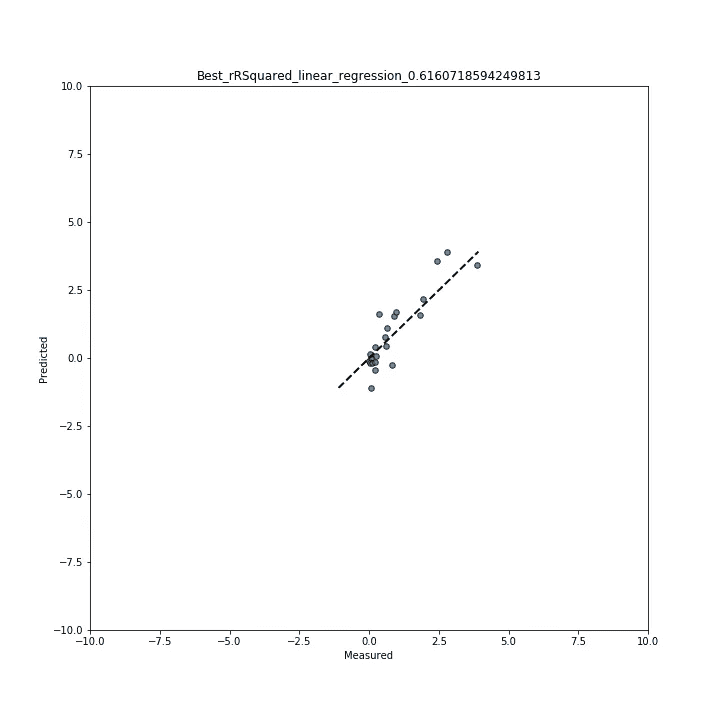
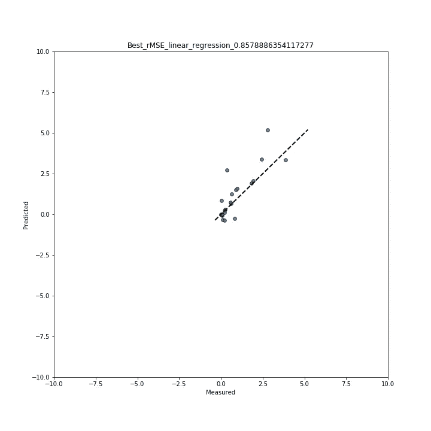
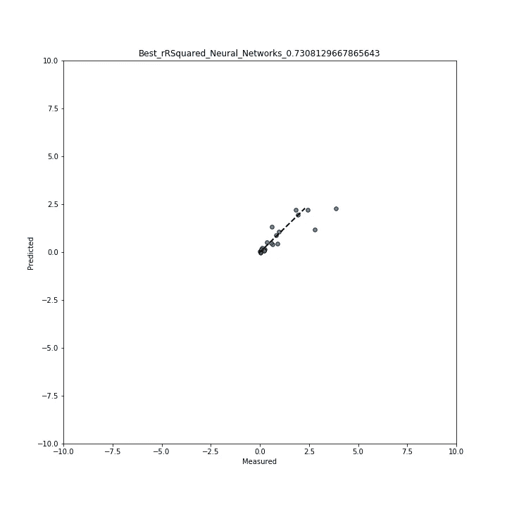
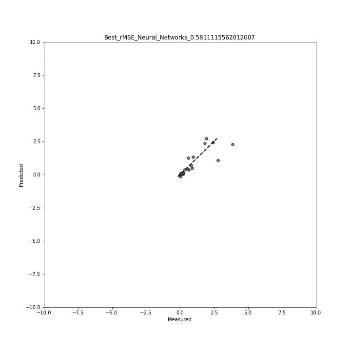

# IcoOmen:使用机器学习预测 ICO 价格

> 原文：<https://towardsdatascience.com/icoomen-using-machine-learning-to-predict-ico-prices-29fa4cec6d86?source=collection_archive---------16----------------------->

## 在真实世界的数据上使用机器学习。

# 介绍

加密货币无需介绍。加密货币曾经是在线聊天论坛上书呆子社区的专利，现在几乎已经成为主流。另一方面，ico 鲜为人知。

最初的硬币发行，通常被称为 ICO 或代币销售，是一种筹资手段，其中新发行的加密货币中的[代币与公众](https://papers.ssrn.com/sol3/papers.cfm?abstract_id=3080098)交换为比特币或以太坊等其他加密货币。

这些旨在用于资助早期阶段的加密货币项目，但是它们是相当高风险的投资，因为在 ICO 中筹集的超过 [10%的资金已经丢失或被黑客攻击](https://www.ey.com/Publication/vwLUAssets/ey-research-initial-coin-offerings-icos/%24File/ey-research-initial-coin-offerings-icos.pdf)，并且只有 [10%发行的 ICO 代币在 ICO](https://www.bloomberg.com/news/articles/2017-10-23/only-one-in-10-tokens-is-in-use-following-initial-coin-offerings) 后用于实际的代币生态系统，而其余的只是简单的交易。

直到最近，对 ICO 的监管还很少，市场非常繁荣，ICO 基金增长迅速。2017 年末和 2018 年初尤其如此，如下图所示。这一增长此后迅速放缓，因为整个加密货币市场变得相当悲观。

Source: [Elementus.io](https://elementus.io/blog/ico-market-august-2018/)

ico 和加密货币的不可预测性通常会产生一个有趣而困难的问题——我们能对这些行为建模甚至预测它们吗？

更具体地说:

***能否用机器学习来预测 ico 的成功/价格？***

让我们找出答案。

# 方法学

1.  选择输入和输出。
2.  收集和汇总数据。
3.  准备数据。
4.  探索并尝试理解数据。
5.  选择一个机器学习模型。
6.  衡量模型的性能。
7.  保存模型。
8.  使用模型进行预测。

# 1.选择输入和输出

# **输入**

选择正确的输入和输出(在监督 ML 的情况下)对于机器学习算法的成功至关重要。在输入和你试图预测的输出之间，需要有某种关联。做到这一点的最好方法是尝试并获得一些领域知识。我对 ico 的各个方面做了一些研究，以衡量可能影响其未来价值的因素。

影响其绩效的 ICO 主要建议因素如下:

*   **开发团队的质量—** *更好的团队，更好的 ICO 产品质量。*
*   **社交媒体上的受欢迎程度，如 Twitter 上的关注者数量—** *一个 ICO 的知名度越高，它获得资金的机会就越大。*
*   **与 ICO 相关的因素具体来说——***价格、总供应量、市值……*
*   **ICO 推出时的市场相关因素—***ICO 推出时，加密货币市场是否表现良好？*

然后，我创建了一个我认为可能影响 ICO 价值的特性列表[并检查了我是否可以从任何来源收集这些数据，并创建了一个最终的输入列表。](https://docs.google.com/document/d/16IXF2lwoHZtcaCrFbNPGw6dTyVauU2SeHtG2N70LB8s/)

不幸的是，很难从数字上收集某些数据——例如，度量从事 ICO 工作的开发团队的质量——您度量多年的经验吗？这是衡量质量的有效方法吗？

此外，很难找到其他指标的数据，如 ICO 推出时的受欢迎程度。例如，很难获得 Twitter 的历史数据，即使使用 [Wayback Machine](https://archive.org/web/) ，它不会对每个页面进行索引，这使得在一个 ICO 推出时很难获得 Twitter 追随者的数量。

**最终使用的功能列表:**

*   **美元价格。**
*   BTC 的价格。
*   **总供给。**
*   **市值——代币销售期间可以购买的代币数量。**
*   可用供应。
*   **美元上调。**
*   **以太坊上市时的价格。**
*   **推出时的比特币价格。**
*   **月 ICO 上线。**
*   **ICO 发布的日期，例如当月的第 8 天。**
*   **ICO 从哪个国家推出。**
*   **ICO 持续天数。**

# 输出

ico 通常仍然是一种新的筹资方式，所以没有多少 ico 可以用来收集数据。选择六个月的期限，因为这足以观察到 ICO 价格的潜在增长，并且从可用数据来看，有足够多的 ICO 超过六个月。

**最终输出:**

**一个 ICO 六个月后的价格。**

# **ICOs 上收集的部分数据示例**

此处提供完整数据集[。](https://github.com/KaleabTessera/ICOOmen_ML_Model/blob/master/dataset/ico_data_final.csv)

# 2.收集和汇总数据

这个项目的很大一部分是数据收集。ICOs 上没有可用的数据集，因此必须创建数据集。

使用了 restful API，用 C#编写，遵循 dotnet 核心框架。这个 API 汇集了来自不同站点的数据，并将其存储在一个 Mongo 数据库中。

有些数据，如 ICO 发布的国家/地区，必须手动收集，因为无法始终从特定来源获得这些数据，因此必须使用多个网站。数据是在 **2 885 个 ico**上收集的。

# 3.准备数据

一旦数据被收集并存储在 Mongo 数据库中，就必须将数据转换成可用的数据集。从各种来源收集的所有数据都使用数据库视图进行聚合。

如上所述，收集了 2 885 个 ico 的数据，但这些数据很少，因此需要进行数据准备。

一旦数据被清除，我们就有了 189 个 ico 的信息。最后，进一步过滤，只包括存在时间超过六个月的 ico 数据，最终我们的数据集中有 109 个 ico。

**准备数据时遇到的问题:**

*   **不洁数据**

ICO 的开始和结束日期、ICO 持续时间和 ICO 月份的值无效，已通过手动更正这些字段进行了清除。

*   **缺失数据**

处理缺失数据的常用方法通常是使用平均值或中位数。然而，由于数据的稀疏性(不到 10%的数据具有大部分必需的字段)，这种方法没有被采用。

相反，选择具有大多数必填字段的数据，然后从各种网站手动收集缺少的值，如 ICO 推出的国家。

*   **数据冲突**

一些数据是相互矛盾的，例如，网站上有不同的开始和结束日期的 ICO 或国家推出。这是通过检查多个来源并采用一致的值来处理的。

*   **分类数据**

一种热编码应用于分类数据字段——ICO
日期、ICO 发布月份和 ICO 国家。

# 数据收集和准备阶段的工作流程

# 4.探索并试图理解数据

我们可以通过计算相关系数和绘制散点图来研究输入和输出之间的关系。

以美元/BTC 计价的 ICO 推出时的价格与六个月后的期货价格密切相关(显然！)，而其他投入与产出并不密切相关。

此外，至关重要的是，要确保 ICOs 数据的分布能够代表当前市场，以便有一个能够很好地概括的模型。这一目标已经实现，收集的数据与按[国家](https://medium.com/@kerya/ico-statistics-countries-traffic-and-investors-79d934591b4b)划分的 ICO 分布相关的统计数据相互关联。

Distribution of ICO Data Per Country in ICO Omen.

# 5.选择机器学习模型

**岭回归**

一旦对数据进行了一次性编码，输入矩阵就形成了所谓的待定矩阵或胖矩阵。这实质上意味着特征比示例多(128 个特征对 109 个数据点)。

这意味着我们的回归模型易受过度拟合和多重共线性的影响。

> "**多重共线性**是自变量之间高度相关或关联的状态。因此，这是数据中的一种干扰，如果在数据中存在，对数据做出的统计推断可能不可靠。”— [统计解决方案](https://www.statisticssolutions.com/multicollinearity/)

为了避免这种情况，我们应用正则化。在我们的案例中，我们应用了岭回归(L2 正则化)，它惩罚了非常大的权重。你可以在这里阅读更多关于岭回归[的内容。](https://onlinecourses.science.psu.edu/stat857/node/155/)

**岭回归公式:**

Source : [Penn State](https://onlinecourses.science.psu.edu/stat857/node/155/)

**神经网络**

我们还使用神经网络将结果与回归模型获得的结果进行比较。

对于神经网络，我们使用 tanh 激活函数，对于解算器，我们使用 Adam 解算器和梯度下降解算器。

# 6.衡量模型的性能

使用了两种性能测量方法— **RSquared(R )** 和**均方根误差** ( **rMSE)。**

**R** ，度量模型可以解释的[“方差的百分比](https://www.r-bloggers.com/assessing-the-accuracy-of-our-models-r-squared-adjusted-r-squared-rmse-mae-aic/)”。高 R 值通常是好的，但并不总是如此，因为这可能意味着您的模型与数据过度拟合。你可以在这里阅读更多关于 R [的内容](http://blog.minitab.com/blog/adventures-in-statistics-2/regression-analysis-how-do-i-interpret-r-squared-and-assess-the-goodness-of-fit)。

**rMSE，**测量我们的模型达到的均方误差的根(误差——我们的模型预测值和实际值之间的差)。

**结果**

所有结果都是使用维持方法计算的，性能是根据测试数据(即模型从未见过的数据)测量的。

该图描绘了预测结果与测量结果。这显示了预测值和测量值之间的相关性。越靠近虚线的值表示相关性越好。

线性回归模型的 rMSE 得分为 0.86，R 得分为 0.62。

神经网络模型的 rMSE 分数为 0.58，R 分数为 0.73。

# 7.保存模型

一旦我们有了满意的模型，我们就应该保存这个模型，这样我们就可以在以后重新使用它来进行预测。

我使用了 [Joblib](https://joblib.readthedocs.io/en/latest/) ，这是一个 python 助手类，它是 SciPy 包的一部分，为流水线操作提供了实用程序。它使得保存和加载模型变得简单。

# 8.使用模型进行预测

一旦保存了模型，就可以加载该模型并进行预测，而无需重新训练模型。

以下是如何使用保存的模型进行预测的示例:

# **结论和最终想法**

现实世界中的机器学习很大程度上依赖于你的数据。与处理模型相比，您通常会花费更多的时间来清理、准备和聚合数据。

在本文中，我们设法创建了一个模型，它可以相当好地预测 ICO 的价格。我们还展示了将机器学习应用于现实世界问题的一般步骤。

感谢您阅读这篇文章，如果您有任何想法或意见，请告诉我。:)

你可以在[推特](https://twitter.com/KaliTessera)和/或[这里](https://www.kaleabtessera.com/)找到我。

# 源代码

所有源代码都是可用的，以**文档化的**格式。ML 模型还包含一个 **Google Colab 链接**。

*   [机器学习模型](https://github.com/KaleabTessera/ICOOmen_ML_Model)。
*   [API](https://github.com/KaleabTessera/IcoOmenAPI) 收集数据。