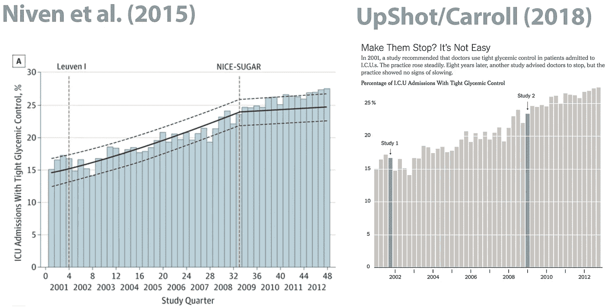
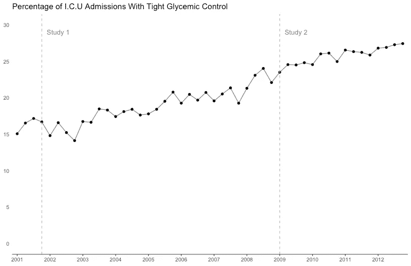

# 我会选择点数，而不是小节

> 原文：<https://towardsdatascience.com/id-go-with-points-not-bars-f48b64030564?source=collection_archive---------18----------------------->

Aaron Carroll 在[结果/NYT](https://www.nytimes.com/2018/09/10/upshot/its-hard-for-doctors-to-unlearn-things-thats-costly-for-all-of-us.html?smtyp=cur&smid=tw-upshotnyt) 中写道[尼文等人 2015 年的研究](https://jamanetwork.com/journals/jamainternalmedicine/fullarticle/2195119)发表在 *JAMA Internal Medicine* 上，该研究表明，在一项研究表明严格控制血糖是一个好主意后，医疗实践如何增加，但在第二项更大规模的研究推翻了指导方针后，没有减少。卡罗尔的观点是，唯一比说服医生开始做某事更难的事情可能是说服他们停止。

但是让我们开始真正有趣的东西:情节！

原始图在左边，NYT/Upshot 版本在右边。按照典型的 NYT 风格，他们剥离情节，揭示一些更令人愉悦的东西。

他们坚持使用条形图——也许是为了尽可能忠实于原文——但我认为点数在这里最有效。这部分是个人偏好，部分是 Tufte 启发的关于数据-油墨比率的智慧。基本原理是这样的:所有的数据都存在于棒线的尖端，那么为什么不仅仅绘制尖端呢？

我使用`ggplot2()`包在 R 中创建了这个图。JAMA 的作者可能在某处共享了底层数据，但是我什么也没找到。所以我用 [WebPlotDigitizer](http://arohatgi.info/WebPlotDigitizer/app3_12/) 从公布的图中提取近似值。如果你想修改的话，下面是代码。