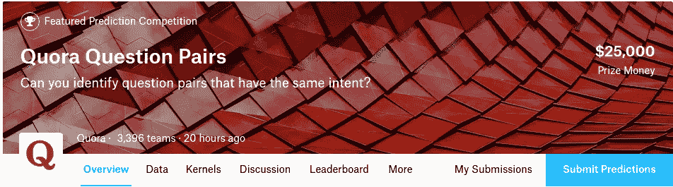
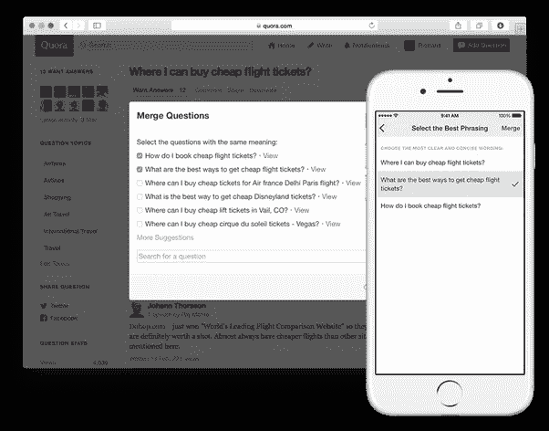
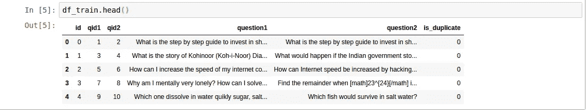
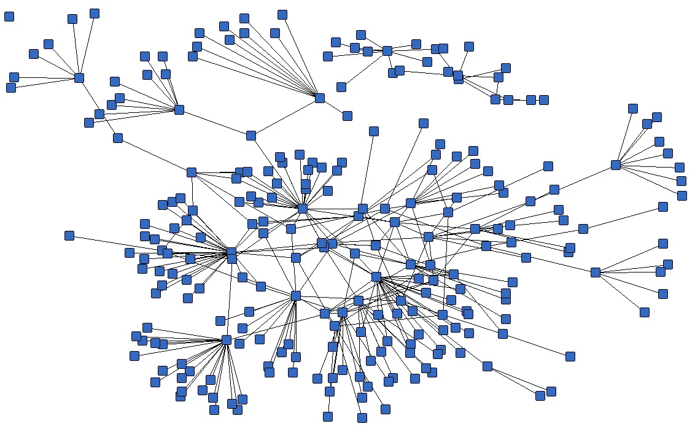
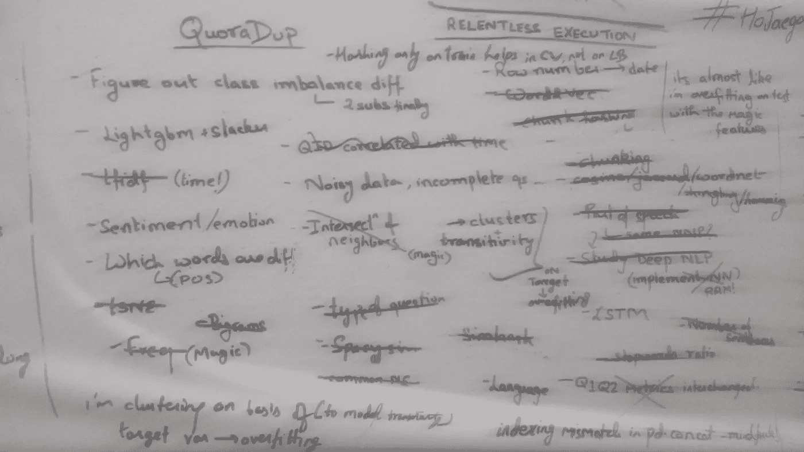
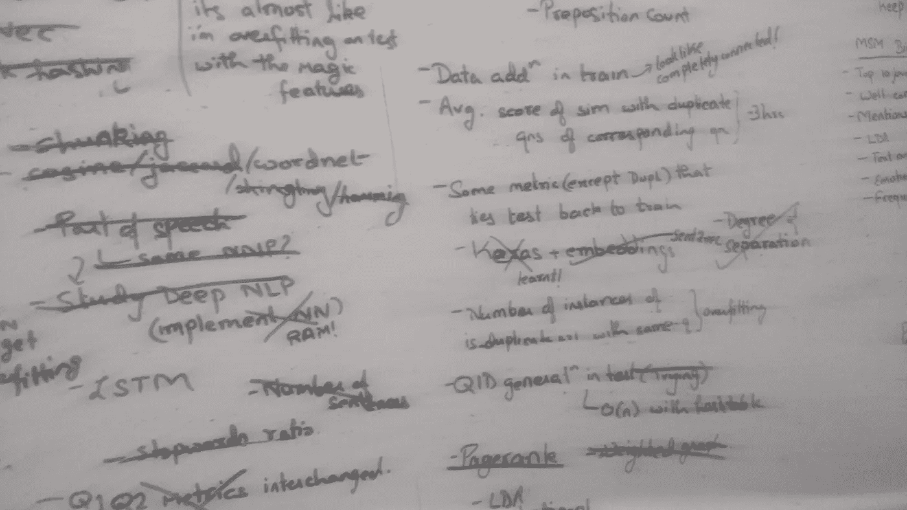

# 识别 Quora 上的重复问题| ka ggle 上的前 12%！

> 原文：<https://towardsdatascience.com/identifying-duplicate-questions-on-quora-top-12-on-kaggle-4c1cf93f1c30?source=collection_archive---------0----------------------->

> 如果你像我一样是一个普通的 Quoran 人，你很可能会无意中发现重复的问题，问同样的基本问题。

这对于作者和搜索者来说都是一个糟糕的用户体验，因为答案在同一问题的不同版本中变得支离破碎。其实这是一个在 StackOverflow 等其他社交问答平台上非常明显的问题。一个现实世界的问题，求人工智能解决:)

在过去的一个月左右的时间里，我和其他 3000 名卡格勒人一起，整夜都在为这个问题绞尽脑汁。这是我连续第二次参加严肃的比赛，有时会有压力，但总体来说我学到了很多——获得了前 12%的位置，一枚讨论金牌和几枚核心铜牌:)

一个 **关于问题**——Quora 已经给出了一个(几乎)真实世界的问题对数据集，每个问题对都带有 is_duplicate 的标签。目标是最小化测试数据集中重复预测的对数损失。训练集中大约有 40 万个问题对，而测试集中大约有 250 万个问题对。对，250 万！这些问题中的大部分是计算机生成的问题，以防止作弊，但有 250 万，天啊！我每隔一个小时就把我那可怜的 8GB 机器用到了极限

[**我的方法**](https://github.com/shubh24/QuoraDuplicate/blob/master/run_quora.ipynb)——我从@anokas 的 xgboost [starter](https://www.kaggle.com/anokas/data-analysis-xgboost-starter-0-35460-lb) 开始，并逐渐在它的基础上构建。我的特征集包含了大约 70 个特征，与顶级 Kagglers 的方法相比，这是一个相当低的范围。我的特征可以大致分为基于 NLP 的特征、基于单词嵌入的距离和基于图形的特征。让我详细说明一下:

N 我尝试继续使用 tfidf 分数，但这既没什么用，又计算量大。相反，最重要的特征之一是加权单词匹配份额，其中每个单词的权重是该单词在语料库中的频率的倒数(基本上是 IDF)——如果我在两个问题中都有一个罕见的单词，他们可能会讨论类似的话题。我还有余弦距离、jaccard 距离、jarowinkler 距离、hamming 距离和 n-gram 匹配(shingling)等特性。

我在 NLP 任务中广泛使用的一个库是 Spacy，它最近开发了一些很棒的功能——Spacy 相似性也是一个很好的特性。我想到的一些有创意的问题与问题的类型有关——无论是“如何”的问题还是“为什么”的问题——取决于句子的第一个单词。奇怪的是，在建模的时候，我本应该想到建立“最后一个单词的相似度”,但是完全没有想到！命名实体是理解问题上下文的关键——因此 common_named_entity 得分和 common_noun_chunk 得分是显而易见的选择。我推出了一个关于通过 wordnet 语料库计算相似度的[内核](https://www.kaggle.com/shubh24/wordnet-similarity-matrix-a-naive-implementation)，但是 wordnet 在易用性、速度和词汇量方面都有所欠缺。

# [**字嵌入基础距离**](https://github.com/shubh24/QuoraDuplicate/blob/master/word2vec_features.ipynb) :

做 NLP 比赛的时候，Word2Vec 能不能留下！我觉得 word2vec 可能是我读过的最酷的计算机科学概念，我总是被它的有效性所震撼。每时每刻。

Word2Vec Magic!

总之，我将问题映射到 Sent2Vec 格式的 300 维向量中，结果每个问题都有一个向量。自然地，基于距离的矢量特征被建立起来——余弦、城市街区、jacard、堪培拉、欧几里得和布雷柯蒂斯。必须提到@abhishek 的[脚本](https://github.com/abhishekkrthakur/is_that_a_duplicate_quora_question)作为这些功能的灵感来源。不幸的是，我不能构建真正的嵌入层，我可以在 keras 中传递到 lstm 层——我的 RAM 不允许我这样做。我很快就会有真正的硬件了！

G **图形特征**:在 NLP 比赛中，这些图形特征玩得相当扫兴！然而，这很好地提醒了我们，社交网络的理论可能如何应用于像 Quora 的问题对这样的数据集。

A typical graph structure in social media

这里，每个问题都是图中的一个节点，数据集中的一个问题对表示两个节点之间的一条边。我们也可以使用测试数据的图结构，因为我们没有在任何地方考虑 is_duplicate 标签——这 200 万条边对图贡献了很多！卡格勒夫妇就基于图表的功能是否应该是“神奇的功能”展开了激烈的讨论，这些功能应该被释放出来以创造公平的竞争环境。总之，所有这些特性都极大地提升了大多数模型:

*   一个节点的度:本质上，问题的频率，这个问题在数据集中出现多少次，就有多少条边。这个特性带来了巨大的收益，因为 Quora 所做的问题抽样(对重复项进行上抽样)很可能依赖于这个频率。
*   邻居交集:问题对的一级邻居的百分比，例如，Q1 的邻居是 Q2，Q3，Q4，Q2 的邻居是 Q1，Q3。(Q2 Q1)的共同邻居是 Q3，占所有一级邻居的一半。
*   分离度:这是我通过广度优先搜索想到并实现的一个特性，但并没有带来很大的改进。
*   PageRank:我实现了这个功能，甚至在 kaggle 上发布了一个[内核](https://www.kaggle.com/shubh24/pagerank-on-quora-a-basic-implementation)——page rank 较高的问题链接到重要的(page rank 较高的)问题，而垃圾问题链接到垃圾问题。
*   kcore/kclique: K-core 基本上是最大的子图，其中每个节点都连接到至少“K”个节点，但没有给我太多的收获。我曾经想过 kclique，但是因为时间不够而没有实现:(结果证明这是一个相当重要的想法！
*   加权图:在比赛的后期，kagglers 的同事分享了一个加权图的想法，其中每个节点的权重是 weighted_word_share(我们之前讨论过)。这个加权图中的邻居交集是有用的。

**传递性魔法**——继续图结构，对问题之间的传递性建模是一种显而易见的方法。例如，如果 Q1 与 Q2 相似，Q2 与 Q3 相似，这意味着 Q1 与 Q3 更相似(根据我们的数据集)。这是我开始构建的功能之一，但中途放弃了，这是一个代价高昂的错误。许多顶级解决方案以某种形式使用了这一功能，一个更简单的版本是平均每个问题与其对应的邻居之间的重复概率。

# **我的白板会议**

Part 1 of 2

Part 2 of 2

# **一些混蛋**

当一个像我这样的菜鸟一头扎进一个大圈子时，肯定会有麻烦。尽管我有意识地努力保持管道的模块化和版本控制，但由于管道中的一个严重错误，我损失了几乎一个周末的工作。经过艰苦的学习，我在 ipython [笔记本](https://github.com/shubh24/QuoraDuplicate/blob/master/run_quora.ipynb)上恢复并改造了管道。我在构建特性时面临的一个主要挑战是编写内存高效的代码，而不是重新构建以前的特性，模块化是关键。这导致了另一个混乱——因为我无法在我的 RAM 中处理我的整个测试数据集，我将它分成六个子集，并迭代地构建特性。这意味着我在旧的数据框架和新的特性之间做一个 pandas concat，我很少关注索引:(花了几天时间对所有 NaN 特性挠头。没有错。

# **QID 难题:**

训练数据集的每个问题都有一个 ID，因此每行都有一个 QID1 和 QID2。然而，测试数据集的情况并非如此，这意味着“QID”不能直接用作一个功能。一位 kaggler 的同事发布了一个令人难以置信的创造性的[观察](https://www.kaggle.com/ashhafez/temporal-pattern-in-train-response-rates),随着 QID 的增加，平均重复率(滚动平均值)下降——很可能是 Quora 随着时间的推移改进算法的迹象，从而随着 ID 的增加减少重复问题的数量。这一推断基于这样的假设，即 QID 值没有被屏蔽，并且真正代表了发布问题的时间。为了在我们的测试数据集中对 qid 建模，我有一个将问题文本映射到 qid 的哈希表。现在迭代 test_df 中的所有问题——如果我遇到一个存在的问题，相应的 QID 被分配给它。否则，我们假设这是一个新问题，按照发布的时间顺序，将 QID 加 1。这导致了各种各样的特征，如 QID 差异、平均 QID、最小 QID，以期模拟随着时间的推移重复率的下降。

# **阶层失衡:**

讨论的主要部分集中在猜测测试数据框架中的类别划分，这与测试划分并不明显相似。数学专家通过几个恒定值的提交，这里的和这里的，计算出一个狭窄的分割范围。训练集中大约有 34%的正重复，而测试集中估计有 16%-17%的正重复——这可能是改进的 Quora 算法的结果，或者是计算机生成的问题对的结果。无论如何，一个错误的训练数据集不会有所帮助——人们想出了过采样的解决方案(复制训练中的负行)，或者通过适当的因子重新调整他们的预测。

> **我的模特——XGBoost 是爱情，XG boost 是生活**

承认这一点非常尴尬，但我提交的只是一个单一模型解决方案，一个 2000 轮的 xgboost。公平地说，我没有在参数调整或构建多样化模型上花太多时间，因为太晚了。我尝试了默认的随机森林和 GBM，效果并不比 XGB 好。堆叠和集成也在路线图中，但只是停留在那里:(

相反，我花了一个很长的周末来学习 Keras 和建立密集的神经网络——这是我的第一次！通过了解各种超参数和理想的架构，激活函数，辍学层和优化背后的理论！非常有趣的东西！我用我的两层 sigmoid 神经网络和我的 70 个特性来完善它，但它从未接近 xgboost。正如我前面提到的，我无法用我的硬件构建嵌入层或 LSTMs，那肯定会有帮助。很快。

我为自己的建模管道感到自豪，不必为每个模型都创建一个函数而烦恼——当我构建数百个模型进行堆叠时，这会很有帮助。很快。

# **顶级解决方案:**

金牌得主的赛后评论让我觉得自己完全是个菜鸟！我必须真正提高我的比赛水平，更加努力地去达到那个高度，铜牌离我不远了！从赢家解决方案中获得的一些主要经验:

*   大多数团队根据加权图的边或节点的频率来重新调整他们的最终预测
*   每个顶级团队都建造了一个有数百个模型的堆垛机，并有一个可重复使用的模型构建管道。
*   使用了最先进的神经网络架构(Siamese/Attention NNs)、LightGBMs，但甚至像 ExtraTrees 或 Random Forests 这样的低性能模型也有帮助！
*   图形特性是许多解决方案的核心，因为团队使用各种技术从中获取价值。一些去除了虚假的(不太频繁的)节点，一些使用邻居权重的平均值/中值，而大多数模拟了传递性。
*   显然，问题 1 或问题 2 也很重要。令人惊讶！
*   NLP:以多种不同的方式处理文本——小写和不变，以不同的方式替换标点，包含和排除停用词，词干化和不词干化，等等。
*   堆叠很重要，但人们也用单个 xgb 型号实现了 0.14 倍。
*   第一名[后](https://www.kaggle.com/c/quora-question-pairs/discussion/34355)。真令人羞愧。

# **结论**:

我应该更好地管理我的时间，为探索、特征工程、模型构建和堆叠分配适当的时间。上周我确实感到了压力，因为我提交的材料不够了。

*   我的建模管道很适合测试，但是我需要在不同的超参数/数据子集上建立更多的模型。
*   不要中途放弃构建特性，有些特性会导致代价高昂的失误。
*   不要仅仅因为你花了时间在一个功能上，就过于沉迷于它。这有点好笑，哈哈！
*   花大量时间在 Kaggle 内核和讨论上。他们太酷了:)

所以是的，就是这样。一场比赛结束，另一场比赛开始。Kaggle 会上瘾！

It’s true!

*这篇文章最初发表在我的* [*博客*](https://shubh24.github.io) *上。每周一篇博客*