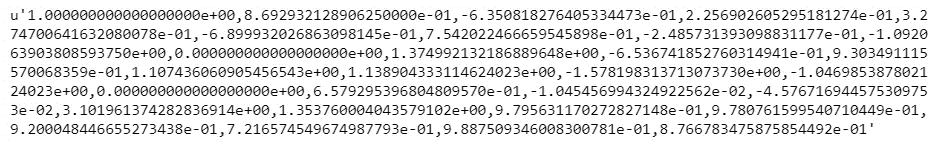
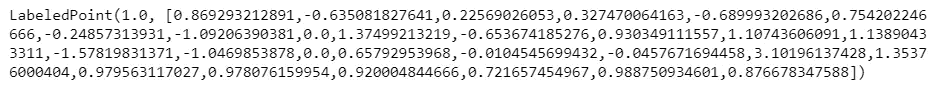
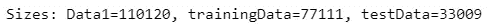
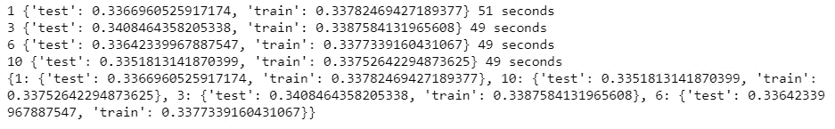
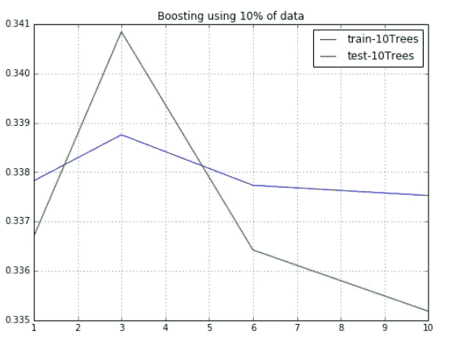
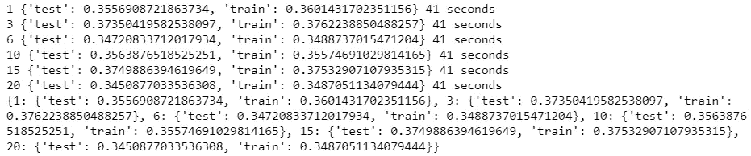
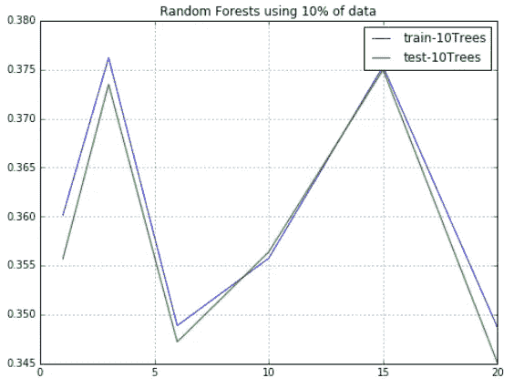
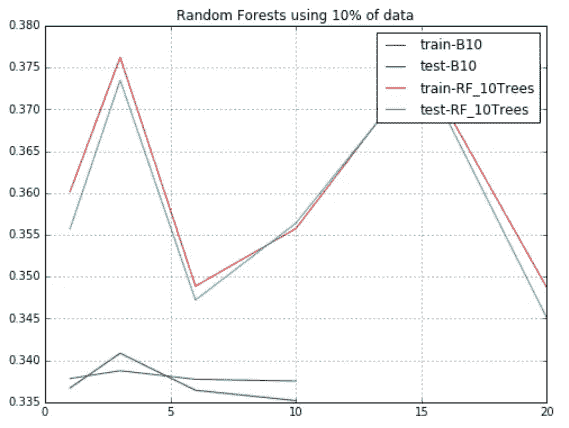

# 在背景噪音中识别希格斯玻色子

> 原文：<https://towardsdatascience.com/identifying-higgs-bosons-from-background-noise-pyspark-d7983234207e?source=collection_archive---------17----------------------->


Large Hadron Collider

## 背景

在这篇简短的博客中，解释什么是希格斯玻色子是非常困难的。然而，为了保持它的基本性，根据一个大爆炸理论，在一个叫做玻色子的导火索导致它爆炸之前，整个宇宙曾经是一个单一的粒子。希格斯玻色子是以物理学家彼得·希格斯的名字命名的，他在 1964 年和其他六位科学家一起提出了这种机制，这表明了这种粒子的存在。这种亚原子粒子是在大型强子对撞机的一次实验中产生的。彼得·希格斯将因此发现获得 2013 年的诺贝尔奖。

历史说够了。现在进行一些有趣的机器学习！这是一个分类问题，以区分产生希格斯玻色子的信号过程和不产生希格斯玻色子的背景过程。

## 资料组

网址:[http://archive.ics.uci.edu/ml/datasets/HIGGS#](http://archive.ics.uci.edu/ml/datasets/HIGGS#)

这些数据是使用蒙特卡罗模拟产生的。前 21 个特征(第 2-22 列)是由加速器中的粒子探测器测量的运动特性。后 7 个特征是前 21 个特征的函数；这些是由物理学家得出的高级特征，有助于区分这两个类别。人们有兴趣使用深度学习方法来消除物理学家手动开发这些特征的需要。基准测试结果使用贝叶斯决策树从一个标准的物理包和 5 层神经网络提出了在原来的文件。最后 500，000 个示例用作测试集。

## 导入库

希格斯数据集是巨大的！因此，我们需要使用 Spark 来运行它。对于本文，我使用 Python 包装器 for Spark，或 PySpark。

```
**from** **time** **import** time
**from** **string** **import** split,strip
**from** **plot_utils** **import** ***from** **pyspark.mllib.linalg** **import** Vectors
**from** **pyspark.mllib.regression** **import** LabeledPoint

**from** **pyspark.mllib.tree** **import** GradientBoostedTrees 
**from pyspark.mllib.tree** **import** GradientBoostedTreesModel
**from** **pyspark.mllib.tree** **import** RandomForest, RandomForestModel

**from** **pyspark.mllib.util** **import** MLUtils
```

## 准备数据

接下来，我们对数据集中感兴趣的要素列表进行硬编码

```
feature_text='lepton pT, lepton eta, lepton phi, missing energy magnitude, missing energy phi, jet 1 pt, jet 1 eta, jet 1 phi, jet 1 b-tag, jet 2 pt, jet 2 eta, jet 2 phi, jet 2 b-tag, jet 3 pt, jet 3 eta, jet 3 phi, jet 3 b-tag, jet 4 pt, jet 4 eta, jet 4 phi, jet 4 b-tag, m_jj, m_jjj, m_lv, m_jlv, m_bb, m_wbb, m_wwbb'features=[strip(a) **for** a **in** split(feature_text,',')]
```

接下来，我们把数据转换成火花 RDD

```
inputRDD=sc.textFile(path_to_data) #Replace with actual pathinputRDD.first()
```



如果每行都是一个字符串，那么数据就没有用。因此，为了使用 PySpark 的机器学习库，我们需要用逗号将它分开，并将每个单元格分配给一个 LabeledPoint。第一列是目标，因此需要从模型特征中分离出来。

```
Data=(inputRDD.map(**lambda** line: [float(strip(x)) **for** x **in** line.split(',')]).map(**lambda** line: LabeledPoint(line[0], line[1:])))Data.first()
```



为了更清楚地看到过度拟合的影响，我们将数据的大小减少了 100 倍。然后，我们将 70%–30%分成培训和测试。

```
Data1=Data.sample(False,0.01).cache()(trainingData,testData)=Data1.randomSplit([0.7,0.3])

**print (**'Sizes: Data1=**%d**, trainingData=**%d**, testData=**%d**'%(Data1.count(),trainingData.cache().count(),testData.cache().count()))
```



## 梯度增强树

第一个分类器将使用梯度增强树来构建。

```
errors={} **for** depth **in** [1,3,6,10]:     
    start=time()        
    model=GradientBoostedTrees.trainClassifier(Data1,                                              
            categoricalFeaturesInfo={}, numIterations=3)        
    errors[depth]={}     
    dataSets={'train':trainingData,'test':testData}     
    **for** name **in** dataSets.keys():  
        *# Calculate errors on train and test sets*           
        data=dataSets[name]         
        Predicted=model.predict(data.map(**lambda** x: x.features))         
        LabelsAndPredictions=(data.map(**lambda** lp: 
                               lp.label).zip(Predicted))
        Err=(LabelsAndPredictions.filter(**lambda** (v,p):v != 
              p).count()/float(data.count()))         
        errors[depth][name]=Err     
    **print** depth,errors[depth],int(time()-start),'seconds' 
**print** errors
```



```
B10=errors
make_figure([B10],['10Trees'],Title='Boosting using 10**% o**f data')
```



## 随机森林

接下来，我们尝试随机森林分类器进行比较。

```
errors={}
**for** depth **in** [1,3,6,10,15,20]:
    start=time()
    model = RandomForest.trainClassifier(Data1, numClasses=2, 
           categoricalFeaturesInfo={}, numTrees=3,  
           featureSubsetStrategy="auto", impurity='gini', 
           maxDepth=4, maxBins=32)
    errors[depth]={}
    dataSets={'train':trainingData,'test':testData}
    **for** name **in** dataSets.keys():  
        *# Calculate errors on train and test sets*
        data=dataSets[name]
        Predicted=model.predict(data.map(**lambda** x: x.features))
        LabelsAndPredictions=(data.map(**lambda** lp: 
                               lp.label).zip(Predicted))
        Err=(LabelsAndPredictions.filter(**lambda** (v,p):v != 
             p).count()/float(data.count()))
        errors[depth][name]=Err
    **print** depth,errors[depth],int(time()-start),'seconds'
**print** errors
```



```
RF_10trees = errors
*# Plot Train/test accuracy vs Depth of trees graph*
make_figure([RF_10trees],['10Trees'],Title='Random Forests using 10**% o**f data')
```



## 一起想象

```
make_figure([B10,RF_10trees],['B10','RF_10Trees'],Title='Random Forests using 10**% o**f data')
```

