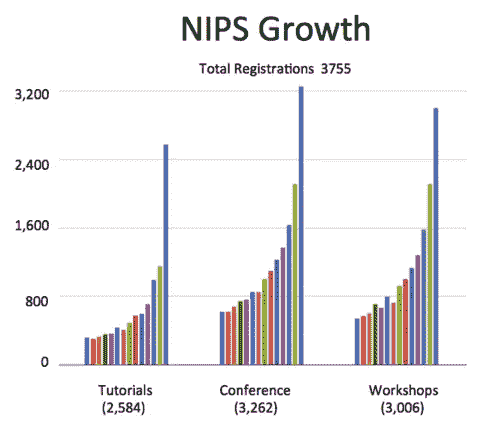
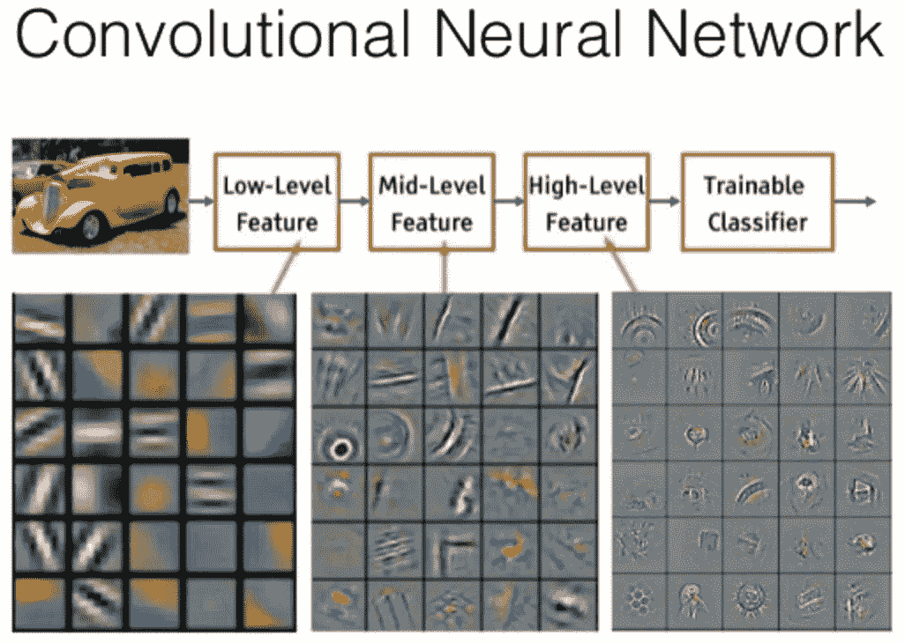
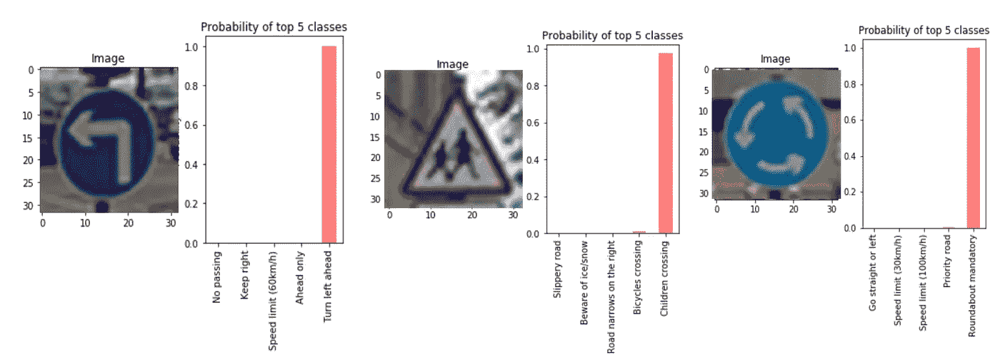
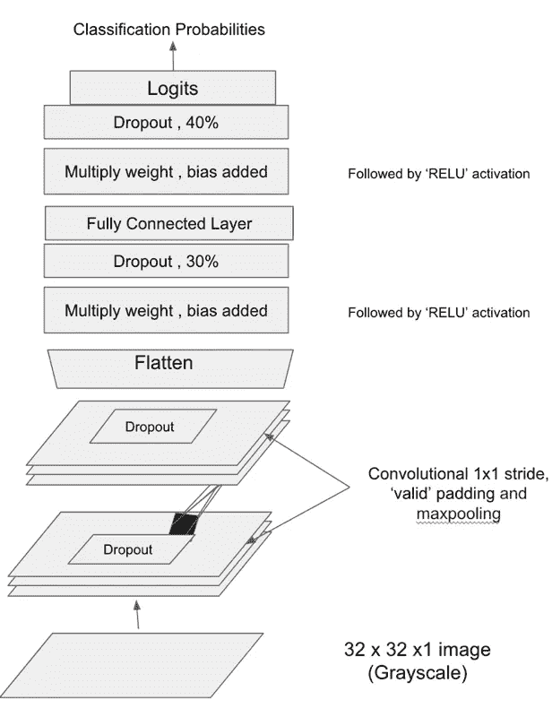

# 利用深度学习识别交通标志

> 原文：<https://towardsdatascience.com/identifying-traffic-signs-with-deep-learning-5151eece09cb?source=collection_archive---------2----------------------->

交通标志的成功检测和分类是自动驾驶汽车需要解决的重要问题之一。想法是让汽车足够智能，以达到成功自动化最少人类互动。在图像识别、自然语言处理、自动驾驶汽车等相关领域，[深度学习](https://en.wikipedia.org/wiki/Deep_learning)相对于经典机器学习方法的优势迅速上升，并辅之以 GPU(图形处理单元)的进步，这令人震惊。

## 深度学习



Attendance at the Annual Conference on Neural Information Processing Systems (NIPS)

图表只显示了 2015 年和 2016 年 [NIPS](http://beamandrew.github.io/deeplearning/2016/12/12/nips-2016.html) 有超过 6000 人参加。图表显示对深度学习和相关技术的兴趣激增。

**深度学习**是一种机器学习技术，其中人工神经网络使用多个隐藏层。这要归功于两位著名的神经生理学家大卫·胡贝尔和托尔斯滕·威塞尔，他们展示了视觉皮层中的神经元是如何工作的。他们的工作确定了具有相似功能的神经元如何组织成列，这些列是微小的计算机器，将信息传递到大脑的更高区域，在那里视觉图像逐渐形成。

*通俗地说*大脑结合低级特征，如基本形状、曲线，并从中构建更复杂的形状。深度卷积神经网络也类似。它首先识别低级特征，然后学习识别和组合这些特征，以学习更复杂的模式。这些不同级别的功能来自网络的不同层。



Feature Visualization of Convnet trained on ImageNet from [Zeiler & Fergus 2013]

我们不会进一步深入深度学习和反向传播如何工作的数学解释。跟随 [cs231n](http://cs231n.github.io/) 和本[博客](https://medium.com/@karpathy/yes-you-should-understand-backprop-e2f06eab496b)深入了解。让我们看看简单的深度卷积神经网络如何在交通标志数据集上执行。



Traffic Sign Images and Classification Probabilities

## 模型架构和超级参数

[Tensorflow](https://www.tensorflow.org/) 用于实现交通标志分类的深度 conv 网。RELU 用于激活以引入非线性，不同百分比的退出用于避免不同阶段的过拟合。很难相信简单的深度网络能够在训练数据上达到高精度。以下是用于交通标志分类的架构。这里是[链接](https://github.com/linux-devil/traffic_sign_classifier)到我的源代码。架构灵感来自 [LeNet](http://www.pyimagesearch.com/2016/08/01/lenet-convolutional-neural-network-in-python/) ，也被视为深度学习中的“Hello World”。



在探索了 LeNet 之后，我决定从简单的架构开始。想法是从简单开始，如果需要，增加更多的复杂性。架构与上面张贴的图表相同。将图像转换为灰度确实有助于获得更好的准确性。使用 ***【亚当】*** **优化器为 **256** ***批量*** 训练模型 ***40 个历元*** ，学习率最初设置为 0.0001，后来进一步增加到 ***0.001*** 以收敛到目标精度。我发现这个[博客](http://sebastianruder.com/optimizing-gradient-descent/index.html#adam)真的很有助于理解不同的梯度下降优化算法。这是我在 tensorflow 上面的第一个模型。下面是这个模型的一个小片段。**

```
**def** deepnn_model(x,train=**True**):
    *# Arguments used for tf.truncated_normal, randomly defines variables for the weights and biases for each layer*
    x =   tf.nn.conv2d(x, layer1_weight, strides=[1, 1, 1, 1], padding='VALID')
    x =   tf.nn.bias_add(x, layer1_bias)
    x =   tf.nn.relu(x)
    x = tf.nn.max_pool(x,ksize=[1, 2, 2, 1],strides=[1, 2, 2, 1],padding='SAME')
    **if**(train):
        x = tf.nn.dropout(x, dropout1)

    x =   tf.nn.conv2d(x, layer2_weight, strides=[1, 1, 1, 1], padding='VALID')
    x =   tf.nn.bias_add(x, layer2_bias)
    x =   tf.nn.relu(x)
    conv2 = tf.nn.max_pool(x,ksize=[1, 2, 2, 1],strides=[1, 2, 2, 1],padding='SAME')
    **if**(train):
        conv2 = tf.nn.dropout(conv2, dropout2)

    fc0   = flatten(conv2)
    fc1 = tf.add(tf.matmul(fc0, flat_weight),bias_flat)
    fc1 = tf.nn.relu(fc1)
    **if**(train):
        fc1 = tf.nn.dropout(fc1, dropout3)

    fc1 = tf.add(tf.matmul(fc1, flat_weight2),bias_flat2)
    fc1 = tf.nn.relu(fc1)
    **if**(train):
        fc1 = tf.nn.dropout(fc1, dropout4)
    fc1 = tf.add(tf.matmul(fc1, flat_weight3),bias_flat3)
    logits = tf.nn.relu(fc1)

    **return** logits
```

## **结果**

**我的目标是从简单的架构开始，达到 90%的准确性，我惊讶地发现在第一次运行中，它接近 94%的准确性。进一步向模型中添加更多的层和复杂性，并辅以数据扩充，可以实现高达 98%的准确性。**

## **讨论**

**深度学习真的令人印象深刻，它带来的结果看起来很有前途。从图像识别到自然语言处理，可能性是无穷无尽的。在了解了[反向传播](https://medium.com/@karpathy/yes-you-should-understand-backprop-e2f06eab496b)和卷积神经网络等相关概念后，我个人很难相信它完全是这篇[文章](https://sinews.siam.org/Details-Page/deep-deep-trouble-4)中提到的黑箱。请随时提问，评论和建议。迫不及待地想在这个领域探索更多。**

## **参考**

**[Udacity](https://www.udacity.com/drive) 自动驾驶汽车工程师纳米学位。**

**G [ithub](https://github.com/linux-devil/traffic_sign_classifier) 回购源代码。**

**[CS231n](http://cs231n.github.io/) 课程和 [Andrej Karpathy](https://medium.com/u/ac9d9a35533e?source=post_page-----5151eece09cb--------------------------------) 关于卷积神经网络的[视频讲座](https://www.youtube.com/watch?v=g-PvXUjD6qg&list=PLlJy-eBtNFt6EuMxFYRiNRS07MCWN5UIA)。**

**[交通标志分类器项目](https://github.com/udacity/CarND-Traffic-Sign-Classifier-Project)。**

**交通标志 d [数据来源](http://benchmark.ini.rub.de/?section=gtsrb&subsection=dataset)**