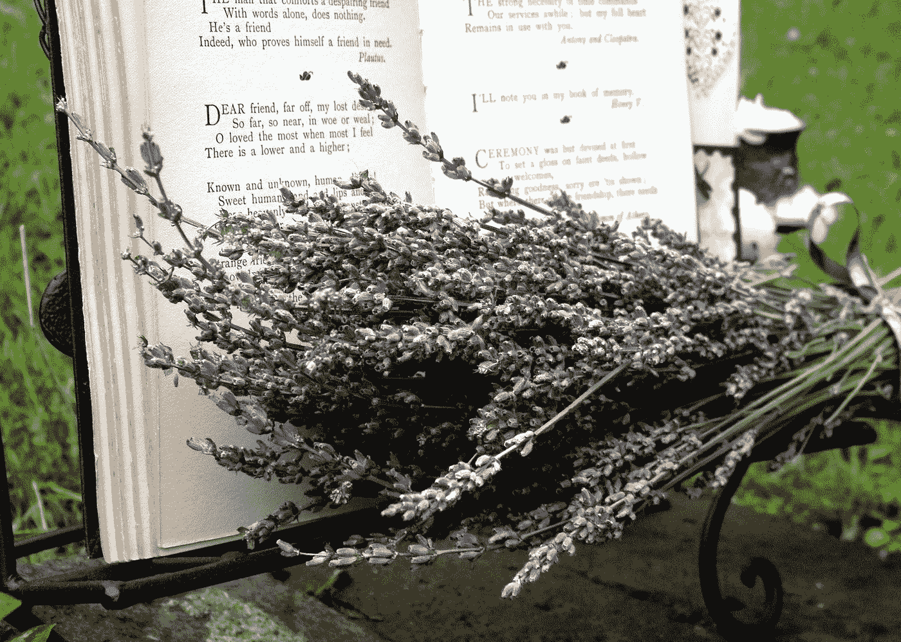
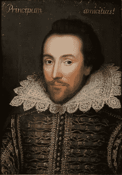
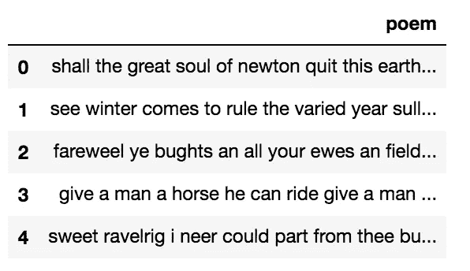
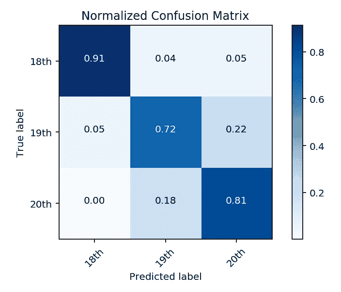
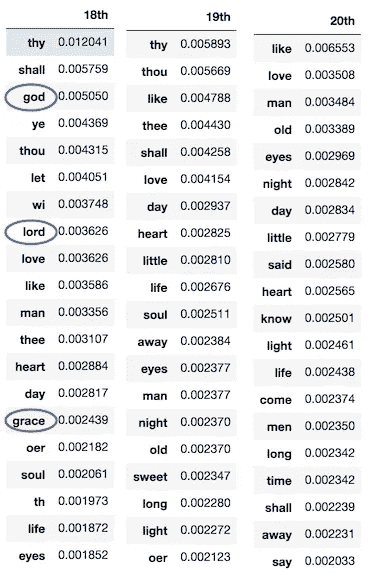

# 这首诗是什么时候写的？我的电脑可以告诉你

> 原文：<https://towardsdatascience.com/identifying-when-poems-were-written-with-natural-language-processing-a40ff286bcd?source=collection_archive---------6----------------------->

## 用数据科学来理解诗歌中的动作

我最近的项目真的很令人兴奋。我热爱诗歌已经有一段时间了，所以我选择它作为我第一次涉足自然语言处理(NLP)的主要领域。

数据科学最酷的事情之一是它的普遍性和多功能性。你可以“数据科学”几乎任何东西。所以我用这个项目来拓展我的数据科学经验，并用一种非常酷的方式来阐述这个想法。

To be or not to be?

你也许能分辨出莎士比亚的诗和艾米莉·狄金森的作品。莎士比亚死于 1616 年，狄金森死于 1886 年，在这 270 年里，英语的使用方式发生了相当大的变化。但是狄金森和罗伯特·弗罗斯特之间的区别呢？罗伯特·弗罗斯特一直活到 1963 年。他们两人都用今天仍可理解的语言写作，没有“thous”和“thys”。在他们所处的时代，英语发生了多大的变化？毕竟，1886 年并不算太久。那是可口可乐被发明的那一年。

但也许你是诗歌专家。也许你对弗罗斯特的风格超级熟悉。如果是这样的话，你也许能分辨出其中的区别，但这远不像对莎士比亚那样容易。但是你，专家先生，如果我给你 1500 首诗，然后问你哪些是 18、19 和 20 世纪的呢？你现在有多自信？

对我们大多数人来说，这是相当困难的。风格和用词的差异并不明显。

这个项目旨在发现这些差异**是否**实际上是可以区分的。机器学习模型可以学习几个世纪之间的风格和单词选择的差异吗？如果有，准确度如何？*剧透警告:可以。也很好。*

## 获取数据:

我的第一个挑战是获得足够大的诗歌语料库来训练模型。起初，我期望这在互联网的某个地方很容易得到。我是说，互联网什么都有，对吧？不对。如果有，我没找到。

下一个可能性是网络抓取。有很多网站上有大量的诗歌。问题是他们中的一些人喝太多了。我指的是用户提交的内容。让任何一个汤姆、迪克或哈利出版他们杰作的网站。伟大的家伙，汤姆，迪克和哈利。但是为了*这个*项目，我没有要他们的大作。

经过一番搜索，我找到了一个合适的网站，但不幸的是，这个网站做得不是很好。一个完全不合逻辑的 URL 方案和一个过时的 HTML 结构使它成为一个挑战。但是我刮了。我想出了大约 30，000 首诗，并对其进行删减以创建我的最终数据集。

## 数据清理:

下一步是清洗和预处理。有几个步骤。

由于数据来自一个网站，我必须在不丢失任何内容的情况下删除所有的 HTML 标签。我还去掉了所有的标点符号和数字，把所有的字母都改成了小写。这很重要，因为计算机将大写和小写字母视为不同的字母，即使它们代表相同的字符。

在这个过程的最后，我留下了大约 4000 首诗，每一首都只是一滴原始文本，没有标点符号或大写字母。看起来像这样:

If you can figure out what ‘bughts’ are, you get ten points.

## 建模:

下一步是建模。我决定使用计数矢量器来分析这些诗歌。计数矢量器是 NLP 任务中常用的一种相对简单的方法。它基本上从整个语料库中的每个单词创建一个特征，然后为每首诗中的每个特征分配一个频率计数。它通常被称为“单词包”，因为它只是简单地统计每个单词在每次观察中的出现次数。还有更复杂的文本分析方法，但我选择这种方法主要是因为它简单。大多数自然语言处理任务集中在分析文本的内容，但是在这个任务中，我关注的是 T2 风格。

关于这一点，我在这个项目中做了另一个有趣的决定。NLP 项目中的一个标准步骤是去除“停用词”。停用词是像“the”这样的词，它们在所有文本中如此普遍，以至于不能提供任何见解。如果你看词频的话，几乎总是最常见的一个，但它并不能真正告诉我们什么。这个项目是不同的。因为我寻找的是风格，而不是内容，所以我可以从“the”中学到很多。也许 20 世纪的诗人比 18 世纪的诗人更经常使用特定的连词。所以我决定留下停用词。这被证明是一个好的决定，因为去掉它们会损害模型的性能。

预处理之后是模型构建阶段。scikit-learn 和 nltk 中有许多现成的建模技术，适用于文本分类项目。在尝试了许多方法并试验了它们的不同参数后，我选定了一个多项式朴素贝叶斯分类器。

朴素贝叶斯模型之所以被称为朴素贝叶斯模型，是因为它们假设所有特征都是独立的，即使这并不完全正确。通过这样做，他们可以查看每个特征属于每个类的概率。然后，他们将每个观察值分配给其组合特征具有最高概率的类。尽管有天真的假设，但它们通常在文本数据上表现得非常好。

朴素贝叶斯模型获得了 82%的总准确率。不同班级的分数有一个有趣的分类。下面是一个混乱矩阵，显示了正确和错误分类的诗歌。

It’s appropriately called a confusion matrix because it can be confusing. A more detailed description below.

看这个矩阵，看起来 18 世纪和其他阶级最有区别。该模型正确预测了 91%的 18 世纪诗歌。有趣的是，虽然它确实将一些 18 世纪的诗歌误归类为 19 世纪和 20 世纪，但它没有将任何 20 世纪的诗歌误归类为属于 18 世纪。

这个模型在 19 世纪和 20 世纪遇到了更多的麻烦。你可以看到它只正确识别了 72%的 19 世纪诗歌，和 81%的 20 世纪诗歌。夹在另外两个阶级中间的 19 世纪，给这一模式造成了最大的混乱。时间上更远的几个世纪比中间的几个世纪更容易区分，这肯定是有道理的。

下面是一些最有可能属于每个世纪的特征。许多单词可能会出现在不止一个类中，这似乎有悖常理。但它确实有意义，因为为了识别类别，模型结合了这首诗中所有单词的概率。但是每个单词对于每个类别都有一个可能性。通过观察某些单词在不同类别中的概率差异，你仍然可以获得一些有趣的见解。当停用词被实际取出时，下面的单词属于每一类的概率最高。即使我把它们留在我的最具预测性的模型中，我还是把它们拿出来放在一个模型中，以便对特定的单词有所了解。看一看:

Looks like God went out of style!

如果你注意到其他有趣的东西，请在下面留言。

## 后续步骤:

这个项目让我着迷，我会继续探索和发展它。

下一步是动态主题建模，这是一种提取数据中正在谈论的主题，并观察它们如何随时间变化的方法。请继续关注这方面的新闻。

在那之后，我计划收集更多的数据，创建额外的功能，并在分类上做出一些深思熟虑的决定。

Jupyter 笔记本和原始诗歌数据可以在我的 Github [这里](https://github.com/chaimgluck/projects/tree/master/Project-poems)找到。如果你对这些数据有任何创造性的使用，我很乐意听到并贡献出来。

有问题吗？评论？喜欢吗？讨厌？在下面留言。