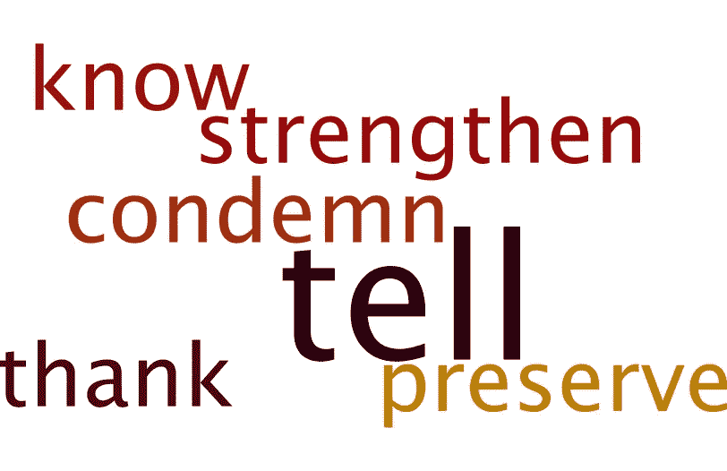

# 意识形态 Vs 现实？特朗普总统会见约旦国王后的讲话

> 原文：<https://towardsdatascience.com/ideology-vs-reality-insights-from-the-remarks-by-president-trump-after-meeting-the-king-of-jordan-85bad28e7a71?source=collection_archive---------7----------------------->

本周中期，特朗普总统在白宫会见约旦国王的消息铺天盖地。这通常表明，正如媒体广泛指出的那样，在处理中东问题时，国家之间的联盟越来越重要。

这篇文章的目的是分享一种更深层次的政治洞察力，这种洞察力可以通过应用于政治演讲文稿的认知分析技术获得。总统讲话的会议记录可以在白宫发布的[公共领域找到。](https://goo.gl/USTtbm)

该分析和方法基于我在认知和社会心理学领域的研究，包括从公开可用的数据中研究数百种认知取向，以及我在非结构化政治数据上应用高级分析工具和技术的经验。

## 认知文本分析

在对总统讲话的分析中，有三个重要的基于心理取向的洞察力维度，它们可能会阐明这种会议的重要性，如下所示。,

1.  **政治信任:**观察到一种积极的倾向，表明通过伙伴关系和合作与约旦建立了更密切的关系。
2.  **对外关系:****态度上取向是有可能定位在左边*(左翼政治支持社会平衡方面和* [*平均主义*](https://en.wikipedia.org/wiki/Egalitarianism) *)。*此外，在从属关系的驱动下，对外关系的倾向于和平(而非战争)。我们在合作中的角色可能是调停者/整合者，而不是影响者或积极独立的角色扮演者*(基于参考文献。数据来自赫尔曼 1987 年 b)***

**3.**订婚的方法？**(对外交易):这种定位是关于一个人如何在外部世界交易/参与，并表明特朗普可能会谨慎*(相对于雄心勃勃)*，但在处理合作目标中的实际问题时，他的方法是自信和正式的。**

## **动机分析(回答为什么？)**

**人类的动机表现为寻求改变的愿望或挫折，关注自我、物质或社会/人际世界。在我对总统讲话的分析中发现的主要动机如下。**

1.  ****成就** (76%) —这种动机情绪有寻求结果的愿望(获得胜利)，关注物质或任务导向的世界(而不是关注自我或社会世界)**
2.  ****精通**(70%)——这是另一个动机，人们渴望或寻求的变化变得不同寻常(以精通)，以便川普能够更好地同化和处理中东局势(通过约旦合作)。掌握动机关注自我(与物质或社会世界相对的内在自我)**
3.  ****归属感**(68%)——这种动机表示与对未来的期望相关的愿望，关注社会或人际关系世界。这就像是在说，在实现目标的过程中，我们将是值得信赖和可靠的(真诚的)伙伴。这也暗示了约旦对美国的支持。**
4.  ****养成** (52%) —有与体验关怀和支持相关的愿望。(养育和被养育的概念)。这个动机的重点在社交/人际世界。我相信在给定的环境下，这更多的是关于培养约旦和约旦在中东目标上对美国的回报。这一动机也表明了美国邀请约旦国王访问白宫的重要性。**

## **来自文本分析的线索**

1.  ****上下文发现****

**为了从总统的会议讲话中分析上下文，我把讲话记录分成三个部分，即。a)基于过去 b)现在和 c)将来时态。因为我很想知道这次会议可能会产生什么，所以我把分析的重点放在了文本中与未来相关的线索上，我的发现列举如下。**

****摘录** [**演讲正文**](https://goo.gl/USTtbm) **传达将来时方面****

> **一个非常特别的地方，我可以告诉你。我已经很了解它了。就此而言，美国与我们在全球的盟友一起谴责这一恐怖袭击和所有其他恐怖袭击。
> *陛下，约旦人素以热情好客著称，我们将尽最大努力成为同样热情的东道主。
> *然而，我不得不说，他们也因他们的战斗能力而闻名。*通过所有这些，美国将约旦视为一个宝贵的伙伴，一个文明价值观的倡导者，以及稳定和希望的源泉。
> *我坚定地致力于维护我们牢固的关系——我会的——并加强美国对约旦的长期支持。
> *通过这一切，美国将约旦视为一个重要的合作伙伴，一个文明价值观的倡导者，以及稳定和希望的源泉。我坚定地致力于维护我们牢固的关系——我将这样做——并加强美国对约旦的长期支持。我可以告诉你，在我们国家，你确实拥有巨大的支持。*约旦军人在这场与文明敌人的战斗中做出了巨大牺牲，我要感谢他们所有人，感谢他们令人难以置信的勇气。国王是呼吁一劳永逸地击败 ISIS 的领导者。**

****上下文发现—动作词(将来时文本)****

**上面引用的文本中的单词及其含义暗示了一种谨慎、合作和防御的姿态，而不是任何进攻的姿态。积极词汇与消极词汇的比率表明了一种预期的/积极的合作。**

****

****上下文发现—唯一&重要术语*** **术语—词语和短语*
这些是从上述文本中提取的重要关键词。如果你看到，无论是意义，然后积极的比率与消极的话是倾向于积极的方面有关方面的合作和联盟与约旦。文本“约旦服务成员”是一个有趣和独特的观察，因为合作可能与军事方面有关。(编辑注:我认为 AMN 在这篇文章发表两天后发布的[这条](https://goo.gl/43oksC) [特别新闻](https://goo.gl/43oksC)与这意味着什么有关，并暗示了新兴合作的性质)**

****

**Unique & Important terms from the speech (with future orientation)**

****2。语言风格&语气分析(将来时文本)****

**a.人们发现这种语言风格反映了自信和希望。
b .情绪基调表明存在喜悦(在 0-100%的范围内为 56 ),表示没有任何重大负面情绪的伙伴关系方面。**

**在上下文中，术语“恐怖袭击”与恐惧情绪有关，而恐惧情绪与战斗或逃跑反应有关。因此，很明显，在恶劣天气下，任何应对措施都可能以战斗(军国主义)姿态出现。(打架)。“谴责”这个词与愤怒的情绪有关。(对情况做出反应)。根据 CMU 的一项研究，尤其是愤怒的情绪可能会让人愿意冒更大的风险。**

****总结****

**总体分析主要指向“关系”因素，这意味着美国与约旦的政治伙伴关系的持续和日益增长的重要性。这种关系如何体现和出现将是一件有趣的事情，这取决于中东正在发生的变化。**

**虽然这种分析具有预测性，但考虑到问题的复杂性、人类思维和文本数据的较小/有限大小，最好将分析结果视为可能有助于准备工作的线索，而不是真正预测确定性的东西。**

**免责声明:
这里提到的观点是我自己的。
本文使用的数据来自公共领域的可用信息。但对其准确性、完整性、及时性或正确性不做任何明示或暗示的陈述或保证。我不对任何错误或不准确负责，不管是什么原因造成的。(读者)。**