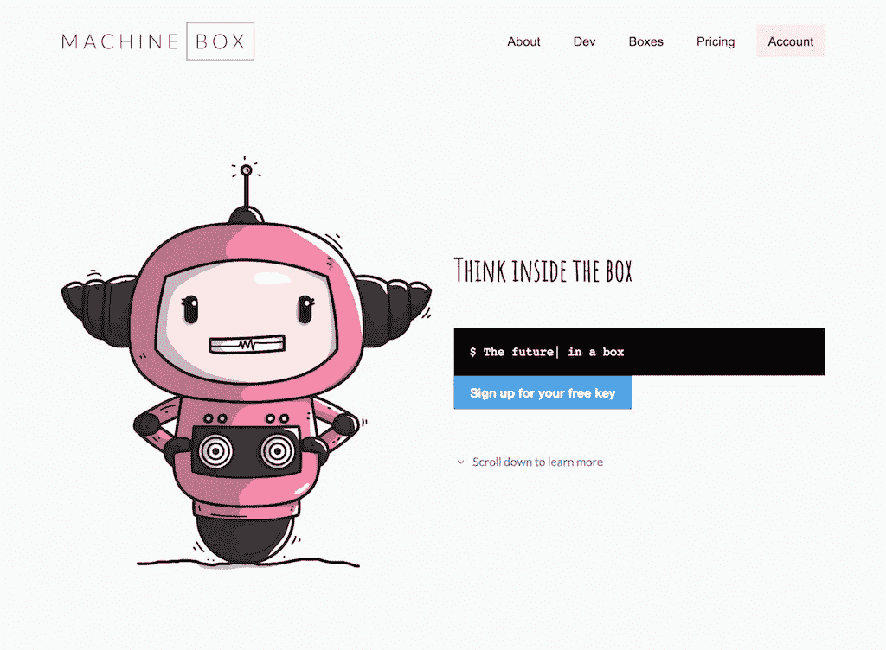

# 如果机器学习不能帮你省钱，那你就做错了

> 原文：<https://towardsdatascience.com/if-machine-learning-isnt-saving-you-money-you-re-doing-it-wrong-902053c3c898?source=collection_archive---------6----------------------->

***注来自《走向数据科学》的编辑:*** *虽然我们允许独立作者根据我们的* [*规则和指导方针*](/questions-96667b06af5) *发表文章，但我们不认可每个作者的贡献。你不应该在没有寻求专业建议的情况下依赖一个作者的作品。详见我们的* [*读者术语*](/readers-terms-b5d780a700a4) *。*

我们都同意，机器学习是新的热点。或许你读过的每一个标题都很吸引人的故事，比如“ [7 种将主导 2018 年](https://www.forbes.com/sites/jaysondemers/2017/12/30/7-technology-trends-that-will-dominate-2018/)的技术趋势”，都会以这样或那样的方式提到机器学习或人工智能。

事实是，机器学习是伟大的，但如果你没有以正确的方式进行，它真的很容易很快被剥夺。我从亲身经历中了解到这一点。

Photo by [NeONBRAND](https://unsplash.com/photos/-Cmz06-0btw?utm_source=unsplash&utm_medium=referral&utm_content=creditCopyText) on [Unsplash](https://unsplash.com/search/photos/wrong?utm_source=unsplash&utm_medium=referral&utm_content=creditCopyText)

## 以一个问题开始

首先，也可能是最重要的，机器学习仍然只是触及了可能的表面。令人沮丧的是，你绝对不会听到有人试图向你出售机器学习能力或服务。即使是你雇佣的热门数据科学家和 ML 工程师(可以理解)可能也不会立即鹦鹉学舌当前技术水平的局限性。

我无法告诉你我从大大小小的企业那里听到了多少根本不可能的使用案例和请求。我可能听到过同样多的请求，这些请求实际上并不需要机器学习来完成。

把机器学习扔给任何老问题都不会奏效。你最终会浪费很多时间和金钱。

相反，仔细考虑你试图解决的问题。你能把问题变得越简单，机器学习就越有可能奏效。不要想象你认为只有计算机会擅长的问题。先看看手动解决这个问题需要多少努力，然后评估计算机系统是否可以独立完成这项任务。

## 训练就是一切

从零开始学习机器仍然非常非常困难。我认为最难的部分是训练。当我试图训练一个机器学习模型来检测电影和视频中的吸烟时，我学到了这一点。我最初认为，我只需要向它展示数百张香烟的图片，然后它就会知道香烟的样子。

失败了。

然后我发现我需要给它两个标签；*吸烟*和*不吸烟*。所以我找了一堆随机的不是香烟的东西的图片，然后把它们放了进去。

那也失败了。

然后我尝试了一种不同的方法。我决定从人们吸烟的电影中截取定格画面。因为这是模型运行的环境，我想我有更好的机会让它工作。为了我的*不吸烟*标签，我使用了不同电影中对话场景的定格画面。

差点就成功了。问题是，事实证明，我所做的是训练模型检测我用来训练的电影。所以它本质上是一个*是不是这 5 部电影中的一部*模型。

One of my favorite scenes from *Silicon Valley*

我在这上面花的时间和精力都白费了。我也从其他顾客那里听到过类似的趣闻。他们雇佣了 ML 工程师和专家来建造定制模型，这花了一年的时间，结果却是一些不太好的东西。

这个问题的解决方案与上面的部分相同。首先考虑问题，并确保一个好的训练集是你可以得到的。

我最终使用[机器盒](https://goo.gl/KNCJ1X)中的[标签盒](https://goo.gl/dn5jN7)解决了这个问题，但我仍然必须考虑我的训练数据，并决定边缘情况发生的可能性有多大。

## 不要花的钱比你存的多

这似乎是显而易见的，但值得重复。谷歌、微软、IBM 等公司有一些非常棒的机器学习 API。但在实践中，这些工具的成本会迅速增加。我曾见过有人仅仅为了一个月的开发工作就得到 45，000 美元的账单。我采访过的一家主要广播公司告诉我，通过这些云 API 运行他的所有内容比付钱给高中生手动标记所有内容要昂贵得多。

这是一个巨大的投资回报率问题。(这也是我加入[机器盒子](https://goo.gl/KNCJ1X)的原因，因为我们解决了这个问题，不管使用与否，所有东西都要支付统一的订阅费)。在 GPU 和其他地方训练机器学习模型的成本已经下降，但仍然需要一些成本。在许多情况下，有些东西可能比它的价值更高。

你从特定的机器学习模型中提取的价值将取决于你的用例。确保它经过深思熟虑和验证。

## 不要期待奇迹

Alexa 有没有理解过你说的话？真的很让人沮丧吗？我仍然看到这些语音助手有很多准确性问题。语音识别非常非常难实现。在机器学习中，当我们谈到一个特定的模型时，我们经常会引用一个百分比的准确率。如果准确率在 80%以上，我们会觉得我们得到了有用的东西。开车到 90%以上通常只是稍微调整一下。但我们真正做的是讨论我们的模型如何从我们搁置的训练数据子集预测一些东西，我们称之为验证集。当您的模型与不在训练集中的东西运行时，可能会出现问题。在很多情况下，不可能考虑到所有可能的边缘情况。当 Alexa 被激活时，它处于数百万种不同的听觉情况中。背景噪音、口音、回声和许多其他东西会干扰语音识别系统。

A lot of false positives from an implementation of OpenCV face recognition: [https://goo.gl/m9jpwR](https://goo.gl/m9jpwR)

当机器学习模型错过一些东西时，很容易认为这是一个错误，或者可能是模型中的缺陷。非常重要的是，你要明白事实并非如此。误报和漏报是机器学习的一部分。它有时也会犯错，就像我们一样。每个企业都必须为机器学习中偶尔出现的误报和漏报做好准备。这就是生活的现实。作为企业执行任务的人类总是会犯错误。

我们在[机器盒子](https://goo.gl/KNCJ1X)帮助缓解这些问题的方法之一是让我们的盒子可教。也就是说，您可以简单地对模型进行修改或添加，而不需要进行任何类型的再培训。就像人类一样，机器学习模型需要随着时间的推移不断改进，以考虑所有可能的边缘情况。

但是你的业务和对机器学习的理解需要考虑偶尔的误报和漏报。仅仅因为你的系统漏掉了一些文本中的关键词，或者图片中的一张脸，并不意味着整个系统应该崩溃。如果你曾经在电视上看过隐藏式字幕，你就会知道人类总是会犯错。是否意味着隐藏式字幕没有用？当然不是。它仍然提供重要的服务。你的机器学习实现也应该如此。

## 我该不该用？

尽管如此，我想重申，机器学习是一种[奇妙、强大的计算类型](/how-i-use-machine-learning-to-save-time-49f8b0ee0881)，可以给[大大小小的企业](/6-ways-people-are-making-money-with-machine-learning-db10575f3564)带来很多价值。我已经看到了很多非常好的机器学习用例，用[机器盒](https://goo.gl/KNCJ1X)和其他工具廉价而有效地解决了这些问题。从提高安全性和合规性到改进搜索和发现，无所不包。使用得当，它可以节省人们大量的时间。它还可以帮助创造新的收入来源，识别威胁，找到丢失的数据，等等。

所有这些成功的实现都是如此，因为它们都是定义明确的问题，可以通过当前或以前最先进的机器学习来解决。投入的精力没有超过创造的价值。

如果你不确定你的用例是否能被机器学习解决，你能做的最好的事情就是实验。但是很明显，以一种不会破产的方式。你可以用[机器盒](https://goo.gl/KNCJ1X)或者一些云工具轻松做到这一点。

在你开始一个耗时的数据科学项目之前，尽你所能评估这个问题，并确保它是用例最简单的迭代。

# 什么是机器盒子？

[Machine Box](https://goo.gl/2F11De) 将最先进的**机器学习**功能放入 **Docker 容器**中，以便像您这样的开发人员可以轻松整合自然语言处理、面部检测、对象识别等功能。到您自己的应用程序中。

这些盒子**是为扩展**而建造的，所以当你的应用真正起飞时，只需水平地添加更多的盒子，直到无限甚至更远。哦，它比任何云服务都要便宜得多([而且可能更好](https://hackernoon.com/which-face-recognition-technology-performs-best-c2c839eb04e7))……而且**你的数据不会离开你的基础设施**。

有戏让我们知道你的想法。