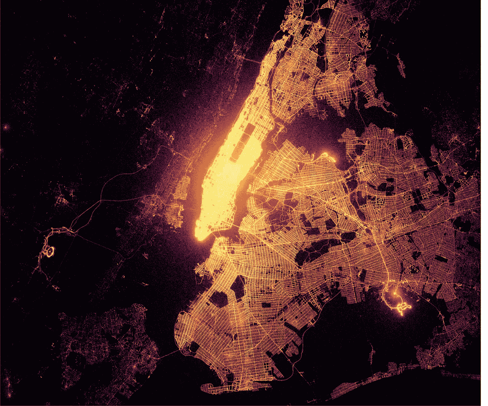
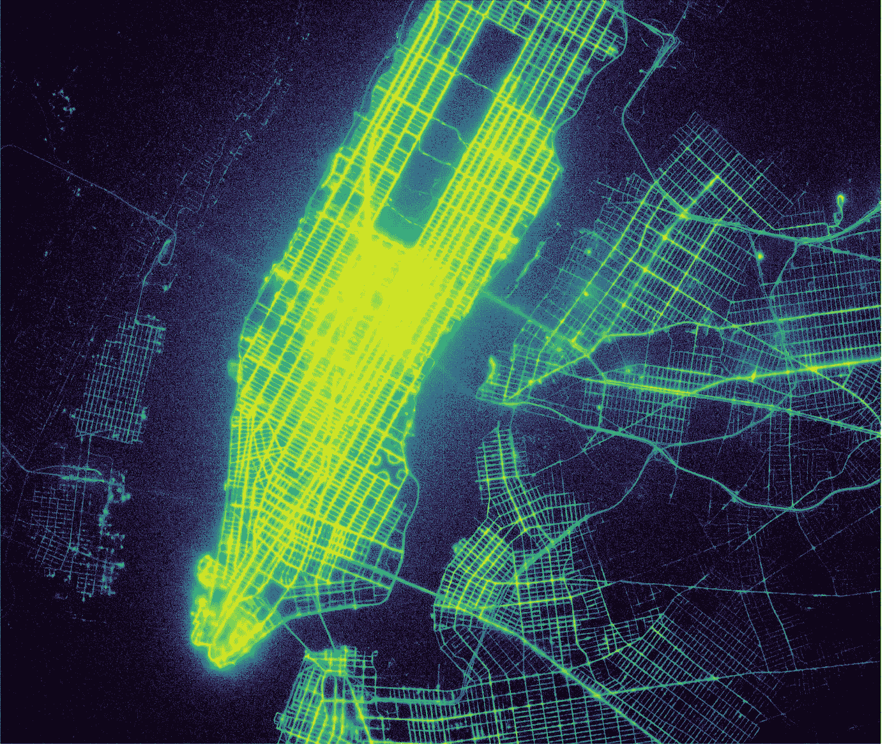
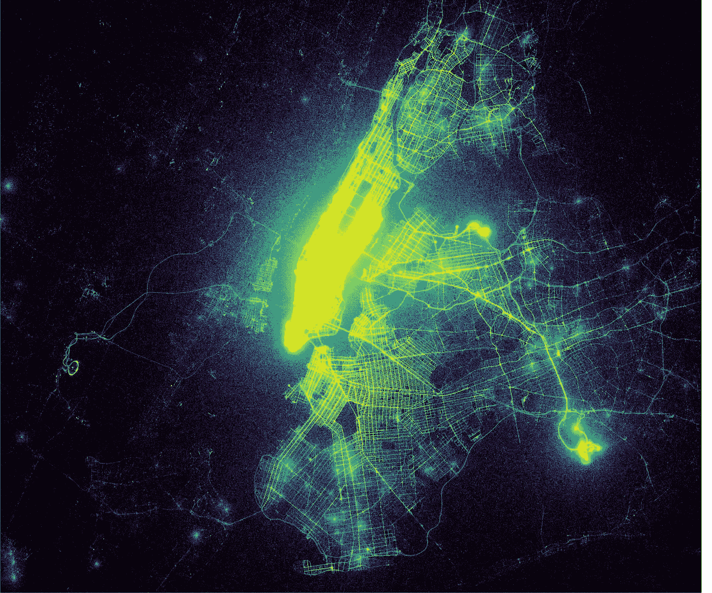
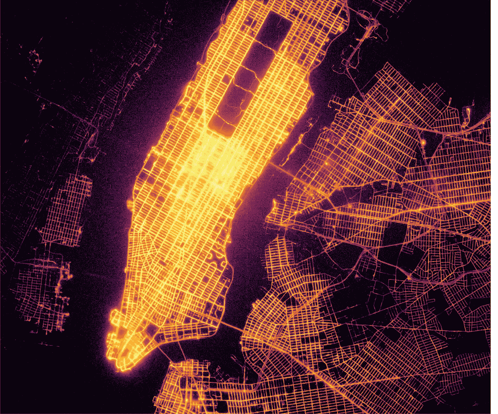
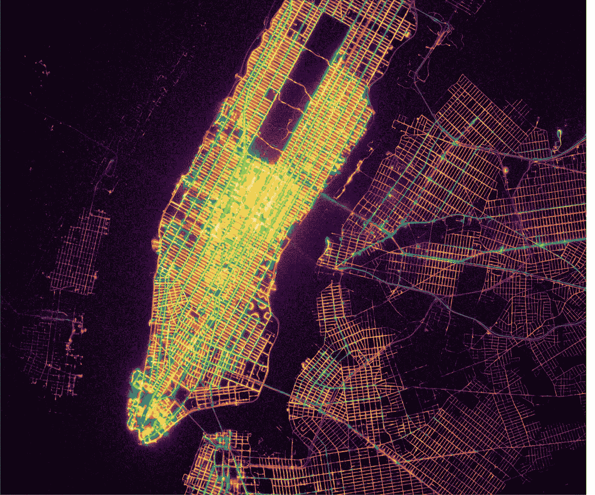
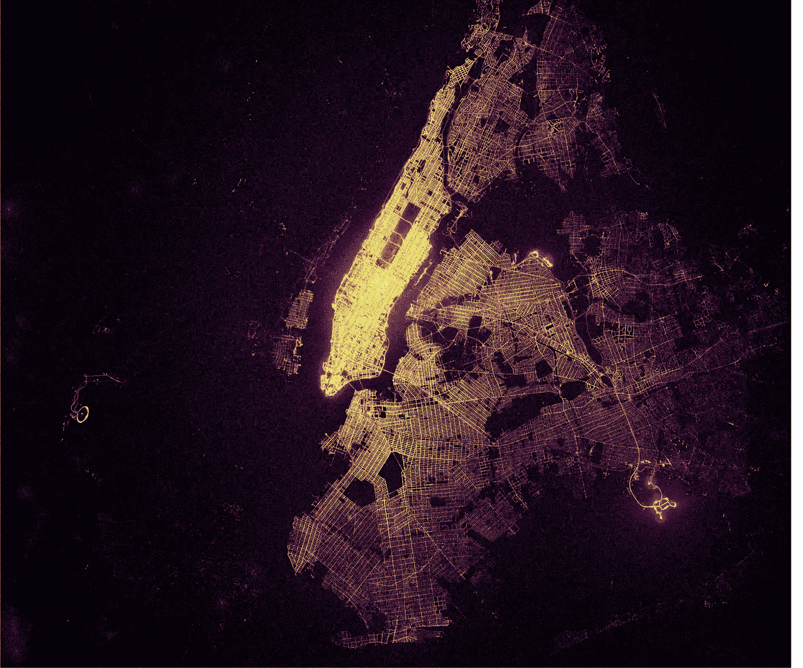

# 如果出租车旅行是萤火虫:13 亿次纽约出租车旅行

> 原文：<https://towardsdatascience.com/if-taxi-trips-were-fireflies-1-3-billion-nyc-taxi-trips-plotted-b34e89f96cfa?source=collection_archive---------1----------------------->



NYC Metro Area Taxi Dropoffs, 1.3 Billion points plotted. [Click for full resolution](http://shekhar.info/images/dropoffs.jpg)

纽约市出租车和豪华轿车委员会(TLC)公开发布了一个从 2009 年 1 月到 2016 年 6 月的出租车出行数据集，其中包含起点和终点的 GPS 坐标。最初，Chris Whong 向 TLC 发送了一个 FOIA 请求，让他们发布数据，并制作了一个著名的可视化图像，[纽约市出租车:生活中的一天](http://chriswhong.github.io/nyctaxi/)。 [Mark Litwintschik](http://tech.marksblogg.com/benchmarks.html) 使用这个 400GB 大小的数据集对各种关系数据库和大数据技术进行了基准测试。值得注意的是， [Todd W. Schneider](http://toddwschneider.com/posts/analyzing-1-1-billion-nyc-taxi-and-uber-trips-with-a-vengeance/) 制作了一些非常好的数据集摘要，其中一些与我在这里展示的作品相似。实际上，我是在这篇文章写出来之后才知道 Todd 在这个话题上的工作的，所以尽管有一些重叠，这篇文章和其中的图片都是原创的。

我从 [TLC 网站](http://www.nyc.gov/html/tlc/html/about/trip_record_data.shtml)下载了数据文件，并且使用 Python、Dask 和 Spark([非常](https://github.com/r-shekhar/NYC-transport) [痛苦地](https://medium.com/towards-data-science/geospatial-operations-at-scale-with-dask-and-geopandas-4d92d00eb7e8))生成了一个清晰的 Parquet 格式的数据集，我在这篇文章的最后将它提供给 AWS 用户。

所以我很好奇，出租车在哪里接客，或者更准确地说，出租车接客地点的分布是什么样的？由于有 13 亿辆出租车，以不忽略细节的方式绘制分布图非常具有挑战性。由于过度绘制，散点图是无用的，2D 直方图是一种核密度估计形式，必然会模糊或像素化许多细节。此外，对于完整的数据集，仅拾取位置就有 21GB，这比我的 16GB 笔记本电脑的内存还多。核心外的工具可以很容易地解决这个技术问题(子采样比这更容易)，但是视觉问题呢？人眼无法在一个情节中吸收 21GB 的信息。

这个问题的解决方案来自一个叫做 [Datashader](https://github.com/bokeh/datashader) 的有趣的库。它会以您的显示器(或指定的画布)的分辨率动态生成 2D 直方图。显示器上的每个像素对应于数据中的特定直方图边界。该库为每个像素计算落入这些边界内的数据点的数量，该数量用于给像素的亮度着色。利用 Dask，直方图的创建可以扩展到万亿字节的数据，并分布在整个集群中。利用散景，最终的情节可以缩放和平移。使用来自[高动态范围](https://en.wikipedia.org/wiki/High-dynamic-range_imaging)摄影的技术，强度范围被映射，使得最大动态对比度出现在任何变焦水平和任何给定的视窗中。

# 出租车接送位置

这是曼哈顿上空出租车上客点(13 亿个点)的地图，使用 Viridis 感知均匀色图绘制。



*NYC Taxi pickups map for Manhattan* [*Click for full resolution*](http://shekhar.info/images/pickups_narrow.jpg)

我注意到的第一件事是我能多么清楚地看到街道图案。在布鲁克林和皇后区的部分地区，街道格局非常鲜明。在曼哈顿，这种模式是“模糊的”，尤其是在曼哈顿南端附近和中央公园以南的中城。根据全球定位系统的坐标，有相当多的货车掉在哈德逊河或东河，也有相当多的货车掉在中央公园没有道路的地方。显然，并没有很多出租车从曼哈顿周围的河流出发，但这个图显示的是 GPS 误差有多重要。这种模糊性来自于高层建筑，这使得很难获得良好的 GPS 定位，而且建筑物越高，街道看起来就越模糊。更广泛地说，中央公园以南的市中心区非常明亮，表明许多出租车旅行都是从那里开始的。



*Taxi pickups map for NYC Metro Area* [*Click for full resolution*](http://shekhar.info/images/pickups.jpg)

第二个图像也是出租车皮卡，但在一个更广泛的规模。缩小后，曼哈顿的大部分地区像灯塔一样亮着，表明曼哈顿的皮卡数量远远超过周围地区。但是机场，特别是 JFK 和拉瓜迪亚机场，也亮起来了，显示出几乎和市中心区一样的视觉强度(从那里开始的单位面积的旅行次数)。

# 出租车下车地点

现在让我们使用地狱色图来检查衰减位置。



*NYC Taxi dropoffs map for Manhattan* [*Click for full resolution*](http://shekhar.info/images/dropoffs_narrow.jpg)

乍一看，交货地点很像曼哈顿的交货地点。同样的地区，中央公园以南的中城和曼哈顿的南端展示了最明亮(也是最模糊)的街道。


*Taxi dropoffs map for NYC Metro Area* [*Click for full resolution*](http://shekhar.info/images/dropoffs.jpg)

缩小到更广阔的都会区，布鲁克林和皇后区的街道更清晰、更明亮，这表明外围区的落客比皮卡多得多，也表明这些地区的 GPS 误差往往更低，这可能是因为高层建筑更少。事实上，在一些地方，它看起来足够好，可以用作街道地图，表明布鲁克林和皇后区的出租车乘客分布相对均匀。这与皮卡地图截然不同，表明在外区有相对较少的皮卡，但有很多落客。许多人从曼哈顿乘出租车去郊区，但很少有人从郊区乘出租车去曼哈顿。

# 出租车上下车地点

最后两个图逐个像素地比较了拾取和衰减。在拾取高于衰减的地方，像素用绿色和黄色色图着色。在衰减高于拾取的地方，像素用紫色和橙色的地狱色图着色。



*Pickups (Yellow-Green) and Dropoffs (Orange) for Manhattan* [*Click for full resolution*](http://shekhar.info/images/pickups_dropoffs_narrow.jpg)

在曼哈顿，街道(南北向的街道)两旁都是绿色，这表明接送的人比下车的人多。十字路口(东-西)是橙色的，表示更多的下降。实际上，如果我想搭出租车，走到最近的大街上搭一辆可能更容易。



*Pickups (Yellow-Green) and Dropoffs (Orange) for NYC Metro Area* [*Click for full resolution*](http://shekhar.info/images/pickups_dropoffs.jpg)

缩小到更广阔的区域，布鲁克林和皇后区的几条主要街道是绿色的，表明这些街道上有大量的皮卡，而其他街道仍然是橙色的，显示从曼哈顿开始的旅行有所减少。在 JFK 和拉瓜迪亚机场，机场内的上客区和下客区被突出显示，部分区域用绿色阴影表示(上客区)，其他区域用橙色阴影表示(下客区)。

# GPS 呢？

使用 Datashader 和 Bokeh 绘制出租车上客和下客位置表明，有时 GPS 坐标数据相当不准确，表明上客和下客位置在东河或哈德逊河。我们从曼哈顿的接送地图上看到，GPS 受到高楼的强烈影响。特别是下降显示了一个令人惊讶的均匀分布在外围行政区，每条道路，每座桥梁都被突出。我觉得这很令人惊讶，因为我不希望在桥上或其他不鼓励停车让乘客下车的地方出现很多下车现象，比如通往 JFK 的范威克高速公路。然而，这样的桥梁和道路被突出显示，这让我想知道这是不是 GPS 的一个怪癖？这都是我的推测，但是如果 GPS 设备只是以固定的时间间隔更新，比如每两分钟，或者只要它可以获得位置锁定，会怎么样呢？在这种情况下，出租车行程将在一个合理的位置结束，但数据将被记录为行程在沿途某处结束。这可以解释为什么大量的接送发生在看似不可能的地点。

鉴于数据集可以追溯到 2009 年，智能手机中的 GPS 接收器从那时起已经走过了很长的路，我非常好奇是否有可能在出租车数据集中看到 GPS 精度的提高。作为 GPS 误差的一个替代，我检查了在物理上不可能的位置上的上下车地点的数量，例如在哈德逊河和东河的中间。然后我把这种不可能的旅行的比例标绘成总旅行次数的比率。鉴于优步和 Lyft 等打车服务和拼车服务的增长，费率调整是必要的。


*Rate of Pickups and Dropoffs outside of the Taxi Zones, but within the local NYC area*

果不其然，自 2009 年以来，不可能的地点的接送率下降了 4 到 5 倍。我不清楚是什么导致了 2009-2012 年的年度周期，错误率在夏季月份增加。自 2011 年以来，错误率大幅下降，这可能是由于整个出租车车队的出租车计价器发生了变化，或者 GPS 报告方式发生了变化。掉线率高于接站率的事实表明，我的理论可能有一些支持，即 GPS 设备只在固定的时间间隔更新，或者每当它们可以锁定位置时更新。

值得一提的是，0.5% — 0.1%的误差率不一定代表特定位置的实际 GPS 误差。例如，中央公园以南中城的模糊街道表明，那里的位置误差远高于 0.5%。此外，全球定位系统的位置可能是错误的，在某种程度上不是把它放在水面上，而是放在不正确的陆地位置上，这不会被我的 GPS 误差的原始代理检测到。

# 摘要

我获取、清理并绘制了纽约出租车数据集。我制作了一些有趣的接送地点的可视化图像，显示大多数接送发生在曼哈顿、JFK 和拉瓜迪亚机场，但是从曼哈顿到布鲁克林和皇后区有大量的出租车行程。很少有旅行是从郊区开始，在曼哈顿结束的。我逐点比较了出租车的上客和下客情况，显示出曼哈顿的大街上出租车上客的数量比十字路口多，十字路口上客的数量比十字路口多。

我还展示了 GPS 位置的准确性如何有问题。在市中心区，这可以通过“模糊”的街道和相当数量的点看到，这些点显示了在像哈德逊或东河这样不可能的位置的皮卡。在不方便让乘客下车的地方，比如范怀克高速公路，也有大量的上下车点，这表明上下车点地图上对这些街道的清晰定义是 GPS 设备不经常更新的一个怪癖。对恰好在水中的上下车地点的数量进行分析显示，自 2009 年以来，4 5X 的数量显著下降，这可能要归功于出租车计价器中 GPS 技术的改进。尽管如此，GPS 定位的误差表明应该有所保留。

在接下来的几周里，我将发布更多关于这个数据集的数据分析。

# 数据可用性

我把代码放在我的 NYC-transport [github 库](https://github.com/r-shekhar/NYC-transport)中。你可以在 [Github](https://github.com/r-shekhar/NYC-transport/blob/master/15_dataframe_analysis/Datashader_maps_01.ipynb) 或 [NBViewer](https://nbviewer.jupyter.org/github/r-shekhar/NYC-transport/blob/master/15_dataframe_analysis/Datashader_maps_01.ipynb) 上查看用于制作这篇文章情节的笔记本。

我已经将亚马逊 S3 上包含出租车数据和优步数据(不是本文的主题)的原始拼花格式数据帧放在一个[请求者付费](http://docs.aws.amazon.com/AmazonS3/latest/dev/RequesterPaysBuckets.html)桶中。如果您在美国东部地区使用正确配置的`s3cmd`启动 EC2 实例，您可以如下复制文件。**一定要在美国东部地区，否则你可能会招致巨额带宽费用**。

```
s3cmd sync --requester-pays s3://transit-project/parquet/all_trips_spark.parquet .
```

数据大约为 33GB，采用快速压缩的柱状拼花格式。如果用 Dask 读取，需要使用 PyArrow 后端。

如果您想联系我，请通过 [LinkedIn](https://www.linkedin.com/in/rshekhar2/) 联系我。