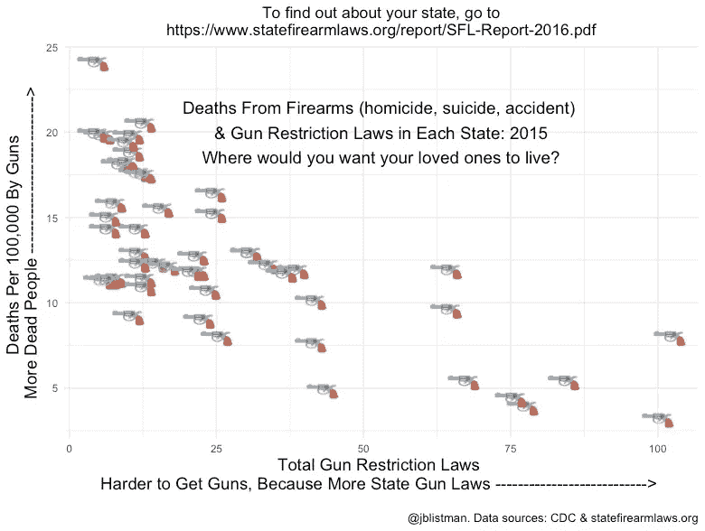

# 如果你想增加枪支致死的风险，就不要管制枪支。哦，等等，那很糟糕…

> 原文：<https://towardsdatascience.com/if-you-want-to-increase-risk-of-death-by-firearm-dont-regulate-guns-oh-wait-that-s-bad-p-9d9e0166b540?source=collection_archive---------7----------------------->

2015 年，如果你的孩子住在阿拉斯加，他们死于子弹的可能性是住在马萨诸塞州的 24 倍。就我个人而言，我不希望我的孩子去上图左上角的任何一个州处理他们的日常事务或参加电影或音乐会或大学课程，因为我希望他们健康长寿，为我生孙子，这样我就可以有孩子一起玩了。我跑题了。

为了制作这个图表，我按照美国各州和年份过滤了[疾病预防控制中心的数据库](https://wonder.cdc.gov/ucd-icd10.html)中的死亡原因。根据以下死亡原因代码，任何火器造成的死亡都包括在内，无论是合法死亡还是意外死亡:

U01.4(涉及火器的恐怖主义)

W32(手枪发射)

W33(步枪、猎枪和大型火器发射)

W34(从其他和未指明的火器发射)

X72(手枪走火造成的故意自残)

X73(用步枪、猎枪和更大的火器发射故意自残)

X74(其他未具体说明的火器发射造成的故意自伤)

X93(手枪发射攻击)

X94(步枪、猎枪和大型火器攻击)

X95(用其他未具体说明的火器发射攻击)

Y22(手枪射击，未确定意图)

Y23(步枪、猎枪和大型火器发射，未确定意图)

Y24(其他和未指明的火器发射，未确定的意图)

Y35.0(涉及火器发射的法律干预)

我将这些数据与总部位于波士顿大学的[州枪支法律项目](https://www.statefirearmlaws.org/index.html)的州级枪支限制法规数据结合起来(嘿，我儿子在波士顿大学读的研究生——耶！).我刚刚被指向 2013 年 J [AMA 内科学](https://www.ncbi.nlm.nih.gov/pubmed/23467753)的一篇文章，该文章使用类似的数据(CDC 枪支死亡数据+各州枪支法律数据)得出类似的结论。它在付费墙后面，但是你可以阅读摘要。

我没有在这个情节上花太多时间。这并不好看，不仅仅是因为这个话题。我故意省略了州名和红蓝标签，因为我想专注于两个指标:被子弹打死的可能性&买枪有多难。如果你对你所在州的法律感到关注或好奇，请查看[页面，了解更多](https://www.statefirearmlaws.org/state-by-state.html)。

用于数据操作和数据可视化的代码可以在[我的 GitHub](https://github.com/JListman/State_Gun_Laws_And_Deaths) 中找到。

## **感谢您的阅读。**

我欢迎反馈——您可以“鼓掌”表示赞同，或者如果您有具体的回应或问题，请在此给我发消息。我也有兴趣听听你想在未来的帖子中涉及哪些主题。

**阅读更多关于我的作品**[**jenny-listman.netlify.com**](https://jenny-listman.netlify.com)**。欢迎随时通过 Twitter**[**@ jblistman**](https://twitter.com/jblistman)**或**[**LinkedIn**](https://www.linkedin.com/in/jenniferlistman/)**联系我。**

注意事项:

1.  枪支法律数据:美国各州从 1991 年到 2017 年的枪支法律可从[https://www.kaggle.com/jboysen/state-firearms](https://www.kaggle.com/jboysen/state-firearms)获得
2.  疾控中心 1999 年至 2015 年火器致死原因数据:[https://wonder.cdc.gov/ucd-icd10.html](https://wonder.cdc.gov/ucd-icd10.html)
3.  使用 [R](https://www.r-project.org) 中的工具处理和绘制数据