# LSTM 和 GRU 的图解指南:一步一步的解释

> 原文：<https://towardsdatascience.com/illustrated-guide-to-lstms-and-gru-s-a-step-by-step-explanation-44e9eb85bf21?source=collection_archive---------0----------------------->

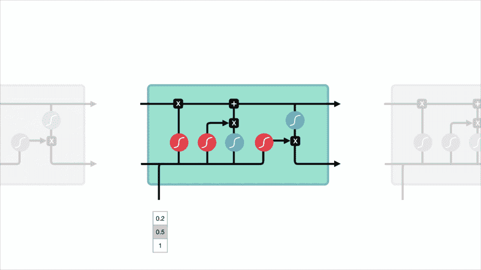

嗨，欢迎来到长短期记忆(LSTM)和门控循环单位(GRU)的图解指南。我是迈克尔，我是人工智能语音助手领域的机器学习工程师。

在这篇文章中，我们将从 LSTM 和 GRU 背后的直觉开始。然后我会解释让 LSTM 和 GRU 表现如此出色的内部机制。如果你想了解这两个网络的内幕，那么这篇文章就是为你准备的。

如果你愿意，你也可以在 youtube 上观看这篇文章的视频版本。

# 问题是，短期记忆

递归神经网络存在短期记忆的问题。如果一个序列足够长，它们将很难将信息从较早的时间步骤传递到较晚的时间步骤。因此，如果你试图处理一段文字来做预测，RNN 氏症可能会从一开始就遗漏重要信息。

在反向传播期间，递归神经网络遭受消失梯度问题。梯度是用于更新神经网络权重的值。消失梯度问题是当梯度随着时间向后传播而收缩时。如果一个梯度值变得极小，它不会贡献太多的学习。

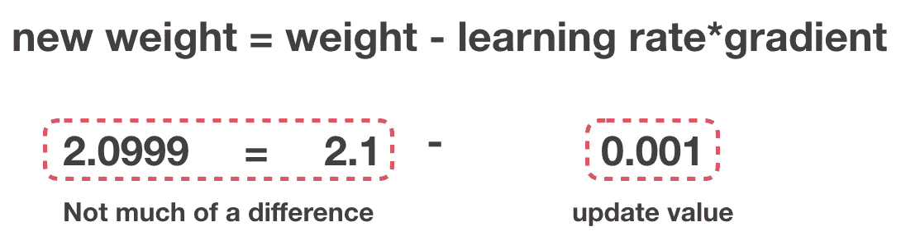

Gradient Update Rule

所以在递归神经网络中，获得小梯度更新的层停止学习。这些通常是早期的层。因此，因为这些层不学习，RNN 氏症可以忘记它在更长的序列中看到的东西，因此有短期记忆。如果你想知道更多关于递归神经网络的一般机制，你可以在这里阅读我以前的帖子。

 [## 递归神经网络图解指南

### 嗨，欢迎来到循环神经网络图解指南。我是迈克尔，也被称为学习矢量。我是一个…

towardsdatascience.com](/illustrated-guide-to-recurrent-neural-networks-79e5eb8049c9) 

# LSTM 的和 **GRU 的作为解决方案**

LSTM 和 GRU 的发明是为了解决短期记忆问题。它们有称为“门”的内部机制，可以调节信息的流动。

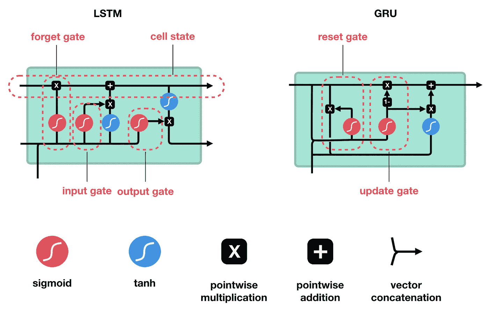

这些门可以了解序列中哪些数据是重要的，应该保留或丢弃。通过这样做，它可以将相关信息传递到长长的序列链中进行预测。几乎所有基于递归神经网络的现有技术结果都是用这两个网络实现的。LSTM 和 GRU 氏症可以在语音识别、语音合成和文本生成中找到。你甚至可以用它们来为视频生成字幕。

好了，到这篇文章结束的时候，你应该对为什么 LSTM 和 GRU 擅长处理长序列有了一个坚实的理解。我将用直观的解释和插图来处理这个问题，并尽可能避免使用数学。

# 直觉

好了，先来一个思维实验。假设你正在网上看评论，以决定是否要买生活麦片(不要问我为什么)。你将首先阅读评论，然后决定是否有人认为它是好的还是坏的。

当你阅读评论时，你的大脑下意识地只记住重要的关键词。你会听到像“惊人的”和“完美平衡的早餐”这样的词。你不太在意“这个”、“给了”、“所有”、“应该”之类的词。如果一个朋友第二天问你这篇评论说了什么，你可能不会一字不差地记住它。你可能还记得要点，比如“肯定会再次购买”。如果你和我很像，其他的词会从记忆中消失。

这基本上就是 LSTM 或 GRU 所做的。它可以学习只保留相关信息来进行预测，而忘记不相关的数据。在这种情况下，你记住的单词让你判断它是好的。

# 递归神经网络综述

为了理解 LSTM 和 GRU 是如何做到这一点的，让我们回顾一下递归神经网络。一个 RNN 是这样工作的；第一个单词被转换成机器可读的向量。然后，RNN 逐一处理向量序列。

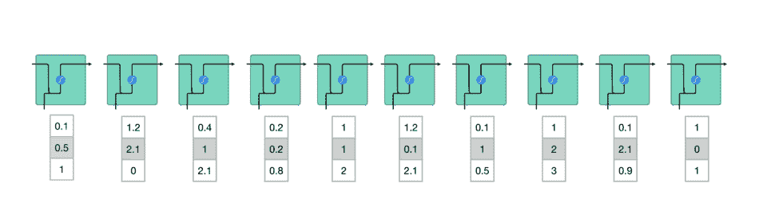

Processing sequence one by one

在处理时，它将前一个隐藏状态传递给序列的下一步。隐藏状态充当神经网络的记忆。它保存网络以前看到的以前数据的信息。

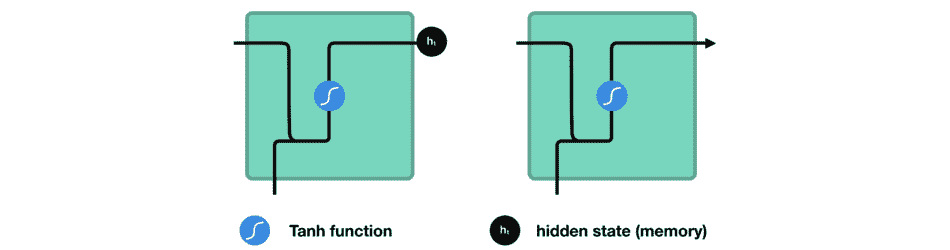

Passing hidden state to next time step

让我们看看 RNN 的一个单元，看看如何计算隐藏态。首先，将输入和先前的隐藏状态组合起来形成一个向量。该向量现在具有关于当前输入和先前输入的信息。向量经过 tanh 激活，输出是新的隐藏状态，或者网络的记忆。

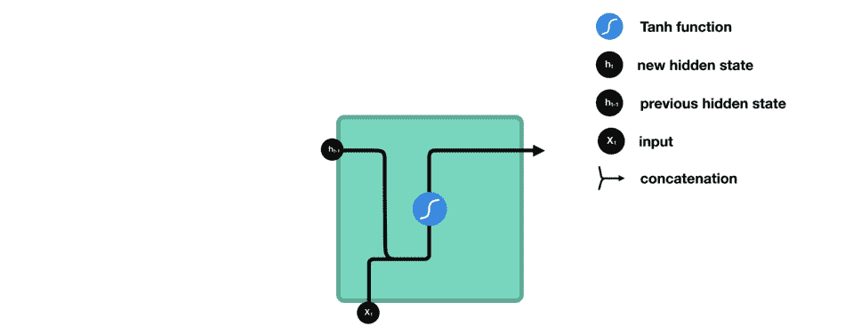

RNN Cell

## Tanh 激活

tanh 激活用于帮助调节流经网络的值。tanh 函数将值压缩为总是在-1 和 1 之间。

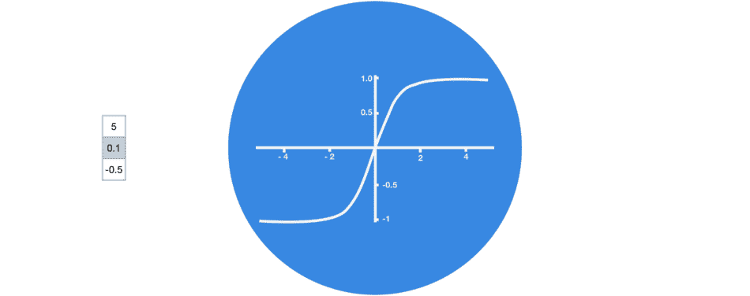

Tanh squishes values to be between -1 and 1

当向量流经神经网络时，由于各种数学运算，它会经历许多转换。所以想象一个值继续乘以比如说 ***3*** 。你可以看到一些价值如何爆炸，成为天文数字，导致其他价值似乎微不足道。

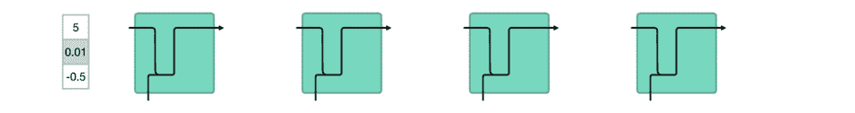

vector transformations without tanh

双曲正切函数确保值保持在-1 和 1 之间，从而调节神经网络的输出。您可以看到上面的相同值是如何保持在 tanh 函数允许的边界之间的。

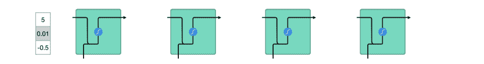

vector transformations with tanh

这是 RNN 的作品。它的内部操作很少，但是在适当的情况下(比如短序列)可以很好地工作。RNN 算法使用的计算资源比它的变种 LSTM 算法和 GRU 算法少得多。

# LSTM

LSTM 具有与递归神经网络相似的控制流。当信息向前传播时，它处理传递信息的数据。不同之处在于 LSTM 细胞内的操作。

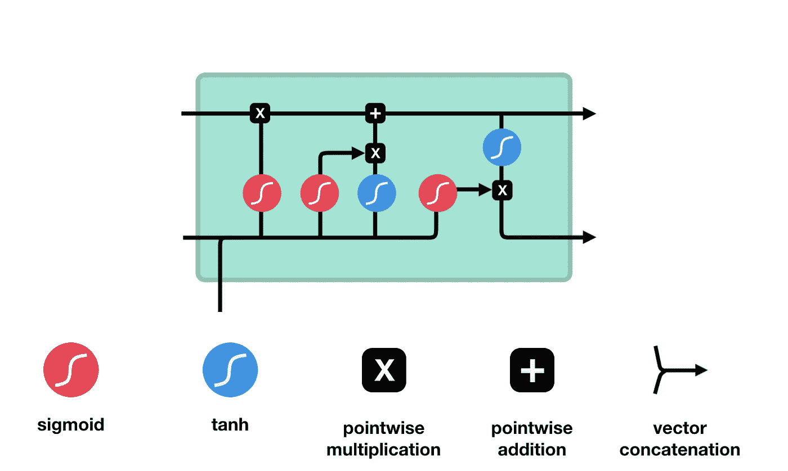

LSTM Cell and It’s Operations

这些操作用于允许 LSTM 保存或忘记信息。现在，查看这些操作可能会有点让人不知所措，因此我们将一步一步地讲解。

## 核心概念

LSTM 的核心概念是细胞状态，以及它的各种门。细胞状态就像一条传输高速公路，沿着序列链一路传输相关信息。你可以把它想象成网络的“记忆”。理论上，细胞状态可以在整个序列处理过程中携带相关信息。因此，即使是来自较早时间步骤的信息也可以传递到较晚的时间步骤，从而减少短期记忆的影响。当细胞状态继续它的旅程时，信息通过门被添加到细胞状态或从细胞状态移除。这些门是不同的神经网络，决定细胞状态允许哪些信息。盖茨夫妇可以在训练中了解哪些信息是应该保留或忘记的。

## 乙状结肠的

门包含乙状结肠激活。乙状结肠活化类似于双曲结肠活化。它不是挤压-1 和 1 之间的值，而是挤压 0 和 1 之间的值。这有助于更新或忘记数据，因为任何乘以 0 的数字都是 0，导致值消失或被“忘记”任何数字乘以 1 都是相同的值，因此该值保持不变或“保持不变”网络可以了解哪些数据不重要，因此可以忘记，或者哪些数据重要，需要保留。

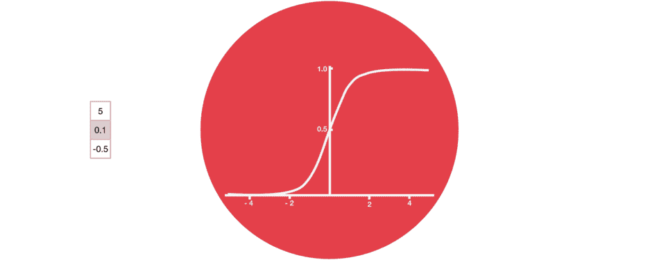

Sigmoid squishes values to be between 0 and 1

让我们更深入地了解一下各个门在做什么，好吗？所以我们有三个不同的门来调节 LSTM 细胞中的信息流动。遗忘门、输入门和输出门。

## 忘记大门

首先，我们有遗忘之门。这个门决定哪些信息应该被丢弃或保留。来自先前隐藏状态的信息和来自当前输入的信息通过 sigmoid 函数传递。值介于 0 和 1 之间。越接近 0 表示忘记，越接近 1 表示保留。

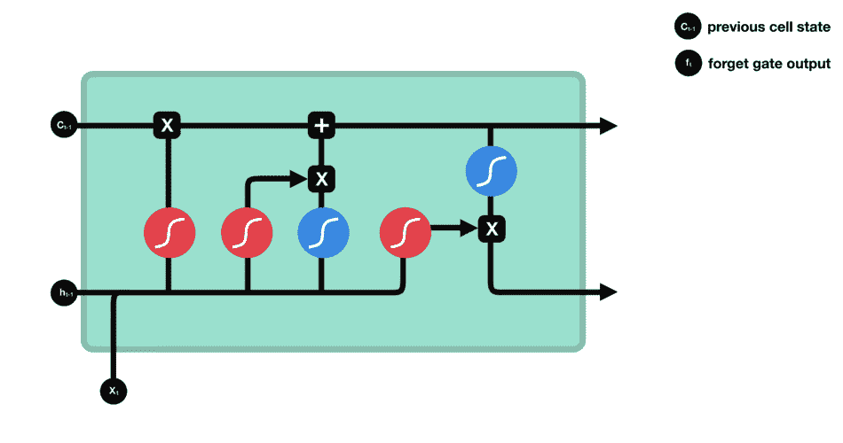

Forget gate operations

## 输入门

为了更新单元状态，我们有输入门。首先，我们将先前的隐藏状态和当前输入传递给一个 sigmoid 函数。它通过将值转换为 0 和 1 之间的值来决定哪些值将被更新。0 表示不重要，1 表示重要。您还可以将隐藏状态和当前输入传递给 tanh 函数，以挤压-1 和 1 之间的值，从而帮助调节网络。然后将双曲正切输出乘以 sigmoid 输出。sigmoid 输出将决定哪些信息对 tanh 输出很重要。

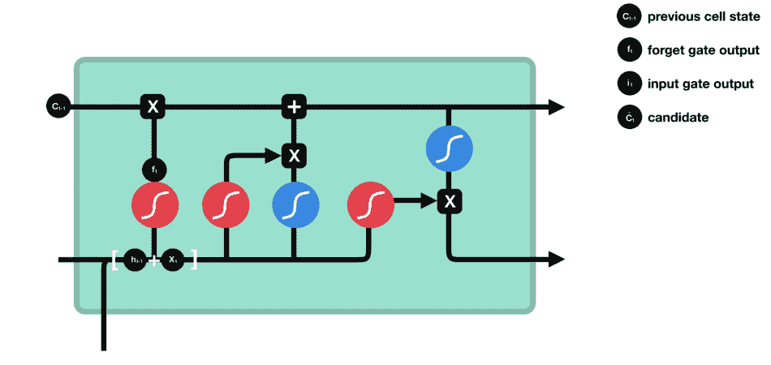

Input gate operations

## 细胞状态

现在我们应该有足够的信息来计算细胞状态。首先，单元格状态逐点乘以遗忘向量。如果乘以接近 0 的值，这有可能会丢失单元状态中的值。然后，我们从输入门获取输出，进行逐点加法，将细胞状态更新为神经网络认为相关的新值。这给了我们新的细胞状态。

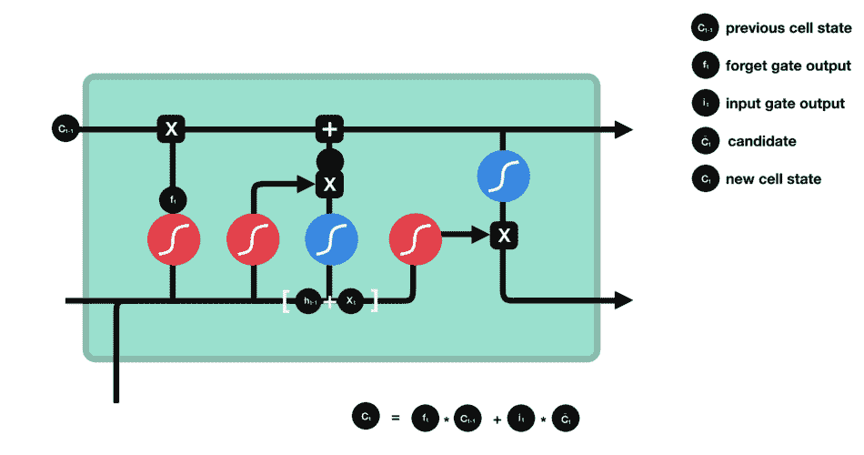

Calculating cell state

## 输出门

最后，我们有输出门。输出门决定下一个隐藏状态应该是什么。请记住，隐藏状态包含以前输入的信息。隐藏状态也用于预测。首先，我们将先前的隐藏状态和当前输入传递给一个 sigmoid 函数。然后，我们将新修改的单元格状态传递给 tanh 函数。我们将双曲正切输出乘以 sigmoid 输出来决定隐藏状态应该携带什么信息。输出是隐藏状态。然后，新的单元状态和新的隐藏被带入下一个时间步骤。

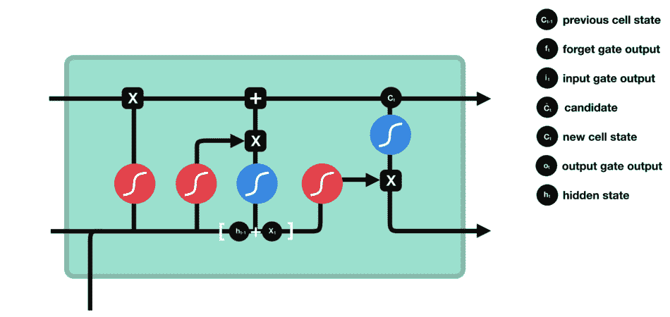

output gate operations

回顾一下,“遗忘之门”决定了哪些内容与之前的步骤相关。输入门决定从当前步骤添加哪些相关信息。输出门决定下一个隐藏状态应该是什么。

## 代码演示

对于那些通过查看代码更好理解的人，这里有一个使用 python 伪代码的例子。

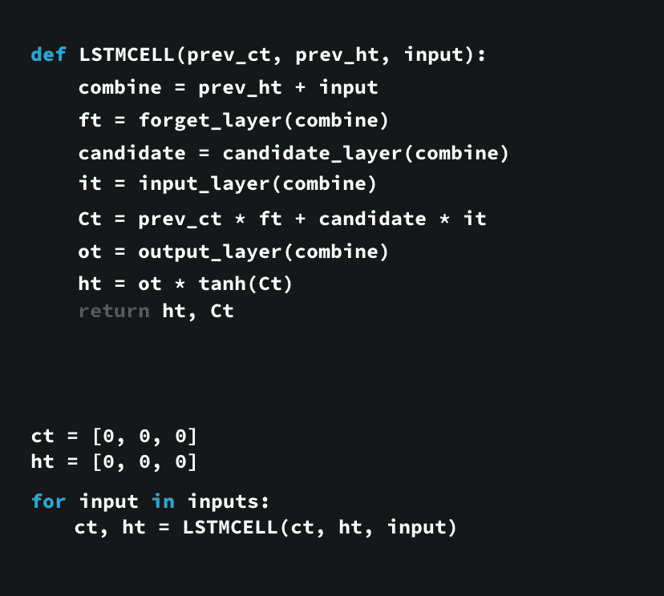

python pseudo code

1.首先，前一个隐藏状态和当前输入被连接起来。我们就叫它*组合*。
2。*合并*把得到的输入到遗忘层。该层移除不相关的数据。
4。使用*组合*创建一个候选层。候选包含可能添加到单元格状态的值。
3。 *Combine* 也把 get 的馈入输入层。这一层决定来自候选的什么数据应该被添加到新的单元状态。
5。在计算了遗忘层、候选层和输入层之后，使用这些向量和先前的像元状态来计算像元状态。
6。然后计算输出。
7。逐点乘以输出和新的单元状态得到新的隐藏状态。

就是这样！LSTM 网络的控制流是一些张量运算和一个 for 循环。您可以使用隐藏状态进行预测。结合所有这些机制，LSTM 可以选择在序列处理过程中记住或忘记哪些相关信息。

# 苏军总参谋部情报总局

现在我们知道了 LSTM 是如何工作的，让我们简单看看 gru。GRU 是新一代的递归神经网络，与 LSTM 非常相似。GRU 摆脱了细胞状态，用隐藏状态来传递信息。它也只有两个门，一个复位门和更新门。

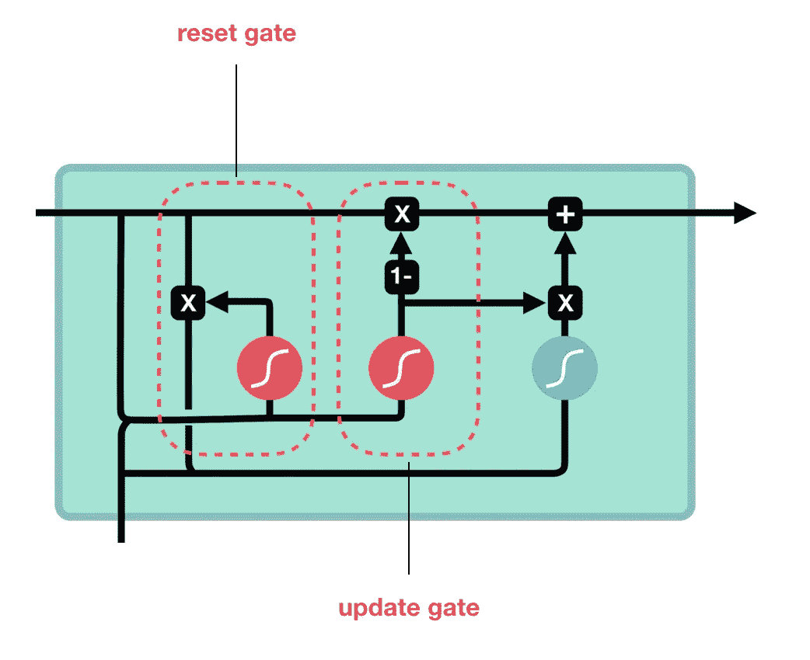

GRU cell and it’s gates

## 更新门

更新门的作用类似于 LSTM 的遗忘和输入门。它决定丢弃什么信息和添加什么新信息。

## 复位门

重置门是另一个用来决定忘记多少过去信息的门。

这是一个 gru。GRU 的张量运算较少；因此，他们比 LSTM 的训练速度要快一些。没有明显的赢家哪一个更好。研究人员和工程师通常尝试两者来确定哪一个更适合他们的用例。

# 原来如此

综上所述，RNN 氏综合症对于处理序列数据进行预测是很好的，但是会受到短期记忆的影响。LSTM 氏症和 GRU 氏症是作为一种利用被称为“门”的机制来减轻短期记忆的方法而产生的。门只是调节流经序列链的信息流的神经网络。LSTM 和 GRU 的被用于先进的深度学习应用，如语音识别、语音合成、自然语言理解等。

如果你有兴趣深入了解，这里有一些很棒的资源链接，可以让你从不同的角度理解 LSTM 和 GRU。这篇文章深受他们的启发。

[http://www . wild ml . com/2015/10/recurrent-neural-network-tutorial-part-4-implementing-a-grul STM-rnn-with-python-and-the ano](http://www.wildml.com/2015/10/recurrent-neural-network-tutorial-part-4-implementing-a-grulstm-rnn-with-python-and-theano/)

http://colah.github.io/posts/2015-08-Understanding-LSTMs/

【https://www.youtube.com/watch?v=WCUNPb-5EYI 

我写这篇文章很开心，所以请在评论中告诉我这是否有帮助，或者你想在下一篇文章中看到什么。一如既往，感谢您的阅读！

查看[michaelphi.com](https://www.michaelphi.com/)了解更多类似的内容。

✍🏽想要更多内容？查看我的博客[***https://www.michaelphi.com***](https://www.michaelphi.com/build-your-own-deep-learning-machine-what-you-need-to-know/)

📺喜欢看基于项目的视频？来看看我的 [**Youtube**](https://www.youtube.com/channel/UCYpBgT4riB-VpsBBBQkblqQ?view_as=subscriber) ！

🥇注册我的 [**电子邮件简讯**](http://eepurl.com/gwy3hj) **，了解最新的文章和视频！**