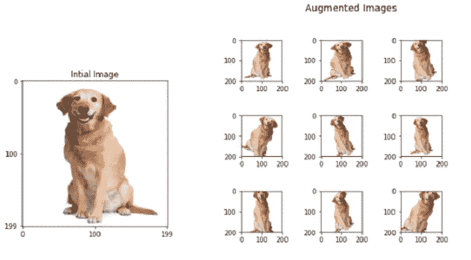
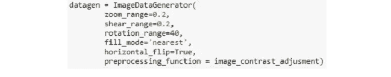
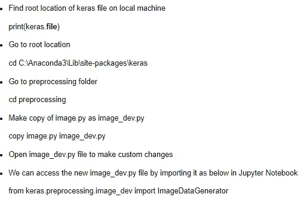
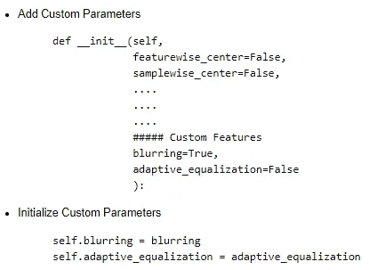
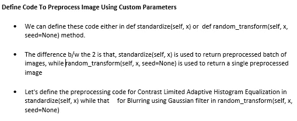
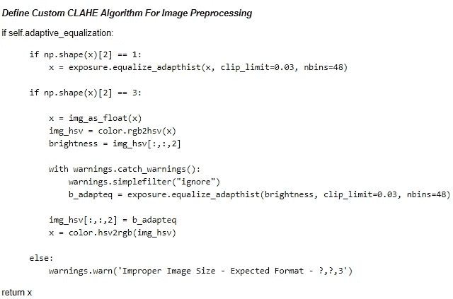
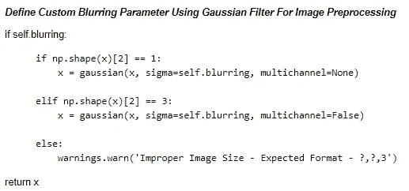
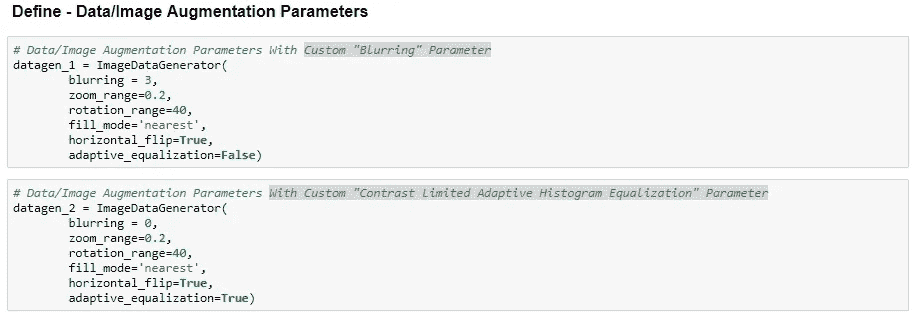
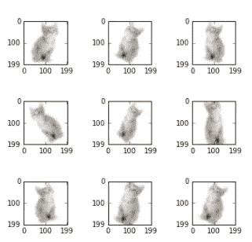
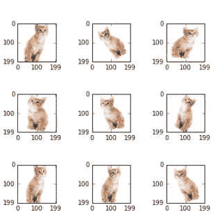

# 自定义图像增强

> 原文：<https://towardsdatascience.com/image-augmentation-14a0aafd0498?source=collection_archive---------4----------------------->

## 图象生成

## 图像增强

图像增强是一种技术，用于人为扩展数据集。当我们得到一个只有很少数据样本的数据集时，这是很有帮助的。在深度学习的情况下，这种情况很糟糕，因为当我们在有限数量的数据样本上训练它时，模型往往会过度拟合。

通常用于增加数据样本计数的图像增强参数是缩放、剪切、旋转、预处理 _ 函数等。这些参数的使用导致在深度学习模型的训练期间生成具有这些属性的图像。使用图像增强生成的图像样本通常会导致现有数据样本集增加近 3 到 4 倍。

在 Keras 中，我们借助一个名为 ImageDataGenerator 的函数来实现图像增强。函数定义的基本概要如下:

Function to Initialize Data Augmentation Parameters

## 自定义图像增强

自定义图像增强我们可能希望在 Keras 中为 ImageDataGenerator 定义我们自己的预处理参数，以便使它成为一个更强大的图像生成 API。我们可以通过更改 Keras image.py 文件来实现这一点。

为了便于理解，最好创建 image.py 的副本，并在副本中进行更改。这是在运行于 Anaconda 环境的 Windows 机器上通过以下步骤实现的:

**Steps to Create Custom Image Augmentation File — image_dev.py**

现在，按照以下步骤添加您希望在 ImageDataGenerator 中看到的自定义参数:

实验结果

**Augmented Images Obtained Using - datagen_1**

**Augmented Images Obtained Using — datagen_2**

源代码

 [## shree 6791/深度学习

### 深度学习——这个知识库由 Shreenidhi Sudhakar 实施的深度学习项目组成。

github.com](https://github.com/shree6791/Deep-Learning/tree/master/CNN/Cats%20and%20Dogs/keras/src)