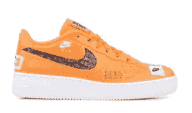
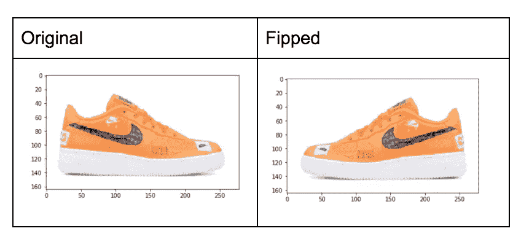
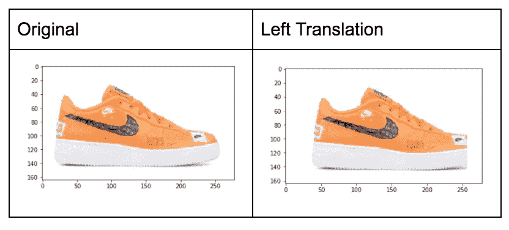
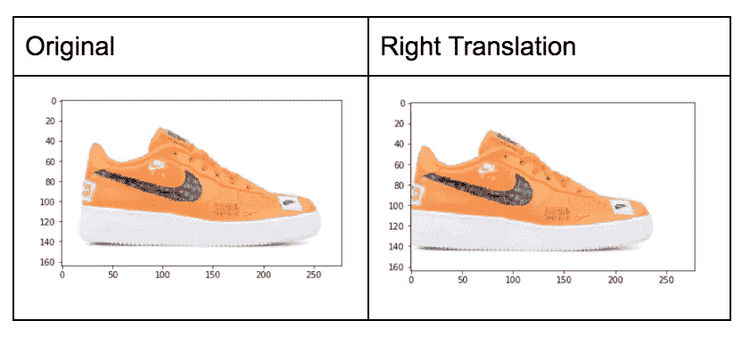
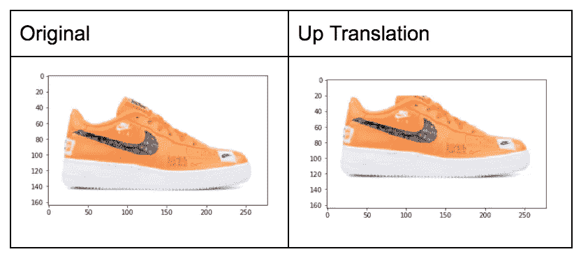
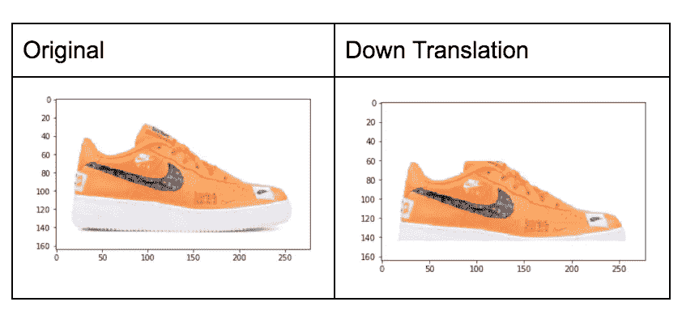
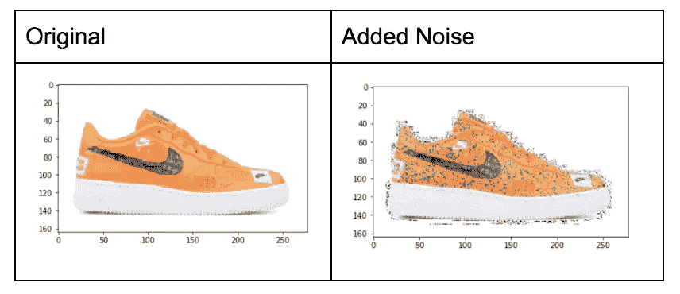
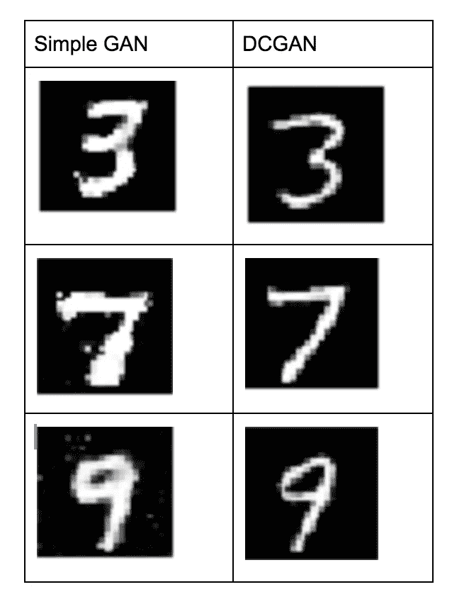

# Python 中的图像增强示例

> 原文：<https://towardsdatascience.com/image-augmentation-examples-in-python-d552c26f2873?source=collection_archive---------4----------------------->

我目前正在进行一项研究，审查图像数据增强的深度和有效性。这项研究的目标是了解如何增加我们的数据集大小，以训练具有有限或少量数据的稳健卷积网络模型。

这项研究需要列出我们能想到的所有图像增强，并列举所有这些组合，以尝试和提高图像分类模型的性能。想到的一些最简单的增强是翻转、平移、旋转、缩放、隔离单独的 r、g、b 颜色通道和添加噪声。更令人兴奋的扩展集中在使用生成对抗网络模型，有时用遗传算法交换生成网络。还提出了一些创造性的方法，例如对图像应用 Instagram 风格的照明过滤器，应用随机区域锐化过滤器，以及基于聚类技术添加平均图像。本文将向您展示如何使用 NumPy 对图像进行放大。

以下是一些增强技术的列表和说明，如果您能想到任何其他方法来增强图像，以提高图像分类器的质量，请留下评论。



Original Image, (Pre-Augmentation)

# 增加

*所有的扩充都是在没有 OpenCV 库的情况下使用 Numpy 完成的*

```
# Image Loading Code used for these examples
from PIL import Image
import numpy as np
import matplotlib.pyplot as pltimg = Image.open('./NIKE.png')
img = np.array(img)
plt.imshow(img)
plt.show()
```

# 轻弹

翻转图像是最流行的图像数据增强方法之一。这主要是由于翻转代码的简单性，以及对于大多数问题来说，翻转图像将为模型增加价值是多么直观。下面的模型可以被认为是看到了一只左脚的鞋子而不是右脚的鞋子，因此，随着数据的增加，该模型对于看到鞋子的潜在变化变得更加稳健。



```
# Flipping images with Numpy
flipped_img = np.fliplr(img)
plt.imshow(flipped_img)
plt.show()
```

# 翻译

很容易想象以检测为目的的分类器的翻译增强的价值。好像这个分类模型试图检测鞋子何时在图像中，何时不在图像中。这些平移将帮助它拾取鞋子，而不用在框架中看到整个鞋子。



```
# Shifting Left
for i in range(HEIGHT, 1, -1):
  for j in range(WIDTH):
     if (i < HEIGHT-20):
       img[j][i] = img[j][i-20]
     elif (i < HEIGHT-1):
       img[j][i] = 0plt.imshow(img)
plt.show()
```



```
# Shifting Right
for j in range(WIDTH):
  for i in range(HEIGHT):
    if (i < HEIGHT-20):
      img[j][i] = img[j][i+20]plt.imshow(img)
plt.show()
```



```
# Shifting Up
for j in range(WIDTH):
  for i in range(HEIGHT):
    if (j < WIDTH - 20 and j > 20):
      img[j][i] = img[j+20][i]
    else:
      img[j][i] = 0plt.imshow(img)
plt.show()
```



```
#Shifting Down
for j in range(WIDTH, 1, -1):
  for i in range(278):
    if (j < 144 and j > 20):
      img[j][i] = img[j-20][i]plt.imshow(img)
plt.show()
```

# **噪音**

噪声是一种有趣的增强技术，我开始越来越熟悉它。我看过很多关于对抗性训练的有趣论文，在这些论文中，你可以向一幅图像中加入一些噪声，结果模型将无法对其进行正确分类。我仍然在寻找产生比下图更好的噪音的方法。添加噪波可能有助于消除光照失真，并使模型总体上更加健壮。



```
# ADDING NOISE
noise = np.random.randint(5, size = (164, 278, 4), dtype = 'uint8')

for i in range(WIDTH):
    for j in range(HEIGHT):
        for k in range(DEPTH):
            if (img[i][j][k] != 255):
                img[i][j][k] += noise[i][j][k]
plt.imshow(img)
plt.show()
```

# **甘斯:**

我对使用生成性对抗网络进行数据增强的研究产生了浓厚的兴趣，下面是我使用 MNIST 数据集制作的一些图像。



从上面的图像中我们可以看出，它们看起来确实像 3、7 和 9。我目前在扩展网络架构以支持运动鞋的 300x300x3 尺寸输出(相比于 28x28x1 MNIST 数字)时遇到了一些问题。然而，我对这项研究感到非常兴奋，并期待着继续下去！

感谢您阅读本文，希望您现在知道如何实现基本的数据扩充来改进您的分类模型！