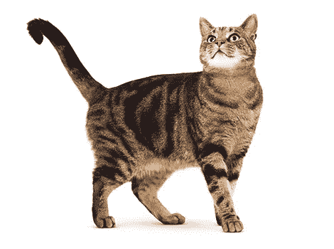
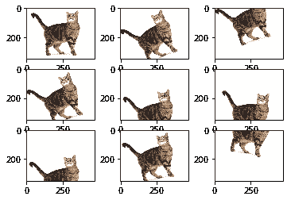
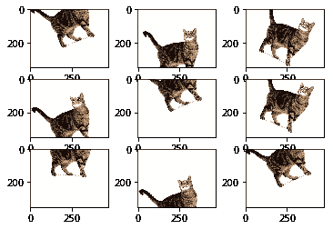
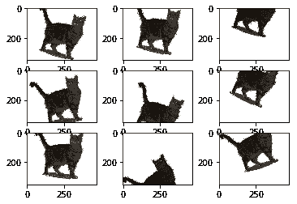
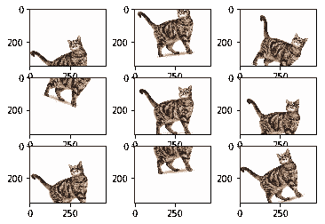

# 用于深度学习的图像增强

> 原文：<https://towardsdatascience.com/image-augmentation-for-deep-learning-histogram-equalization-a71387f609b2?source=collection_archive---------2----------------------->

深度网络需要大量的训练数据来实现良好的性能。为了使用非常少的训练数据建立强大的图像分类器，通常需要图像增强来提高深度网络的性能。**图像增强**通过不同的处理方式或多种处理方式的组合，如随机旋转、平移、剪切、翻转等，人工创建训练图像。

# 图像数据发生器

使用 Keras 中的 [ImageDataGenerator](https://keras.io/preprocessing/image/) API 可以轻松创建一个增强图像生成器。`ImageDataGenerator`通过实时数据增强生成批量图像数据。创建和配置`ImageDataGenerator`以及用增强图像训练深度神经网络的最基本代码如下。

```
datagen = ImageDataGenerator()
datagen.fit(train)
X_batch, y_batch = datagen.flow(X_train, y_train, batch_size=batch_size)
model.fit_generator(datagen, samples_per_epoch=len(train), epochs=epochs)
```

我们可以用下面的代码来创建具有所需属性的增强图像。在我们的例子中，下面的数据生成器生成一批 9 个增强图像，旋转 30 度，水平移动 0.5。

```
datagen = ImageDataGenerator(rotation_range=30, horizontal_flip=0.5)
datagen.fit(img)i=0
for img_batch in datagen.flow(img, batch_size=9):
    for img in img_batch:
        plt.subplot(330 + 1 + i)
        plt.imshow(img)
        i=i+1    
    if i >= batch_size:
        break
```



Original Image and Augmented Images

# 直方图均衡

除了 Keras 中的`ImageDataGenerator`类提供的标准数据扩充技术，我们还可以使用自定义函数来生成扩充图像。例如，您可能想要使用对比度拉伸来调整图像的对比度。**对比度拉伸**是一种简单的图像处理技术，通过将图像的亮度值范围重新缩放(“拉伸”)到所需的值范围来增强对比度。

**直方图均衡**是另一种图像处理技术，使用图像强度直方图增加图像的整体对比度。均衡图像具有线性累积分布函数。这种方法不需要参数，但有时会产生看起来不自然的图像。

另一种方法是**自适应直方图均衡化** (AHE)，它通过计算对应于图像不同部分的几个直方图来提高图像的局部对比度(不同于仅使用一个直方图来调整全局对比度的普通直方图均衡化)，并将它们用于局部对比度调整。然而，AHE 倾向于过度放大图像中相对均匀区域的噪声。

**对比度受限的自适应直方图均衡** (CLAHE)是为了防止 AHE 导致的噪声过度放大而开发的。简言之，它通过在计算累积分布函数之前将直方图限幅在预定值来限制 AHE 的对比度增强。

为了在 Keras 中实现用于增强的定制预处理函数，我们首先定义我们的定制函数，并将其作为参数传递给`ImageDataGenerator`。例如，我们可以使用下面的代码实现 AHE。

```
def AHE(img):
    img_adapteq = exposure.equalize_adapthist(img, clip_limit=0.03)
    return img_adapteqdatagen = ImageDataGenerator(rotation_range=30, horizontal_flip=0.5, preprocessing_function=AHE)
```



Augmented Images using Contrast Stretching (left), Histogram Equalization (middle) and Adaptive Histogram Equalization (right)

[源代码](https://github.com/sukilau/Ziff-deep-learning/blob/master/2-CIFAR10-data-generator/CIFAR10-DataGenerator.ipynb)

## 参考

*   [使用 Keras 进行深度学习的图像增强](http://machinelearningmastery.com/image-augmentation-deep-learning-keras/)
*   [使用非常少的数据构建强大的图像分类模型](https://blog.keras.io/building-powerful-image-classification-models-using-very-little-data.html)