# 基于 Keras 和直方图均衡的深度学习图像增强

> 原文：<https://towardsdatascience.com/image-augmentation-for-deep-learning-using-keras-and-histogram-equalization-9329f6ae5085?source=collection_archive---------0----------------------->

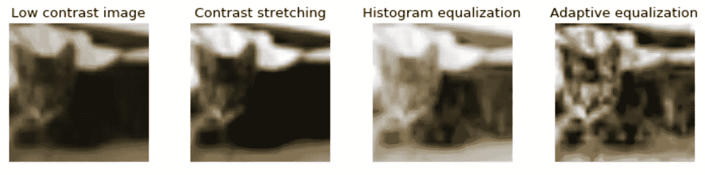

在本帖中，我们将回顾:

*   图像增强:它是什么？为什么重要？
*   Keras:如何使用它进行基本的图像增强。
*   直方图均衡化:它是什么？怎么有用？
*   实现直方图均衡化技术:修改 keras .预处理 image.py 文件的一种方法。

# 图像增强:它是什么？为什么重要？

深度神经网络，尤其是[卷积神经网络(CNN)](https://en.wikipedia.org/wiki/Convolutional_neural_network)，尤其擅长图像分类任务。最先进的 CNN 甚至被证明在图像识别方面超过了人类的表现。


[https://www.eff.org/ai/metrics](https://www.eff.org/ai/metrics)

然而，正如我们从杨健先生在热门电视节目*【硅谷】*[(该应用程序现已在 app store 上提供)](https://itunes.apple.com/us/app/not-hotdog/id1212457521?mt=8)中的“热狗，不是热狗”食物识别应用中了解到的那样，收集图像作为训练数据既昂贵又耗时。

如果你不熟悉电视节目《硅谷》,请注意以下视频中的语言是 NSFW 语:

为了对抗收集成千上万训练图像的高费用，已经开发了图像增强，以便从现有数据集生成训练数据。图像增强是获取已经在训练数据集中的图像并操纵它们以创建同一图像的许多改变版本的过程。这不仅提供了更多的图像进行训练，而且还可以帮助我们的分类器暴露在更广泛的光照和颜色情况下，从而使我们的分类器更加鲁棒。下面是一些来自 [imgaug](https://github.com/aleju/imgaug) 库的不同扩充的例子。

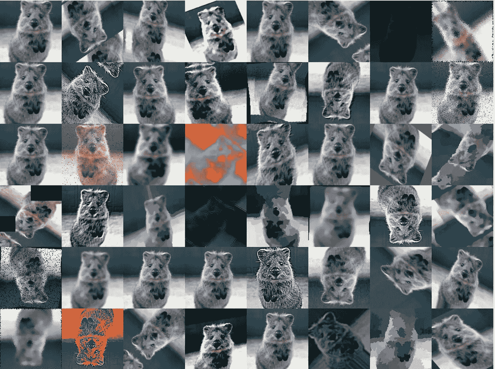

[https://github.com/aleju/imgaug](https://github.com/aleju/imgaug)

# 使用 Keras 进行基本图像增强

有许多方法可以对图像进行预处理。在这篇文章中，我们将回顾一些最常见的开箱即用的方法，这些方法是 [keras 深度学习库](https://github.com/fchollet/keras)为增强图像提供的，然后我们将展示如何改变[keras . preprocessing image . py](https://github.com/fchollet/keras/blob/master/keras/preprocessing/image.py)文件，以便启用直方图均衡化方法。我们将使用 keras 附带的 cifar10 数据集。然而，我们将只使用来自数据集中的猫和狗的图像，以便保持任务足够小，可以在 CPU 上执行——如果您想继续的话。你可以从[这篇文章中查看 IPython 笔记本的源代码。](https://github.com/ryanleeallred/Image_Augmentation/blob/master/Histogram_Modification.ipynb)

## 加载和格式化数据

我们要做的第一件事是加载 cifar10 数据集并格式化图像，以便为 CNN 做准备。我们还将浏览一些图片，以确保数据已经正确加载。

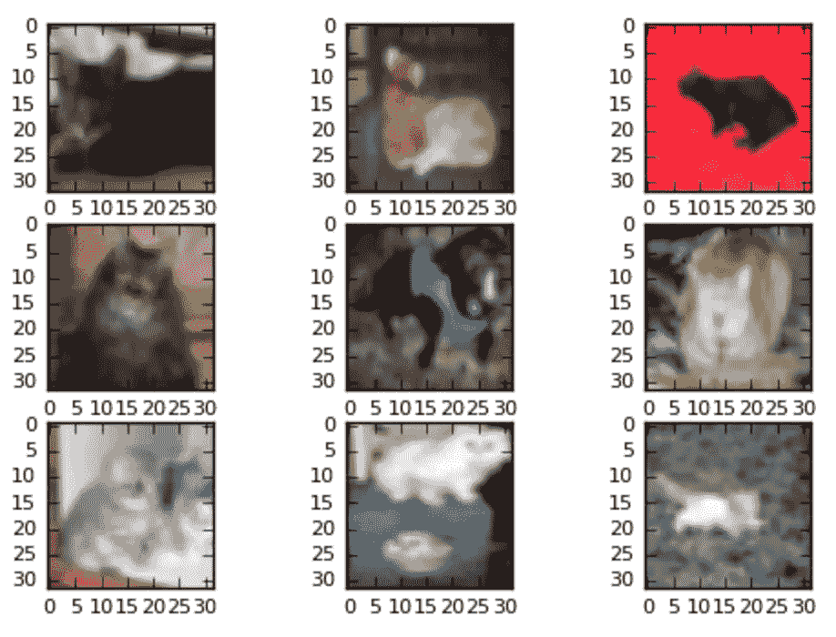

cifar10 图像只有 32 x 32 像素，因此在这里放大时看起来有颗粒，但 CNN 不知道它有颗粒，它看到的只是数据。

## 从 ImageDataGenerator()创建图像生成器

用 keras 增加我们的图像数据非常简单。杰森·布朗利在这方面提供了很棒的教程。首先，我们需要通过调用`ImageDataGenerator()`函数创建一个图像生成器，并向它传递一个参数列表，描述我们希望它对图像执行的更改。然后，我们将调用图像生成器上的`fit()`函数，它将把更改一批一批地应用到图像上。默认情况下，修改将被随机应用，所以不是每个图像每次都会改变。您还可以使用`keras.preprocessing`将增强的图像文件导出到一个文件夹中，以便建立一个巨大的修改图像数据集。

我们将在这里看一些视觉上更有趣的增强。所有可能的`ImageDataGenerator()`参数的描述以及`keras.preprocessing`中可用的其他方法列表可在 [keras 文档中找到。](https://keras.io/preprocessing/image/)

## 随机旋转图像

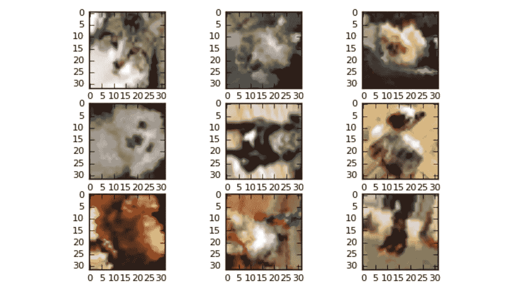

## 垂直翻转图像

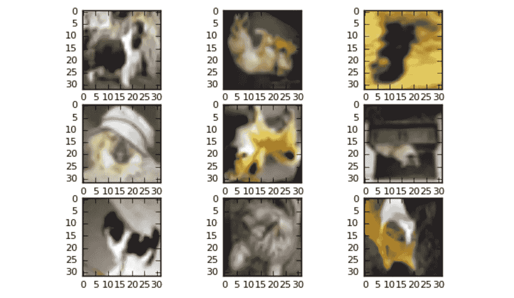

水平翻转图像也是为分类器生成更多数据的经典方法之一。这很容易做到，并且可能对这个数据集更有意义，但是，我已经省略了代码和图像，因为在没有看到原始图像的情况下，没有办法知道狗或猫的图像是否被水平翻转。

## 将图像垂直或水平移动 20%

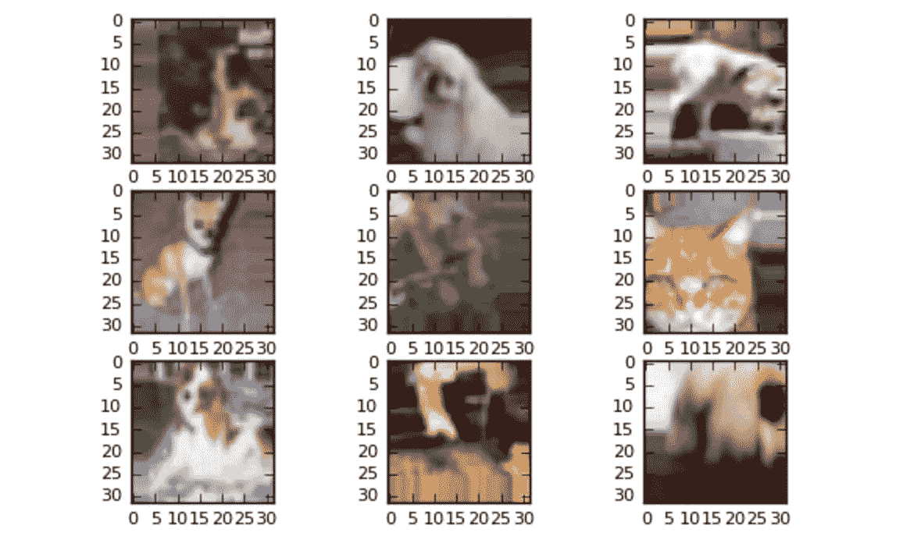

# 直方图均衡技术

直方图均衡化是采用低对比度图像并增加图像相对高点和低点之间的对比度的过程，以便带出阴影中的细微差异并创建更高对比度的图像。结果可能是惊人的，尤其是对于灰度图像。以下是一些例子:

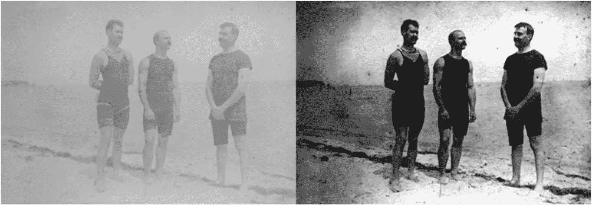

[https://www.bruzed.com/2009/10/contrast-stretching-and-histogram-equalization/](https://www.bruzed.com/2009/10/contrast-stretching-and-histogram-equalization/)

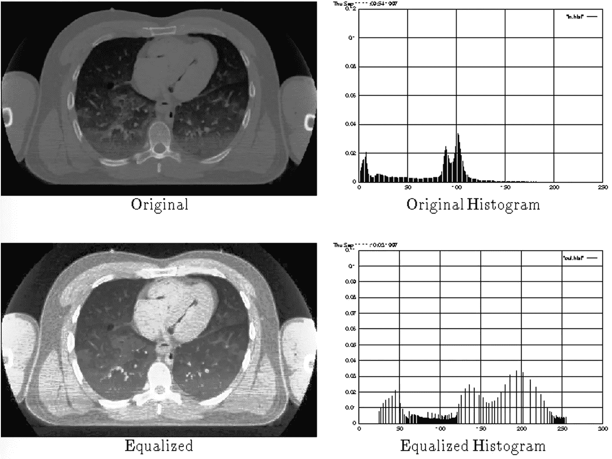

[http://www-classes.usc.edu/engr/ee-s/569/qa2/Histogram%20Equalization.htm](http://www-classes.usc.edu/engr/ee-s/569/qa2/Histogram%20Equalization.htm)

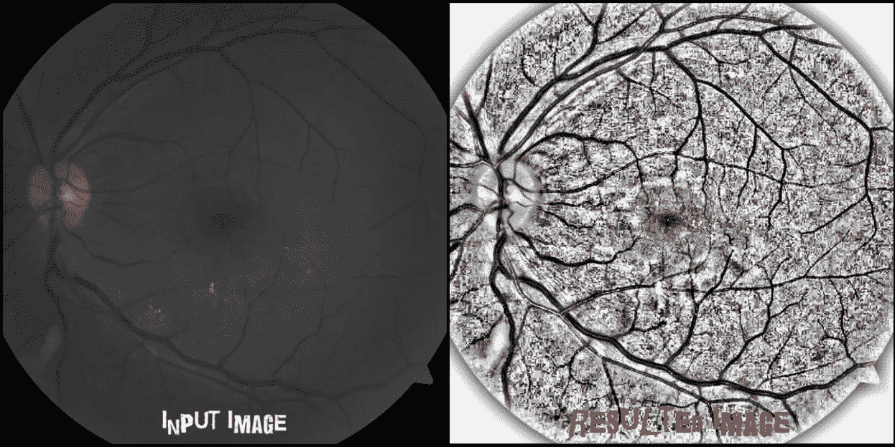

[https://studentathome.wordpress.com/2013/03/27/local-histogram-equalization/](https://studentathome.wordpress.com/2013/03/27/local-histogram-equalization/)

在本帖中，我们将探讨三种提高图像对比度的图像增强技术。这些方法有时也被称为“[直方图拉伸](http://homepages.inf.ed.ac.uk/rbf/HIPR2/stretch.htm)”，因为它们采用像素强度的分布，并拉伸该分布以适应更大范围的值，从而增加图像最亮和最暗部分之间的对比度。

## 直方图均衡

直方图均衡化通过检测图像中像素密度的分布并将这些像素密度绘制在直方图上来增加图像的对比度。然后分析该直方图的分布，如果存在当前未被利用的像素亮度范围，则直方图被“拉伸”以覆盖这些范围，然后被“[反向投影](https://en.wikipedia.org/wiki/Histogram_equalization#Back_projection)到图像上以增加图像的整体对比度。

## 对比度扩展

对比度拉伸采用的方法是分析图像中像素密度的分布，然后[“重新缩放图像，以包含第二和第 98 个百分点内的所有强度。”](http://scikit-image.org/docs/0.9.x/auto_examples/plot_equalize.html)

## 自适应均衡

自适应均衡不同于常规直方图均衡，因为计算了几个不同的直方图，每个直方图对应于图像的不同部分；然而，它[有在其他不感兴趣的部分过度放大噪声](https://en.wikipedia.org/wiki/Adaptive_histogram_equalization)的趋势。

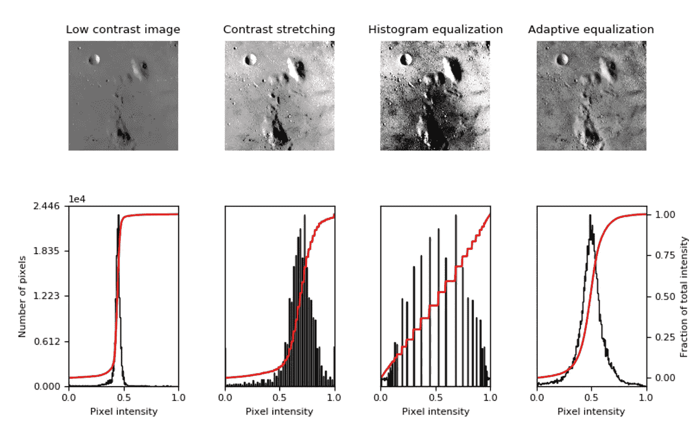

以下代码来自于 [sci-kit image library 的](http://scikit-image.org/) docs，并已被修改以在我们的 cifar10 数据集的第一个图像上执行上述三个增强。首先，我们将从 sci-kit image (skimage)库中导入必要的模块，然后修改来自 [sci-kit image 文档](http://scikit-image.org/docs/dev/auto_examples/color_exposure/plot_equalize.html)的代码，以查看数据集的第一个图像的增强。

以下是来自 cifar10 数据集的低对比度猫的修改图像。如您所见，结果不如低对比度灰度图像那样引人注目，但仍有助于提高图像质量。

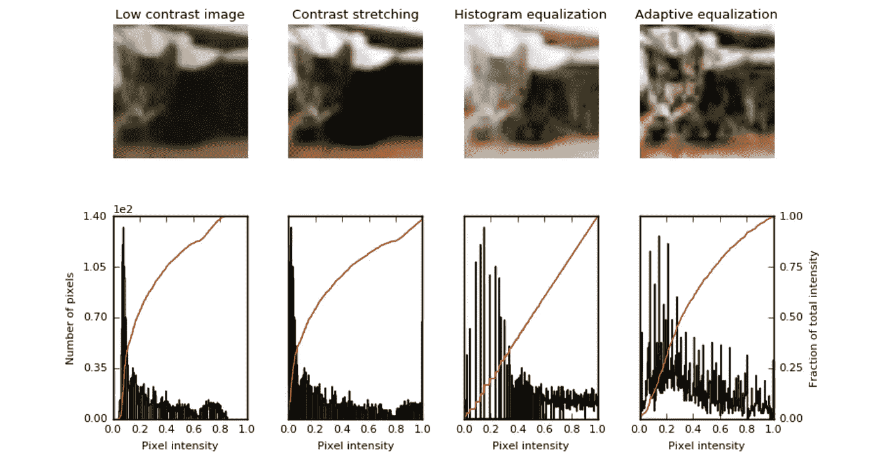

# 修改 keras .预处理以启用直方图均衡化技术。

既然我们已经成功地修改了来自 cifar10 数据集的一幅图像，我们将演示如何修改 keras.preprocessing image.py 文件，以便执行这些不同的直方图修改技术，就像我们使用`ImageDataGenerator()`对现成的 keras 增强所做的那样。为了实现这一功能，我们将遵循以下一般步骤:

## 概观

*   在您自己的机器上找到 keras.preprocessing image.py 文件。
*   将 image.py 文件复制到您的文件或笔记本中。
*   将每个均衡技术的一个属性添加到 DataImageGenerator() init 函数中。
*   将 IF 语句子句添加到 random_transform 方法中，以便在我们调用`datagen.fit()`时实现扩充。

对 keras.preprocessing 的`image.py`文件进行修改的最简单的方法之一就是简单地将其内容复制并粘贴到我们的代码中。这将消除导入它的需要。你可以在这里查看 github [上`image.py`文件的内容。](https://github.com/fchollet/keras/blob/master/keras/preprocessing/image.py)然而，为了确保你抓取的文件版本与你之前导入的文件版本相同，最好抓取你机器上已经存在的`image.py`文件。运行`print(keras.__file__)`将打印出机器上 keras 库的路径。该路径(对于 mac 用户)可能类似于:

```
/usr/local/lib/python3.5/dist-packages/keras/__init__.pyc
```

这为我们提供了本地机器上 keras 的路径。继续导航到那里，然后进入`preprocessing`文件夹。在`preprocessing`里面你会看到`image.py`文件。然后，您可以将其内容复制到您的代码中。这个文件很长，但是对于初学者来说，这可能是对它进行修改的最简单的方法之一。

## 编辑`image.py`

在 image.py 的顶部，你可以注释掉这一行:`from ..import backend as K`，如果你已经在上面包含了它。

此时，还要仔细检查以确保您导入了必要的 scikit-image 模块，以便复制的`image.py`可以看到它们。

```
from skimage import data, img_as_float
from skimage import exposure
```

我们现在需要在 ImageDataGenerator 类的`__init__` 方法中添加六行代码，这样它就有三个属性来表示我们将要添加的增强类型。下面的代码是从我当前的 image.py 复制过来的，旁边有`#####`的那几行是我添加的。

`random_transform()`函数(如下)响应我们传递给`ImageDataGenerator()`函数的参数。如果我们已经将`contrast_stretching`、`adaptive_equalization`或`histogram_equalization`参数设置为`True`，当我们调用`ImageDataGenerator()`(就像我们对其他图像增强所做的那样)`random_transform()`将应用所需的图像增强。

现在我们已经有了所有必要的代码，可以调用 ImageDataGenerator()来执行直方图修改技术。如果我们将这三个值都设置为`True`，下面是一些图像的样子。

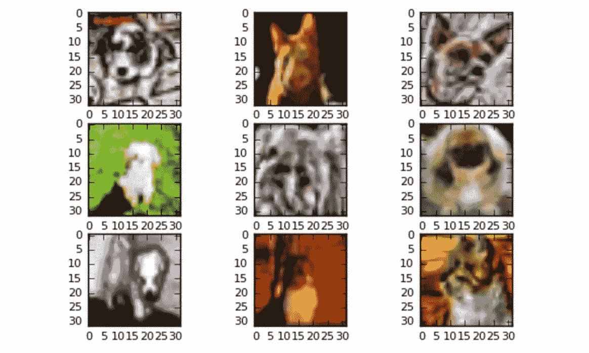

对于任何给定的数据集，我不建议将它们中的一个以上设置为`True`。请确保使用您的特定数据集进行实验，以了解哪些内容有助于提高分类器的准确性。对于彩色图像，我发现对比度拉伸通常比直方图修改或自适应均衡获得更好的结果。

## 训练和验证你的 Keras CNN

最后一步是训练我们的 CNN，并使用`model.fit_generator()`验证模型，以便在增强图像上训练和验证我们的神经网络。

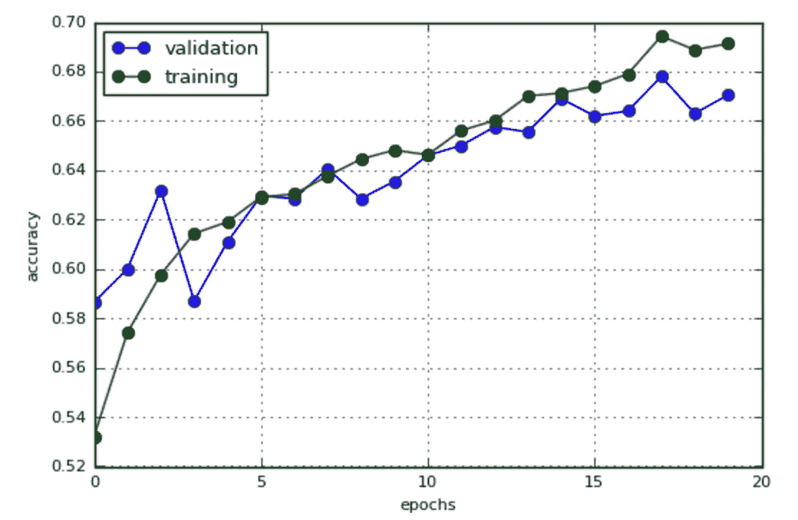