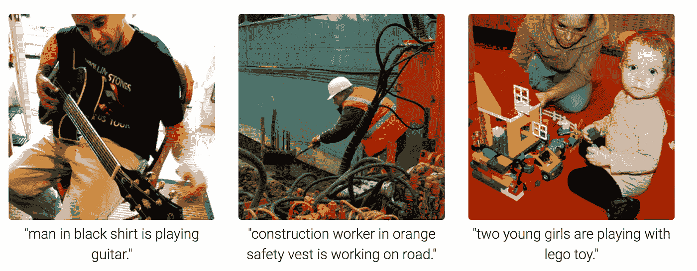
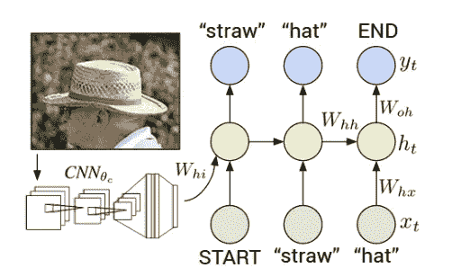

# 深度学习中的图像字幕

> 原文：<https://towardsdatascience.com/image-captioning-in-deep-learning-9cd23fb4d8d2?source=collection_archive---------2----------------------->

## 什么是图像字幕？

**图像字幕**是生成图像文字描述的过程。它同时使用了**自然语言处理**和**计算机视觉**来生成字幕。

Image Captioning

数据集将采用[ **图像** → **标题**的形式。数据集由输入图像及其相应的输出标题组成。

# **网络拓扑**

## 编码器

卷积神经网络(CNN)可以被认为是一个编码器。输入图像交给 CNN 提取特征。CNN 的最后一个隐藏状态连接到解码器。

## **解码器**

解码器是一个递归神经网络(RNN ),它在单词级别进行语言建模。第一时间步接收编码器的编码输出和<start>矢量。</start>

# **培训**

CNN(编码器)最后一个隐藏状态的输出被提供给解码器的第一个时间步长。我们设置 **x1** = **<开始>** 向量和期望的标号 **y1** = **序列中的第一个字**。类似地，我们设置第一个单词的 **x2** = **单词向量，并期望网络预测第二个单词**。最后，在最后一步， **xT** = **最后一个字**，目标标签**yT**=**<END>**token。****

****在训练过程中，即使解码器之前出错，也会在每个时间步向解码器提供正确的输入。****

# ****测试****

****图像表示**被提供给解码器的第一时间步。设置 **x1** = **<开始>** 向量，计算第一个字 **y1** 的分布。我们从分布中抽取一个单词(或者挑选 argmax)，将其嵌入向量设为 **x2** ，重复这个过程，直到生成 **< END >** token。**

****在测试期间，解码器在时间 t 的输出被反馈，并成为解码器在时间 t+1 的输入****

# ****数据集****

*   **[语境中的常见对象(COCO)](http://mscoco.org/dataset/#overview) 。超过 120，000 张图片和描述的集合**
*   **[Flickr 8K](http://nlp.cs.illinois.edu/HockenmaierGroup/8k-pictures.html) 。从 flickr.com 收集了八千张描述过的图片。**
*   **[Flickr 30K](http://shannon.cs.illinois.edu/DenotationGraph/) 。收集了 3 万张来自 flickr.com 的图片。**
*   **[探索图像字幕数据集](http://sidgan.me/technical/2016/01/09/Exploring-Datasets)，2016 年**