# 使用 Keras 的图像字幕

> 原文：<https://towardsdatascience.com/image-captioning-with-keras-teaching-computers-to-describe-pictures-c88a46a311b8?source=collection_archive---------0----------------------->

## 教计算机描述图片

# 目录:

1.  介绍
2.  动机
3.  先决条件
4.  数据收集
5.  理解数据
6.  数据清理
7.  加载训练集
8.  数据预处理—图像
9.  数据预处理—标题
10.  使用生成器功能准备数据
11.  单词嵌入
12.  模型架构
13.  推理
14.  估价
15.  结论和未来工作
16.  参考

# **1。简介**

在下图中你看到了什么？


Can you write a caption?

有些人可能会说“**草地上的白狗**”，有些人可能会说“**带褐色斑点的白狗**”，还有一些人可能会说“**草地上的狗和一些粉红色的花**”。

毫无疑问，所有这些说明都与这张图片相关，可能还有其他一些说明。但是我想说的是。对我们人类来说，只是看一眼图片，然后用合适的语言描述它是如此容易。即使是一个 5 岁的孩子也能轻而易举地做到。

但是，你能编写一个将图像作为输入并产生相关标题作为输出的计算机程序吗？

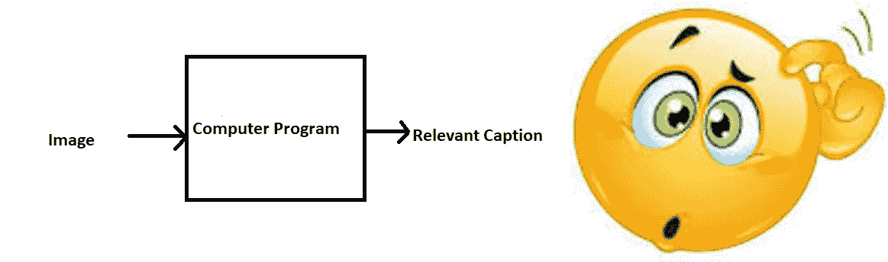

The Problem

就在深度神经网络最近发展之前，这个问题甚至是计算机视觉领域最先进的研究人员都无法想象的。但是随着深度学习的出现，如果我们有了所需的数据集，这个问题就可以很容易地解决。

Andrej Karapathy 在斯坦福大学[1]的博士论文中很好地研究了这个问题，他现在也是特斯拉的 AI 总监。

这篇博客文章的目的是解释(用尽可能简单的话)如何使用深度学习来解决为给定图像生成字幕的问题，因此得名**图像字幕。**

为了更好地了解这个问题，我强烈建议使用这个由微软创建的最先进的系统，名为 [**字幕机器人**](https://www.captionbot.ai/) 。只需转到此链接，尝试上传您想要的任何图片；这个系统会为它生成一个标题。

# 2.动机

我们必须首先理解这个问题对现实世界的场景有多重要。让我们看看这个问题的解决方案非常有用的几个应用。

*   自动驾驶汽车——自动驾驶是最大的挑战之一，如果我们能够适当地描述汽车周围的场景，它可以促进自动驾驶系统的发展。
*   帮助盲人——我们可以为盲人创造一种产品，引导他们在没有他人帮助的情况下上路。我们可以先将场景转换成文本，然后将文本转换成声音。两者现在都是深度学习的著名应用。参考这个 [**链接**](https://www.youtube.com/watch?v=rLyF4XQLwr0) ，它展示了 Nvidia research 如何试图创造这样一个产品。
*   今天，闭路电视摄像头无处不在，但随着观看世界，如果我们也可以生成相关的字幕，那么我们就可以在某个地方发生恶意活动时发出警报。这可能有助于减少一些犯罪和/或事故。
*   自动字幕可以帮助，使谷歌图片搜索像谷歌搜索一样好，因为然后每个图像可以首先转换成标题，然后可以根据标题进行搜索。

# **3。**先决条件

这篇文章假设读者熟悉基本的深度学习概念，如多层感知器、卷积神经网络、递归神经网络、迁移学习、梯度下降、反向传播、过拟合、概率、文本处理、Python 语法和数据结构、Keras 库等。

# 4.数据收集

这个问题有很多开源数据集可用，像 Flickr 8k(包含 8k 张图片)、Flickr 30k(包含 30k 张图片)、MS COCO(包含 180k 张图片)等。

但是出于这个案例研究的目的，我使用了 Flickr 8k 数据集，您可以通过填写伊利诺伊大学香槟分校提供的这个 [**表格**](https://forms.illinois.edu/sec/1713398) 来下载该数据集。此外，用大量图像训练模型在不是非常高端的 PC/膝上型电脑的系统上可能是不可行的。

这个数据集包含 8000 个图像，每个图像有 5 个标题(正如我们在简介部分已经看到的，一个图像可以有多个标题，所有标题同时相关)。

这些图像分为以下两部分:

*   训练集— 6000 幅图像
*   开发集— 1000 个图像
*   测试集— 1000 幅图像

# 5.理解数据

如果您已经从我提供的链接下载了数据，那么，除了图像之外，您还将获得一些与图像相关的文本文件。其中一个文件是“Flickr8k.token.txt ”,它包含每张图片的名称及其 5 个标题。我们可以这样阅读这个文件:

```
# Below is the path for the file "Flickr8k.token.txt" on your disk
filename = "/dataset/TextFiles/Flickr8k.token.txt"
file = open(filename, 'r')
doc = file.read()
```

该文本文件如下所示:

Sample Text File

因此每行包含 #i ，其中 0≤i≤4

即图像的名称、标题号(0 到 4)和实际标题。

现在，我们创建一个名为“descriptions”的字典，它包含图像的名称(没有。jpg 扩展名)作为键，对应图像的 5 个标题的列表作为值。

例如，参考上面的屏幕截图，字典将如下所示:

```
descriptions['101654506_8eb26cfb60'] = ['A brown and white dog is running through the snow .', 'A dog is running in the snow', 'A dog running through snow .', 'a white and brown dog is running through a snow covered field .', 'The white and brown dog is running over the surface of the snow .']
```

# 6.数据清理

当我们处理文本时，我们通常会执行一些基本的清理，如将所有单词小写(否则“hello”和“Hello”将被视为两个独立的单词)，删除特殊标记(如“%”、“$”、“#”等)。)，删除包含数字的单词(如“hey199”等)。).

以下代码执行这些基本的清理步骤:

Code to perform Data Cleaning

创建在数据集中所有 8000*5(即 40000)个图像标题(**语料库**)中出现的所有唯一单词的词汇表；

```
vocabulary = set()
for key in descriptions.keys():
    [vocabulary.update(d.split()) for d in descriptions[key]]
print('Original Vocabulary Size: %d' % len(vocabulary))
Original Vocabulary Size: 8763
```

这意味着在所有 40000 个图片说明中，我们有 8763 个独特的单词。我们将所有这些说明连同它们的图像名称一起写入一个新文件，即“*descriptions . txt”*，并将其保存在磁盘上。

然而，如果我们仔细想想，这些词中有许多会出现很少次，比如说 1 次、2 次或 3 次。由于我们正在创建一个预测模型，我们不希望所有的单词都出现在我们的词汇表中，而是更有可能出现或更常见的单词。这有助于模型变得对异常值更加**稳健**，并减少错误。

因此，我们只考虑那些在整个语料库中至少出现 10 次的单词。这方面的代码如下:

Code to retain only those words which occur at least 10 times in the corpus

所以现在我们的词汇中只有 1651 个独特的单词。然而，我们将附加 0(零填充将在后面解释)，因此总字数= 1651+1 =**1652**(0 的一个索引)。

# 7.加载训练集

文本文件“Flickr_8k.trainImages.txt”包含属于训练集的图像的名称。所以我们把这些名字加载到一个列表“train”中。

```
filename = 'dataset/TextFiles/Flickr_8k.trainImages.txt'
doc = load_doc(filename)
train = list()
for line in doc.split('\n'):
    identifier = line.split('.')[0]
    train.append(identifier)
print('Dataset: %d' % len(train))
Dataset: 6000
```

因此，我们在名为“train”的列表中分离了 6000 个训练图像。

现在，我们从 Python 字典“train_descriptions”中的“descriptions.txt”(保存在硬盘上)加载这些图像的描述。

然而，当我们加载它们时，我们将在每个标题中添加两个标记，如下所示(重要性稍后解释):

**startseq** ' - >这是一个开始序列标记，将被添加到每个字幕的开头。

**endseq** ' - >这是一个结束序列标记，将被添加到每个标题的末尾。

# 8.数据预处理—图像

图像只是我们模型的输入(X)。您可能已经知道，模型的任何输入都必须以向量的形式给出。

我们需要将每张图像转换成固定大小的向量，然后将其作为神经网络的输入。为此，我们通过使用 Google Research 创建的 InceptionV3 模型(卷积神经网络)选择了**迁移学习**。

该模型在 Imagenet 数据集上进行训练，以对 1000 个不同类别的图像执行图像分类。然而，我们在这里的目的不是对图像进行分类，而是获得每幅图像的固定长度的信息向量。这个过程被称为**自动特征工程。**

因此，我们只是从模型中移除最后一个 softmax 层，并为每个图像提取 2048 长度向量(**瓶颈特征**)，如下所示:

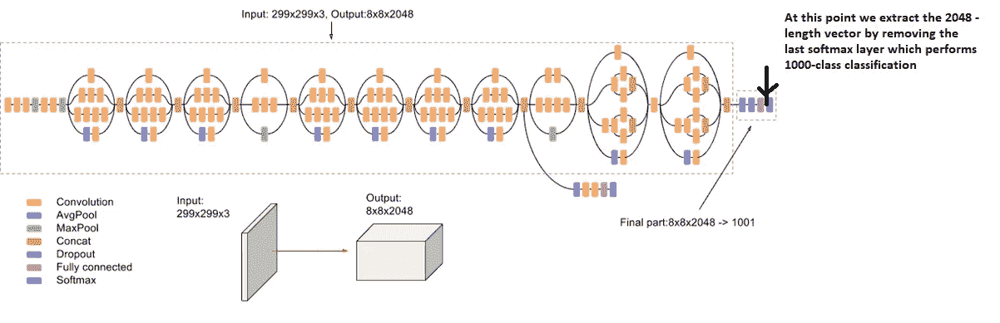

Feature Vector Extraction (Feature Engineering) from InceptionV3

这方面的代码如下:

```
# Get the InceptionV3 model trained on imagenet data
model = InceptionV3(weights='imagenet')
# Remove the last layer (output softmax layer) from the inception v3
model_new = Model(model.input, model.layers[-2].output)
```

现在，我们将每个图像传递给该模型，以获得相应的 2048 长度的特征向量，如下所示:

```
# Convert all the images to size 299x299 as expected by the
# inception v3 model
img = image.load_img(image_path, target_size=(299, 299))
# Convert PIL image to numpy array of 3-dimensions
x = image.img_to_array(img)
# Add one more dimension
x = np.expand_dims(x, axis=0)
# preprocess images using preprocess_input() from inception module
x = preprocess_input(x)
# reshape from (1, 2048) to (2048, )
x = np.reshape(x, x.shape[1])
```

我们将所有的瓶颈训练特征保存在一个 Python 字典中，并使用 Pickle 文件保存在磁盘上，即“ **encoded_train_images.pkl** ”，其关键字是图像名，值是对应的 2048 长度特征向量。

**注意:**如果您没有高端 PC/笔记本电脑，这个过程可能需要一两个小时。

类似地，我们对所有的测试图像进行编码，并将它们保存在文件“ **encoded_test_images.pkl** ”中。

# 9.数据预处理—标题

我们必须注意，字幕是我们想要预测的东西。因此在训练期间，字幕将是模型正在学习预测的目标变量(Y)。

但是对给定图像的整个字幕的预测不会立即发生。我们将逐字预测字幕**。因此，我们需要将每个单词编码成一个固定大小的向量。然而，这一部分将在我们稍后查看模型设计时看到，但现在我们将创建两个 Python 字典，即“wordtoix”(发音—单词到索引)和“ixtoword”(发音—单词到索引)。**

**简单地说，我们将用一个整数(索引)来表示词汇表中的每个唯一的单词。如上所述，我们在语料库中有 1652 个唯一的单词，因此每个单词将由 1 到 1652 之间的整数索引来表示。**

**这两个 Python 字典的用法如下:**

**wordtoix[' abc ']-->返回单词' ABC '的索引**

**ixtoword[k] ->返回索引为“k”的单词**

**使用的代码如下:**

```
ixtoword = {}
wordtoix = {}ix = 1
for w in vocab:
    wordtoix[w] = ix
    ixtoword[ix] = w
    ix += 1
```

**我们还需要计算一个参数，即字幕的最大长度，我们的计算如下:**

```
# convert a dictionary of clean descriptions to a list of descriptions
def to_lines(descriptions):
 all_desc = list()
 for key in descriptions.keys():
  [all_desc.append(d) for d in descriptions[key]]
 return all_desc# calculate the length of the description with the most words
def max_length(descriptions):
 lines = to_lines(descriptions)
 return max(len(d.split()) for d in lines)# determine the maximum sequence length
max_length = max_length(train_descriptions)
print('Max Description Length: %d' % max_length)
Max Description Length: 34
```

**所以任何标题的最大长度是 34。**

# ****10。**使用生成器功能准备数据**

**这是本案例研究中最重要的步骤之一。在这里，我们将了解如何以一种方便的方式准备数据，以作为深度学习模型的输入。**

**在下文中，我将尝试通过以下示例来解释剩余的步骤:**

**假设我们有 3 张图片和 3 个相应的标题，如下所示:**

**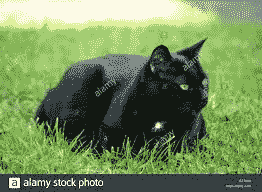**

**(Train image 1) Caption -> The black cat sat on grass**

**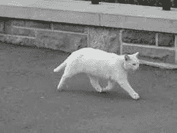**

**(Train image 2) Caption -> The white cat is walking on road**

**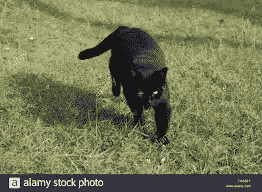**

**(Test image) Caption -> The black cat is walking on grass**

**现在，假设我们使用**前两幅图像**和它们的标题**来训练**模型，使用**第三幅图像**来**测试**我们的模型。**

**现在将要回答的问题是:我们如何将这一问题框定为监督学习问题？，数据矩阵是什么样子的？我们有多少数据点？等。**

**首先，我们需要将两个图像转换成它们相应的 2048 长度的特征向量，如上所述。设“**图像 _1** ”和“**图像 _2** ”分别为前两幅图像的特征向量**

**其次，让我们为前两个(train)标题构建词汇表，在这两个标题中添加两个标记“startseq”和“endseq”:(假设我们已经执行了基本的清理步骤)**

**caption _ 1--> "黑猫坐在草地上"**

**caption _ 2--> " start seq 白猫走在路上 endseq "**

**vocab = {black，cat，endseq，grass，is，on，road，sat，startseq，the，walking，white}**

**让我们给词汇表中的每个单词编个索引:**

**黑色-1，猫-2，结束序列-3，草-4，是-5，on -6，道路-7，sat -8，开始序列-9，the -10，步行-11，白色-12**

**现在让我们试着把它框定为一个**监督学习问题**其中我们有一组数据点 D = {Xi，易}，其中 Xi 是数据点‘我’的特征向量，易是相应的目标变量。**

**让我们取第一个图像向量 **Image_1** 和它对应的标题“ **startseq the 黑猫坐在草地上 endseq** ”。回想一下，图像向量是输入，标题是我们需要预测的。但是我们预测标题的方式如下:**

**第一次，我们提供图像向量和第一个单词作为输入，并尝试预测第二个单词，即:**

**input = Image _ 1+' start seq '；Output = 'the '**

**然后，我们提供图像向量和前两个单词作为输入，并尝试预测第三个单词，即:**

**input = Image _ 1+' start seq the '；输出= '猫'**

**诸如此类…**

**因此，我们可以将一幅图像的数据矩阵及其相应的标题总结如下:**

**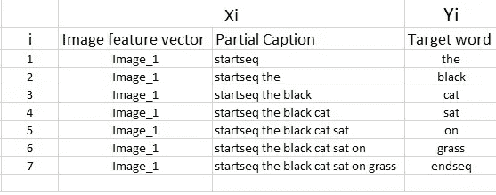**

**Data points corresponding to one image and its caption**

**必须注意，一个图像+字幕**不是单个数据点**，而是取决于字幕长度的多个数据点。**

**类似地，如果我们考虑图像及其标题，我们的数据矩阵将如下所示:**

**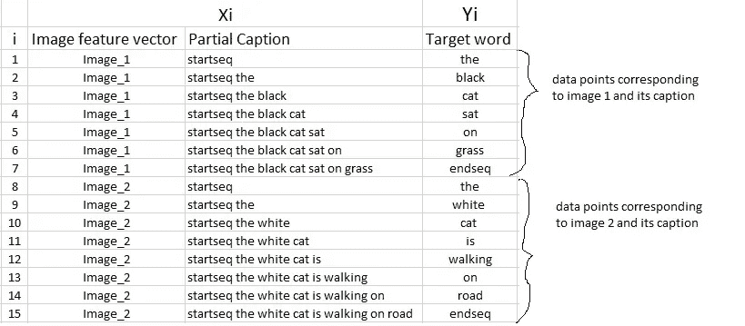**

**Data Matrix for both the images and captions**

**我们现在必须明白，在每一个数据点中，不仅仅是图像作为系统的输入，还有部分标题帮助**预测序列中的下一个单词。****

**由于我们正在处理**序列**，我们将使用**递归神经网络**来读取这些部分字幕(稍后将详细介绍)。**

**然而，我们已经讨论过，我们不会传递标题的实际英文文本，而是传递索引序列，其中每个索引代表一个唯一的单词。**

**因为我们已经为每个单词创建了一个索引，现在让我们用它们的索引来替换单词，并理解数据矩阵将会是什么样子:**

**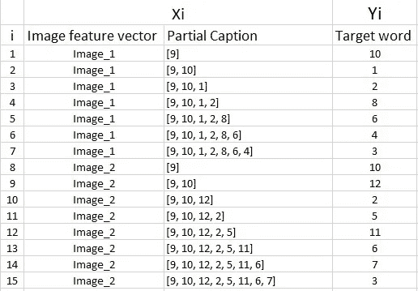**

**Data matrix after replacing the words by their indices**

**由于我们将进行**批处理**(稍后解释)，我们需要确保每个序列的**长度**相等。因此，我们需要**在每个序列的末尾添加 0 的**(零填充)。但是**我们应该在每个序列中添加多少个**零呢？**

**这就是我们计算标题最大长度的原因，它是 34(如果你记得的话)。因此，我们将添加这些数量的零，这将导致每个序列的长度为 34。**

**数据矩阵将如下所示:**

**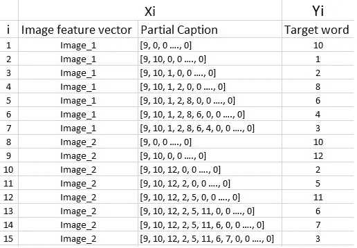**

**Appending zeros to each sequence to make them all of same length 34**

****需要数据生成器:****

**我希望这能给你一个好的感觉，关于我们如何为这个问题准备数据集。然而，这里面有一个很大的陷阱。**

**在上面的例子中，我只考虑了导致 15 个数据点的 2 个图像和标题。**

**然而，在我们实际的训练数据集中，我们有 6000 张图片，每张图片有 5 个标题。这使得总共有 **30000** 张图片和说明文字。**

**即使我们假设每个字幕平均只有 7 个单词长，也将导致总共 30000*7，即 **210000** 个数据点。**

****计算数据矩阵的大小:****

**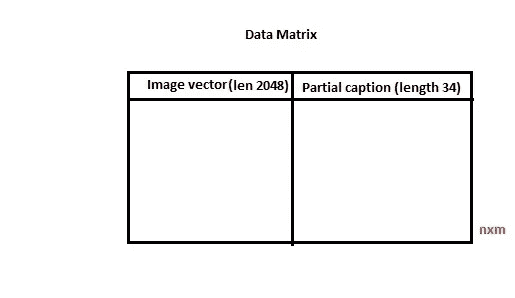**

**Data Matrix**

**数据矩阵的大小= n*m**

**其中 n->数据点的数量(假设为 210000)**

**和 m->每个数据点的长度**

**显然 m=图像向量的长度(2048) +部分字幕的长度(x)。**

**m = 2048 + x**

**但是 x 的值是多少呢？**

**你可能认为是 34，但是不对，等等，这是错的。**

**每个单词(或索引)将通过一种单词嵌入技术被映射(嵌入)到更高维度的空间。**

**稍后，在模型构建阶段，我们将看到使用预训练的手套单词嵌入模型将每个单词/索引映射到 200 长的向量。**

**现在每个序列包含 34 个索引，其中每个索引是长度为 200 的向量。因此 x = 34*200 = 6800**

**因此，m = 2048 + 6800 = 8848。**

**最后，数据矩阵的大小= 210000 * 8848= 1858080000 块。**

**现在，即使我们假设一个块占用 2 个字节，那么，为了存储这个数据矩阵，我们将需要超过 3 GB 的主存储器。**

**这是一个相当大的需求，即使我们能够将这么多数据加载到 RAM 中，也会使系统非常慢。**

**由于这个原因，我们在深度学习中大量使用数据生成器。数据生成器是一种在 Python 中本地实现的功能。Keras API 提供的 ImageDataGenerator 类只不过是 Python 中生成器函数的一个实现。**

****那么使用生成器函数如何解决这个问题呢？****

**如果你知道深度学习的基础，那么你必须知道，为了在特定的数据集上训练模型，我们使用一些版本的随机梯度下降(SGD)，如 Adam，Rmsprop，Adagrad 等。**

**使用 **SGD** ，我们不用计算整个数据集的损失来更新梯度。相反，在每次迭代中，我们计算一批**数据点(通常是 64、128、256 等)的损失。)来更新梯度。****

**这意味着我们不需要一次将整个数据集存储在内存中。即使我们在内存中有当前的一批点，它也足以满足我们的目的。**

**Python 中的生成器函数正好用于此目的。它就像一个迭代器，从上次被调用的地方恢复功能。**

**想了解更多关于发电机的知识，请在这里阅读[](https://wiki.python.org/moin/Generators)**。****

****数据生成器的代码如下:****

****Code to load data in batches****

# ******11。单词嵌入******

****如上所述，我们将把每个单词(索引)映射到 200 长的向量，为此，我们将使用预先训练的手套模型:****

```
**# Load Glove vectors
glove_dir = 'dataset/glove'
embeddings_index = {} # empty dictionary
f = open(os.path.join(glove_dir, 'glove.6B.200d.txt'), encoding="utf-8")for line in f:
    values = line.split()
    word = values[0]
    coefs = np.asarray(values[1:], dtype='float32')
    embeddings_index[word] = coefs
f.close()**
```

****现在，对于我们词汇表中的所有 1652 个唯一单词，我们创建一个嵌入矩阵，该矩阵将在训练之前加载到模型中。****

```
**embedding_dim = 200# Get 200-dim dense vector for each of the 10000 words in out vocabulary
embedding_matrix = np.zeros((vocab_size, embedding_dim))for word, i in wordtoix.items():
    #if i < max_words:
    embedding_vector = embeddings_index.get(word)
    if embedding_vector is not None:
        # Words not found in the embedding index will be all zeros
        embedding_matrix[i] = embedding_vector**
```

****要了解更多关于单词嵌入的信息，请参考此 [**链接**](https://www.analyticsvidhya.com/blog/2017/06/word-embeddings-count-word2veec/)****

# ****12.模型架构****

****由于输入由两部分组成，一个图像向量和一个部分标题，我们不能使用 Keras 库提供的顺序 API。出于这个原因，我们使用函数式 API 来创建合并模型。****

****首先，让我们看看包含高级子模块的简要架构:****

****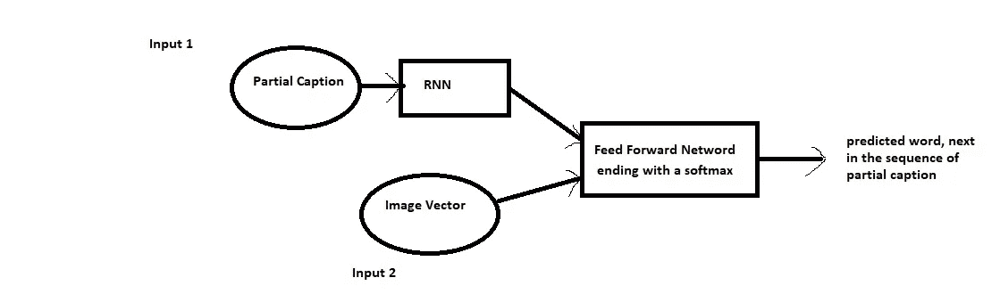****

****High level architecture****

****我们将模型定义如下:****

****Code to define the Model****

****让我们来看看模型总结:****

****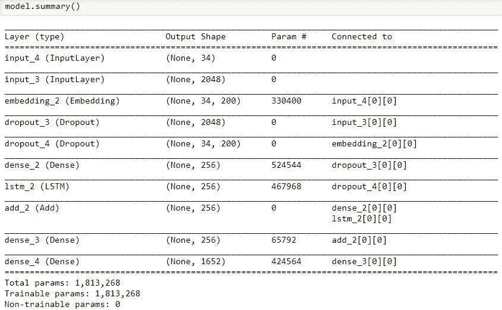****

****Summary of the parameters in the model****

****下图有助于形象化网络结构，并更好地理解两个输入流:****

****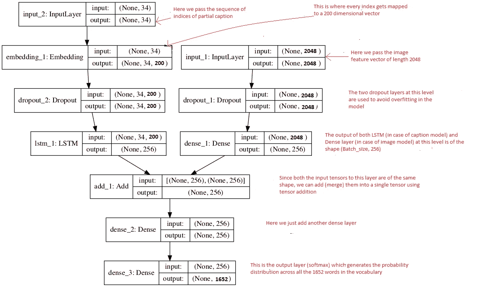****

****Flowchart of the architecture****

****右侧的红色文本是为您提供的注释，用于将您对数据准备的理解映射到模型架构。****

******LSTM(长短期记忆)**层只不过是一个专门的递归神经网络来处理序列输入(在我们的例子中是部分字幕)。要了解更多关于 LSTM 的信息，点击 [**这里**](http://colah.github.io/posts/2015-08-Understanding-LSTMs/) 。****

****如果您已经阅读了前面的部分，我认为阅读这些评论应该有助于您以一种直接的方式理解模型架构。****

****回想一下，我们已经从预训练的手套模型中创建了一个嵌入矩阵，我们需要在开始训练之前将它包含在模型中:****

```
**model.layers[2].set_weights([embedding_matrix])
model.layers[2].trainable = False**
```

****请注意，由于我们使用的是预训练的嵌入层，所以在训练模型之前，我们需要**冻结**它(可训练=假)，这样它就不会在反向传播过程中更新。****

****最后，我们使用 adam 优化器编译模型****

```
**model.compile(loss=’categorical_crossentropy’, optimizer=’adam’)**
```

****最后，通过反向传播算法更新模型的权重，并且给定图像特征向量和部分字幕，模型将学习输出单词。总而言之，我们有:****

****Input_1 ->部分字幕****

****Input_2 ->图像特征向量****

****Output ->一个适当的单词，在 input_1 中提供的部分字幕序列中的下一个(或者用概率术语我们说**以图像向量和部分字幕为条件**)****

******训练期间的高参数:******

****然后用 0.001 的初始学习率和每批 3 张图片(批量大小)训练该模型 30 个时期。然而，在 20 个时期之后，学习率降低到 0.0001，并且每批在 6 张图片上训练模型。****

******这通常是有意义的，因为在训练的后期阶段，由于模型正在走向收敛，我们必须降低学习率，以便我们朝着最小值迈出更小的步伐。此外，随着时间的推移增加批量大小有助于您的渐变更新更加强大。******

******耗时:**我在[www.paperspace.com](http://www.paperspace.com)上使用了 GPU+ Gradient 笔记本，因此我花了大约一个小时来训练模型。然而，如果你在没有 GPU 的 PC 上训练它，它可能需要 8 到 16 个小时，这取决于你的系统配置。****

# ****13.推理****

****到目前为止，我们已经了解了如何准备数据和构建模型。在本系列的最后一步，我们将了解如何通过传入新图像来测试(推断)我们的模型，也就是说，我们如何为新的测试图像生成标题。****

****回想一下，在我们看到如何准备数据的例子中，我们只使用了前两个图像及其标题。现在，让我们使用第三个图像，并尝试理解我们希望标题如何生成。****

****第三个图像向量和标题如下:****

********

****Test image****

****描述->黑猫在草地上行走****

****示例中的词汇还有:****

****vocab = {black，cat，endseq，grass，is，on，road，sat，startseq，the，walking，white}****

****我们将迭代生成标题，一次一个单词，如下所示:****

******迭代 1:******

****输入:图像向量+“startseq”(作为部分字幕)****

****预期输出字:“the”****

****(现在您应该理解标记“startseq”的重要性，它在推断过程中用作任何图像的初始部分标题)。****

****但是等等，模型生成了一个 12 长的向量(在示例中是 1652 长的向量，而在原始示例中是 1652 长的向量)，这是词汇表中所有单词的概率分布。由于这个原因，我们**贪婪地**选择具有最大概率的单词，给定特征向量和部分标题。****

****如果模型训练良好，我们必须期望单词“the”的概率最大:****

****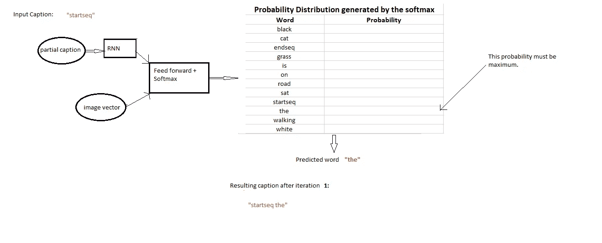****

****Iteration 1****

****这被称为**最大似然估计(MLE)** ，即我们根据给定输入的模型选择最有可能的单词。有时这种方法也被称为**贪婪搜索**，因为我们贪婪地选择具有最大概率的单词。****

******迭代 2:******

****输入:图像向量+ "startseq the "****

****预期输出字:“黑色”****

****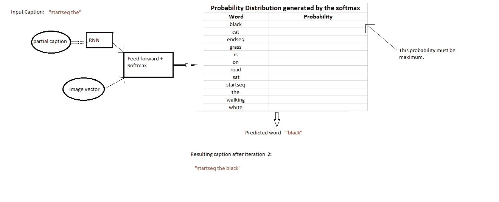****

****Iteration 2****

******迭代 3:******

****输入:图像向量+ "startseq the black "****

****预期输出字:“猫”****

****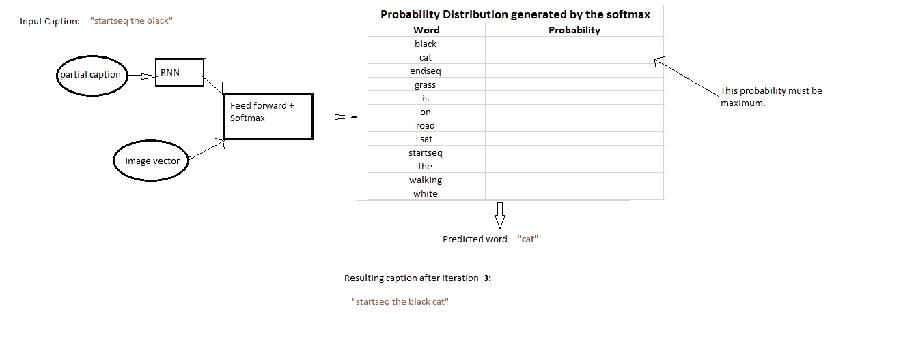****

****Iteration 3****

******迭代 4:******

****输入:图像向量+ "startseq the black cat "****

****预期的输出字:“是”****

****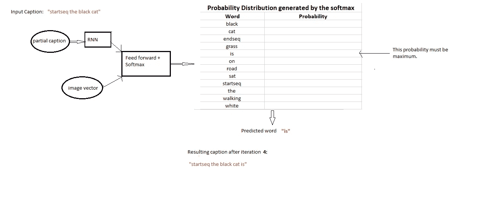****

****Iteration 4****

******迭代 5:******

****输入:图像向量+ "startseq 黑猫是"****

****预期输出字:“行走”****

****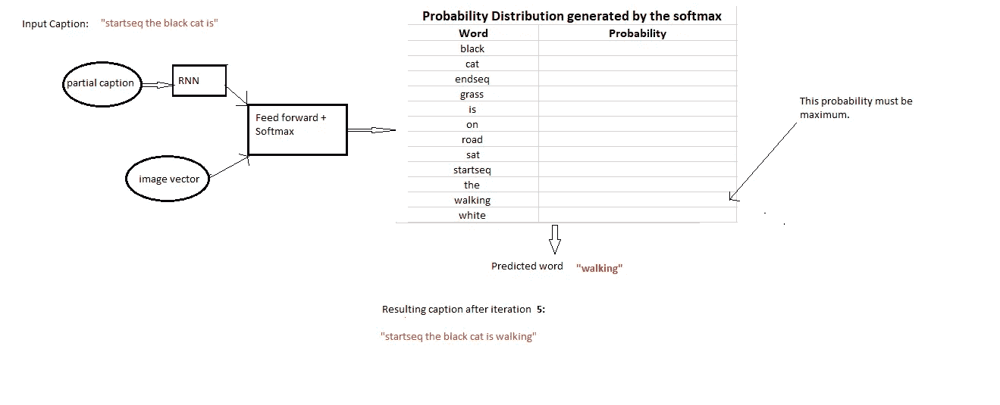****

****Iteration 5****

******迭代 6:******

****输入:图像向量+ "startseq 黑猫在走"****

****预期输出字:“开”****

****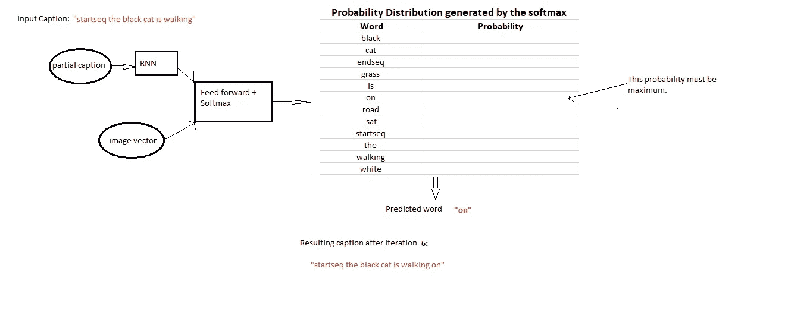****

****Iteration 6****

******迭代 7:******

****输入:图像向量+“黑猫正在行走的起始序列”****

****预期输出字:“草”****

********

****Iteration 7****

******迭代 8:******

****输入:图像向量+“startseq 黑猫在草地上走”****

****预期输出字:“endseq”****

****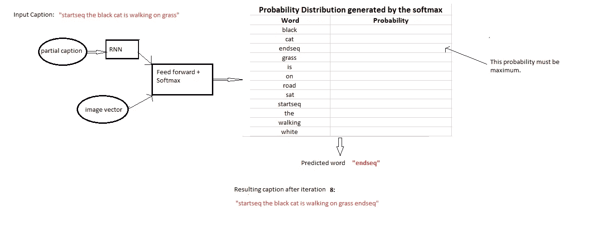****

****Iteration 8****

****这是我们停止迭代的地方。****

****因此，当满足以下两个条件之一时，我们停止:****

*   ****我们遇到了一个“ **endseq** ”标记，这意味着模型认为这是标题的结尾。(您现在应该明白' endseq '标记的重要性了)****
*   ****我们达到由模型生成的单词数量的最大阈值**。******

******如果满足以上任何一个条件，我们就中断循环，并将生成的标题报告为给定图像的模型输出。用于推理的代码如下:******

******Inference with greedy search******

# ******14.估价******

******为了了解模型有多好，让我们尝试在测试数据集的图像上生成标题(即模型在训练期间没有看到的图像)。******

******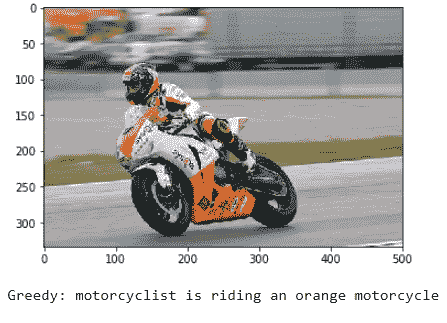******

******Output — 1******

******注意:我们必须理解模型是如何精确地识别颜色的。******

******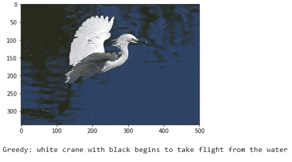******

******Output — 2******

******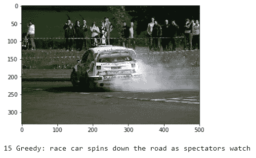******

******Output — 3******

******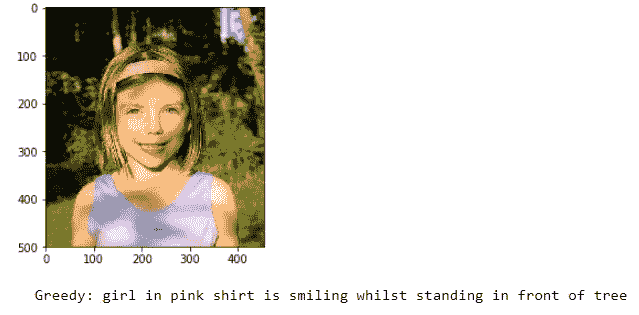******

******Output — 4******

******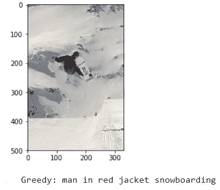******

******Output — 5******

******当然，如果我只给你看适当的说明，我是在欺骗你。世界上没有一个模型是完美的，这个模型也会犯错误。让我们来看一些例子，这些例子中的标题不是很相关，有时甚至是不相关的。******

************

******Output — 6******

******可能衬衫的颜色和背景色混在一起了******

******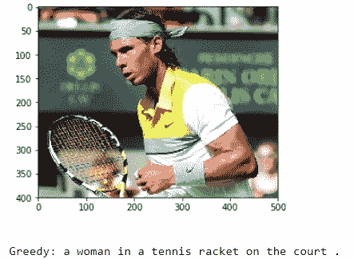******

******Output — 7******

******为什么模型把著名的拉菲尔·纳达尔归为女性:-)？大概是因为长发的缘故吧。******

******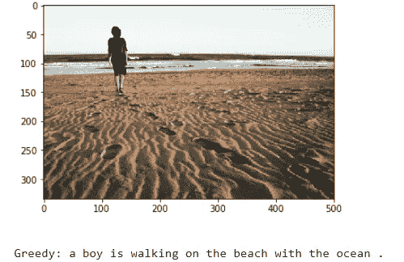******

******Output — 7******

******这次模型得到的语法不正确******

******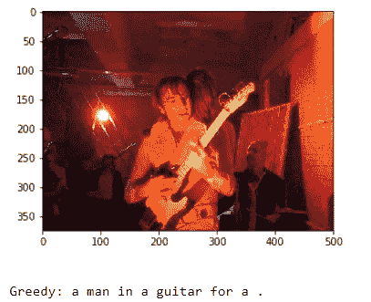******

******Output — 9******

******很明显，这个模型尽了最大努力去理解这个场景，但是标题仍然不太好。******

******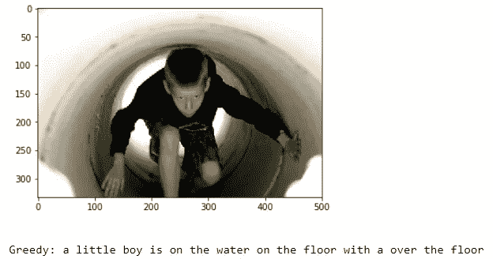******

******Output — 10******

******这又是一个模型失败，标题不相关的例子。******

******所以总而言之，我必须说，我天真的第一次切割模型，没有任何严格的超参数调整，在生成图像字幕方面做得很好。******

********重点:********

****我们必须理解，用于测试的图像必须与用于训练模型的图像在语义上相关。例如，如果我们在猫、狗等的图像上训练我们的模型。我们不能在飞机、瀑布等图像上测试它。这是一个训练集和测试集的分布将非常不同的例子，在这种情况下，世界上没有机器学习模型会提供良好的性能。****

# ****15.结论和未来工作****

****如果你已经到达这里，非常感谢。这是我第一次尝试写博客，所以我希望读者能慷慨一点，忽略我可能犯的小错误。****

****请参考我的 GitHub 链接 [**这里**](https://github.com/hlamba28/Automatic-Image-Captioning.git) 访问 Jupyter 笔记本上写的完整代码。****

****请注意，由于模型的随机性，您生成的标题(如果您试图复制代码)可能与我的案例中生成的标题不完全相似。****

****当然，这只是一个初步的解决方案，可以进行许多修改来改进该解决方案，例如:****

*   ****使用一个**更大的**数据集。****
*   ****改变模型架构，例如包括**注意**模块。****
*   ****做更多**超参数调整**(学习率、批量大小、层数、单位数、辍学率、批量标准化等。).****
*   ****使用交叉验证集了解**过拟合**。****
*   ****推断时使用**波束搜索**代替贪婪搜索。****
*   ****使用 **BLEU Score** 评估和测量模型的性能。****
*   ****以适当的面向对象的方式编写代码，以便其他人更容易复制:-)****

# ****16.参考****

1.  ****[https://cs.stanford.edu/people/karpathy/cvpr2015.pdf](https://cs.stanford.edu/people/karpathy/cvpr2015.pdf)****
2.  ****[https://arxiv.org/abs/1411.4555](https://arxiv.org/abs/1411.4555)****
3.  ****[https://arxiv.org/abs/1703.09137](https://arxiv.org/abs/1703.09137)****
4.  ****[https://arxiv.org/abs/1708.02043](https://arxiv.org/abs/1708.02043)****
5.  ****[https://machine learning mastery . com/develop-a-deep-learning-caption-generation-model-in-python/](https://machinelearningmastery.com/develop-a-deep-learning-caption-generation-model-in-python/)****
6.  ****[https://www.youtube.com/watch?v=yk6XDFm3J2c](https://www.youtube.com/watch?v=yk6XDFm3J2c)****
7.  ****[https://www.appliedaicourse.com/](https://www.appliedaicourse.com/)****

******PS:** 如果你认为他们可以改进这个博客，请随时提供意见/批评，我一定会努力做出必要的修改。****