# 图像分类挑战，使用迁移学习和深度学习工作室

> 原文：<https://towardsdatascience.com/image-classification-challenge-using-transfer-learning-and-deep-learning-studio-2e89c3189fcf?source=collection_archive---------6----------------------->

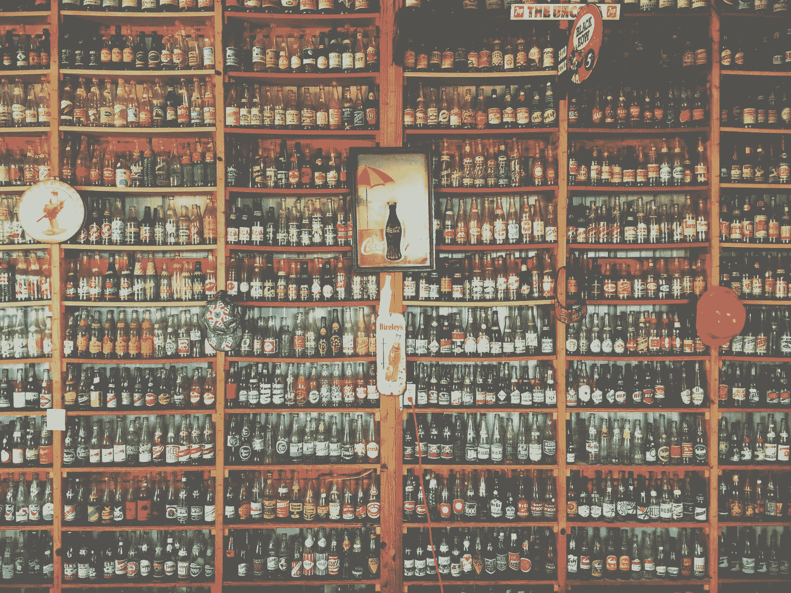

Photo by [Taylor Swayze](https://unsplash.com/photos/IPFSwl-4IfA?utm_source=unsplash&utm_medium=referral&utm_content=creditCopyText) on [Unsplash](https://unsplash.com/search/photos/soda-bottle?utm_source=unsplash&utm_medium=referral&utm_content=creditCopyText).

图像分类的任务是识别图像上的对象或模式，并基于给定的类别/种类池来分配类别以对图像进行分类。有许多不同的子领域，如识别单个图像上的多个对象，甚至定位图像中的对象。

在这篇文章中，我想与你分享我参加第一次图像分类挑战赛以及使用深度学习工作室(DLS)平台的经历。DLS 在一个高抽象层次上提供了一个图形界面，以建立和训练基于后端的深度神经网络，如 keras / tensorflow / theano 等，免费用于桌面或云应用程序。

*如果你从未听过或用过 DLS，去看看* [*这篇文章*](/deep-learning-made-easy-with-deep-learning-studio-an-introduction-18606a67f198) *由* [*Rajat*](https://medium.com/u/499b9c4ef53c?source=post_page-----2e89c3189fcf--------------------------------) *或在*[*deep cognition . ai*](https://deepcognition.ai/)*试用一下。*

# 挑战

这项挑战被命名为*汽水瓶识别挑战*，由 DeepCognition.ai 直接主办，作为他们的第一场比赛，目标是在图像上识别不同种类的汽水瓶。
与其他竞赛类似，例如 [Kaggle](https://www.kaggle.com/) 上的竞赛，您会收到一个或多或少准备好的带有标签的图像数据集，以及一套关于如何评估结果的规则和信息，还有一个提交结果的流程。在这种情况下，由于需要使用深度学习工作室服务，数据集和提交过程是根据 DLS 的工作方式定制的，这使得获得 startet 和提交第一个模型变得非常容易。

在下面的帖子中，我试图描述我采取的步骤，我获得的经验和我犯的错误，我的最终模型得分为 93.75%，在比赛中获得了第 10 名。

# 数据集

提供的数据集由 6615 张图像组成，或多或少均匀地分成 8 类不同的汽水瓶。

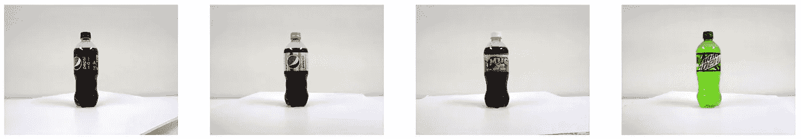

Soda Bottle Dataset preview from [DeepCognition.ai](https://deepcognition.ai/competitions/soda-bottle-label-detection/)

正如你所看到的，图像已经基本上以类似的白色背景为中心，所以我决定我真的不需要任何更大的图像预处理步骤。人们应该注意到，并不是所有的图片都像这个数据集预览中显示的那样完美。通过手动滚动一些图像，您会注意到有许多不同角度的瓶子，以及瓶子躺着或被物体部分遮盖的图像。

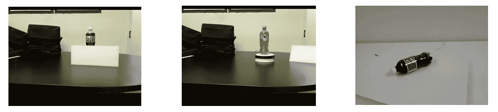

Differently positioned bottles

原始图像大小为 640*480 像素，这不一定是一个巨大的图像处理，但肯定比大多数网络工作。因此，调整图像大小似乎是一个合理的决定，以查看哪些大小会产生最好的结果。

# 天真的第一种方法

我的第一个方法是简单地训练一个模型，用 DLS AutoML 特性生成，它将根据你的输入/输出设置为你生成一个完整的模型。

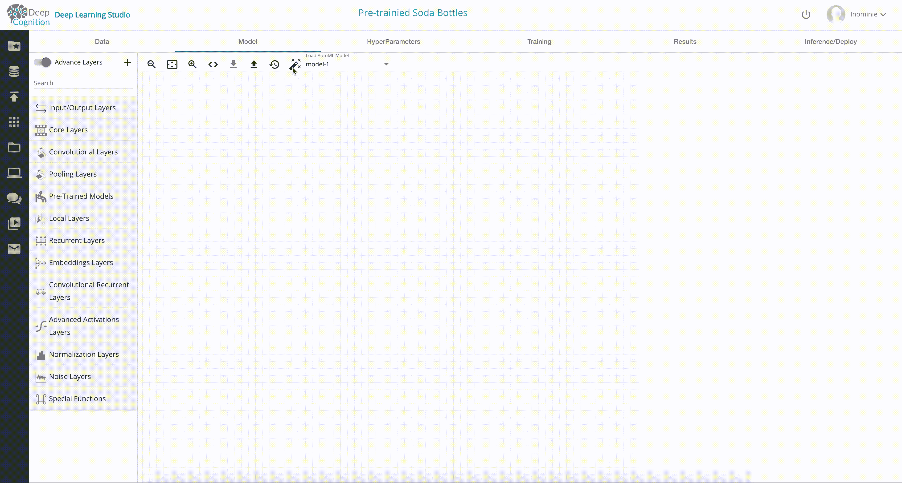

AutoML model for the Soda Bottle Challenge

正如你所看到的，生成的模型非常庞大，对于一个 6k 图像和 8 个类别的图像分类问题来说，可能是完全多余的，但我仍然继续尝试训练它。很快我就注意到，将图像保持在 640*480 像素的原始大小会立即填满我笔记本的 16GB RAM，并使训练过程崩溃。即使将尺寸缩小到原始图像的 1/4，这个 AutoML 模型对我的笔记本来说似乎还是太大了。

当然，DeepCognition 的云应用程序可以让你用相对较少的钱使用不同类型的 GPU，但我假设在这些条件下训练模型，将需要至少 4 个 GPU，这超出了我对这个项目的预算。

看起来简单的“魔棒”方法并没有让我走得更远，所以我考虑了其他可能的、资源更友好的解决方案。

# 迁移学习

迁移学习描述了一个相对宽泛的概念，即使用通过解决一组问题获得的知识来解决你当前问题的过程。

在我们的例子中，我们将使用一个已经成功训练的模型来识别图像上的某些对象，以识别不同的汽水瓶。乍一看，这可能没有意义。一个训练有素的模型如何区分猫和狗，能够告诉我们这个图像是包含露水还是胡椒博士瓶？

为了了解这可能是如何工作的，让我们非常简短地离题到图像分类模型是如何工作的。

# 特征抽出

几乎所有的图像分类模型都使用堆叠卷积层从图像中提取特征。这些特征在它们的第一层包含非常一般的信息，如边界或基本形状。使用预先训练的模型，我们可以利用模型的较低层的这些特征，因为它们将适用于几乎所有类型的图像数据。然后，我们只需要重新训练模型的最后几层，就可以学会识别我们的汽水瓶。

*你可能想在这里* *阅读关于卷积神经网络* [*的更深入的解释。*](/convolutional-neural-networks-for-all-part-i-cdd282ee7947)

在讨论不同的模型选择之前，我们先来看看如何使用 DLS 实现预训练模型。

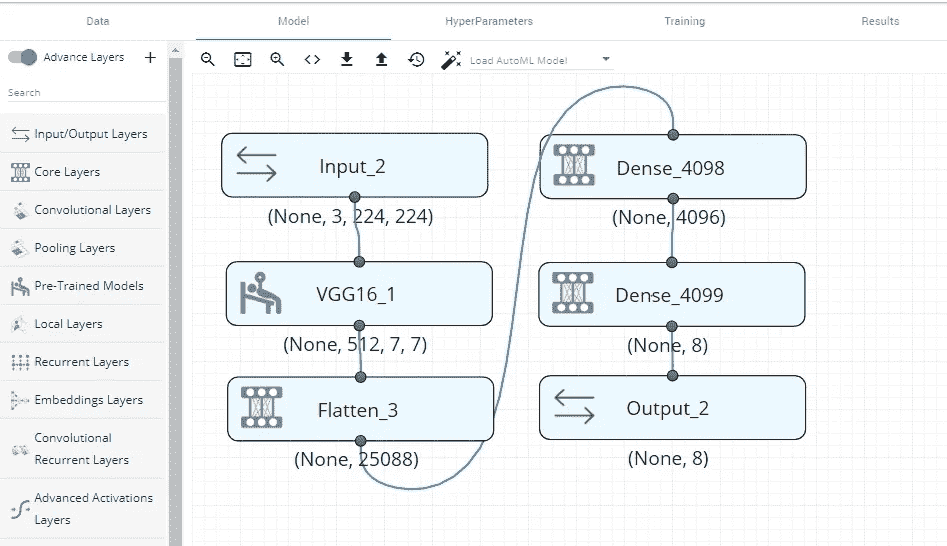

VGG16 as a pre-trained model

上面你可以看到一个非常基本的使用 DLS 图形编辑器的预训练 VGG16 模型的实现。有几件事需要考虑:

## 输入尺寸

我们的图像的输入尺寸显示在模型的第一个节点上(3，224，224)，这意味着我们已经将图像的尺寸调整为 224*224 像素，这是 VGG16 模型的原始图像尺寸。

这可以在 DLS 的数据选项卡中轻松完成。

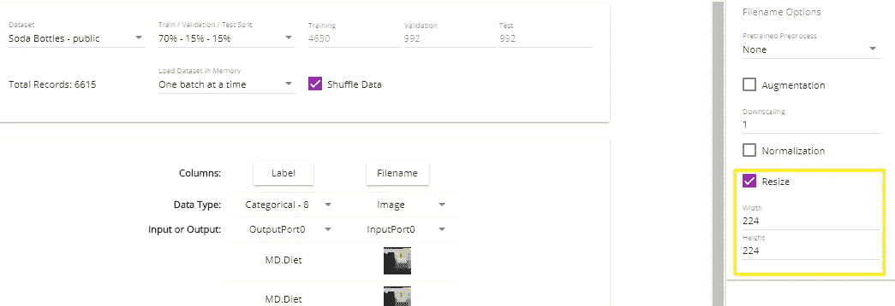

Resizing the input images

## 预训练模型

我们模型中的一个节点称为 VGG16，它实际上代表了压缩在单个节点中的整个 VGG16 模型架构。从*预训练模型*选项卡，DLS 提供了几个模型供选择。节点本身有一些关于如何加载预训练权重以及模型的哪个部分应该是可训练的选项。

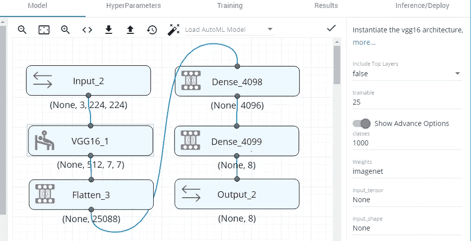

VGG16 settings

正如你在右手边看到的，我们不包括 VGG16 模型的顶层，因为这些是一旦我们建立自己来分类 8 个汽水瓶类，而不是 1000 个类别的 *imagenet* 数据集，原始的 VGG16 模型被训练。

另一个重要参数是*可训练值*，它是我们希望在反向传播过程中包含的 VGG16 模型的百分比。由于前几层提取了相当一般化的特征，我们不想重新训练它们，而是保持它们原来的样子。实际上，在我的方法中，只重新训练 VGG16 模型的最后一个卷积块就足够了，它大约是模型的 25%。

通过这种设置，与 AutoML 模型相比，该模型需要的资源少得多，甚至可以在我配有 CPU 和 16GB RAM 的笔记本电脑上进行训练。然而，我只达到了大约 1 个样本/秒的处理速度，这将导致训练时间大约为。只有一个纪元的 76 分钟。这似乎是不可接受的，因为我想测试几种不同的方法，看看哪种模型表现最好。此外，整个比赛持续时间只有大约 3 周。

切换到云版本并使用 Telsa K80 以大约 1 美元/小时的速度运行，导致培训时间大约为。VGG16 型号每周期 74 秒，我尝试的一些其他型号甚至更快。

# VGG16 / VGG19 / ResNet50

为了比较不同种类的预训练模型，我做了一个 10 个时期的小测试，每个时期都有与 VGG16 模型相同的设置。

## VGG16

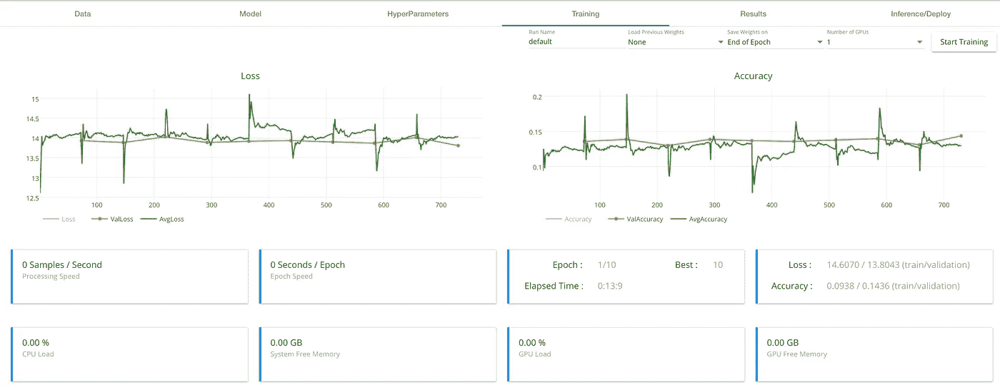

VGG16 training process

VGG16 模型在前 2 个时期后在验证集上仅实现了约 14%的准确度，并且似乎在最后 8 个时期都不被认可。在 8 类分类问题上 14%的准确率仅略高于随机猜测概率，后者约为 12.5%。这个结果对于迁移学习的前景来说并不是很鼓舞人心，但是让我们看看其他模型的得分如何。

## VGG19

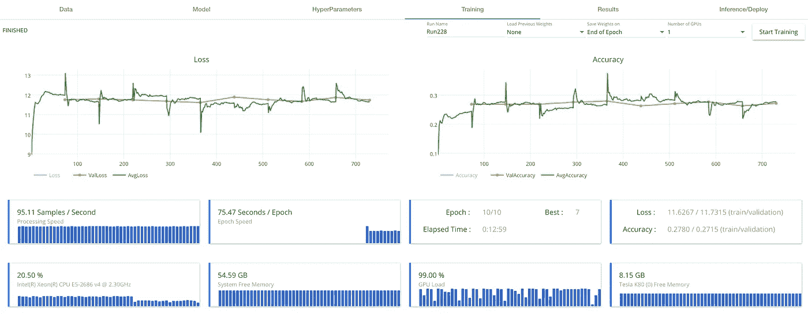

VGG19 training prcoess

VGG19 模型的架构与他的前任 VGG16 相似，但更深入，已经表现得更好，几乎达到 30%的精度。然而，训练曲线并没有给出通过进一步训练来提高准确度的希望。

## ResNet50

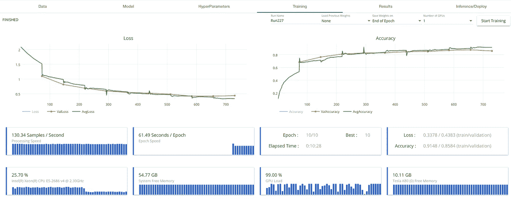

ResNet50 training process

差别真大！这是我所希望的结果。如你所见，该模型在 3 个时期后几乎达到了 80%的准确率，并在整个训练过程中不断提高。除了在三款测试车型中表现最佳之外，它还拥有最快的训练速度。

# 估价

有几种方法可以评估模型的性能。首先，对您的数据进行适当的训练/测试分割对于创建一个对未来数据表现良好的模型是必不可少的。DLS 自动对您的数据执行训练/验证/测试分割，同时让您选择不同的分割比率。

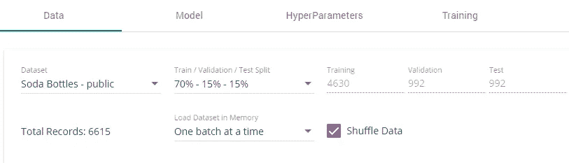

DLS Dataset settup

在训练过程中，然后在每个时期之后使用验证集来计算验证损失和准确度，这与训练损失/准确度一起显示在训练图中。

在训练过程的最后，您可以对数据的测试分割进行推理。在我们的例子中，这意味着我们将使用我们训练过的模型来预测测试集的图像上显示的是哪一类汽水瓶。

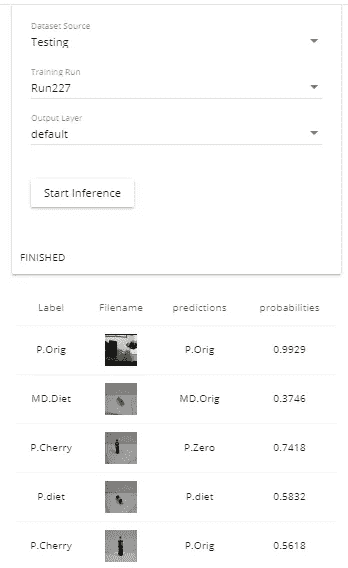

DLS Dataset Inference

用我们训练过的模型在我们的测试分割上运行预测，可以让我们知道我们的模型能够多好地识别它以前没有见过的图像上的汽水瓶类别。

当然，这很大程度上取决于数据集内部的方差。在我们的案例中，提供的所有图像都是以非常相似的方式拍摄的，只有角度或旋转上的微小差异。因此，推理的表现和预期的一样好，这并不一定意味着它能够识别不同的图像。许多参赛者在提交他们的第一个模型进行评估后可能会注意到一个事实。

# 提交流程

在我们的私人数据集上创建了一个准确率约为 80%的模型后，我觉得自己已经准备好第一次提交参赛作品了。

本次比赛的提交过程相当简单。DLS 提供了一个以 zip 文件形式下载您的训练模型的功能，该文件包含您的. h5 模型文件以及一个配置文件和一个 test.py 脚本，可用于在测试映像上运行您的模型。这个压缩文件只需上传到比赛网站。

提交我的第一个模型，最终得分约为 40%。

相当令人失望，当我们预期分数约为 80%时。那么这种差异从何而来呢？

按照竞赛规则的规定，对参赛作品的评估是在个人的私有数据集上进行的，参赛者无法访问这些数据集。我们训练过的模型从未见过这些图像，因此 40%的准确率意味着该模型没有足够的泛化能力来识别它没有见过的图像上的汽水瓶。

# 数据扩充

提高模型性能的一种方法是数据扩充。数据扩充描述了仅使用来自我们的训练数据的信息来增加训练数据量的过程。对于我们的图像数据集，这意味着我们根据现有的图像创建更多具有不同特征的图像。例如，我们可以左右移动图像、旋转图像、上下翻转图像或执行剪切变换。

*如果你有兴趣阅读更多关于数据增强的内容，请查看* [*瑞安·奥尔雷德*](https://medium.com/u/7d8ea5e73263?source=post_page-----2e89c3189fcf--------------------------------) *的* [*帖子*](/image-augmentation-for-deep-learning-using-keras-and-histogram-equalization-9329f6ae5085) *。*

使用这些“新”图像，我们基本上在更大的数据集上训练我们的模型，并由此增加其鲁棒性，因为它不仅从原始图像中学习。因此，我们应该看到对私有评估数据集的预测也有所改善。

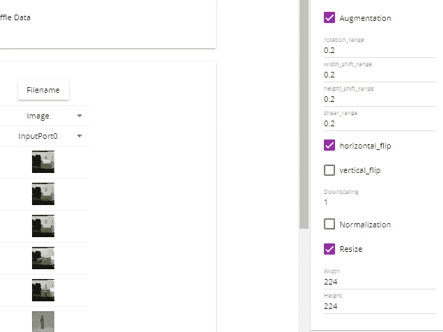

Data Augmentation in DLS

在 DLS，数据扩充可以像调整大小选项一样直接在输入图像的*数据*选项卡下使用。

使用如上所示的数据增强图像训练我们的 ResNet50 模型，得到了非常相似的训练曲线，在 10 个时期后峰值约为 90%。

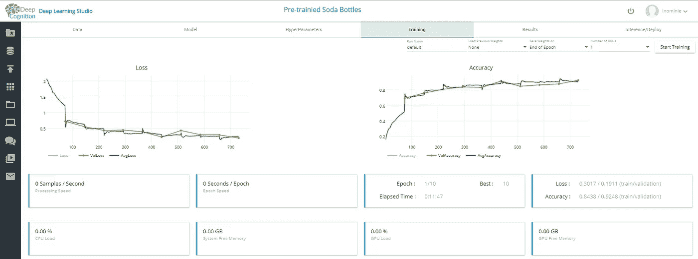

ResNet50 training process with data augmentation

将这个模型提交给比赛给了我 57%的分数，这表明数据增强有助于提高模型的整体稳健性，正如我们预期的那样。

与我们在训练期间达到的 91%相比，57%看起来不是很好，但是不要忘记我们只训练了 10 个时期的模型。我认为有改进的余地。

# 超参数

机器学习中的超参数，描述我们的模型中在学习过程开始之前设置的那些参数。最常见的是你谈论的参数，如批量大小、时期数、优化器和损失函数。

*阅读更多关于超参数的文章* [*本文*](/artificial-intelligence-hyperparameters-48fa29daa516) *作者* [*丹尼尔·夏皮罗博士*](https://medium.com/u/e7f791e64e83?source=post_page-----2e89c3189fcf--------------------------------) *。*

这些也是 DLS 在*超参数*选项卡下为您提供的超参数。

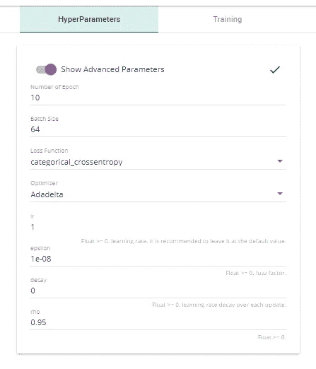

据我所知，DLS 默认提供这些设置，基于 keras 中实现的默认值。因为这些是你最常用的设置，我继续使用 DLS 的默认设置。我只是调整了批量大小，以提高训练速度。

作为一个优化器，我们使用了 Adadelta，它有一个自适应的学习率，所以我们甚至不用费心去寻找正确的学习率。这对于快速获得好的结果是很棒的，但是也会导致一个小问题，我将在后面讨论。

*如果你想深入了解不同的优化器，我建议你阅读本文***[*Rinat Maksutov*](https://medium.com/u/9483c7e0e6ed?source=post_page-----2e89c3189fcf--------------------------------)*。***

# **决赛成绩**

**为了提高分数，我尝试了很多不同的方法。最后，帕维尔·奥斯特亚科夫和阿列克谢·哈尔拉莫夫在他们的谈话中表达了一个想法，这个想法让我最终得出了大约 93%的准确率。**

**他们参加了一场图像分类挑战，这有点类似于汽水瓶识别挑战，但数据集要大得多。他们在训练中的方法是只在原始图像上开始训练，没有任何数据增强。然后，在训练收敛后，他们停下来，保存模型，并继续进行少量增强训练。他们多次重复这些步骤，一直训练到损失收敛，每次都增加数据增加量。**

**起初，在 DLS 建立这种行为是相当容易的，因为在开始训练过程时，有一个选项来加载上次跑步的重量。**

**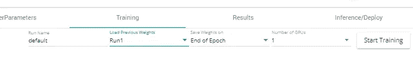**

**DLS loading weights of previous runs**

**当我试图模仿上面提到的程序时，我的最终得分高达 80%,但在我看来，这主要是因为该模型的整体训练时间较长。**

# **学习率**

**如前所述，我选择了具有自适应学习率的 Adadelta 优化器。它以较高的学习率开始，并在训练过程中逐渐降低。**

**由于我们已经多次开始和停止训练过程来调整数据扩充，所以学习率的调整并不真正有效，因为我在 DLS 找不到任何选项来保存或加载先前运行的学习率。**

**这就是为什么我决定尝试 Adam 优化器，它也有一个学习率衰减的参数，但从一个固定的学习率开始。因此，我在第一次运行时以 0.01 的标准学习率开始，然后在每次新的训练开始后手动调整学习率。**

**用这种新方法，我最终达到了 93.75%的最终分数，请注意，这是提交期的最后一天。**

***由于选择正确的学习速率是超参数调优中最棘手也是最重要的部分之一，我将推荐阅读* [*文章*](/estimating-optimal-learning-rate-for-a-deep-neural-network-ce32f2556ce0) *作者*[*Pavel Surmenok*](https://medium.com/u/d002f056f8c?source=post_page-----2e89c3189fcf--------------------------------)*。***

# **结论**

**总的来说，由于这是我第一次参加比赛，我对自己的成绩非常满意。DeepCognitions 竞赛极大地激励了人们去尝试不同的架构和方法，并在这样做的同时学到了很多东西，所有这些都不需要编写一行代码。**

**比赛的前两个位置实际上达到了完美的 100 分，所以对我来说肯定有改进的空间。**

**我希望你喜欢阅读我关于如何应对这一挑战的想法，甚至可能带走一些想法。请随时留下任何提示或建议，告诉我你会如何解决这个问题，以及我可以如何改进。**

**我总是很高兴认识新朋友并分享想法，所以如果你喜欢这篇文章，可以考虑在 LinkedIn 上加我。**