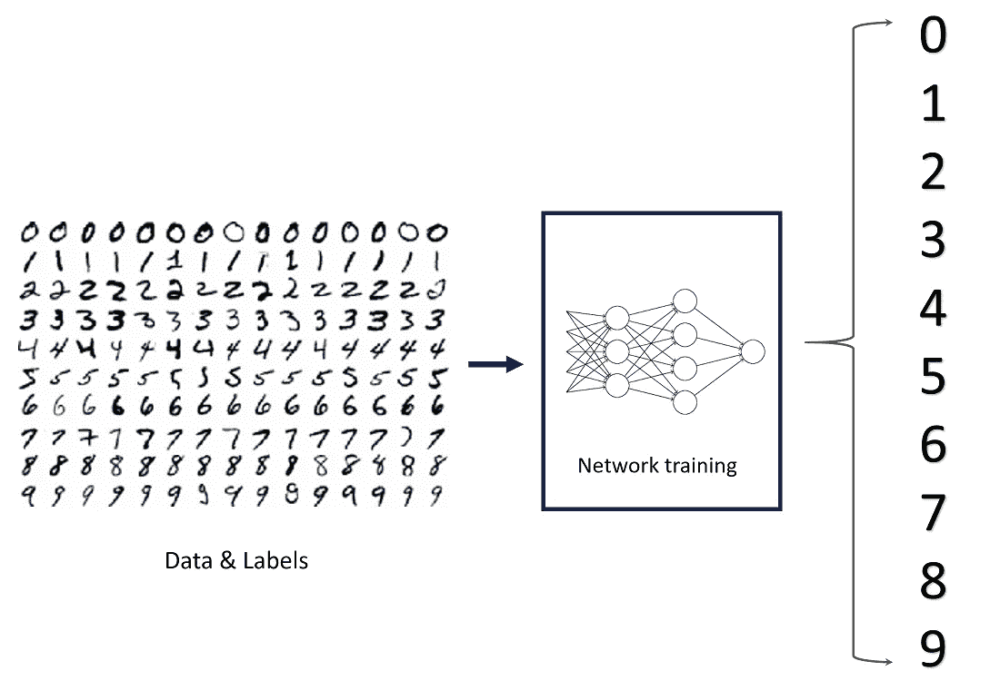
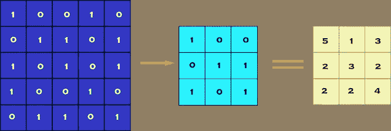
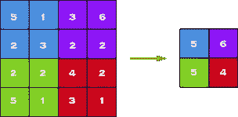
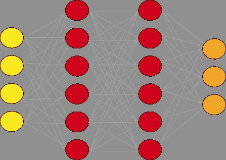
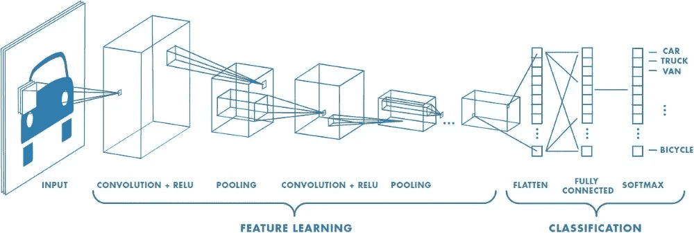
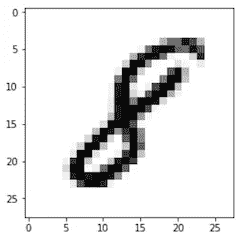
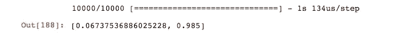
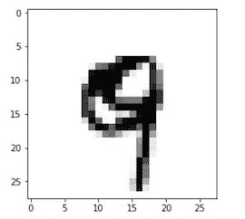

# 使用 MNIST 数据集在 10 分钟内完成图像分类

> 原文：<https://towardsdatascience.com/image-classification-in-10-minutes-with-mnist-dataset-54c35b77a38d?source=collection_archive---------0----------------------->

## 深度学习案例研究

## 利用 TensorFlow 和 Keras |监督深度学习使用卷积神经网络来分类手写数字

> 如果你正在阅读这篇文章，我确信我们有着相似的兴趣，并且正在/将要从事相似的行业。所以还是通过 [Linkedin](https://linkedin.com/in/orhangaziyalcin/) 联系吧！请不要犹豫发送联系请求！[Orhan g . yaln-Linkedin](https://linkedin.com/in/orhangaziyalcin/)

MNIST Dataset and Number Classification by [Katakoda](https://www.katacoda.com/basiafusinska/courses/tensorflow-getting-started/tensorflow-mnist-beginner)

*在开始这篇文章之前，我只想让你知道，如果你对深度学习感兴趣，我相信你也应该看看我的其他文章，比如:*

1 — [使用深度卷积自动编码器在 10 分钟内降低图像噪声](/image-noise-reduction-in-10-minutes-with-convolutional-autoencoders-d16219d2956a)我们学习了如何构建用于图像去噪的自动编码器；

2 — [*用递归神经网络预测明天的比特币(BTC)价格*](/using-recurrent-neural-networks-to-predict-bitcoin-btc-prices-c4ff70f9f3e4) *我们用 RNN 预测 BTC 价格，因为它使用 API，所以结果总是最新的。*

当你开始学习不同神经网络架构的深度学习时，你会意识到最强大的监督深度学习技术之一是卷积神经网络(缩写为“CNN”)。CNN 的最终结构实际上非常类似于常规神经网络(RegularNets ),其中存在具有权重和偏差的神经元。此外，就像在 RegularNets 中一样，我们在 CNNs [ [CS231](http://cs231n.github.io/convolutional-networks/) ]中使用一个损失函数(例如 crossentropy 或 softmax)和一个优化器(例如 adam optimizer)。此外，在 CNN 中，还有卷积层、汇集层和平坦层。CNN 主要用于图像分类，尽管您可能会发现其他应用领域，如自然语言处理。

# 为什么选择卷积神经网络

正则网络的主要结构特征是所有的神经元都是相互连接的。例如，当我们有灰度为 28×28 像素的图像时，我们最终会在一个似乎易于管理的层中有 784(28×28×1)个神经元。然而，大多数图像有更多的像素，他们不是灰度。因此，假设我们有一组 4K 超高清彩色图像，我们将有 26，542，080 (4096 x 2160 x 3)个不同的神经元在第一层相互连接，这实际上是不可管理的。因此，我们可以说正则网对于图像分类是不可伸缩的。然而，特别是当涉及到图像时，两个单独的像素之间似乎几乎没有相关性或关系，除非它们彼此靠近。这就引出了卷积层和池层的概念。

# CNN 中的层

我们能够在卷积神经网络中使用许多不同的层。但是，卷积、池化和全连接层是最重要的。因此，我将在实现它们之前快速介绍这些层。

## 卷积层

卷积层是我们从数据集中的图像中提取特征的第一层。由于像素仅与相邻和接近的像素相关，卷积允许我们保留图像不同部分之间的关系。卷积基本上是用较小的像素过滤器过滤图像，以减小图像的大小，而不丢失像素之间的关系。当我们通过使用具有 1x1 步幅(每步移动 1 个像素)的 3×3 滤波器将卷积应用于 5×5 图像时。我们最终将得到 3×3 的输出(复杂度降低了 64%)。

Figure 1: Convolution of 5 x 5 pixel image with 3 x 3 pixel filter (stride = 1 x 1 pixel)

## 汇集层

当构造 CNN 时，通常在每个卷积层之后插入汇集层，以减小表示的空间大小，从而减少参数计数，这降低了计算复杂度。此外，合并层也有助于解决过度拟合问题。基本上，我们通过选择这些像素内的最大值、平均值或和值来选择池大小以减少参数的数量。最大池化是最常见的池化技术之一，可演示如下:

Max Pooling by 2 x 2

## 一组完全连接的层

完全连接的网络是我们的规则网络，其中每个参数相互链接，以确定标签上每个参数的真实关系和效果。由于卷积和合并层大大降低了我们的时空复杂度，我们最终可以构建一个完全连通的网络来分类我们的图像。一组完全连接的层如下所示:

A fully connected layer with two hidden layers

既然您对我们将使用的各个层有了一些了解，我认为是时候分享一个完整的卷积神经网络的概览了。

A Convolutional Neural Network Example by [Mathworks](https://www.mathworks.com/content/dam/mathworks/tag-team/Objects/d/80879v00_Deep_Learning_ebook.pdf)

现在你有了一个关于如何建立一个卷积神经网络的想法，你可以建立一个图像分类，我们可以得到最陈词滥调的分类数据集:MNIST 数据集，代表修改后的国家标准和技术研究所数据库。这是一个手写数字的大型数据库，通常用于训练各种图像处理系统。

# 下载 MNIST 数据集

MNIST 数据集是用于影像分类的最常用数据集之一，可从许多不同的来源访问。事实上，甚至 Tensorflow 和 Keras 也允许我们直接从它们的 API 导入和下载 MNIST 数据集。因此，我将从下面两行开始，在 Keras API 下导入 TensorFlow 和 MNIST 数据集。

MNIST 数据库包含 60，000 张训练图像和 10，000 张测试图像，取自美国人口普查局员工和美国高中生[ [维基百科](https://en.wikipedia.org/wiki/MNIST_database) ]。因此，在第二行中，我将这两个组分为训练组和测试组，还将标签和图像分开。x_train 和 x_test 部分包含灰度 RGB 代码(从 0 到 255 ),而 y_train 和 y_test 部分包含从 0 到 9 的标签，表示它们实际上是哪个数字。为了可视化这些数字，我们可以从 matplotlib 获得帮助。

当我们运行上面的代码时，我们将得到 RGB 代码的灰度可视化，如下所示。

A visualization of the sample image at index 7777

我们还需要知道数据集的形状，以便将其导入卷积神经网络。因此，我将使用 NumPy 数组的“shape”属性，代码如下:

你会得到(60000，28，28)。您可能已经猜到，60000 表示训练数据集中的图像数量，而(28，28)表示图像的大小:28 x 28 像素。

# 重塑和标准化图像

为了能够在 Keras API 中使用数据集，我们需要 4 维 NumPy 数组。然而，正如我们在上面看到的，我们的数组是三维的。此外，我们必须规范化我们的数据，因为它在神经网络模型中总是需要的。我们可以通过将 RGB 代码分为 255(最大 RGB 代码减去最小 RGB 代码)来实现这一点。这可以通过下面的代码来完成:

# 构建卷积神经网络

我们将通过使用高级 Keras API 来构建我们的模型，该 API 在后端使用 TensorFlow 或 Theano。我想提一下，有几个高级 TensorFlow APIs，如 Layers、Keras 和 Estimators，可以帮助我们创建具有高级知识的神经网络。然而，这可能会导致混乱，因为它们的实现结构各不相同。所以，如果你看到同一个神经网络虽然都用 TensorFlow，但是代码完全不同，这就是为什么。我将使用最简单的 API，即 Keras。因此，我将从 Keras 导入顺序模型，并添加 Conv2D、MaxPooling、Flatten、Dropout 和 Dense 层。我已经谈到了 Conv2D、Maxpooling 和密集层。此外，丢弃层通过在训练时忽略一些神经元来对抗过度拟合，而展平层在构建完全连接的层之前将 2D 阵列展平为 1D 阵列。

对于第一致密层，我们可以用任何数目进行实验；然而，最终的密集层必须有 10 个神经元，因为我们有 10 个数字类(0，1，2，…，9)。你可以尝试内核大小、池大小、激活函数、退出率和第一密集层中的神经元数量，以获得更好的结果。

# 编译和拟合模型

使用上面的代码，我们创建了一个非优化的空 CNN。现在是时候为优化器设置一个使用度量标准的给定损失函数了。然后，我们可以通过使用我们的训练数据来拟合模型。对于这些任务，我们将使用以下代码:

您可以试验优化器、损失函数、指标和时期。然而，我可以说，亚当优化器通常是优于其他优化器。我不确定你是否真的可以改变多类分类的损失函数。请在下面随意试验和评论。纪元编号可能看起来有点小。然而，您将达到 98–99%的测试准确度。由于 MNIST 数据集不需要强大的计算能力，您也可以轻松地试验纪元编号。

# 评估模型

最后，您可以使用一行代码通过 x_test 和 y_test 来评估定型模型:

对于 10 个时期和这样一个简单的模型来说，结果相当不错。

Evaluation shows 98.5% accuracy on test set!

我们用这样一个基本模型达到了 98.5%的准确率。坦率地说，在许多图像分类情况下(例如，对于自动驾驶汽车)，我们甚至不能容忍 0.1%的误差，因为作为类比，它将在 1000 个情况中导致 1 个事故。然而，对于我们的第一个模型，我会说结果还是不错的。我们还可以使用以下代码进行单独的预测:

我们的模型将图像分类为“9 ”,以下是图像的视觉效果:

Our model correctly classifies this image as a 9 (Nine)

虽然这不是一个很好的数字 9 的笔迹，但我们的模型能够将其归类为 9。

# 恭喜你！

你已经用 Tensorflow 的 Keras API 成功构建了一个卷积神经网络来对手写数字进行分类。你已经达到了超过 98%的准确率，现在你甚至可以保存这个模型&创建一个数字分类器应用程序！如果你对保存你的模型感兴趣，我会指引你去查看 Keras 文档。毕竟，为了能够有效地使用 API，必须学习如何阅读和使用文档。

# 订阅邮件列表获取完整代码

如果你想在 Google Colab 上获得完整的代码，并获得我的最新内容，请订阅邮件列表:✉️

> [现在就订阅](http://eepurl.com/hd6Xfv)

# 喜欢这篇文章

如果你喜欢这篇文章，可以考虑看看我的其他[类似文章](https://www.vizio.ai/blog-category/artificial-intelligence):

 [## 使用卷积自动编码器在 10 分钟内降低图像噪声

### 在时尚 MNIST 的帮助下，使用深度卷积自动编码器清洁(或去噪)有噪声的图像

towardsdatascience.com](/image-noise-reduction-in-10-minutes-with-convolutional-autoencoders-d16219d2956a)  [## 利用生成性对抗网络在 10 分钟内生成图像

### 使用无监督深度学习生成手写数字与深度卷积甘斯使用张量流和…

towardsdatascience.com](/image-generation-in-10-minutes-with-generative-adversarial-networks-c2afc56bfa3b)  [## 使用递归神经网络预测比特币(BTC)价格

### 如果你能以某种方式预测明天的比特币(BTC)价格，这不是很棒吗？加密货币市场有…

towardsdatascience.com](/using-recurrent-neural-networks-to-predict-bitcoin-btc-prices-c4ff70f9f3e4)  [## TensorFlow Hub & Magenta 在 5 分钟内实现快速神经风格转换

### 利用 Magenta 的任意图像风格化网络和深度学习，将梵高的独特风格转移到照片中

towardsdatascience.com](/fast-neural-style-transfer-in-5-minutes-with-tensorflow-hub-magenta-110b60431dcc)