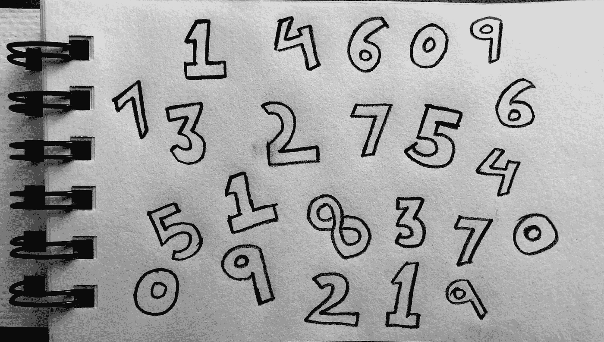
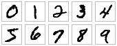

# 基于 MNIST 数据集的卷积神经网络图像分类。

> 原文：<https://towardsdatascience.com/image-classification-using-convolutional-neural-networks-on-mnist-data-set-406db0c265ed?source=collection_archive---------7----------------------->



这篇文章是为那些对机器学习感兴趣并且正在寻找一个不太复杂的来源的人准备的。

我是犹他大学的一名研究生，在我短暂的课程工作中，我对机器学习和人工智能产生了兴趣。我喜欢研究不同的数据集，并做笔记，然后发布到网上，这样那些觉得难以理解深度研究论文的人就可以从更简单、更容易理解的角度来看待人工智能和人工智能。

如果我必须向一个五年级学生解释什么是机器学习，我会说，你迈出的每一小步都会产生一个结果，让你知道什么是有利的，什么是不利的。这是机器学习的基础。类似地，当我们在大型数据集上训练计算机系统时，我们在给它们提供什么是有利的，什么是不利的信息。例如，当狗和猫的图片被提供给系统时，系统根据该信息训练自己，并且基于该信息，系统现在能够识别什么是猫，什么是狗。如何训练一个计算机系统来完成这样的魔法，我们将在本文的后面部分找到答案。

# MNIST 手写的图像:

这是一个数据集，由从 0 到 9 的手写数字图像组成。每个图像都是单色的，28 * 28 像素。请参见下面的示例:



Source: [https://www.tensorflow.org/tutorials/layers](https://www.tensorflow.org/tutorials/layers)

# 目标:

训练计算机系统首先理解什么是数字的手写图像，然后测试该系统以正确预测新的手写图像。我们将向我们的系统提供 MNIST 数据集，并用随机图像对其进行测试，以检查其预测的准确性。

# 先决条件:

1.  python 脚本基础知识，Python 3.6。
2.  关于什么是机器学习和张量流的概念。
3.  学习新事物的活力。

# 如何做:

**导入张量流和 MNIST 数据:**

```
import tensorflow as tffrom tensorflow.examples.tutorials.mnist import input_data
mnist = input_data.read_data_sets("MNIST_data/", one_hot=True)
```

**占位符:**

占位符不同于变量。它们是为保存训练数据而创建的参数，在这种情况下，它们是训练图像。MNIST 图像的形状为(28*28)。这些将被展平成(None *784)形状张量。“无”表示它可以是任何大小。

```
x = tf.placeholder(tf.float32, [None, 784])
```

**权重和偏差:**

权重和偏差的初始值被设置为零，因为当计算发生时它将被改变。因此，初始值是什么并不重要。因为存在 784 个特征和 10 个输出，所以 w’是(784 * 10)形状。“b”的形状是 10，因为从 0 到 9(数字)有 10 个输出。

```
w = tf.Variable(tf.zeros([784,10]))
b = tf.Variable(tf.zeros([10]))
```

**预测模型:**

x 和 w 是相乘并加到偏差上的矩阵。softmax 函数接受值并使总和为 1。这样，它可以用作概率值，使得判断哪个数字(0 -9)被预测的机会更高变得一致。

```
y = tf.nn.softmax(tf.matmul(x,w) + b)
#training our model
y_ = tf.placeholder(tf.float32, [None,10])
```

**交叉熵函数:**

交叉熵函数是成本或损失函数。它将真实值与预测值进行比较。目标是使损失最小化。

```
cross_entropy = tf.reduce_mean(-tf.reduce_sum(y_ * tf.log(y), reduction_indices=[1]))
```

**梯度下降优化器:**

当使用交叉熵函数形成模型图时，我们希望找到损失最小的点。这是使用梯度下降优化器完成的。它向图中值较小的部分移动。可以手动设置步数或学习率。如果设定一个非常小的学习率，如 0.001，系统将永远需要达到损失最小的点，但它将更加精确。如果学习率设置得很高，则系统可能会产生快速但错误的结果。

```
train_step = tf.train.GradientDescentOptimizer(0.5).minimize(cross_entropy)
```

**训练模式:**

在这里，我们正在训练我们的模型，以 100 个为一批来学习 MNIST 数据。

```
y_ = tf.placeholder(tf.float32, [None,10])cross_entropy = tf.reduce_mean(-tf.reduce_sum(y_ * tf.log(y), reduction_indices=[1]))train_step = tf.train.GradientDescentOptimizer(0.5).minimize(cross_entropy)
```

**评估和测试模型:**

在这里，模型以 0.8916 的精度被评估和测试。tf.argmax 给出一个轴中的最高值。所以，y_ 是正确值，y 是预测值。tf.equal 用于判断它们是否相等。

```
prediction = tf.equal(tf.argmax(y,1), tf.argmax(y_,1))
```

**多卷积层:**

在这里，我们使用更多的层、权重和偏差来改进我们的模型并提高准确性。

我们的第一个卷积层对于每个 5*5 的面片有 32 个特征。它的权重张量将是[5，5，1，32]的形状。前两个维度是面片大小，接下来是输入通道，最后一个数字是输出通道。

为了应用卷积层，x 被整形为 4D 张量。28*28 是图像的宽度和高度，最后一个维度是颜色通道的数量。

然后应用 ReLU 函数使负值为 0，并保持正值不变。最大池将图像大小缩小到 14*14。

第二卷积层对于每个 5*5 的面片具有 64 个特征。

现在，图像大小已经减少到 7*7，我们添加一个具有 1024 个神经元的全连接层。

**漏失和读出层:**

为了减少过度拟合，我们会随机丢弃一些数据。因此，下降层有助于提高预测的准确性。下一层用于读取数据。

**最终精度:**

0.9919

**完整的 Python 代码:**

[](https://github.com/rajitnikhare/MNIST/blob/master/MNIST_Softmax.py) [## 拉吉特尼哈尔/MNIST

### 在 GitHub 上创建一个帐户，为 rajitnikhare/MNIST 的发展做出贡献。

github.com](https://github.com/rajitnikhare/MNIST/blob/master/MNIST_Softmax.py) 

**参考文献:**

1.  [https://www . tensor flow . org/versions/r 1.0/get _ started/Mn ist/pros](https://www.tensorflow.org/versions/r1.0/get_started/mnist/pros)
2.  [https://code labs . developers . Google . com/code labs/cloud-tensor flow-mnist/# 2](https://codelabs.developers.google.com/codelabs/cloud-tensorflow-mnist/#2)