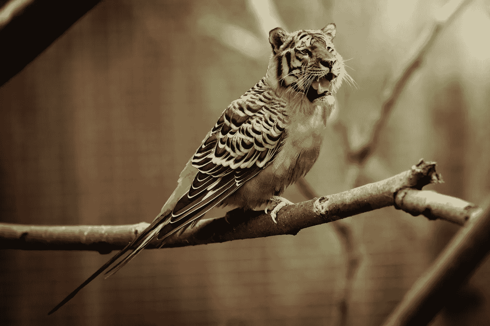
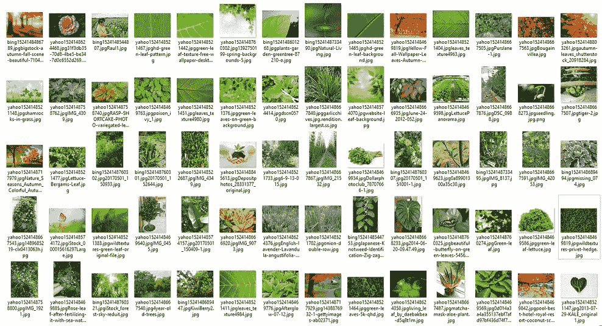
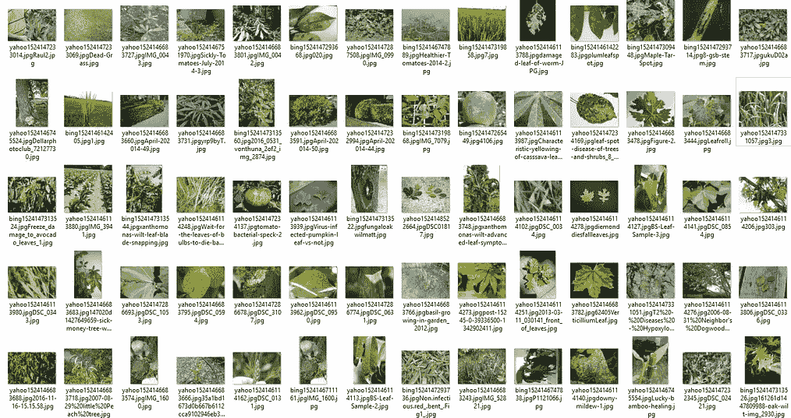
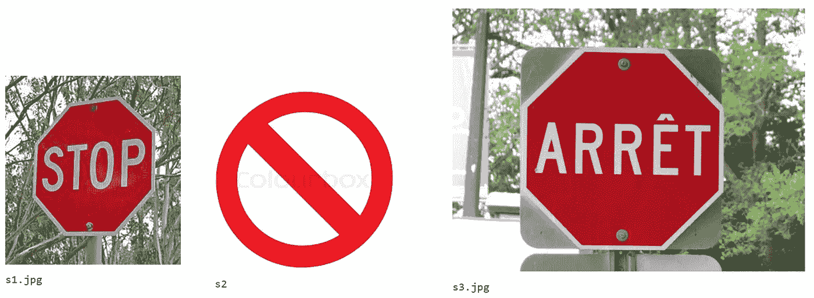

# 人工智能的图像数据集

> 原文：<https://towardsdatascience.com/image-datasets-for-artificial-intelligence-bbb12615edd7?source=collection_archive---------3----------------------->



在人工智能领域，数据就是力量。

人工智能算法以及它们如何相互融合是一门艺术，通过大学课程、在线培训以及观看 YouTube 视频的人逐渐了解这门艺术。人工智能是开源的，[应该是](https://openai.com)。为了保护你的公司免受竞争，你可以做的是建立专有数据集。

有大量的数据集向公众开放。例如， [Kaggle](https://www.kaggle.com/datasets) ，以及其他[企业](https://cloud.google.com/bigquery/public-data/)或[学术](http://www.image-net.org)数据集，以及众多[联邦](https://open.canada.ca/en/open-data)和[市级](http://data.ottawa.ca)数据源。我们在很多项目中使用这些，但是其他人也可以。你要的是造一些我没有的“特别”。例如，你不能在搜索方面打败谷歌，因为他们知道人们搜索什么，而你不知道。优势在于其数据集的规模和深度，而不仅仅是市场份额。

我们经常遇到构建人工智能解决方案的需求，在这种情况下，客户需要一个图像数据集来继续前进。客户端通常没有图像数据集来开始。他们不能简单地使用现成的解决方案或 API，因为[现成卷积网络](https://keras.io/applications/)中典型的 [1000 个对象](http://www.image-net.org/challenges/LSVRC/)并不像人们希望的那样广泛，而且区分两个类的分类器可能比有 1000 个的分类器更强大。当“输出类”(系统可以看到的事物类型)的数量很小时，做出错误预测的机会就很少，因此这些专门的模型往往工作得很好。

今天我想向大家介绍的是我们构建这些自定义图像数据集的一种方法。先说只有 2 类的情况:**染病叶片**和**健康叶片**。这个想法是用人工智能来区分某处田地里健康和病态的叶子。

首先，我们安装了 [images-scraper](https://www.npmjs.com/package/images-scraper) 和 nodejs，我们将抓取的图像限制为非 https URLs。我们确保网址有。jpg '结尾，这通常是格式良好的。我们接下来需要的是一组关键字，所以我们使用下面的关键字列表开始:

```
keywordList = ['healthy', 'thriving', 'growing', 'living', 'beautiful','nourishing','tasty','green']baseKeyword = 'leaf'
```

从这里，我们生成关键字列表和基本关键字的组合。例如:

```
('healthy leaf', 'thriving leaf', 'growing leaf', 'living leaf', 'beautiful leaf')
```

接下来，我们将每个组合传递到一个单独的 nodejs 线程中。scraper 将抓取的图像收集到一个基本目录中，每个关键字组合都有子文件夹。然后，我们运行脚本来删除重复和空的文件。

这是一个完整的例子，我们如何刮图像感染的叶子。

```
keywordList = ['sick', 'damaged', 'infected', 'dying', 'bacteria','virus','sickly','wilting']
baseKeyword = 'leaf'import lemayScraper as lsls.scrapeImages(keywordList, baseKeyword)
```

在这一点上，我们有 2 个文件夹，一个包含数千张健康叶子的图片(和许多垃圾图片)，另一个包含数千张感染叶子的图片(和更多垃圾图片)。接下来的任务是手动浏览图像，并删除与树叶无关的图像(一个拿着雨伞的婴儿)，然后再次浏览图像，并删除类型错误的图像(树叶的绘图、树叶的 3D 渲染等)。最后，人类操作员梳理图像，并添加他们认为第一遍所需的尽可能多的努力。在后期阶段，我们可能会选择裁剪图像，或做其他图像清理。在这个阶段，目标只是确保坏数据不会过滤到训练数据中。



Collected image data for healthy leaves (left) and infected leaves (right).

此时，训练人工智能进行图像识别的项目可以开始了。我们已经看到了收集图像数据的许多其他要求，因此您的项目的解决方案可能会有所不同。有时，我们会寻找在感知哈希方面相似的图像，如下例所示:



3 images from a scrape

上面的图片都是醒目的红色。也许它们来自于对单词“红色”和“停止”的刮擦。我们可以通过下面的代码看到它们是多么相似:

结果如下:

```
ffe2c38f8983073d c3991c6e763899c3 ffe3c3c0c0c1c0ec
False
s1-s2 47
s1-s3 20
```

在结果的第一行，我们看到每个图像都有一个唯一的散列。英语停止标志(s3.jpg)和禁止标志(s3.jpg)之间的差异大于英语和法语停止标志(s3.jpg 和 s3.jpg)之间的差异。这太酷了！用数学它明白了停止标志是相似的！

因此，我们能够对刮下的图像进行后处理，在没有人工干预的情况下，将与其他东西相似的东西收集成堆(子类)。我们有很多其他的脚本来帮助清理 scraper 输出。一旦我们在分类器训练过程中看到一个好的分类结果([混淆矩阵](https://en.wikipedia.org/wiki/Confusion_matrix))，我们就停止胡闹。在[这篇文章](https://www.thinkmind.org/index.php?view=article&articleid=intelli_2017_2_10_60038)中讨论了这个图像刮刀的起源，以及一些关于如何使用它的疯狂想法。

至于使用来自 web 抓取的数据所需的许可，以及其他知识产权问题，那已经超出了本文的范围。

因此，总之，抓取图像形成一个数据集是完全可行的。我们都在关注快节奏的开发和尽早展示价值，抓取图像是构建定制图像识别解决方案的重要组成部分。

如果你喜欢这篇关于构建图像数据集的文章，可以看看我过去读过最多的文章，比如“[如何为人工智能项目定价](https://medium.com/towards-data-science/how-to-price-an-ai-project-f7270cb630a4)”和“[如何聘请人工智能顾问](https://medium.com/towards-data-science/why-hire-an-ai-consultant-50e155e17b39)”除了与业务相关的文章，我还准备了一些关于寻求采用深度机器学习的公司所面临的其他问题的文章，如“[没有云和 API 的机器学习](https://medium.com/@lemaysolutions/locked-in-a-box-machine-learning-without-cloud-or-apis-76cc54e391c8)”

编码快乐！

-丹尼尔
[丹尼尔@lemay.ai](mailto:daniel@lemay.ai) ←打个招呼。
[LEMAY . AI](https://lemay.ai)
1(855)LEMAY-AI

您可能喜欢的其他文章:

*   [人工智能和不良数据](/artificial-intelligence-and-bad-data-fbf2564c541a)
*   [人工智能:超参数](/artificial-intelligence-hyperparameters-48fa29daa516)
*   [人工智能:让你的用户给你的数据贴上标签](https://medium.com/towards-data-science/artificial-intelligence-get-your-users-to-label-your-data-b5fa7c0c9e00)