# keras 中从零开始的图像分类。初学者友好，中级刺激和专家刷新。

> 原文：<https://towardsdatascience.com/image-detection-from-scratch-in-keras-f314872006c9?source=collection_archive---------0----------------------->

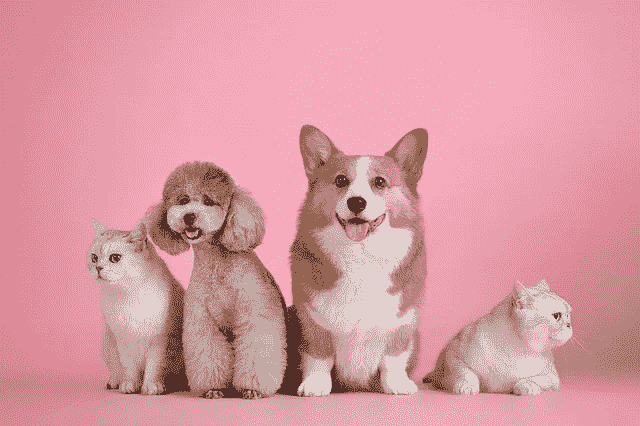

source: pixabay.com

上周末我在大声思考。

> 如果我有一个非常非常小的图像数据集，我自己捕获的，并想教计算机识别或区分一些特定的类别。

假设我有几千张图像，我想训练一个模型来自动检测一个类和另一个类。既然我只有这么少的数据，我能训练一个深度神经网络来成功地对这些图像进行分类吗？

嗯，在做了一些研究后，我发现必须用很少的数据训练深度神经网络是人们在计算机视觉领域遇到的常见情况。


Image source: pixabay.com

> 好吧，让我们面对现实吧，并不是每个人都可以像谷歌或人脸那样访问大数据，而且有些数据很难获得。

但是我也发现这个问题的解决方法很简单。所以今天我将带你训练一个**卷积神经网络**使用这一点点图像数据，你必须得到一个真正好的分类器，其准确率约为 81%。

在这篇[](/transfer-learning-and-image-classification-using-keras-on-kaggle-kernels-c76d3b030649)**的文章中，我介绍了一种叫做**迁移学习**的非常强大的技术，它帮助我们将准确率提高到大约 95%。**

****

**Image source: pixabay.com**

> **好了，你可以出去开始收集数据了。**

**我将使用 K [aggle](https://www.kaggle.com/c/dogs-vs-cats-redux-kernels-edition/data) 平台上现有的猫狗数据集。——是的，我很懒。我拿不到自己的数据。**

****

**kaggle.com**

**[Kaggle](https://www.kaggle.com) 是全球数据科学和机器学习从业者的家园。他们举办了一些最大的数据科学竞赛，这是一个获得开源数据以及向获奖专家学习的好地方。**

****

**Yes i’m a Zindian. source: zindi.africa**

**我觉得我应该这么说。如果你来自非洲，我们有一个名为 [**Zindi**](http://zindi.africa/) 的新平台，它类似于 **Kaggle** ，但对非洲社会进行了微调。它包含从非洲企业和组织收集的数据集。这是防止 AI 偏见的一大步， [**Zindi**](http://zindi.africa/) 就是一个很棒的平台。**

> **所以小心那些津迪亚人，我们来了。**

**好了，回到获取数据。我们前往 Kaggle 上的这个[页面](https://www.kaggle.com/c/dogs-vs-cats-redux-kernels-edition/data)。这里我们有两个选择，我们可以下载数据并在我们的笔记本电脑上本地训练我们的模型，或者我们可以使用 Kaggle 内核，它为我们提供了更多的计算能力，访问 GPU，以及几乎所有预安装的用于机器学习和深度学习的库。**

**[](https://blog.usejournal.com/meet-journal-d222fce8db1d)**

**我不知道你怎么想，但我宁愿用 Kaggle 内核，除非我有 GPU。**

**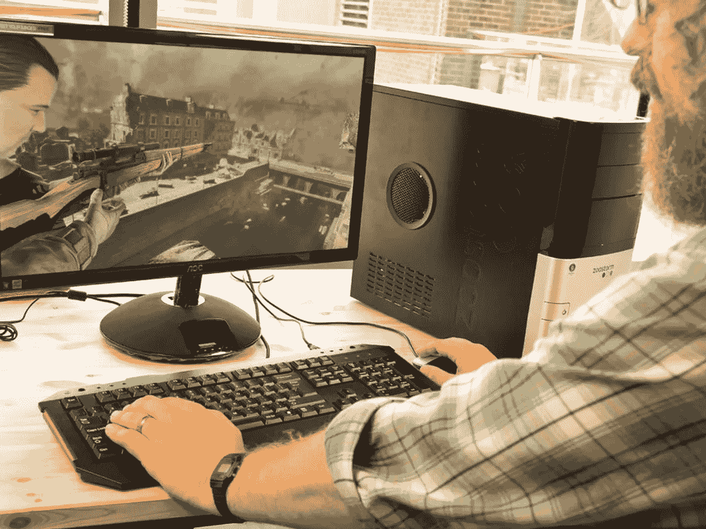**

**source: pcmag.com**

**如果你买得起 GPU，或者你是一个***游戏玩家，我完全虚构了这个词***，并且已经有了一个 GPU，并且你想在你的 PC 上训练你的模型，因为你**太喜欢你的 PC 了，那么你可以按照这个 [**教程**](/build-and-setup-your-own-deep-learning-server-from-scratch-e771dacaa252) 或者这个**[**one**](https://medium.com/@fabiograetz/setting-up-your-personal-deep-learning-station-with-ubuntu-16-04-2bc3ed2d7bb3)建立你自己的深度学习工作站。**********

**对于其余懒惰或目前负担不起的 GP-us，让我们前往 K [阿格尔](https://www.kaggle.com/c/dogs-vs-cats-redux-kernels-edition/kernels)并启动这个引擎。**

**点击链接，我们传送到这里。**

**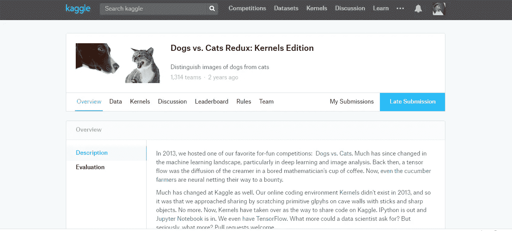**

**cats vs dogs kernel on kaggle**

**注意:当你访问一个 Kaggle 竞赛页面时，阅读数据描述通常是一个好主意。**

**接下来，点击**内核**，然后点击右上角的蓝色**新内核**按钮，这将要求您**选择内核类型**。选择笔记本，这样我们可以做一些交互式编程。**

**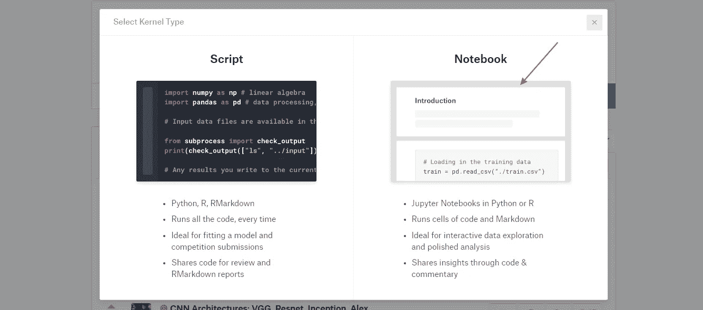**

**如果你不知道什么是笔记本或者需要刷新你的 ***notebooking*** 技能，这里的[](https://www.dataquest.io/blog/jupyter-notebook-tutorial/)**和这里的[](https://www.datacamp.com/community/tutorials/tutorial-jupyter-notebook)**都是很棒的关于 Jupyter 笔记本的教程网站。******

******点击 Notebook 为你创建一个新的私有内核，并自动将 dogs vs cats 数据集添加到你的文件路径——云中的**当然还有*。*******

*******给你的内核取个名字，并使用你的超级能力( **GPU** )来加快计算速度。*******

*****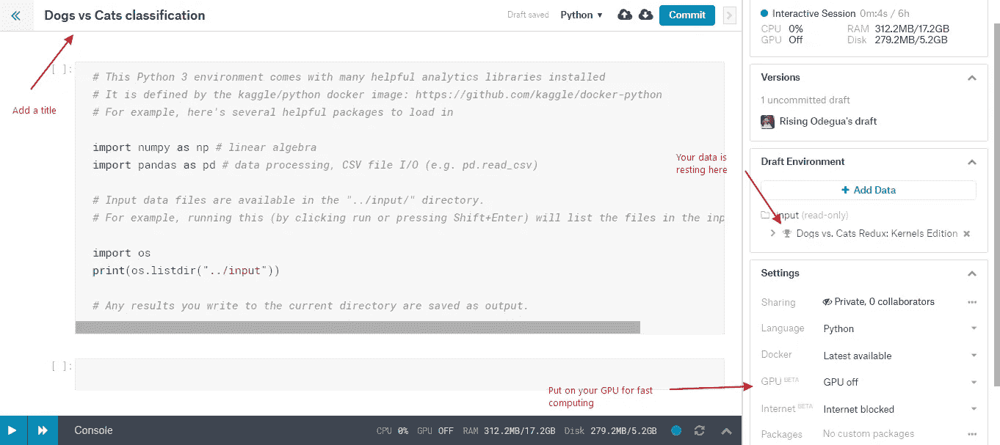*****

*****Your Notebook opens like this*****

*****现在我们的内核已经准备好了，让我们导入一些将要使用的库。键入下面的代码并按下 ***shift 回车*** 来运行单元格。*****

*****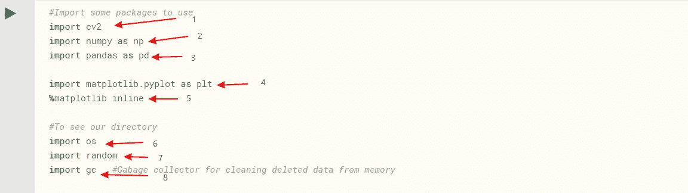*****

*****Import the following libraries*****

1.  *******cv2** [**cv2**](https://opencv.org/)也叫**[**OpenCV**](https://opencv.org/)，是 Python 等多种高级编程语言中可用的图像和视频处理库。它用于各种图像和视频分析，如面部识别和检测、车牌读取、照片编辑、高级机器人视觉、光学字符识别等。在本教程中，我们将使用它来读取和调整我们的图像。*******
2.  *****[**NumPy**](https://en.wikipedia.org/wiki/NumPy) 是 Python 中最流行的数学库。它使大型多维数组和矩阵的工作和计算变得非常容易和快速。它有大量的高级数学函数来处理这些数组。*****
3.  *****[**Pandas**](https://pandas.pydata.org/)**Pandas 是一个为 Python 编程语言编写的用于数据操作和分析的软件库。特别是，它提供了数据结构和操作来操作数字表和时间序列。*******
4.  *******[**Matplotlib**](https://matplotlib.org/)**是 Python 的一个绘图库。它可以用来绘制线，条形图，图表，直方图，甚至显示图像。*********
5.  *********%matplotlib inline** 是一个让我们的图出现在笔记本中的命令。*******
6.  *****操作系统是一个内置的 python 包，用于访问你的计算机和文件系统。它可以用来显示目录中的内容，创建新的文件夹，甚至删除文件夹。*****
7.  *******random** 将帮助我们创建随机数，这些随机数将在我们分割或打乱数据集时使用。*****
8.  *******gc** 垃圾收集器的简称，是手动清理和删除不必要变量的重要工具。我们将在 Kaggle 内核上积极使用它，因为由于我们正在处理图像数据集，分配给我们的空闲内存可能会变满。*****

*****导入必要的库后，我们将图像读入内存。数据以 Zip 文件的形式存储在我们的内核中。*****

*****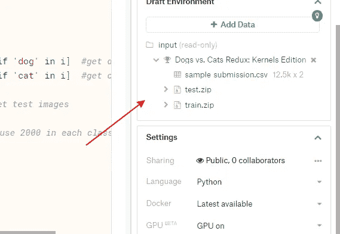*****

*****Our data*****

*****我们可以看到三个文件:*****

1.  *****sample submission.csv
    这是一个 csv(逗号分隔值)文件，用于在训练您的模型并在给您的测试文件上进行测试后进行提交。由于本次比赛已经结束，我们不能提交，所以我们将忽略此文件。*****
2.  *****test.zip
    该文件包含我们将在训练后测试我们的模型的图像，以了解我们的模型是否已经学会区分狗和猫。*****
3.  *****这是我们模特的食物。它包含了我们将要用来教我们的模型一只狗或一只猫长什么样的数据。*****

*****现在，为了访问我们的训练图像，我们将使用我们之前导入的**操作系统**包。*****

> *****注意:kaggle 上的所有数据文件路径都以根目录 ***开始../输入。例如，这个内核中训练数据的文件路径将是../输入/训练********

*****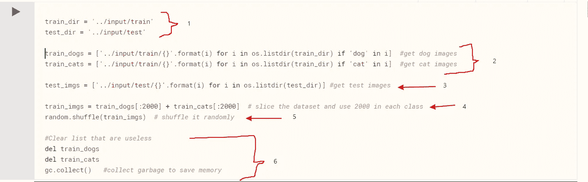*****

*****import our Images*****

1.  *****在这里，我们为我们的训练和测试数据创建一个文件路径*****
2.  *****这里我们创建两个变量 ***train_dogs*** 和 ***train_cats*** 。一个用于所有的狗图像，另一个用于猫图像。我们编写一个列表理解，使用命令 ***os.listdir()*** 获取列车数据 zip 文件中的所有图像，并检索名称中带有*狗*的所有图像。
    **我们对猫的图像也是如此。*****
3.  *****我们也得到我们的测试图像。*****
4.  *****训练数据集总共包含 25，000 幅图像，但由于我们正在试验使用一个小数据集，并且我们显然只能使用很少的计算能力，因此我们将从两个类中仅提取 2000 幅图像。
    ** 2000 张狗图像和 2000 张猫图像，制作 4000 张图像的训练数据集。
    所以我们从 ***train_dogs*** 和 ***train_cats*** 中抓取前 2000 个图像，然后将它们连接成一个名为 ***train_imgs*** 的训练集。*****
5.  *******非常重要！**
    我们随机洗牌 ***train_imgs。********
6.  *****在这里，我们做一些清洁。你可能已经注意到了，我们现在有 ***train_imgs*** 意为 ***train_dogs*** 和 ***train_cats*** 变量是无用的，并且占用了不必要的空间。如果我们不删除它们，当我们开始训练我们的模型时，我们可能会耗尽内存。*****

*****好的，让我们来看看 **train_imgs** 中的一些图片。*****

*****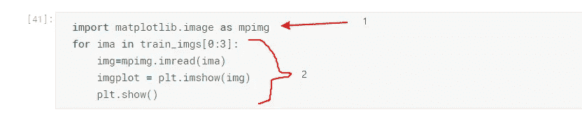*****

*****lets view some cute dogs*****

1.  *****从 matplotlib 导入图像绘图模块*****
2.  *****运行 for 循环来绘制 ***train_imgs*** 中的前三幅图像*****

*****请记住这是一个随机列表，但幸运的是，当我运行代码时，前三个图像是由两只狗和一只猫组成的，请注意它们有不同的尺寸。*****

*****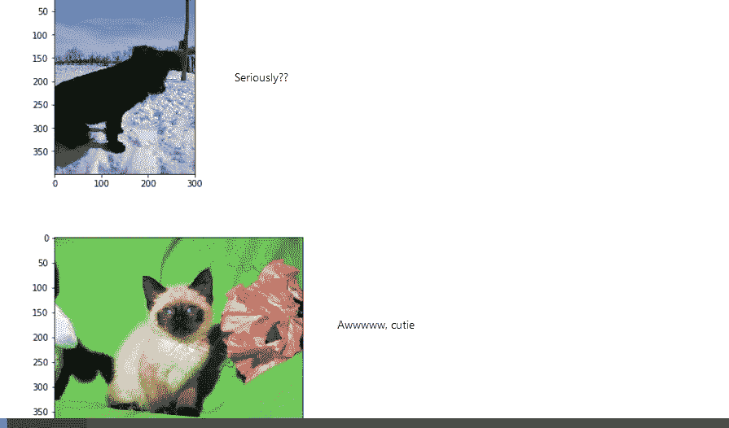*****

*****The last two images of plot*****

*****在下一个代码块中，我们将使用 **cv2** 模块来调整图像的大小。
首先让我们声明我们想要使用的新维度。在这里，我使用 150 乘 150 的高度和宽度和 3 个通道。*****

*****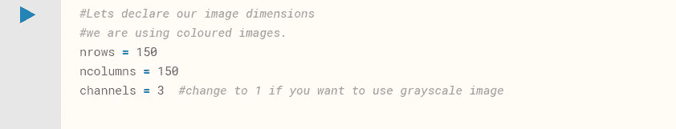*****

*****declare some important variables*****

*****彩色图像由 3 个通道组成，即红色、绿色和蓝色像素值的 3 个阵列。我们可以使用 1 个通道来读取灰度格式(黑白)的图像。*****

*****现在，让我们写一个小函数，它也有助于阅读，然后调整我们的图像到上面提到的高度和宽度。*****

*****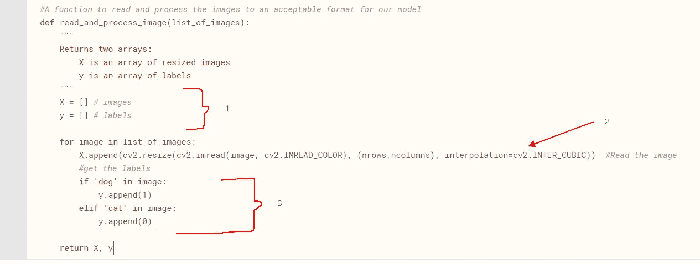*****

*****helper function*****

1.  *****创建一个新变量 ***X*** ，它将保存新的训练集，而 ***y*** 将保存我们的训练标签。(如果图像是狗，则为 1；如果图像是猫，则为 0)*****
2.  *****我们一个接一个地读取我们的图像，并用 ***cv2*** 命令调整它们的大小。*****
3.  *****如果图像是一只狗，我们将 1 添加到 ***y*** 中，如果图像是一只猫，我们将 0 添加到图像中。*****

*****现在，让我们调用我们的函数并处理图像。*****

```
*****X, y = read_and_process_image(train_imgs)*****
```

*****x 现在是图像像素值的数组，y 是标签的列表。我们来预览一下 x 中的第一张图片。*****

*****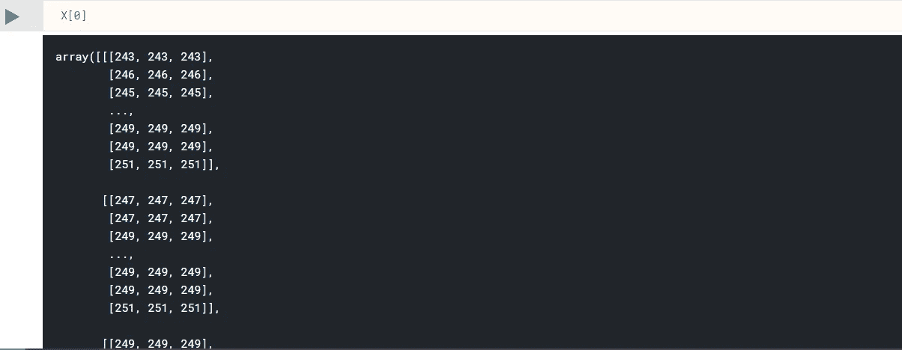*****

*****Yea, that’s what your computer calls a dog*****

*****我的朋友是一只狗。或者我们可以说我们的电脑称之为狗。等等！我怎么知道它是一只狗？好吧，让我们看看标签列表 ***y*** 中的对应值。*****

*****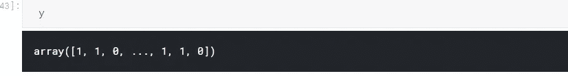*****

*****remember 1 for dog and 0 for cat*****

*****嗯，记得我们说过让 1 和 0 分别代表狗和猫。*****

*****还是不相信我。然后，让我们绘制 X 的前 5 个数组。我们不能用上面的***matplotlib . image***的 **mpimg** 模块绘制 X 中的图像，因为这些现在是像素数组，而不是原始的 ***jpg*** 文件。所以我们应该使用 ***imshow*** ()命令。*****

*****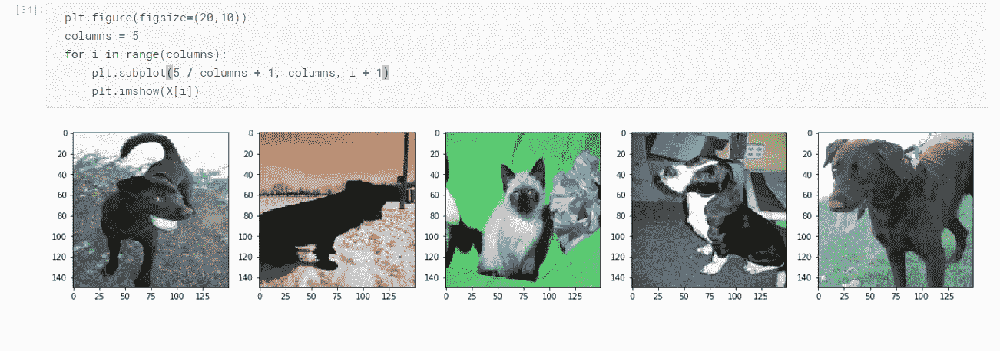*****

*****plot the first five images*****

*****现在，我们确信我们的训练集包含了适当的狗和猫的图像，让我们看看我们的标签。记住我们总共有 4000 张图片(2000 只狗和 2000 只猫)，因此我们的标签列表 **y** 应该包含 2000 张 1 和 2000 张 0。让我们画出这个并确认。*****

*****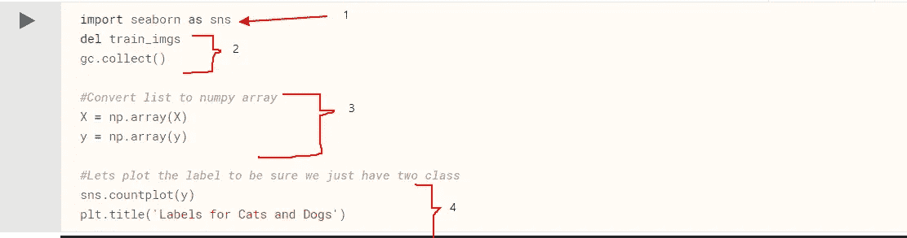*****

1.  *****我们导入了 ***seaborn*** 包，这是另一个构建在 ***matplotlib*** 之上的绘图包，它给出了非常漂亮的绘图。*****
2.  *****记住，我们是爱整洁的人，我们不会等着清洁工来为我们打扫卫生。所以我们删除了 ***train_imgs*** ，因为它已经被转换为一个数组并保存在 ***X.*** 中*****
3.  *****x 和 y 目前是 list 类型(python 数组的列表)，我们将把它们转换成 ***numpy*** 数组，这样我们就可以把它输入到我们的模型中。*****
4.  *****绘制一个彩色图表来确认我们的 y 标签变量中的类的数量*****

*****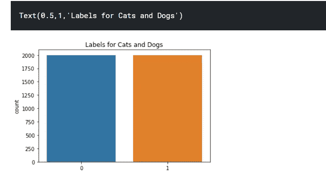*****

*****bar count of labels*****

*****太好了！我们有 2000 个狗和猫的班级。我们继续吧。*****

*****接下来让我们检查数据的形状。总是检查和确认你的数据的形状，这是非常重要的。*****

*****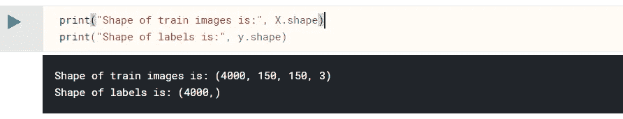*****

*****shape of our data*****

*****我们可以看到，我们的图像是一个秩为 4 的张量，或者我们可以说是一个 4 维数组，其尺寸为 4000 x 150 x 150 x 3，分别对应于批次大小、高度、宽度和通道。*****

> *****我们的图像数组的形状对于我们将要构建的 **keras** 模型非常重要。该模型将(高度、宽度、通道)的数组作为输入*****

*****现在我们的数据已经准备好了(X，y ),我们可以开始训练，但是首先我们必须做一些非常重要的事情，那就是将我们的数据分成训练集和验证集。这是开始训练模型之前要做的最重要的事情之一。*****

*****对于拆分，我们将使用 python 中一个流行的机器学习包中的一个方便的函数，名为 ***sklearn*** 。*****

*****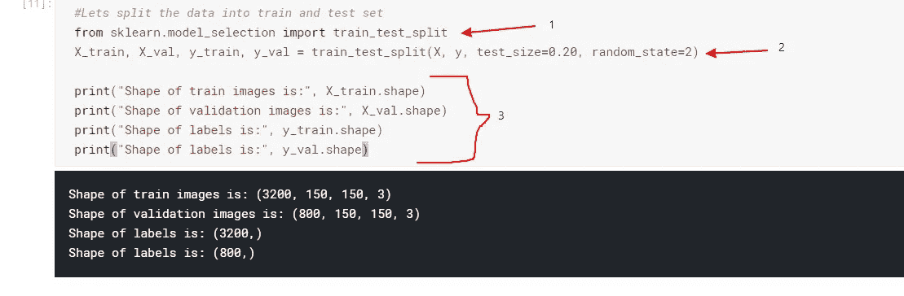*****

1.  *****从 ***sklearn*** 导入 ***train_test_split********
2.  *****我们告诉函数，我们希望将 20%的数据分配给验证集，而将另外 80%的数据分配给训练集。*****
3.  *****这里我们打印了新的训练和验证集的形状*****

*****接下来，我们将声明在训练我们的模型时将使用的一些重要变量。*****

*****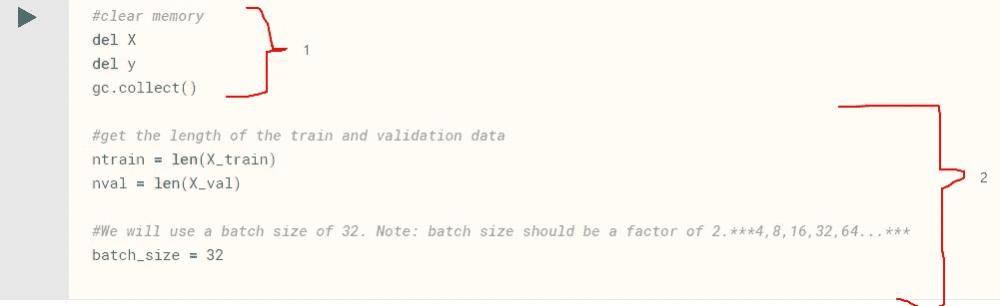*****

1.  *****是的，我们还在打扫。*****
2.  *****获取训练集和验证集的长度。*****

*****wheeeeew…现在是时候创建我们的模型了。*****

*****我们将使用卷积神经网络(convnet)来训练我们的模型。当涉及到计算机视觉问题时，Convets 是当前的标准。在任何图像问题上，它们总是胜过其他类型的神经网络。*****

*****刚接触 convnets？在这篇文章的最后，有一些很好的网站链接，你可以在那里了解它们。*****

*****在创建我们的模型时，我们将使用 [**KERAS**](https://keras.io/) 。*****

> *****根据维基百科…*****

> *****Keras 是用 Python 编写的开源神经网络库。它能够在 TensorFlow、微软认知工具包或 Theano 上运行。旨在实现深度神经网络的快速实验，它专注于用户友好、模块化和可扩展。*****

*****首先，让我们导入将要使用的必要的 keras 模块*****

*****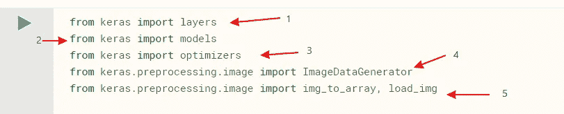*****

1.  *****这里我们导入 keras [***图层***](https://keras.io/layers/about-keras-layers/) ***模块*** 其中包含深度学习中使用的不同类型的图层，例如:
    **卷积层(主要用于计算机视觉)
    **池层(也用于计算机视觉)
    **递归层(主要用于序列和时间序列建模)
    **嵌入层(主要用于自然语言处理)
    **规范化层
    **等等*****
2.  *****这里我们导入 keras [***模型***](https://keras.io/models/about-keras-models/) ，它包含两种类型:
    * *我们将在本教程中使用的顺序模型和
    * *带有函数式 API 的模型*****
3.  *****这里我们导入 keras[***optimizer***](https://keras.io/optimizers/)***，一个模块*** 包含不同类型的反向传播算法用于训练我们的模型。这些优化器包括:
    **sgd(随机梯度下降)
    **rmsprop(均方根传播)
    * * Adams
    * * Adagrad
    * * Adadelta*****
4.  *****这里我们导入一个最重要的函数( **ImageDataGenerator** )，在处理小数据集时使用。以下是更多相关信息。*****

*****现在让我们创建我们的网络架构。我们将遵循一个流行、有效和简单的架构，叫做 [**VGGnet**](https://arxiv.org/pdf/1409.1556)*****

*****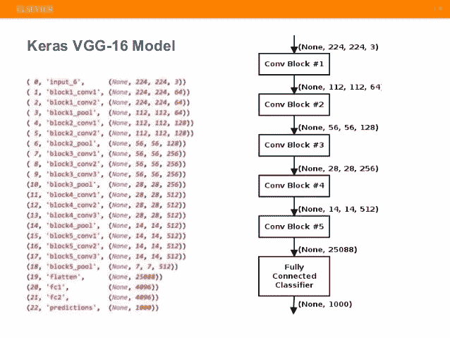*****

*****slide from [Elsever](https://www.slideshare.net/sujitpal/transfer-learning-and-fine-tuning-for-cross-domain-image-classification-with-keras)*****

> *****网络架构只是我们排列卷积层的方式*****

*****我们将使用一个小的 vggnet，但你可以在下面看到，我们的过滤器大小随着我们向下分层而增加。*****

*****32 → 64 →128 →512 —最后一层是 1*****

*****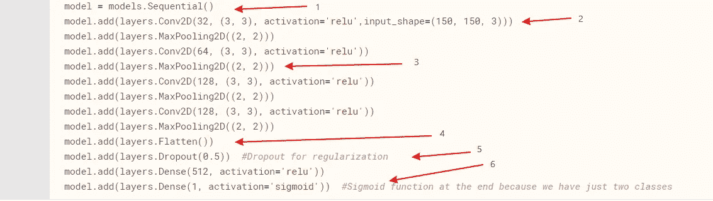*****

1.  *****这里我们创建一个序列模型。这告诉 keras 按顺序堆叠所有层。*****
2.  *****这里我们通过调用**来创建第一层。在我们创建的模型上添加()**函数，并传递我们想要的图层类型——一个 **Conv2D** 图层。这第一层被称为**输入层**，有一些我们需要设置的重要参数。
    ****** **滤波器大小** [ **32** ]:这是输出维度的大小(即卷积中输出滤波器的数量)
    *** *****kernel _ size[3，3]:** 这指定了 2D 卷积窗口的高度和宽度。
    ****激活** [' **relu** ']:我们选择一个激活函数，也称为非线性，供我们的神经网络使用。R ***eLU*** (整流线性单位)是当今最常用的激活函数，其他变体还有*R***eLU***和 eLU ***。* **输入形状[150，150，3]:** 还记得我们调整图像的尺寸吗？150 乘 150 对吗？我们在这里通过，包括通道 3。
    我们不传递第一个维度 4000，因为这是批量维度。******
3.  ******这里我们添加一个[***maxpool 2d***](https://keras.io/layers/pooling/#maxpooling2d)图层。它的功能是减少输入特征的空间大小，因此有助于减少网络中的参数和计算的数量，从而有助于减少过拟合。******

********过拟合**发生在我们的模型记忆训练数据的时候。该模型在训练时表现出色，但在测试时会失败。******

1.  ******这里我们添加一个**展平**层。conv2D 图层提取并学习空间要素，然后在展平后将其传递给密集图层。这是展平层的工作。******
2.  ******这里我们添加一个值为 0.5 的下降层。Dropout 随机丢弃神经网络中的一些层，然后使用简化的网络进行学习。通过这种方式，网络学会在单个层上独立而不可靠。底线是，它有助于过度拟合。
    ***0.5*** 表示随机掉一半的图层。******
3.  ******最后一层的输出大小为 1，激活函数称为 ***sigmoid。*** 这是因为我们试图检测一张图片是狗还是猫。也就是说，我们希望模型输出图像是狗而不是猫的概率，这意味着我们需要一个概率分数，其中较高的值意味着分类器认为图像是狗，较低的值意味着它是猫。
    sigmoid 非常适合这种情况，因为它接受一组数字，并返回 0 到 1 范围内的概率分布。******

******我们可以通过调用 Keras 函数**来预览我们的 convnet 的排列和参数大小。模型对象上的 summary()** 。******

******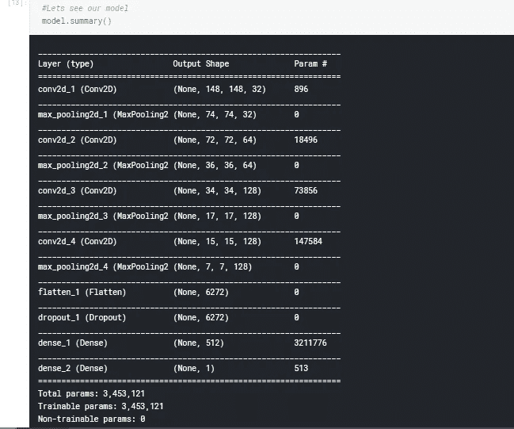******

******我们可以看到我们想要训练的参数的数量(300 多万)和不同层的一般排列。******

> ******下一步是编译我们的模型。******

******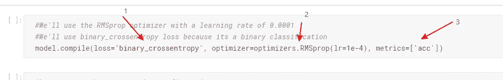******

******我们向 model.compile()命令传递三个参数******

1.  ******l**OSS[' binary _ cross entropy ']:**我们指定一个损失函数，我们的优化器将最小化它。在这种情况下，因为我们正在处理两类问题，所以我们使用 ***二进制交叉熵损失*** 。******
2.  ******还记得我们之前定义的 ***优化器*** 吗？我们将使用其中一个名为 ***rmsprop*** 的。这不是一个固定的选择，这是一个叫做 ***超参数调整*** 的过程的一部分，这可能就是世界级模型和幼稚模型的区别。******
3.  ******在这里，我们指定在训练后测量模型性能时要使用的指标。我们想知道我们的模型做得好不好。
    既然我们在做分类问题，那么精度指标 **(acc)** 是个不错的选择。
    **注:**您用来衡量模型性能的指标将取决于您正在处理的问题的类型。******

******最后，在我们开始训练我们的模型之前，我们需要执行一些规范化。即缩放我们的图像像素值，使其具有单位标准偏差和平均值 0。******

******我们将使用 Keras 中一个名为***imagedata generator***的重要模块，当我们在训练期间将图像输入模型时，它会执行一些重要的功能。******

> ******但是……但是什么是图像数据生成器呢？******

******根据 Keras [**的创建者 Fran ois Chollet**](https://twitter.com/fchollet?ref_src=twsrc%5Egoogle%7Ctwcamp%5Eserp%7Ctwgr%5Eauthor)的说法，Keras ImageDataGenerator()让我们可以快速设置 python 生成器，自动将图像文件转换为预处理张量，可以在训练期间直接输入到模型中。它很容易为我们执行以下功能:
1 .将 JPEG 内容解码为像素的 RGB 网格。
2。把这些转换成浮点张量。
3。将像素值(在 0 和 255 之间)重新缩放到[0，1]区间(神经网络在规格化数据时表现更好)。
4。它帮助我们轻松地增强图像。(这是我们将使用的一个重要特性，因为我们是在一个小数据集上进行训练的)。******

******好了，让我们创建我们的 ImageDataGenerator 对象。我们将创建两个生成器，一个用于训练集，另一个用于验证集。******

******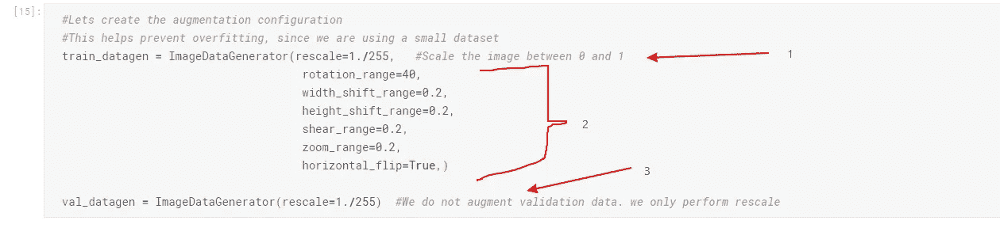******

1.  ******我们将 rescale 选项传递给 **ImageDataGenerator** 对象。 ***重新标度=1。/255*选项是一个非常**重要的**参数。它将图像像素值标准化为平均值为零，标准偏差为 1。它有助于您的模型有效地学习和更新其参数。********
2.  ****第二组选项是图像增强。他们告诉 **ImageDataGenerator** 对图像随机应用一些变换。这将有助于扩大我们的数据集，提高泛化能力。****
3.  ****这里我们还为我们的验证集创建了一个 **ImageDataGenerator** 对象。注意:我们这里不做数据扩充。我们只执行 ***重新调整*** 。****

****既然我们有了 **ImageDataGenerator** 对象，让我们通过传递我们的训练和验证集从它们创建 python 生成器。****

****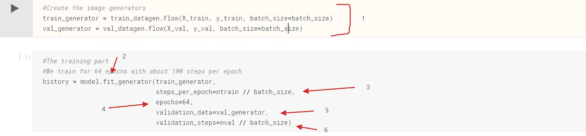****

1.  ****我们称之为 ***。我们在上面创建的数据生成器上的 flow( )*** 方法传递数据和标签集。
    **X_train** 和 **y_train** 用于训练，然后 **X_val** 和 **y_val** 用于验证。
    批次大小告诉数据生成器一次仅获取指定批次(在我们的例子中为 32)的图像。****
2.  ****现在我们通过调用**来训练我们的网络。在**模型**上拟合()**方法并传递一些参数。第一个参数是训练集***imagedata generator***object[**train _ generator**]。****
3.  ****这里我们指定每个时期 的 ***步数。这告诉我们的模型，在对我们的损失函数进行梯度更新之前，我们想要处理多少图像。
    总共 3200 张图像除以 32 的批量大小将得到 100 个步骤。这意味着我们将在整个训练集中一次对我们的模型进行总共 100 次梯度更新。*******
4.  ****一个**历元**是整个训练集的一个完整周期或一遍。在我们的例子中，当我们按照我们的 **steps_per_epoch** 参数的指定进行 **100 次梯度更新**时，就达到了一个 epoch。
    E **pochs = 64** ，意味着我们要检查我们的训练数据 64 次，每次我们将进行 100 次梯度更新。****
5.  ****我们传递我们的验证数据生成器。****
6.  ****我们也在这里设置步长。我将使用与上述相同的步长。****

> ****运行细胞开始训练…这需要一段时间。去推特上打扰某人吧…****

****仅仅过了 64 个时期，我就获得了大约 80%的准确率。****

****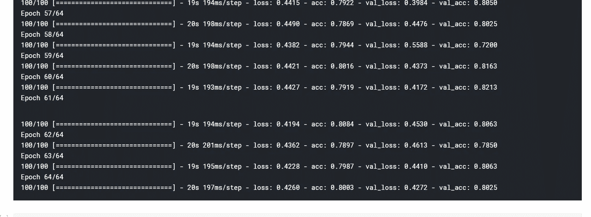****

****screenshot of model training****

> ****对于一个我们用很少的数据从零开始训练的模型来说，这已经不错了。****

****也许增加历元的数量和使用一些超参数，如批量大小和优化器，将有助于提高这个分数。****

> ****我将把那留给你去探索。****

****接下来，我们保存我们的模型，使用下面显示的简单的 Keras 函数，这样我们可以随时重用它，而不是在重新运行我们的笔记本时再次训练。****

```
****#Save the modelmodel.save_weights('model_wieghts.h5')
model.save('model_keras.h5')****
```

****我们将绘制一些训练集和验证集中的准确性和损失的图表，看看我们是否可以获得一些见解。****

****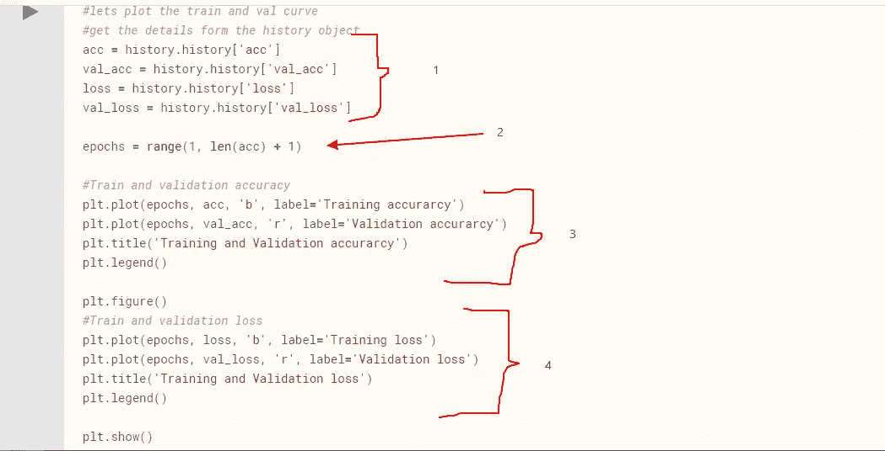****

1.  ****在训练一个 Keras 模型之后，它总是计算并保存我们在一个名为 ***history*** 的变量中编译我们的模型时指定的指标。我们可以提取这些值并绘制出来。
    **注**:历史对象包含训练过程中发生的所有更新。****
2.  ****这里我们简单的从' ***acc'*** 列表中的数值个数得到我们 ***epoch*** 的大小。****
3.  ****这里我们绘制了精度与历元大小的关系。****
4.  ****这里我们绘制了损失与历元大小的关系。****

****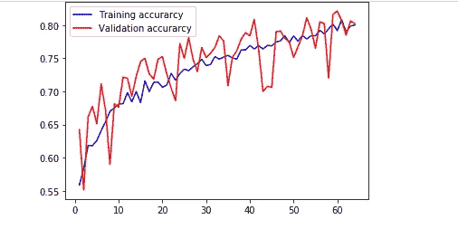****

****Plot of accuracy against epochs****

****那么我们能从这个情节中学到什么呢？****

1.  ****首先要注意的是，我们没有过度拟合，因为训练和验证准确性非常接近，并且相互跟随。****
2.  ****我们还可以注意到，精度随着历元的增加而不断增加，这给我们一种直觉，即增加历元大小可能会给我们带来更高的精度。****

****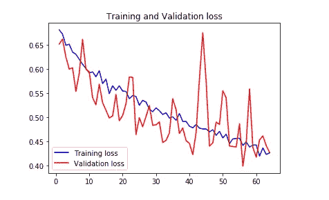****

****Plot of loss against epochs****

****我们仍然没有过度拟合，因为训练和验证损失都呈下降趋势，就像上面的准确度图一样，如果我们增加历元大小，损失可能会更低..****

> ****所以，你已经有了一些直觉。现在尝试增加历元大小，并使用一些超参数。****

****在我结束本教程之前，我们将在测试集中的一些图像上测试我们的模型。****

****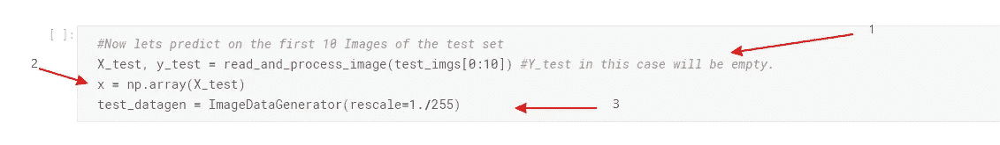****

****code to pre-process the test Images****

****我们在训练和验证集上执行相同的预处理。****

1.  ****我们读取测试集中的前 10 幅图像，并将其转换为数组列表。
    **注:** y_test 将为空，因为测试集没有标签。****
2.  ****我们将数组列表转换成一个大的 numpy 数组。****
3.  ****我们创建了一个测试 **ImageDataGenerator** ，并且只执行标准化。
    **注意**:我们不扩充测试集。****

****现在我们将创建一个简单的 for 循环，它遍历来自生成器的图像来进行预测。然后我们将绘制结果。****

****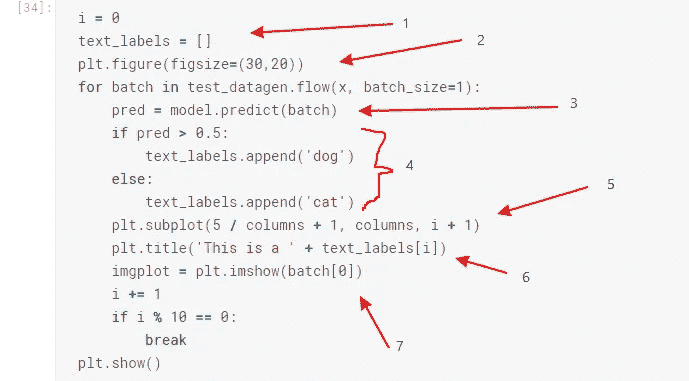****

1.  ****创建一个列表来保存我们将要生成的标签。****
2.  ****我们设置将要绘制的图像的图形大小。****
3.  ****这里我们通过调用**对 **ImageDataGenerator** 提供的特定图像进行预测。predict( )** 方法在我们训练好的模型上。****
4.  *******pred*** 变量是模型确定当前图像是狗的概率。
    因为我们给狗的标签是 1，所以高概率——至少大于平均 0.5——意味着我们的模型非常确信图像是狗，否则就是猫。
    因此，我们简单地创建一个 ***if -else*** 语句，如果概率大于 0.5，该语句将字符串“ ***Dog*** ”追加到 **text_label。我们这样做是为了在绘图时给图像添加一个标题。******
5.  ****这里我们添加了一个支线剧情，这样我们就可以绘制多个图像。****
6.  ****这里，我们将预测的类作为标题添加到图像绘图中。****
7.  ****我们最终绘制出图像。****

****让我们看看我们的模型在以前看不到的图像上表现如何。****

****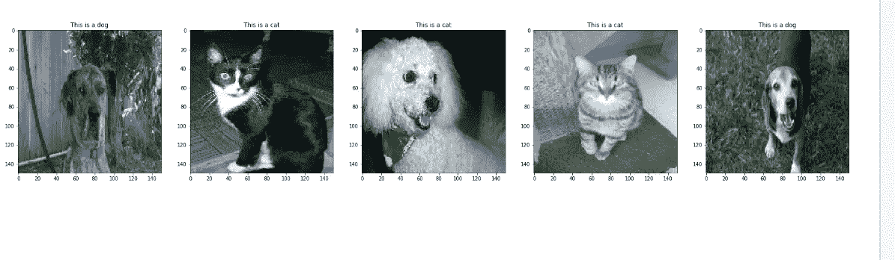****

> ****嗯…我们的模型从五幅图像中得到一个错误。我没说它处于最佳状态…至少现在还没有。****

****wheeew…这是一个很长的帖子，但我想这是值得的。在这个 [**下一个教程**](/transfer-learning-and-image-classification-using-keras-on-kaggle-kernels-c76d3b030649)**中，我们通过使用一个 ***预训练的网络，改进了我们的模型，达到了大约 95%的准确率。*** *一个过程叫做* ***转移学习。*********

************

******source: pixabay.com******

> ******好了，再见了，祝你编码愉快。******

******[**在 Github **上链接到这个笔记本****](https://github.com/risenW/medium_tutorial_notebooks/blob/master/dogs-vs-cats-keras-implementation.ipynb) 。******

****CNN 和 Keras 上一些惊人的帖子和文章。****

*   ****[用于视觉识别的 CS231n 卷积神经网络](http://cs231n.github.io/)。****
*   ****[Keras 的创造者 Francois Chollet 用 python 进行深度学习](https://www.amazon.com/Deep-Learning-Python-Francois-Chollet/dp/1617294438/ref=as_li_ss_tl?s=books&ie=UTF8&qid=1519989624&sr=1-4&keywords=deep+learning+with+python&linkCode=sl1&tag=trndingcom-20&linkId=ec7663329fdb7ace60f39c762e999683)。****
*   ****[卷积神经网络基础知识](https://pythonprogramming.net/convolutional-neural-network-cnn-machine-learning-tutorial/)。****
*   ****CNN 上一篇很棒的媒体文章。****
*   ****[CNN 直观指南](https://medium.freecodecamp.org/an-intuitive-guide-to-convolutional-neural-networks-260c2de0a050) |中帖。****
*   ****[Keras 教程](https://www.pyimagesearch.com/2018/09/10/keras-tutorial-how-to-get-started-with-keras-deep-learning-and-python/)。****

> ******欢迎提问、评论和投稿。******

> ******在** [**推特**](https://twitter.com/risingodegua) **上跟我连线。******
> 
> ******在**[**insta gram**](https://www.instagram.com/rising_developer/)**上跟我连线。******