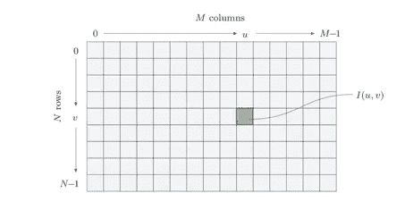
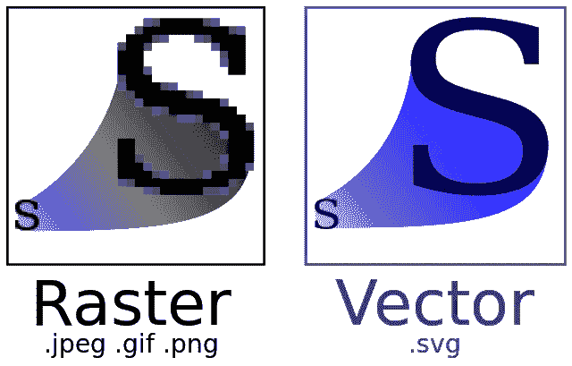
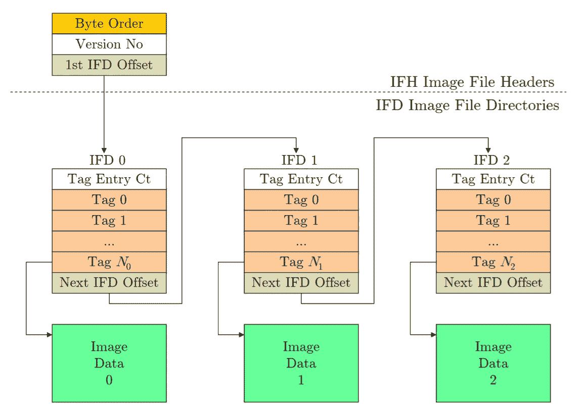
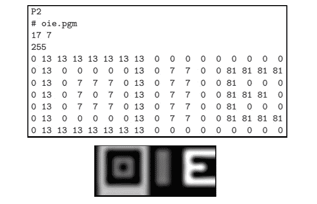
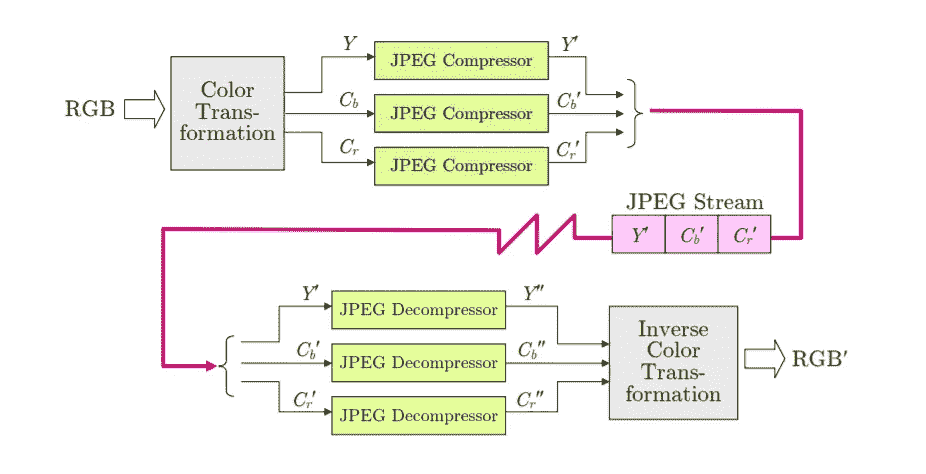

# 图像处理类别(EGBE443) #1.2 —数字图像

> 原文：<https://towardsdatascience.com/image-processing-class-0-2-digital-image-7509403b4c86?source=collection_archive---------10----------------------->

> 这篇文章是为了总结我在医学图像处理课上(EGBE443)学到的经验。如果我犯了什么错误，请纠正我。谢谢你。

上一篇文章是关于构建图像的最简单的方法。在这篇文章中，我将谈论什么是数字图像和每种文件格式的区别。

如果您还没有阅读上一篇文章，您可以点击下面的链接轻松找到它。:)

 [## 图像处理类(EGBE443) #0.1 —图像采集

### 大家好！我叫皮查亚·西普克汉姆。我是玛希隆生物医学工程系四年级学生…

towardsdatascience.com](/image-processing-class-egbe443-0-1-image-aquisition-7e80cc89de84) 

# 什么是数字图像？

D 数字图像是以计算机可以存储的形式(即以数字的形式)呈现的图像。这种形式易于操作，适用于图像处理。

**制作“数码快照”的方法有以下几个必要步骤:**

1.  **空间采样:**将连续信号转化为离散表示。这一步被称为图像的“空间采样”,它取决于传感器和采集设备的几何形状。
2.  **时间采样**:该过程通过定期测量入射到每个单独传感器元件上的光量来执行。
3.  **像素值的量化:**所有的像素值都被转换成一个范围内的整数值，例如 8 位= 256 或 12 位= 4096。但是在某些情况下，使用浮点值。(例如，医学图像处理)

## 数字图像的坐标系统

尺寸为 M x N(列 x 行)的图像表示为图像矩阵 I。每个像素由它们所在的行和列表示，原点坐标在图像的左上角(u = 0，v =0)。所以最大列和最大行分别是 M-1 和 N-1。

在现实世界中，每次测量的像素数量；例如，每英寸点数或每英寸线条数被称为图像的*'***'*。*

*每个像素的值取决于数据类型，该数据类型总是长度为 k (k 为 2 的幂)的二进制值，因此像素值可以是该范围内的任何值。k 值被称为图像的“比特深度”。*

*图像处理中你应该知道的另一个重要话题是*‘图像文件格式’。**

# *图像文件格式*

*任何图像都存储在内存中，光栅图像包含按规则矩阵排列的像素值。相反，矢量图像使用连续坐标表示几何对象。如果放大光栅图像，图像的分辨率将会丢失，但在矢量图像中不会发生这种情况。*

**

*Raster image and Vector image*

1.  ***标记图像文件格式(TIFF)***

*TIFF 旨在满足不同领域的专业需求。这种格式支持各种类型的图像，也支持灰度和真彩色图像。TIFF 提供了多种不同的压缩方法(LZW、ZIP、CCITT 和 JPEG ),它可以在单个 TIFF 文件中存储多种不同大小和表现形式的图像。*

*典型 TIFF 文件的结构由标题和图像对象的链接列表组成。每个图像对象都由一个“标签”列表组成，其对应的条目后跟一个指向实际图像数据的指针。*

**

*The structure of a typical TIFF file for three image object.*

***2。图形交换格式(GIF)***

*GIF 格式支持多位深度索引颜色，并可以通过在单个文件中存储大量图像并按顺序显示它们来编码简单的动画。这种格式设计用于灰度和彩色图像，最大深度为 8 位，不支持真彩色。*

***3。便携式网络图形(PNG)***

*PNG 是作为 GIF 格式的替代而开发的。PNG 支持三种不同类型的图像:*

*   *真彩色(3 x 16 位/像素)*
*   *灰度(16 位/像素)*
*   *索引(256 色)*

*PNG 为透明度提供了最大深度为 16 位的 alpha 通道。该通道只有一位深，并且该格式仅支持在一个文件中具有 2 行的最大 30 次方和 2 列的最大 30 次方的单个图像。*

***3。Windows 位图(BMP)***

*BMP 只是在 Windows 下使用，它支持灰度、真彩色和索引图像以及二进制图像，但每个像素都用一个完整的字节存储。*

***4。可移植位图格式(PBM)***

*PBM 格式将图像存储在人类可读的文本中，可以使用文本编辑器进行阅读和编辑。*

**

*Example of BPM file format read from text editor program.*

***5。JPEG***

*JPEG 是一种广泛使用的文件格式。JPEG 标准压缩方法取决于应用。在 RGB 图像的情况下，有三个主要步骤:*

*   ***颜色转换和下采样:**将颜色转换到 YCbCr 空间。y 和 C 分别是亮度分量和颜色分量。*
*   ***频率空间中的余弦变换和量化:**图像被分成 8 个块的网格，对于每个块，使用离散余弦变换来计算频谱。然后，将每个块的 64 个频谱系数量化到量化表中。*
*   ***无损压缩:**用无损方法压缩数据。*

**

*The process of JPEG compression method in RGB image.*

*实际上，JPEG 不是一种文件格式，而是一种压缩方法。Eric Hamilton 和 IJG 开发了一种关于 JPEG 压缩方法的文件格式，称为“JPEG 文件交换格式”或 JFIF。此外，还有一种称为可交换图像文件格式(EXIF)的文件格式，它是 JPEG(JFIF)的变体，也可以将图像存储在数码相机上。*

*希望你对数字世界中的图像有更清楚的了解。课程的下一个主题是关于应用和修改数字图像。你可以通过点击下面的链接很容易地找到下一篇文章。*

* [## 图像处理类(EGBE443) #2

### 这篇文章是为了总结我在医学图像处理课上(EGBE443)学到的经验。

medium.com](https://medium.com/@ptchaya.p/image-processing-class-egbe443-2-6beb2a8349e6)*