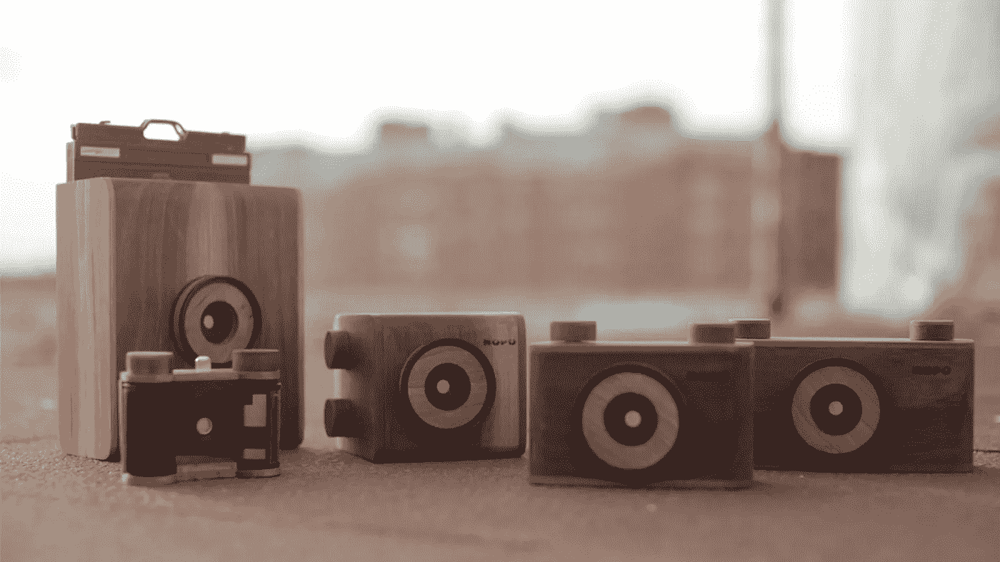
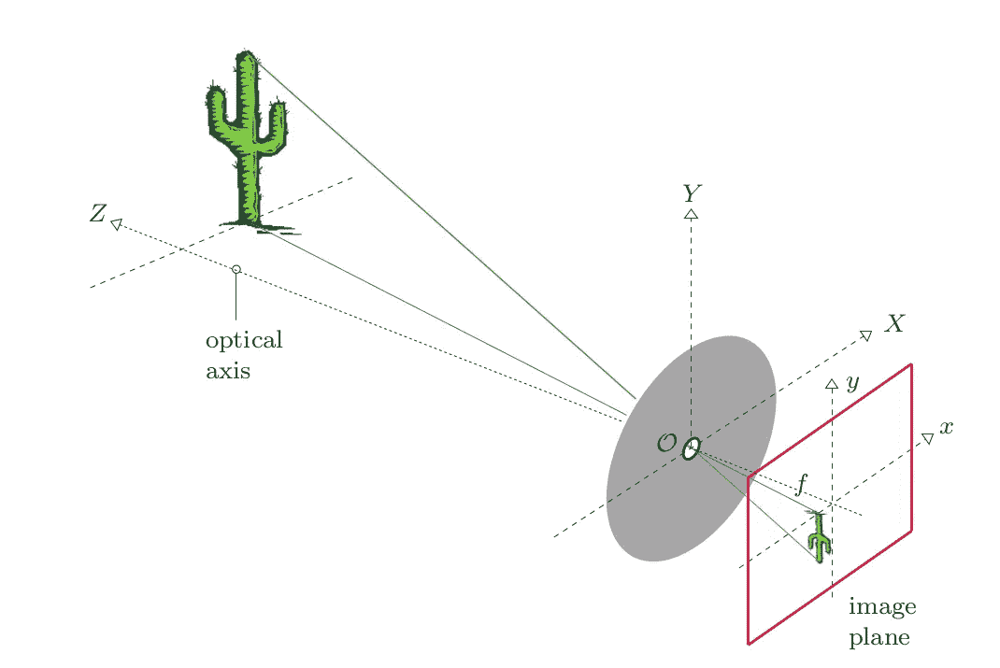
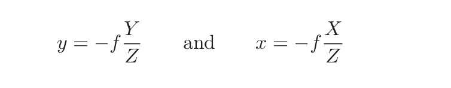
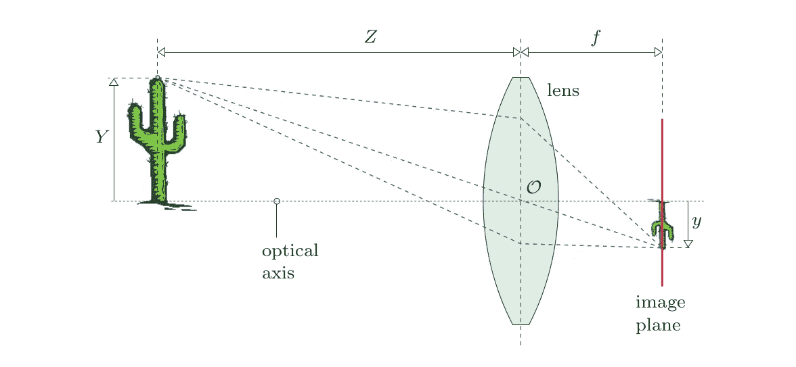
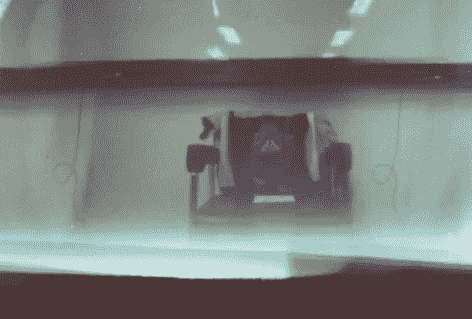
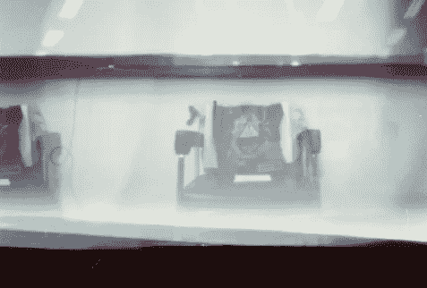
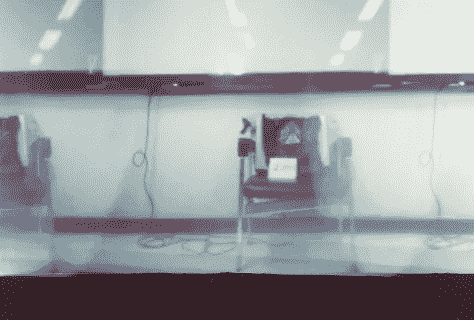
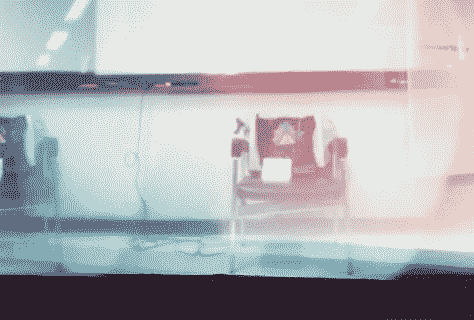

# 图像处理 1.1 级—图像采集

> 原文：<https://towardsdatascience.com/image-processing-class-egbe443-0-1-image-aquisition-7e80cc89de84?source=collection_archive---------15----------------------->

大家好！我叫皮查亚。我是玛希隆大学生物医学工程系的四年级学生。

> 我写这篇文章的目的是总结我在医学图像处理课程或 EGBE443 中学到的经验。如果我犯了什么错误，请纠正我。谢谢你。

先说第一个题目， ***图像采集*** 。

Image from NOPO Pinhole Camera

# 什么是图像采集过程？

图像采集是构建图像的过程。有一个执行这个过程的简单模型叫做 ***【针孔摄像机模型】*** 。

**针孔摄像机型号**

室内摄像机是生成图像的最简单的工具。它很容易制作，因为它的组件只是由一个漆黑的房间，一个叫做“针孔”的小洞和一个场景组成。为了形成图像，光线穿过针孔，入射到场景中。这会使图像变小并反转。

针孔摄像机的几何属性非常简单，如下图所示。

Geometric properties of the image from pinhole camera

从图中可以看出，物体位于离
针孔水平距离 Z 处，离光轴垂直距离 Y 处。f 是针孔和场景之间的距离。我们通过相似三角形原理找到了物体坐标 X，Y，Z 和图像坐标 X，Y，焦距 f 之间的关系。

The relationship between object coordinate and image coordinate.

然而，针孔照相机并不像预期的那样实用。较小的孔产生更清晰的图像，并且伴随着更长的曝光时间。所以使用 ***光学镜头型号*** 就是因为这些原因。为了使用，我们需要用薄透镜代替针孔。我们假设它无限薄。所以图像的几何形状类似于针孔摄像机的图像。薄透镜模型的几何特性如图所示。

The geometric properties of thin lens model

这个视频将向您展示如何制作针孔摄像机以及图像采集过程的结果。

我和我组里的朋友制作了一个针孔相机，并在不同的距离和快门速度下测试了第一个原型。这些是每个标准的结果。

*   与物体的距离= 1 米。速度快门= 5 秒

*   距离物体 1 米，快门速度 10 秒

*   距离物体 2 米，速度快门 5 秒

*   距离物体 2 米，快门 10 秒

*如你所见，很容易制作！让我们开始吧，享受你的相机！:)*

*无论如何，可调整的图像必须是数字图像。所以在下一章，我会解释这个话题。它让你明白它是如何适合这种形式的修改。*

***下面是下一篇文章。请点击它前往:)***

 [## 图像处理类别#0.2 —数字图像

### 这篇文章是为了总结我在医学图像处理课上(EGBE443)学到的经验。

medium.com](https://medium.com/@ptchaya.p/image-processing-class-0-2-digital-image-7509403b4c86)