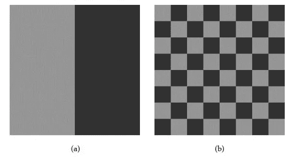
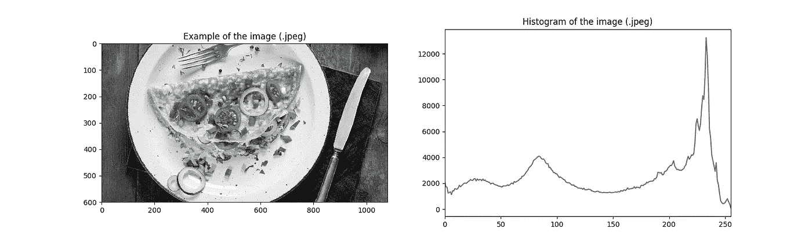

# 图像处理类别# 2-直方图

> 原文：<https://towardsdatascience.com/image-processing-class-egbe443-2-6beb2a8349e6?source=collection_archive---------8----------------------->

> 这篇文章是为了总结我在医学图像处理课上(EGBE443)学到的经验。

这篇文章是关于基本的图像处理。如果你是这个领域的新手，你可以点击下面的链接阅读我的第一篇文章。:)

[](/image-processing-class-egbe443-0-1-image-aquisition-7e80cc89de84) [## 图像处理类(EGBE443) #0.1 —图像采集

### 大家好！我叫皮查亚·西普克汉姆。我是玛希隆生物医学工程系四年级学生…

towardsdatascience.com](/image-processing-class-egbe443-0-1-image-aquisition-7e80cc89de84) 

在之前的帖子中，我已经谈到了数字图像。在这篇文章中，你会了解到 ***直方图*** ，这是一个必要的话题。

# 什么是直方图？

H istogram 是图像中强度值的频率分布。直方图条目取决于图像的比特深度(k)。例如，8 比特灰度图像包含 2⁸ = 256 的强度，强度在 0 到 255 的范围内。每个直方图条目被定义为 h(i)

h(i) =强度值为 I 的图像中像素值的数量

最小强度值 0 指的是颜色为黑色的像素，最大强度值 255 指的是颜色为白色的像素。

图像的直方图只提供统计信息，不提供空间信息。这是给出相同强度分布的两幅图像的例子。



Two different pictures, a. and b., provide the same histogram due to the equal number of the intensities.

# 计算直方图

在本节中，直方图是通过 python 编程代码(Python 3.6)的实现来计算的。

对于 python 3.6，有很多常用的图像处理模块，如 Pillow、Numpy、OpenCV 等。但是在这个程序中使用了 Pillow 和 Numpy 模块。

要从您的计算机导入图像，请使用此代码并更改您的路径，这是您的图像的位置。

```
img = Image.open('/PATH/') 
```

下一步，您需要将图像转换为灰度，并将变量类型转换为 numpy 数组，以便轻松计算直方图。

```
img = img.convert("L")  #Convert photo to gray scale
img = np.asarray(img)   #Convert variable type to numpy array
```

现在，图像准备计算直方图。用这个代码算算吧！

```
h = [0]*256                      
for x in range(img.shape[0]):        
    for y in range(img.shape[1]):            
        i = img[x,y]                  
        h[i] = h[i]+1
```

最后一步，变量 h 包含每个强度值的个数。我们可以使用 matplotlib 模块绘制直方图。这是我程序结果的一个例子。



The example image (.jpeg) and the plot of histogram

*下一章，主题是关于直方图的点操作和均衡化。这可能有助于提高图像质量。点击下面的链接，你可以很容易地找到下一篇文章。*

[](https://medium.com/@ptchaya.p/image-processing-class-egbe443-3-point-operation-477ad38334f5) [## 图像处理类(EGBE443) #3 —点操作

### 这篇文章是为了总结我在医学图像处理课上(EGBE443)学到的经验。

medium.com](https://medium.com/@ptchaya.p/image-processing-class-egbe443-3-point-operation-477ad38334f5)