# 图像处理等级#3 —点操作

> 原文：<https://towardsdatascience.com/image-processing-class-egbe443-3-point-operation-477ad38334f5?source=collection_archive---------14----------------------->

这篇文章是为了总结我在医学图像处理课上(EGBE443)学到的经验。

这篇文章是关于基本的图像处理。如果你是这个领域的新手，你可以点击下面的链接阅读我的第一篇文章。:)

[](/image-processing-class-egbe443-0-1-image-aquisition-7e80cc89de84) [## 图像处理类(EGBE443) #0.1 —图像采集

### 大家好！我叫皮查亚·西普克汉姆。我是玛希隆生物医学工程系四年级学生…

towardsdatascience.com](/image-processing-class-egbe443-0-1-image-aquisition-7e80cc89de84) 

有时，相机拍出的照片质量可能很差。它们是当时可怕光线的结果。因此，图像处理中提高图像质量的一个基本方法就是点运算。

## 概述

*   点运算
*   自动对比度调整
*   改进的自动对比度
*   直方图均衡
*   直方图规定化

# **什么是点操作？**

点操作是在不改变图像的大小、几何形状和局部结构的情况下修改像素值。新的像素值仅取决于先前的值。它们由函数 f(a)映射

如果函数 f()不依赖于坐标，则称之为"*全局*或"*齐次*"运算。另一种叫做*非齐次*点运算，如果依赖于坐标的话。非均匀点操作用于补偿图像采集期间的不均匀光照。

同质操作的常见示例包括:

*   **修改对比度和亮度**
*   **通过夹紧限制结果**
*   **反转图像**
*   **阈值操作**

点操作的实现对直方图的影响。提高亮度会将直方图向右移动，提高图像的对比度会扩展直方图。这些点操作通过包含常数的映射函数来映射强度，该常数是图像内容，例如最高强度和最低强度。

# 自动对比度调整

自动对比度调整是将图像中的最低强度和最高强度分别映射到全强度范围的最小和最大强度的方法(对于 8 位灰度图像，全范围为 0–255)。自动对比度调整的映射函数定义为

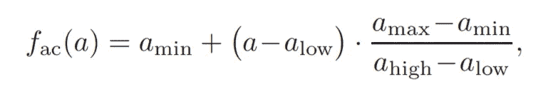

从等式中，a 最小值、a 最大值、a 低值和 a 高值分别是范围内的最小值强度、最大值强度、最低强度和最高强度。在 8 位图像的情况下，最小值=0，最大值=255，因此映射函数定义为

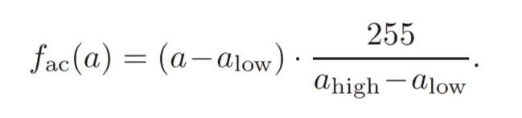

# 修改自动对比度

最高强度和最低强度可能是图像的噪声，我们通过使用分位数使图像的强度饱和来排除这些噪声。它可以通过下面的等式计算出来。

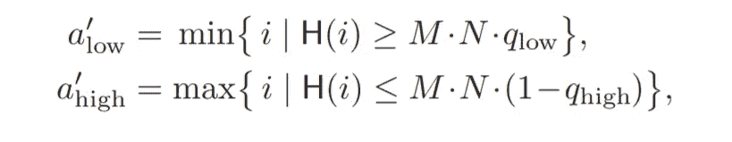

映射方程定义为

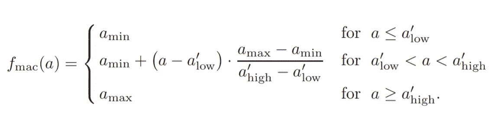

# **直方图均衡化**

执行此任务是为了使两幅图像之间的差异更易于比较并在印刷出版物中使用。其原理是将图像直方图映射成近似均匀分布。映射函数定义为:

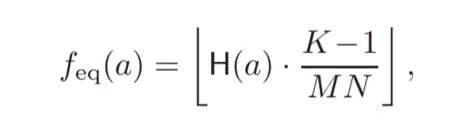

其中 H(a)是像素值 a 的累积直方图，K 是最大强度值，MN 是最近的累积强度。

您可以使用 OpenCV 模块将其应用到您的 python 代码中

```
equ = cv2.equalizeHist(img)
```

这是直方图均衡化的结果。

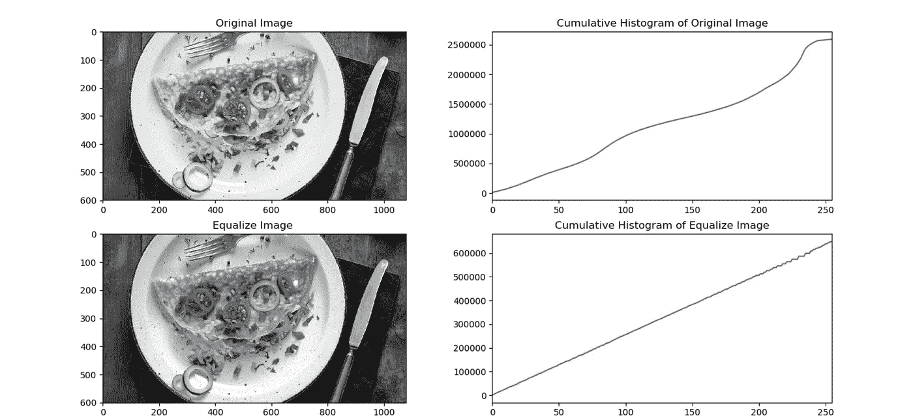

# 直方图规定化

该任务类似于直方图均衡化，但是该过程的目的是将直方图的分布函数映射到参考分布。为了独立于图像大小，图像强度需要归一化到范围 0-1。归一化直方图被解释为随机过程的概率密度函数。其中 p(i)是像素值 I 的概率，h(i)是所有强度值的总和。所以所有概率函数的和等于 1。

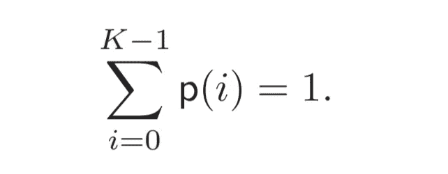

H(i)定义为累积直方图，H(i)的统计对应部分是离散分布函数 P()。这也称为累积分布函数(cdf)。

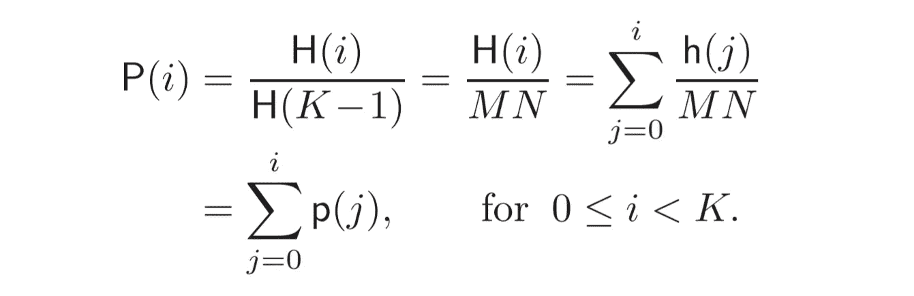

**直方图规定化原理**

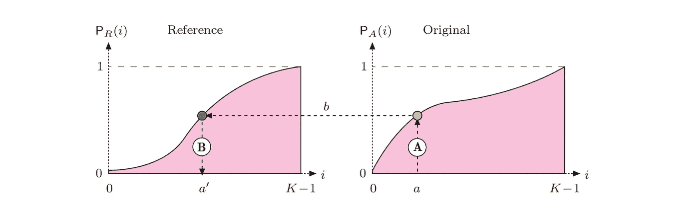

如图所示，我们需要将图像 A 的 pdf 映射到参考图像 r。我们获得新的像素值 A ’,如下所示

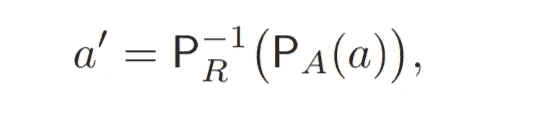

因此，映射函数定义为

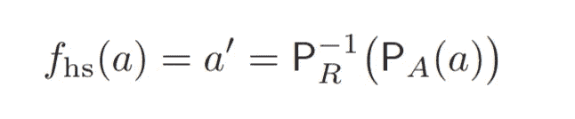

确保参考图像 R 的 pdf 是可逆的(具有 b =[0，1]的现有值)。

*然而，修改图像的方法不仅仅是点操作，还有另一种方法，叫做* ***【滤镜】*** *。我将在下一章向你介绍更多的信息。回头见！*

现在，下一章出版了。你可以点击下面的链接阅读。:D

[](https://medium.com/@ptchaya.p/image-processing-class-egbe443-4-filters-aa1037676130) [## 图像处理类(EGBE443) #4 —过滤器

### 这篇文章是为了总结我在医学图像处理课上(EGBE443)学到的经验。

medium.com](https://medium.com/@ptchaya.p/image-processing-class-egbe443-4-filters-aa1037676130)