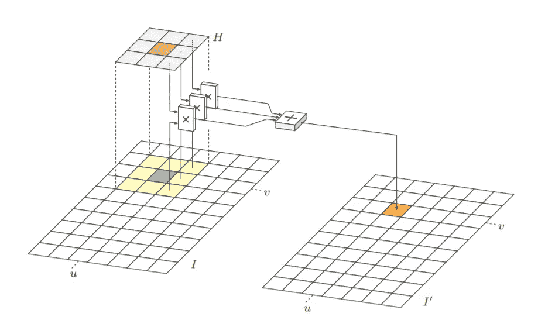
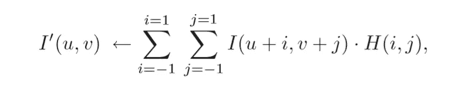
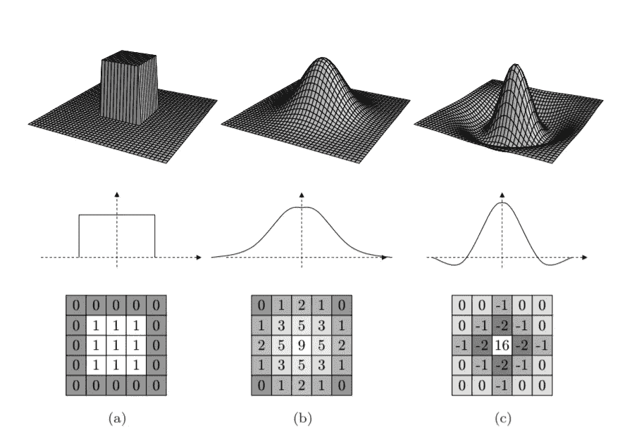
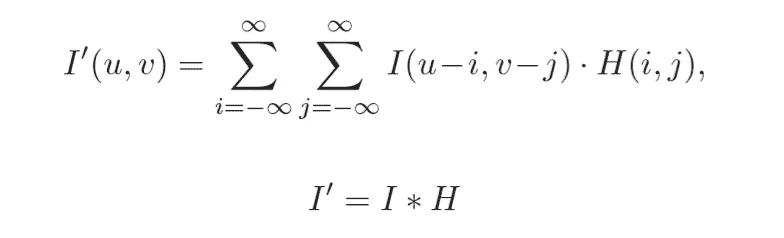
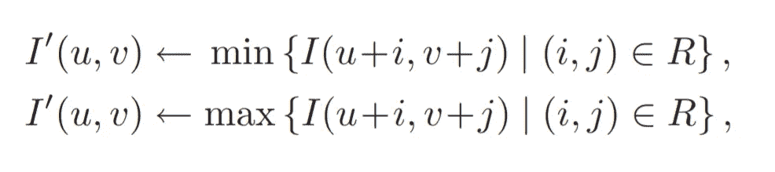
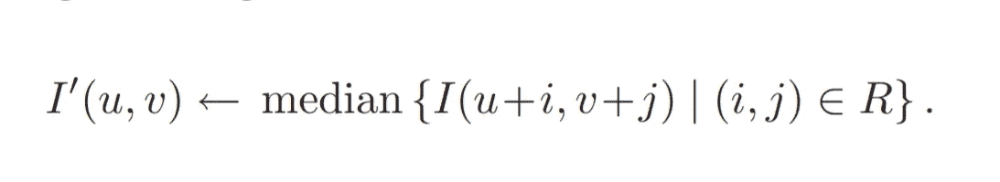
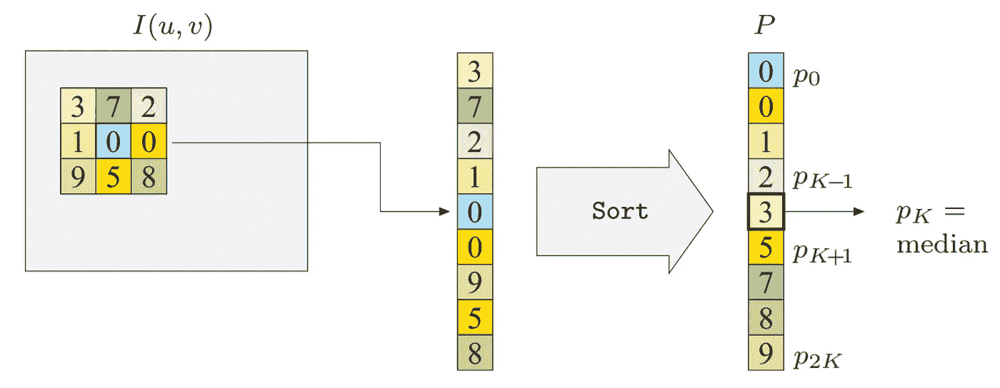
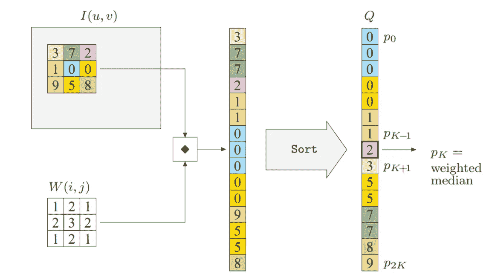
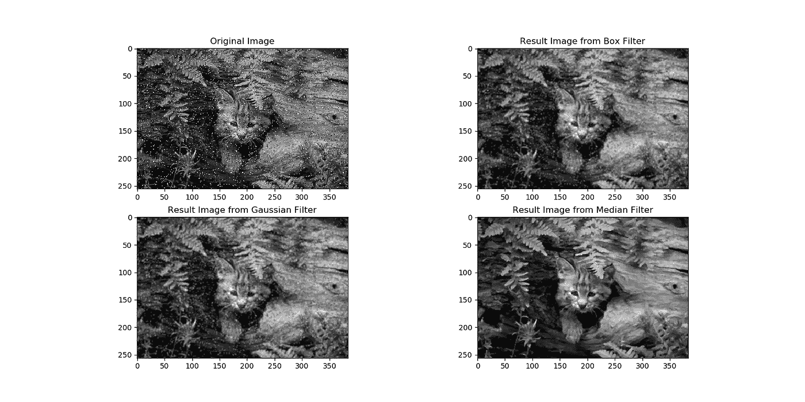

# 图像处理类别#4 —过滤器

> 原文：<https://towardsdatascience.com/image-processing-class-egbe443-4-filters-aa1037676130?source=collection_archive---------5----------------------->

> 这篇文章是为了总结我在医学图像处理课上(EGBE443)学到的经验。

这一章是关于过滤图像。为了更容易理解，你可以通过下面的链接阅读上一章关于点操作的内容。

 [## 图像处理类(EGBE443) #3 —点操作

### 这篇文章是为了总结我在医学图像处理课上(EGBE443)学到的经验。

towardsdatascience.com](/image-processing-class-egbe443-3-point-operation-477ad38334f5) 

如果你是图像处理的新手，你可以点击下面的链接阅读我的第一篇文章。:)

 [## 图像处理类(EGBE443) #0.1 —图像采集

### 大家好！我叫皮查亚·西普克汉姆。我是玛希隆生物医学工程系四年级学生…

towardsdatascience.com](/image-processing-class-egbe443-0-1-image-aquisition-7e80cc89de84) 

## **轮廓**

*   过滤
*   线性过滤器
*   线性滤波器的属性
*   非线性滤波器

# 什么是过滤器？

对图像应用滤镜是修改图像的另一种方式。与点操作的不同之处在于滤波器使用一个以上的像素来产生新的像素值。例如，平滑滤波器，其通过其相邻像素值的平均值来替换像素值。滤波器分为两种， ***线性滤波器*和*非线性滤波器*** 。

# **线性滤波器**

L 线性滤波器是以线性方式(即，作为加权求和)操作支持区域中的像素值的滤波器。支持区域由 ***【滤波矩阵】*** 指定，由表示为 ***H(i，j)*** 。H 的大小称为“过滤区域”,过滤矩阵有自己的坐标系，I 是列索引，j 是行索引。它的中心是原点位置，它被称为“热点”。

Applying weight median filter to the image I, a hotspot location is at the orange shade (center of the filter matrix H)

**应用滤镜**

要对图像应用滤镜，请遵循以下步骤。

*   在图像上移动滤波器矩阵 I 和 H(0，0)必须跟随当前图像位置(u，v)
*   将每个滤波器系数 H(i，j)乘以相应的图像元素 I(u+i，v+j)
*   对上一步的所有结果进行平均，这就是当前位置 I(u，v)的结果

所有步骤都可以用下面的等式来描述

**线性滤波器的类型**

1.  ***平滑滤镜*** (这个滤镜只有正整数。)

*   ***箱式过滤器。*** 这个过滤器的所有成员都是一样的。
*   ***高斯滤波器。*** 过滤构件的重量取决于构件的位置。过滤器的中心承受最大的重量，随着与中心的距离增加而减少。

**2。不同的过滤器**

*   ***拉普拉斯或墨西哥帽状滤波器。*** 此过滤器的某些成员是负过滤器，它可以通过正成员和负成员的求和来计算。

3D structure, 2D structure and example of filter (a) Box filter (b) Gaussian filter and (c) Laplace filter

## **线性滤波器的特性**

首先，我将介绍一个与线性滤波器相关的操作。这个操作叫做 ***“线性卷积”。*** 对于二维函数 I 和 H，卷积运算定义为等式

其中*是卷积运算。看看这个等式，你会发现这个操作提供了与线性滤波器相似的结果，该线性滤波器具有在水平和垂直轴上都反映的滤波器功能。卷积矩阵 H 可以称为 ***核*** 。

**线性卷积的性质**

*   交换性
*   线性
*   结合性
*   可分离性:核 H 可以表示为多个核的卷积，并且可以在二维核 x 和 y 中分离。

***注意*** *:在线性特性中，在与核进行卷积之前，将标量值 b 加到图像 I 上，不等于将标量值 b 加到图像与核之间的卷积结果上。*

## 非线性滤波器

使用平滑滤波器(一种线性滤波器)去除噪声，使图像结构、线条和边缘变得模糊。非线性滤波器用于解决这个问题，它以非线性方式工作。

**非线性滤波器的类型**

*   ***最小和最大滤波:*** 原始图像的运动区域 R 中的最小值和最大值分别是最小和最大滤波的结果。这些过滤器被定义为

The equation of minimum and maximum filter

*   ***中值滤波器:*** 结果的计算方法与最小值和最大值滤波器相同。移动区域 R 中所有值的中值是中值滤波的结果。这种滤波器通常用于消除图像中的椒盐噪声。该过滤器被定义为

下图显示了中值滤波器的工作原理

****

**python 3 中过滤器的实现非常简单。对于盒子、高斯和中值滤波，可以使用`cv2.boxFilter()`、`cv2.GaussianBlur()`和`cv2.medianBlur()`。**

**这是这个项目的结果**

****

**Applying Box filter, Gaussian filter and Median filter to remove salt pepper noise in the image**

**在这篇文章中，你已经知道了滤镜的类型以及如何将它们应用到图像中。这有助于提高图像质量(例如，去除噪声)。下一次，我将利用过滤器来检测边缘和锐化图像。**

**现在你可以点击下面的链接进入下一章。:)**

** [## 图像处理类(EGBE443) #5 —边缘和轮廓

### 这篇文章是为了总结我在医学图像处理课上(EGBE443)学到的经验。

medium.com](https://medium.com/@ptchaya.p/image-processing-class-egbe443-5-edge-and-contour-d5d410f4483c)**