# 图像处理类别#5 —边缘和轮廓

> 原文：<https://towardsdatascience.com/image-processing-class-egbe443-5-edge-and-contour-d5d410f4483c?source=collection_archive---------8----------------------->

> 这篇文章是为了总结我在医学图像处理课上(EGBE443)学到的经验。

这篇文章是关于基本的图像处理。如果你是这个领域的新手，你可以点击下面的链接阅读我的第一篇文章。:)

 [## 图像处理类(EGBE443) #0.1 —图像采集

### 大家好！我叫皮查亚·西普克汉姆。我是玛希隆生物医学工程系四年级学生…

towardsdatascience.com](/image-processing-class-egbe443-0-1-image-aquisition-7e80cc89de84) 

边缘和轮廓在人类视觉系统中起着重要的作用。边缘是由沿着特定方向的强度的局部变化引起的。这篇文章是关于边缘检测的各种方法。

**轮廓**

*   基于梯度边缘检测
*   边缘算子
*   二阶导数边缘检测
*   边缘锐化

## 基于梯度边缘检测

这种边缘检测方法从沿着一条图像线的强度变化或强度轮廓检测边缘。因为基本上，它是由一阶导数计算出来的。在图像中，一阶导数函数需要估计，可以表示为它在位置 u 处切线的斜率。

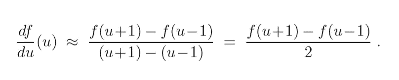

多维函数沿一个轴的导数称为**【偏导数】**。因此，图像函数 I(u，v)沿 u 轴和 v 轴的偏导数表现为以下函数。

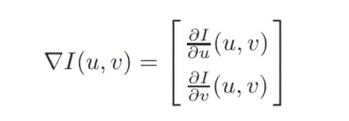

该函数被称为**“梯度向量”**，梯度的大小可以通过下式计算

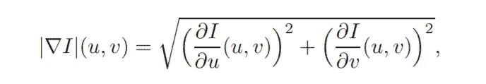

沿着 x 和 y 轴的一阶导数函数可以实现为具有系数矩阵的线性滤波器

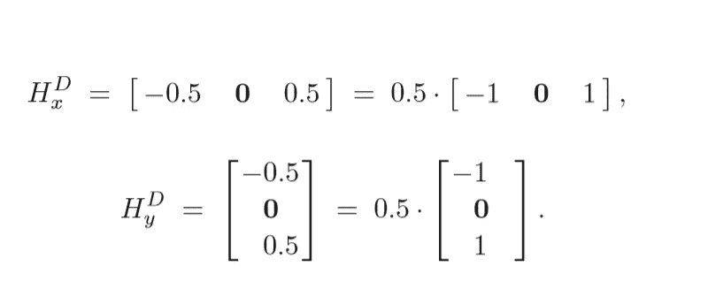

## 边缘算子

很多边缘算子的基本原理都是来自于一阶导数函数。它们的不同之处仅在于过滤器中组件的组合方式。

*   普-索二氏手术

这些方法使用在 3 个相邻行和列上延伸的线性滤波器。对于 Prewitt 算子，沿 x 和 y 轴的滤波器 H 的形式为

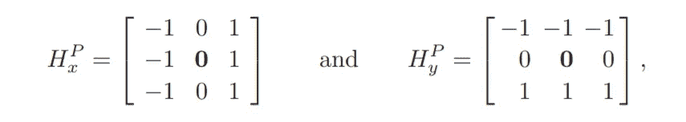

和 Sobel 算子，滤波器 H 沿 x 和 y 轴的形式为

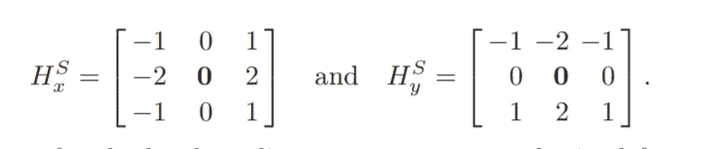

通过对 Prewitt 算子和 Sobel 算子进行适当的缩放，我们可以得到估计的局部梯度分量。

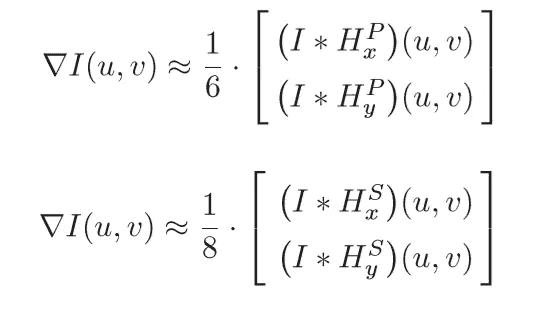

对图像应用梯度滤波器，给出 x 和 y 轴的两个梯度图像，Dx 和 d y

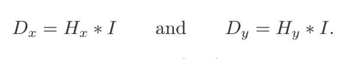

Dx 和 Dy 用于计算每个图像位置(u，v)的边缘奇异值 E 和方向。

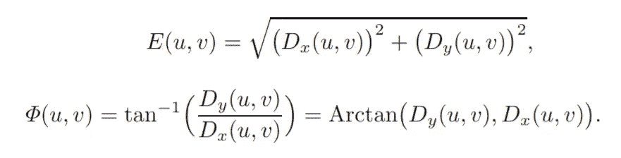

总之，这些过滤器的过程如下所示

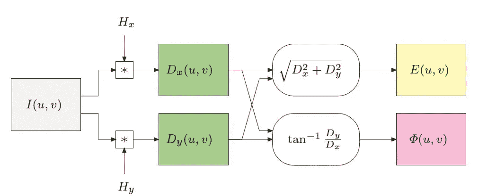

## 罗伯茨算子

这也是最简单的方法。两个尺寸为 2×2 的小滤波器用于边缘检测。

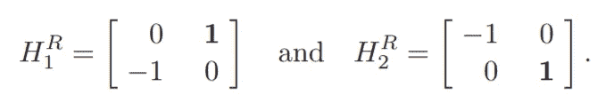

这些是这两个小过滤器的结果。

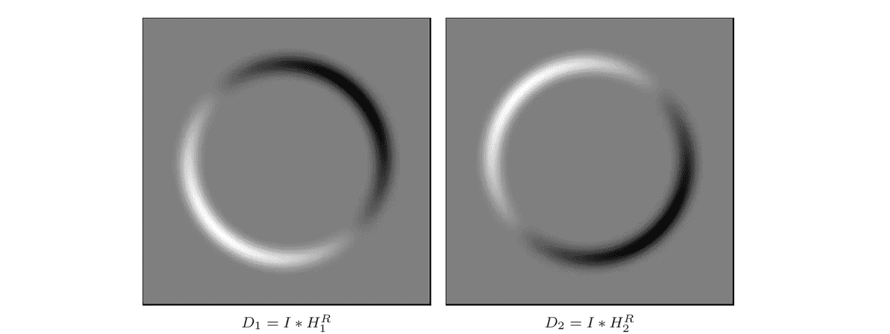

## 罗盘操作员

该方法不仅开发了单对滤波器，还开发了八个方向上 45 度方向的滤波器:

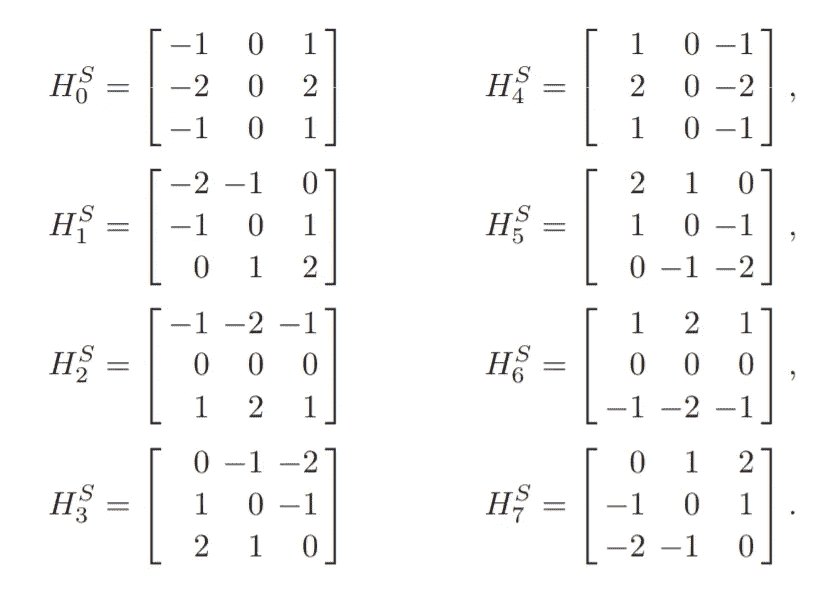

边缘强度和方向也需要被计算，但是它们以不同的方式被计算。边缘强度由来自八个滤波器的梯度图像的最大值来定义。

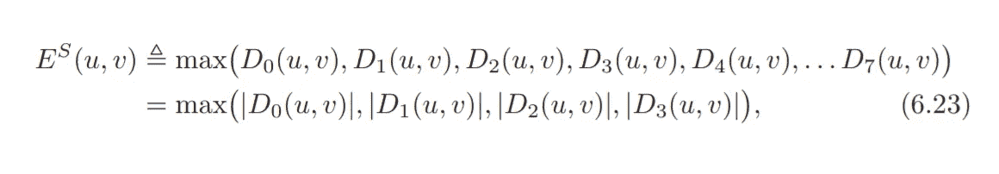

并且局部边缘方向被定义为

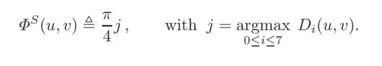

## 二阶导数边缘检测

这个想法就是这么简单。边缘位于一阶导数结果的最大值和最小值上。但是在二阶导数中，边缘位于过零点，如下图所示。

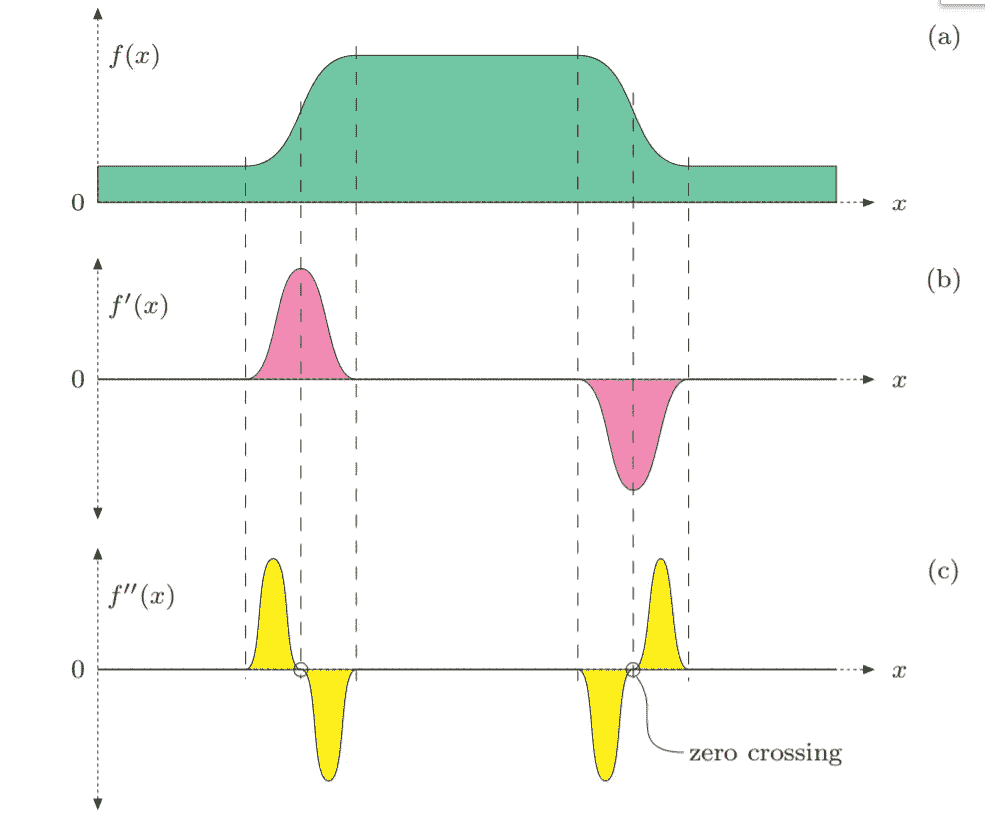

这种算子的一个常见例子是将高斯平滑滤波器和二阶导数(拉普拉斯)滤波器结合在一起的**“拉普拉斯-高斯”(LoG)** 算子。

## 边缘锐化

该任务通常用于解决扫描或缩放后图像锐度损失的问题。想法是放大图像分量的高频。这些过程显示了如何锐化图像的边缘。

*   **用拉普拉斯滤波器锐化边缘(二阶导数):**通过减去二阶导数的某个分数 w 来锐化边缘。
*   **反锐化掩模:**该方法包括两个主要步骤:

1.通过用内核 H(平滑滤波器)减去图像 I 的平滑版本来生成掩模 M。

2.将因子 a 加权到掩模 M 上，并添加到原始图像 I 上

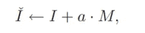

我用 Python 3 实现了边缘检测，这是结果

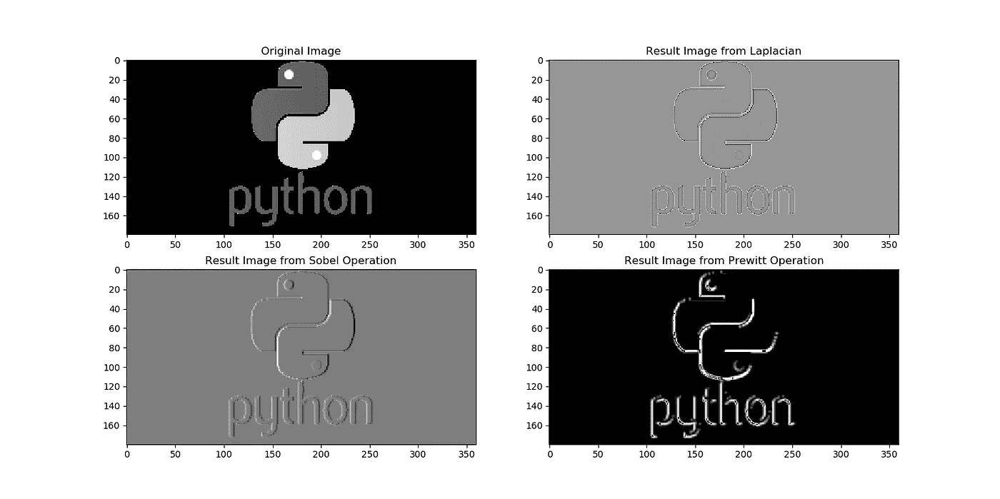

*这是我学到的边缘检测的基础，边缘检测是灵活的，它取决于你的应用。所以在下一章，可能是我图像处理的最后一章，我会描述* ***形态滤波器。再见:)***

现在，下一章在这里！请点击下面的链接。

 [## 图像处理类(EGBE443) #6—形态滤波器

### 这篇文章是为了总结我在医学图像处理课上(EGBE443)学到的经验。

medium.com](https://medium.com/@ptchaya.p/image-processing-class-egbe443-6-morphological-filter-e952c1ec886e)