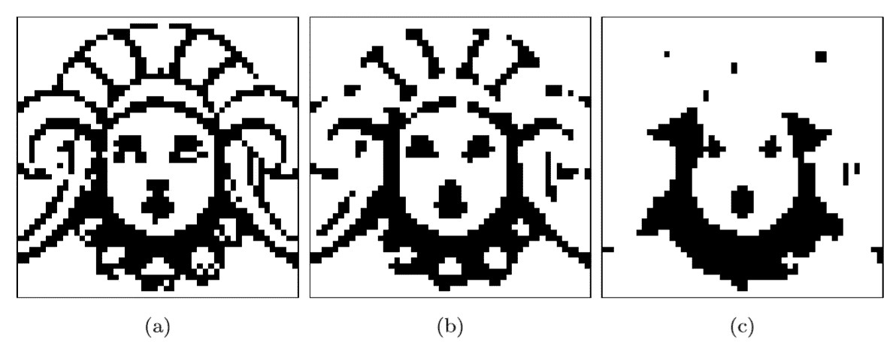
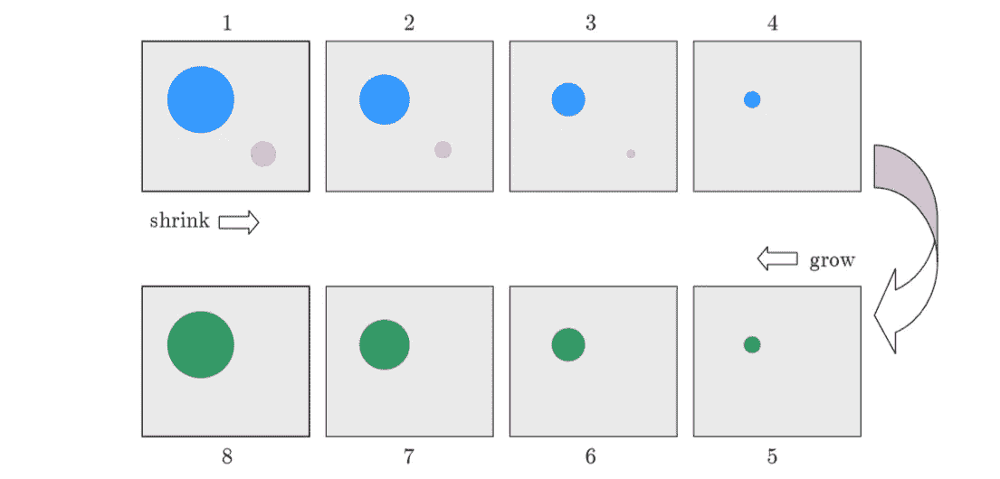
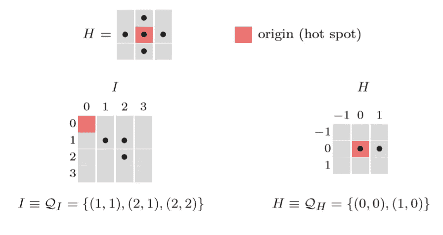
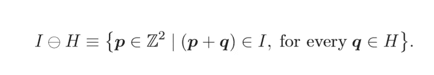
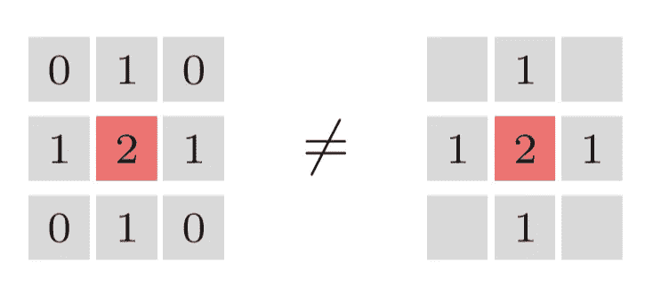
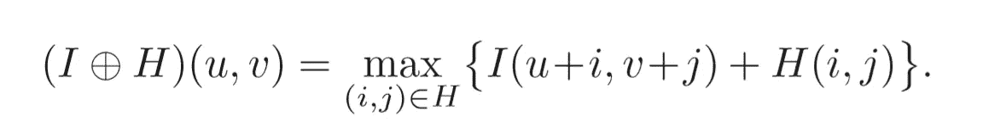
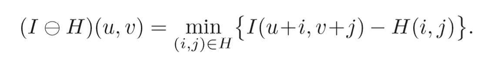
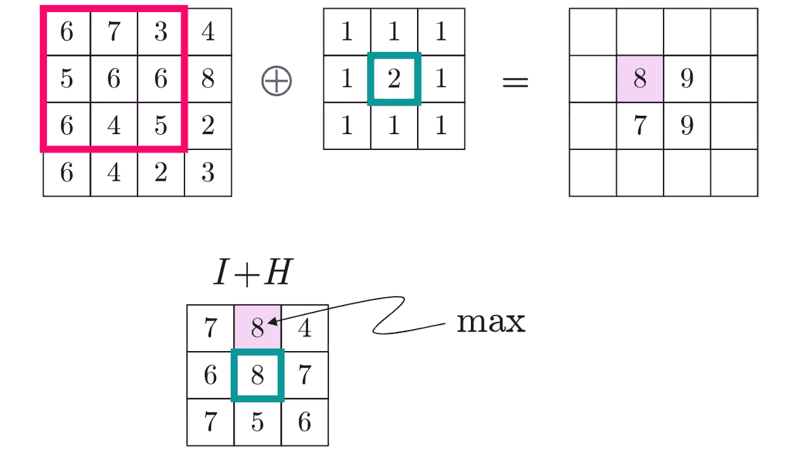
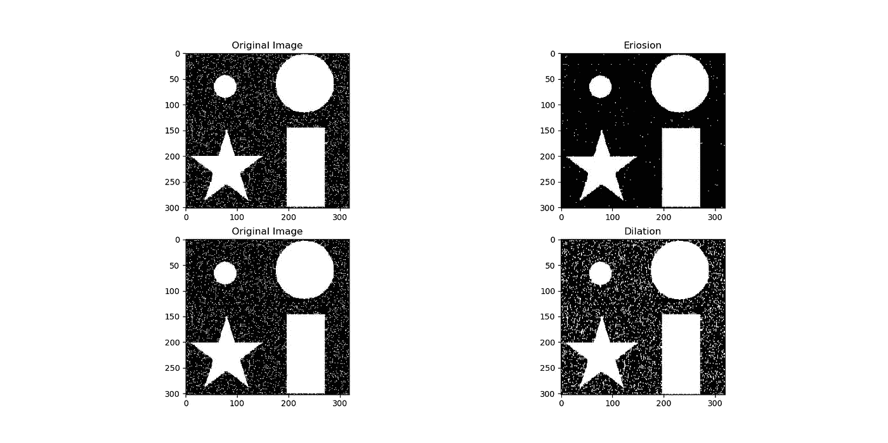
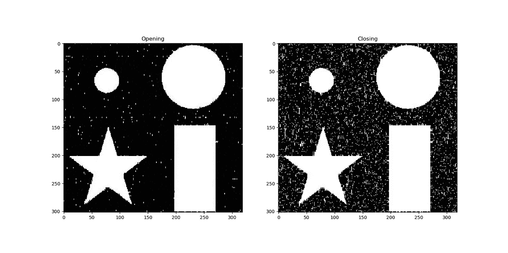

# 图像处理类#6 —形态滤波器

> 原文：<https://towardsdatascience.com/image-processing-class-egbe443-6-morphological-filter-e952c1ec886e?source=collection_archive---------13----------------------->

> 这篇文章是为了总结我在医学图像处理课上(EGBE443)学到的经验。

这篇文章是关于基本的图像处理。如果你是这个领域的新手，你可以点击下面的链接阅读我的第一篇文章。:)

 [## 图像处理类(EGBE443) #0.1 —图像采集

### 大家好！我叫皮查亚·西普克汉姆。我是玛希隆生物医学工程系四年级学生…

towardsdatascience.com](/image-processing-class-egbe443-0-1-image-aquisition-7e80cc89de84) 

在前一章中，我已经谈到了一种使用中值滤波器去除噪声的方法。中值滤波使图像结构发生了很大变化。下图显示了对二值图像应用中值滤波的结果。移除小结构、单线和点，并填充小尺寸孔。

所以在这一章中，我将介绍一个克服这个问题的想法。它被称为“*”。*

**

*Shrink and grow process*

## *形态滤波器*

*形态滤波器的思想是收缩和放任生长的过程。单词“收缩”意味着使用中值滤波器来圆化大的结构并移除小的结构，并且在生长过程中，剩余的结构以相同的量生长回来。*

*首先描述二值图像的形态学操作，并且将在下面的概述中讨论。*

***概述***

*   *二元滤波器的结构元素*
*   *膨胀和侵蚀*
*   *复合操作*

## *结构化元素*

*在形态滤波器中，矩阵中的每个元素称为“结构元素”，而不是线性滤波器中的系数矩阵。结构化元素只包含值 0 和 1。并且过滤器的热点是深色遮光元件。*

**

*二进制图像被描述为多组二维坐标点。这叫做 ***“点集”*** Q，点集由所有前景像素的坐标对 p = (u，v)组成。点集的一些操作类似于其他图像中的操作。对二值图像求逆运算是补码运算，对两个二值图像求并运算。通过将向量 d 加到点 p，将二进制图像 I 移动某个坐标向量 d，或者将二进制图像 I 的反射乘以-1 到点 p。*

## *膨胀和侵蚀*

*   ****膨胀*** 是一个形态学操作符，它适用于我之前提到的生长过程。该算子的方程定义为*

**

*   ****侵蚀*** 是一个形态学操作符，也适用于我之前提到的收缩过程，等式定义为*

**

***膨胀和侵蚀的特性***

*   *可交换的:仅在膨胀中*
*   *联想:仅在膨胀中*

****注意:*** 中的侵蚀与膨胀相反，不具有交换性。*

*此外，腐蚀和膨胀是 ***对决*** ，因为前景的膨胀可以通过背景的腐蚀来完成，随后的结果是两种不同性质但工作相似*

**

## *复合操作*

*在形态学过程中，膨胀和腐蚀共同作用于复合运算。有常用的方法来表示这两种操作的顺序，打开和关闭。开放表示侵蚀，随后以相反的方式膨胀和关闭。*

**

*Opening and Closing process respectively*

*在打开前景等于关闭背景的意义上，打开和关闭也是双重的。*

**

*形态滤波器也可以应用于灰度图像，但在不同的定义。它是最小和最大运算符的推广。我将在下面的大纲中描述。*

***轮廓***

*   *结构化元素*
*   *膨胀和侵蚀*
*   *打开和关闭*

## *结构化元素*

*在灰度形态学中，结构元素被定义为实值 2D 函数，而不是点集*

**

*H 中的值可以是负值或零值。但与线性卷积不同，它使用零元素来计算结果。如果您不想在某个位置使用元素，您可以在该位置不放置元素。*

**

## *膨胀和侵蚀*

*灰度形态学中膨胀和腐蚀的结果是由最大值和最小值运算贡献的。*

*对于膨胀，结果是 H 中的值的最大值加到当前子图像。*

**

*对于侵蚀，结果是差值的最小值。*

**

*这些操作会造成负值，所以我们需要对计算后的结果进行箝位。*

**

*Example of dilation in gray-scale morphology*

## *打开和关闭*

*灰度形态学中的打开和关闭与二值形态学中的工作方式相同。区别只是膨胀和侵蚀中的操作符。*

*对于使用 OpenCV 模块在 Python 3 中的实现，可以使用函数`cv2.erode(input,size)`和`cv2.dilate(input,size)`*

*这是程序的结果，侵蚀和扩张，打开和关闭。*

**

*The result of erosion and dilation of the program.*

**

*The result of opening and closing from the program.*

*这是我关于图像处理的最后一篇文章。感谢您阅读并关注我的帖子。继续享受 ***图像处理*** *！我很快就回来，祝你好运。:)**