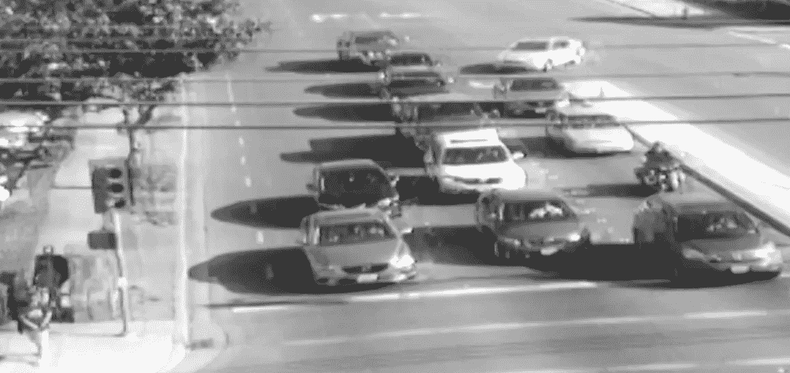
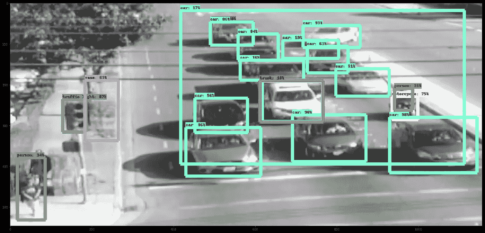

# 路上的图像识别

> 原文：<https://towardsdatascience.com/image-recognition-on-the-road-6ed85bb08292?source=collection_archive---------6----------------------->

当谷歌宣布他们开源其内部物体检测系统 [Tensorflow 物体检测 API](https://research.googleblog.com/2017/06/supercharge-your-computer-vision-models.html) 时，我知道必须尝试一下。在图像中检测物体是一个长期的挑战，由于深度学习的一系列研究，近年来已经取得了巨大的进展。这是一种非常适合深度学习的任务:易于描述和直观掌握，但很难正式解决。

谷歌的 API 提供了五种最先进的 Tensorflow 模型，可以识别和定位图像中的多个对象。这些型号涵盖了从轻量级(用于在手机上实时工作)到重型(计算成本更高但更精确)的所有型号。他们还在 [COCO 数据集](http://mscoco.org/)上对每个模型进行了预训练，这样它们就可以检测出 90 种现成的常见物体类别。还包括一个 [Jupyter 笔记本](https://github.com/tensorflow/models/blob/master/research/object_detection/object_detection_tutorial.ipynb)，演示如何使用他们预先训练好的模型。

我设法拍了一些南湾交通路口的照片。对于检测通过十字路口的机动车、骑自行车的人和行人，有几个有前途的应用:基于观察到的汽车数量的更智能的交通灯信号定时，通过提醒司机注意迎面而来的车辆来预防事故，以及识别经常发生交通堵塞的区域。

由于要在十字路口检测的对象属于 COCO 的常见类别，所以我能够使用预先训练的模型。这意味着我不必忍受收集带标签的数据集和旋转 GPU 时钟周期来训练的单调乏味。下面是(相当粒状)原始图像。

而这里是运行最精确模型后的输出，[faster _ rcnn _ inception _ resnet _ v2 _ atrous _ coco](http://download.tensorflow.org/models/object_detection/faster_rcnn_inception_resnet_v2_atrous_coco_11_06_2017.tar.gz)。

Box colors and their classifications: {Light green: car, Purple: truck, Neon green: person, Pink: vase, White: motorcycle, Darker Green: traffic light}

结果给我留下了深刻的印象！它克服了几个障碍:低分辨率、重影、遮挡和缺乏颜色，但仍能识别每辆汽车、摩托车和骑摩托车的人。它还发现人行道上有一名行人。它确实犯了把树干归类为花瓶的错误(粉色方框)。

总而言之，Tensorflow 对象检测 API 是一个用于对象检测和定位的优秀系统。它对较差的图像质量很鲁棒，并且使用简单。