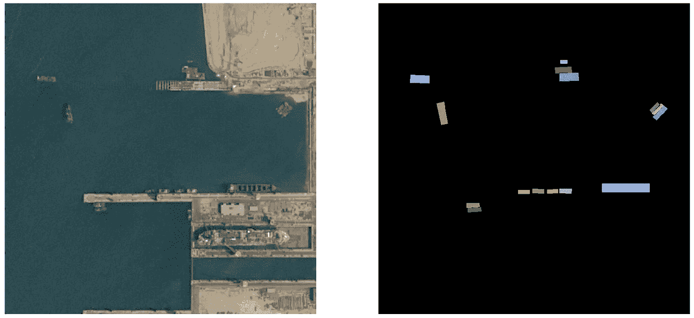
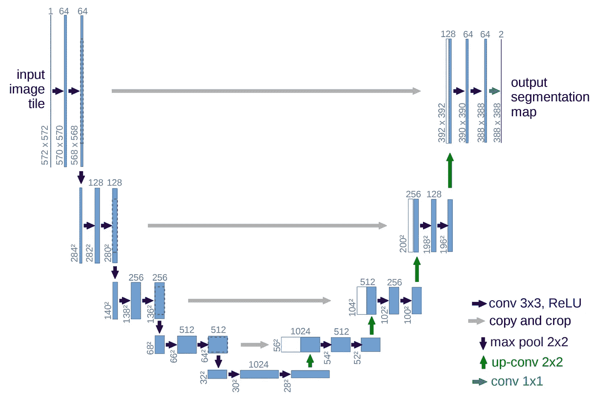

# 图像分割:Kaggle 体验

> 原文：<https://towardsdatascience.com/image-segmentation-kaggle-experience-9a41cb8924f0?source=collection_archive---------11----------------------->

今天我在 Kaggle 上获得了我的第一枚金牌，参加了[空中客车船舶探测挑战赛](https://www.kaggle.com/c/airbus-ship-detection)。我们的 3 人团队([奥列格·亚罗舍夫斯基](https://www.kaggle.com/yaroshevskiy)、[德米特里·达涅夫斯基](https://www.kaggle.com/ddanevskyi)和[弗拉德·什米赫洛](https://www.kaggle.com/vshmyhlo))在卫星图像上分割船只的任务中获得了 884 名中的第 4 名。之前，我们的团队在地震图像上分割盐层的类似比赛中获得了 3234 名中的第 30 名( [TGS 盐识别挑战赛](https://www.kaggle.com/c/tgs-salt-identification-challenge))。我决定这是一个分享我参加竞争性机器学习的经验的好机会。

重要的是要强调，虽然我们在这些比赛之前在计算机视觉和深度学习方面有一些经验，但我们从未做过任何与语义或实例分割相关的高级东西。为了取得好成绩，我们必须学习很多东西，并以非常快的速度工作。下面是分割问题的概述和我们解决方案的更详细的概要。

什么是图像分割？这是一项非常常见的计算机视觉任务，要求您为图像中的每个像素分配一些标签，描述这个特定像素是属于某个对象(例如船只)还是属于某个背景(例如水或地面)。有许多不同的技术可以解决图像分割问题，但在本文中，我想重点关注近年来利用的方法，尤其是基于深度学习的方法。

Photo taken from satellite and corresponding segmentation mask

这个想法是训练一个神经网络，在给定原始图像数据的情况下，给图像中的每个像素分配一个标签，特别适合这个问题的架构是 [U-Net](https://arxiv.org/abs/1505.04597) 。U-Net 是一种卷积神经网络，最初设计用于执行医学图像分割，但它在各种各样的任务中工作得很好，从分割显微镜图像上的细胞到检测卫星照片上的船只或房屋。

U-Net 由编码器和解码器网络组成。编码器网络负责构建从简单的特征(如边缘和形状)到复杂的特征(如船只、人脸、汽车等)的层次结构。解码器负责将细粒度的低级特征与粗粒度的高级特征合并，逐渐恢复位置信息，以实现精确的逐像素分割。

U-Net architecture (source: [https://arxiv.org/abs/1505.04597](https://arxiv.org/abs/1505.04597))

你可以对默认的 U-Net 架构做很多调整，以提高它在特定情况下的性能。对于计算机视觉任务，使用迁移学习几乎总是一个好主意。你需要做的是将在不同任务上训练的网络参数用于你的问题。这是可行的，因为对于网络来说，当它已经有了关于边缘和形状的知识时，学习相关特征要比从头开始容易得多。这就是为什么我们使用 ImageNet 上预训练的 [SE-ResNeXt-50](https://arxiv.org/abs/1709.01507) 网络作为我们的编码器。至于解码器，我们从 [AlbuNet](https://arxiv.org/abs/1803.01207) 获得了灵感，它使用的架构与最初 U-Net 论文中描述的略有不同。

这将我们带到对默认 U-Net-ResNet 架构的第一个重要调整。默认情况下，为了减少计算成本，ResNet 的第一层(以及许多其他为图像分类设计的神经网络)应用 7×7 步距 2 卷积，有人可能会认为应用步距 2 卷积可能会丢失精确的逐像素分割所需的许多重要信息，经过一些简化，我们可以说，将步距 2 conv 应用于 256×256 图像类似于将步距 1 conv 应用于 128×128 图像，这意味着我们试图预测两倍于网络“看到”的图像大小的掩模。这对于在照片和其他任务中分割人的大多数情况是可以的，在这些情况下，我们主要处理大型对象，网络可以从上下文中恢复大部分信息，但在分割非常小的船只(20-30 个正像素)的情况下，这可能是至关重要的，因此我们在 ResNet 的第一层中从步幅 2 移动到步幅 1 卷积，并观察到分数的良好提升。缺点之一是，这种调整增加了巨大的计算开销，因为网络中的每个特征地图现在都是原来的两倍大。这大大减少了批量大小，降低了网络速度，但一个时期的训练时间仍然在足够的时间内，因为我们是在随机的 256 乘 256 作物上训练的，这将我们带到下一点。

为了降低计算成本，加快训练速度并增加批量大小，我们对随机的 256 乘 256 的作物进行了训练，这种方法的问题是，训练集中只有一小部分图像实际上至少有一些积极的标签，其中大多数只是空的，随机作物的情况甚至更糟，因为这些作物几乎总是根本没有船只。这导致了巨大的类别不平衡，这是图像分割中普遍面临的问题。

为什么这不好？这是不好的，因为为多数类计算的损失超过为少数类计算的损失，导致非常低的误差信号。有许多解决方案可以克服这个问题，这些解决方案在特定情况下有效，其中大多数是关于选择正确的损失函数(如焦点损失、骰子损失、平衡交叉熵)或重采样数据集以获得更好的类分布。

一个非常巧妙的技术被设计用来克服阶级不平衡，这个技术非常有效。这个想法是随机裁剪图像的一部分，这样至少有一些积极的像素出现在裁剪中，这大大提高了分数，在我看来，这是一个关键的设计决策，使我们比其他参与者更有优势。

在进行人工故障分析时，我们观察到两个问题:大船检测和对小物体(例如石油平台)的误报。我们认为假阳性的问题可能与智能作物逻辑有关，但没有时间来检查这是否是真的。

为了克服假阳性问题，我们决定训练一个额外的基于 CNN 的二元空/非空分类器。人们可能会认为 U-Net 擅长空/非空分类，但在实践中它容易犯分类错误。另一方面，专用分类器明确地最小化了错误分类率，并且由于它没有解码器，所以训练起来要快得多。如果我们考虑到数据集中有大约 80%的空图像，假阳性问题会变得更加严重。利用非空图像的过采样在所有可用图像上训练分类器，以克服类别不平衡。我们认为性能良好的二进制分类器对本次比赛至关重要，我们认为这是我们从公共排行榜的第 26 位跃升至私人排行榜第 4 位的主要原因之一。一个单独的分类模型也导致了更快的推断:我们没有用慢速 U-Net 模型预测所有 15k 图像，而是只预测了大约 3k，因为其余的已经被分类器作为空图像丢弃了。

大型船只的问题没有假阳性那么严重，但是我们仍然对我们的模型进行了一些修改，以更好地捕捉这些大型实例。也就是说，我们在 U-Net 模型的底部增加了一个额外的卷积层，由于计算成本增加，我们在开始时将其丢弃。这个简单的技巧增加了我们模型的感受域，使它们能够捕捉更多的全球背景。

同样重要的是要提到，这项任务是一种称为实例分割的图像分割。在实例分割中，您不仅必须标记图像中的每个像素，还必须为唯一的对象分隔分割遮罩。这意味着我们必须有一种方法来区分哪些像素属于一艘船，哪些属于另一艘船。我们使用了一种叫做[分水岭](https://en.wikipedia.org/wiki/Watershed_(image_processing))的方法来将蒙版分成实例。

在本教程的第 2 部分，我将更多地关注我们的方法和我们尝试的东西的技术细节，我还将分享这次比赛的源代码，敬请期待！