# 在 Tensorflow 中使用各种自动编码器进行图像分割

> 原文：<https://towardsdatascience.com/image-segmentation-using-varieties-of-auto-encoders-in-tensorflow-manual-back-prop-with-tf-2e688f2a98f7?source=collection_archive---------8----------------------->

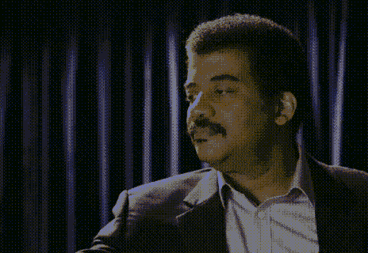

GIF from this [website](https://giphy.com/gifs/neil-141amBdjqs9Vvy)

我想我需要练习表演分段，因此我发了这个帖子。我也想探索自动编码器的世界。下面是我想探究的案例。

***情况 1)普通全卷积自动编码器
情况 2)多损耗自动编码器
情况 3)重复全卷积自动编码器
情况 4)全卷积*** [***变分自动编码器***](/intuitively-understanding-variational-autoencoders-1bfe67eb5daf)

***情况 1)普通全卷积自动编码器***

**蓝框** →卷积层
**红框** →转置卷积层

现在，上述网络具有最简单的结构，其中输入是彩色图像，输出是分段的掩蔽图像。现在让我们看看这个网络的结果。

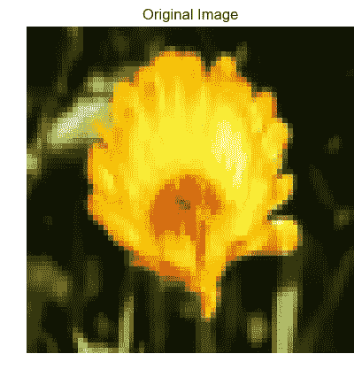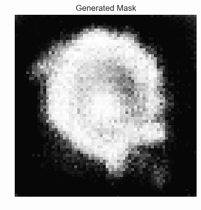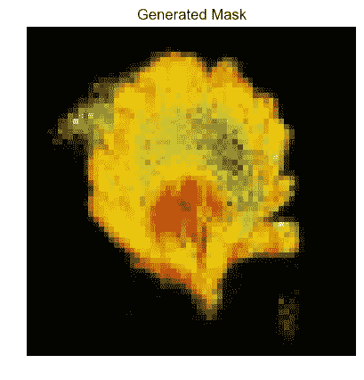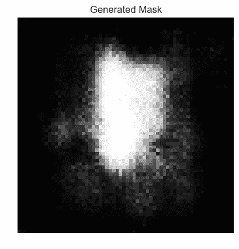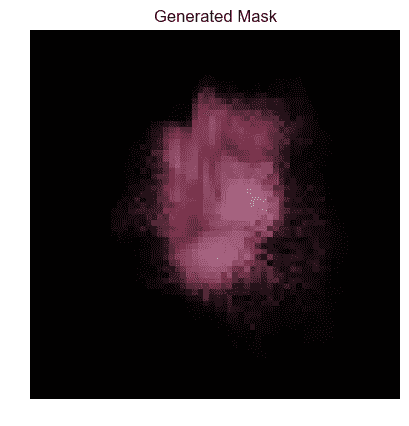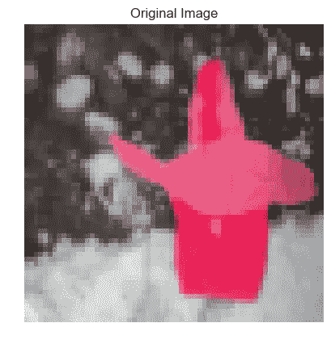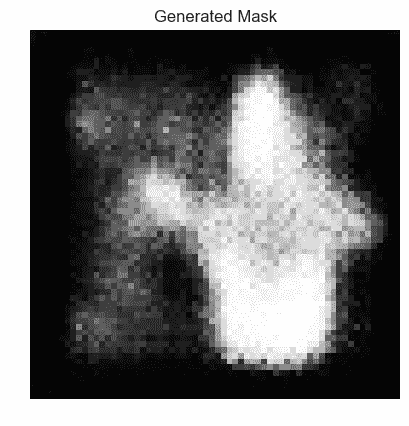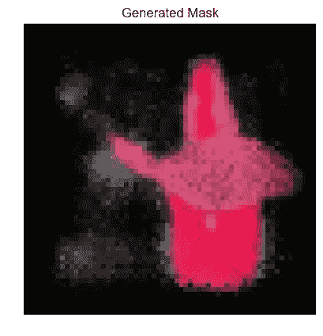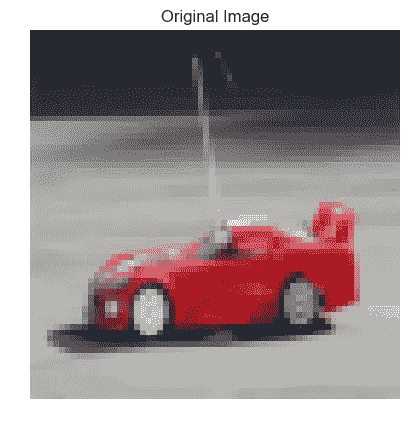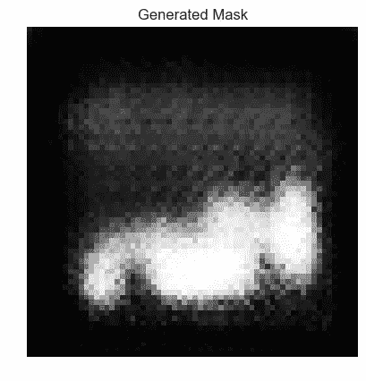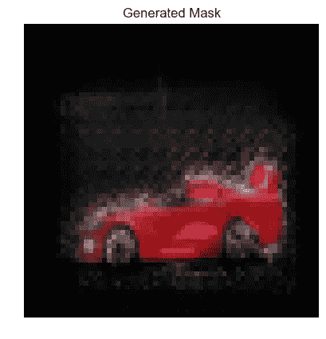

总的来说，网络在检测图像中的物体方面做得不错，正如上面测试图像的结果所示。它实际上做了一个很好的基础网络，下面是为结果创建的 gif。

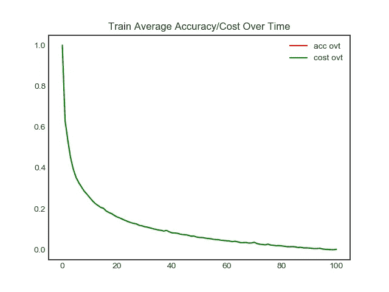

**左图 Gif** →为一段时间内的训练图像生成的遮罩
**右图 Gif** →为一段时间内的测试图像生成的遮罩
**右图** →训练期间的一段时间内的成本

***情况 2)多损耗自动编码器***

Image from this [paper](https://arxiv.org/abs/1806.11266)

这次我的灵感来自于论文“用于由粗到细的密集语义图像标注的门控反馈细化网络”*，论文作者不仅引入了多损失函数，还引入了门控网络。在这里，我将只看到多重损失函数的影响。*

***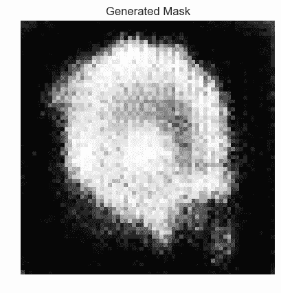******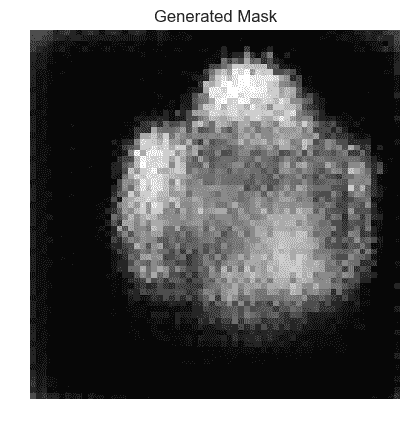**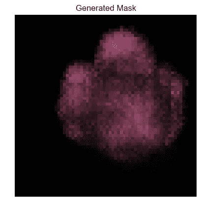****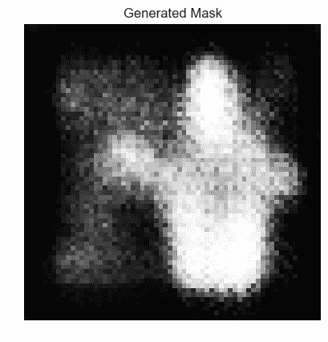*********

*对于具有多重损失函数的网络，看起来图像的某些部分比基本网络更清晰。这个网络做得很好，特别是粉红色花的形象。*

*****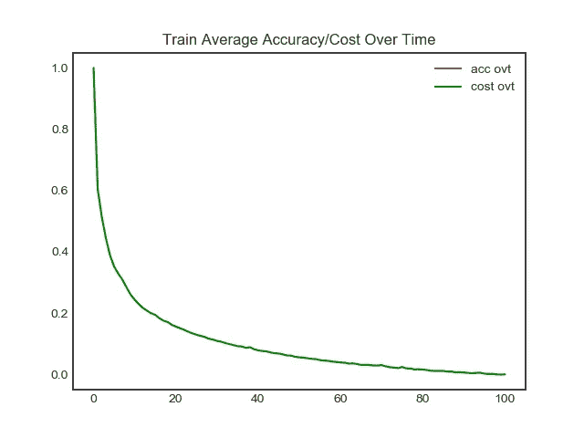*

***左图 Gif** →生成的训练图像随时间变化的蒙版
**右图 Gif** →生成的测试图像随时间变化的蒙版
**右图** →训练期间的成本随时间变化*

****情况 3)重复全卷积自动编码器****

*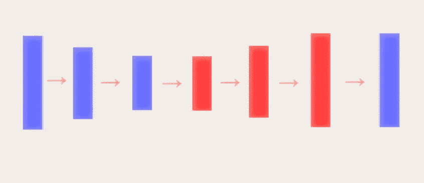***

***蓝框** →卷积层
**红框** →普通重复和卷积层*

*现在，这个网络的架构与之前的完全相同，但我只是想看看如果我们不使用转置卷积运算会发生什么。而只是天真地重复像素值两次，并执行卷积？*

***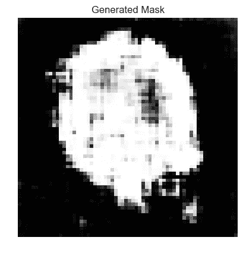**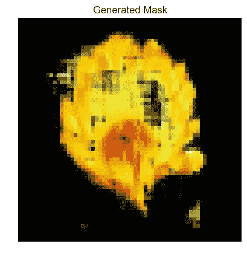****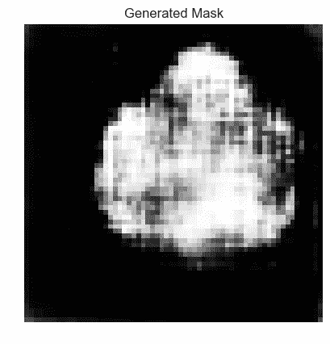**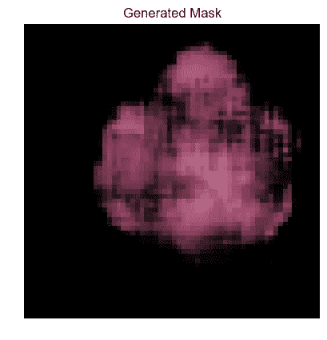******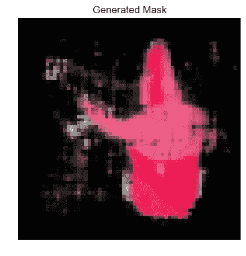****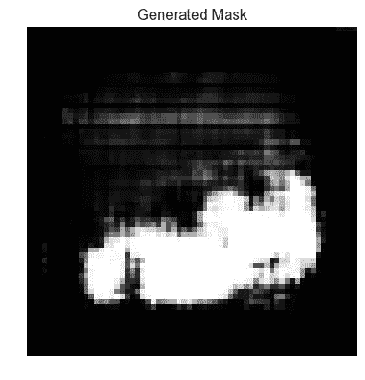**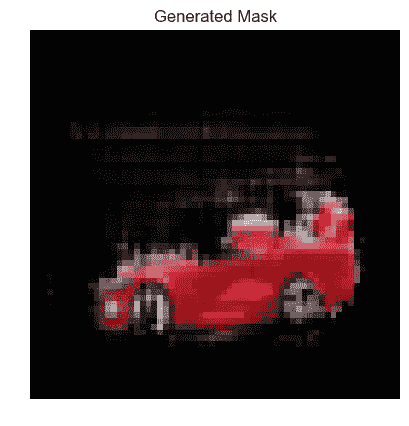*

*如上所述，当我们仅使用卷积运算并天真地重复像素来执行上采样时，生成的遮罩是位清晰和平滑的。但是，我们可以在生成的蒙版中观察到一些随机的黑点。*

*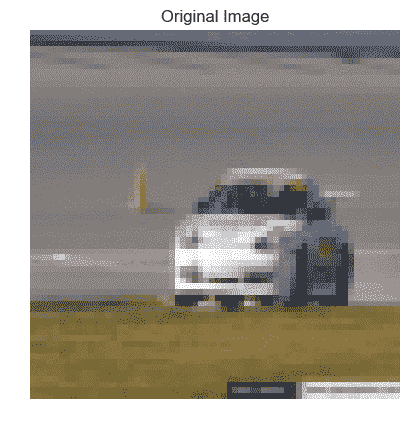****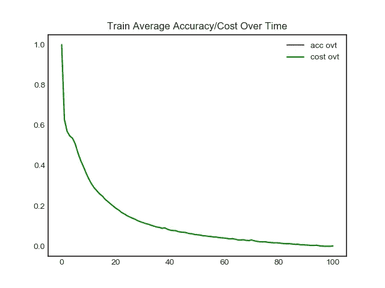*

***左图 Gif** →为一段时间内的训练图像生成的遮罩
**右图 Gif** →为一段时间内的测试图像生成的遮罩
**右图** →训练期间的一段时间内的成本*

****情况 4)全卷积*** [***变分自动编码器***](/intuitively-understanding-variational-autoencoders-1bfe67eb5daf)*

*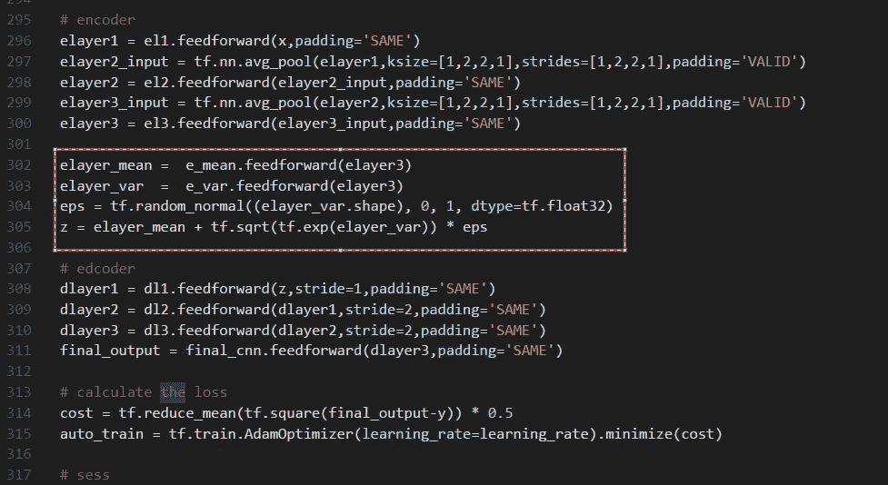*

*我从未见过任何用于分段目的的自动编码器的变化。(如果有人知道论文的名字请告诉我！)但我想使用它，下面是生成的面具。关于这个网络生成的掩码，我注意到的一件事是掩码中存在的噪声量，这可能是因为我们在训练期间从正态分布中抽取样本。*

***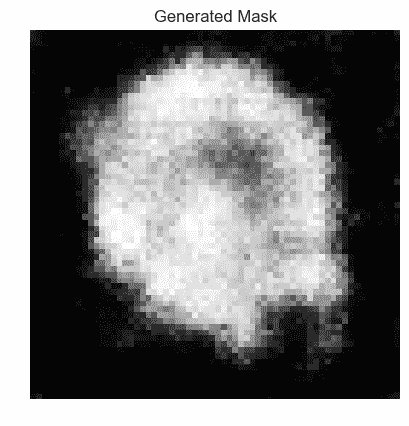**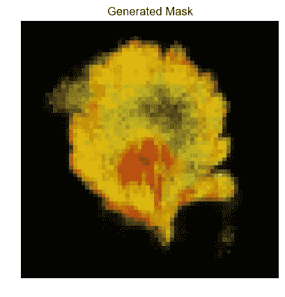****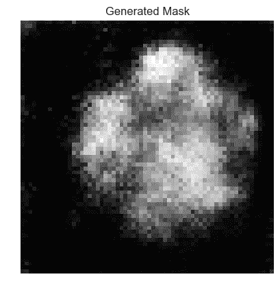**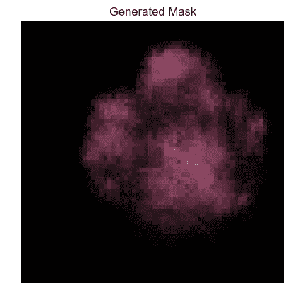****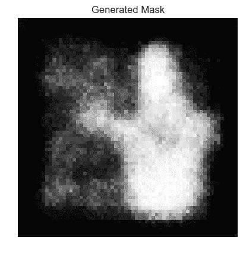**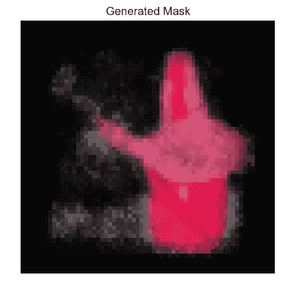****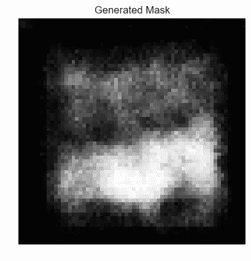**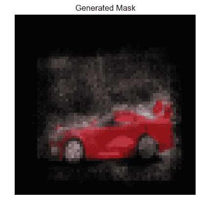****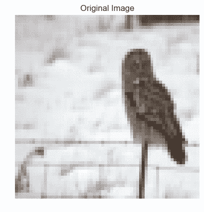**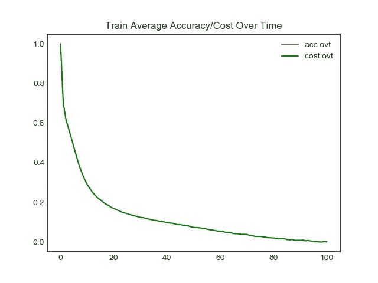*

***左图 Gif** →为一段时间内的训练图像生成的遮罩
**右图 Gif** →为一段时间内的测试图像生成的遮罩
**右图** →训练期间的一段时间内的成本*

***互动码***

*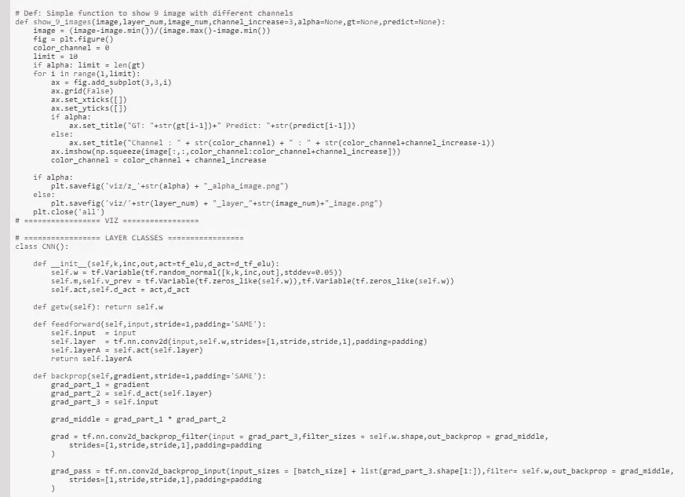*

*对于 Google Colab，你需要一个 Google 帐户来查看代码，而且你不能在 Google Colab 中运行只读脚本，所以在你的操场上复制一份。最后，我永远不会请求允许访问你在 Google Drive 上的文件，仅供参考。编码快乐！*

*要访问[案例 a 的代码，请点击此处。](https://colab.research.google.com/drive/1CdAuZnJKmx9TQnSMns_DUE3MMMwKWlBT)
要访问[案例 b 的代码，请点击此处。](https://colab.research.google.com/drive/1y1vpxTSedxtZdnE8dNtNAz01B8nCd1Ye)
要访问[案例 c 的代码，请点击此处。](https://colab.research.google.com/drive/10K11Sjft_csE-oOU81u5dvVWGyodpQ0W)
要访问[案例 d 的代码，请点击此处](https://colab.research.google.com/drive/1qLa3iSlAzMxg9FerX5ooiFTHkx_6qLVV)。*

***最后的话***

*现在必须指出的是，所有这些模型都不能直接相互比较。超参数存在差异。但是我们仍然可以得到每个建筑的总体效果。*

*如果发现任何错误，请发电子邮件到 jae.duk.seo@gmail.com 给我，如果你想看我所有写作的列表，请点击这里查看我的网站。*

*同时，在我的推特[这里](https://twitter.com/JaeDukSeo)关注我，并访问[我的网站](https://jaedukseo.me/)，或我的 [Youtube 频道](https://www.youtube.com/c/JaeDukSeo)了解更多内容。我还实现了[广残网，请点击这里查看博文 pos](https://medium.com/@SeoJaeDuk/wide-residual-networks-with-interactive-code-5e190f8f25ec) t。*

***参考***

1.  *图像调整:转换图像内容—浏览 v0.15.dev0 文档。(2018).Scikit-image.org。检索于 2018 年 7 月 9 日，来自[http://sci kit-image . org/docs/dev/user _ guide/transforming _ image _ data . html](http://scikit-image.org/docs/dev/user_guide/transforming_image_data.html)*
2.  *伊斯兰，m .，罗昌，m .，那霸，s .，布鲁斯，n .，，王，Y. (2018)。用于由粗到细的稠密语义图像标注的门控反馈细化网络。Arxiv.org。检索于 2018 年 7 月 9 日，来自[https://arxiv.org/abs/1806.11266](https://arxiv.org/abs/1806.11266)*
3.  *直观地理解变分自动编码器-走向数据科学。(2018).走向数据科学。检索于 2018 年 7 月 9 日，来自[https://towards data science . com/直觉-理解-变分-自动编码器-1bfe67eb5daf](/intuitively-understanding-variational-autoencoders-1bfe67eb5daf)*
4.  *图片|张量流。(2018).张量流。检索于 2018 年 7 月 9 日，来自[https://www.tensorflow.org/api_guides/python/image](https://www.tensorflow.org/api_guides/python/image)*
5.  *tf.random_normal | TensorFlow。(2018).张量流。检索于 2018 年 7 月 9 日，来自[https://www.tensorflow.org/api_docs/python/tf/random_normal](https://www.tensorflow.org/api_docs/python/tf/random_normal)*