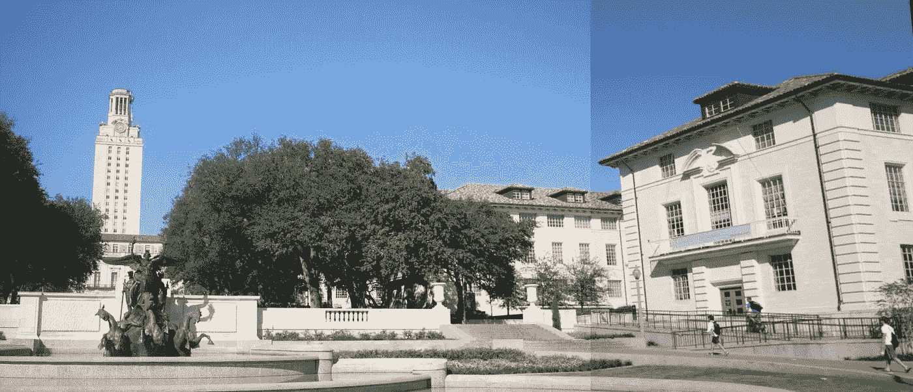
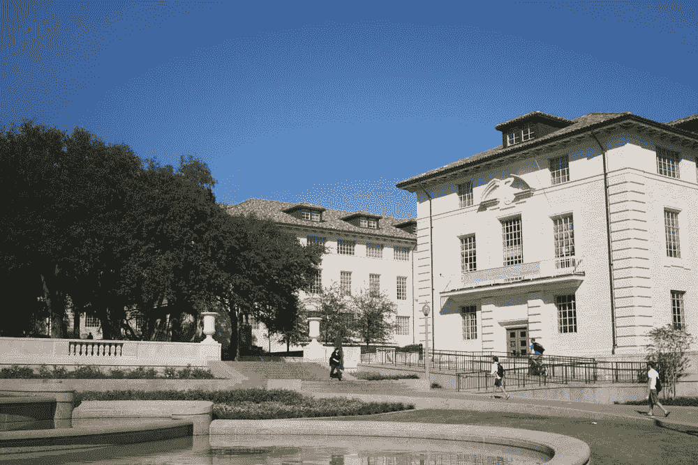
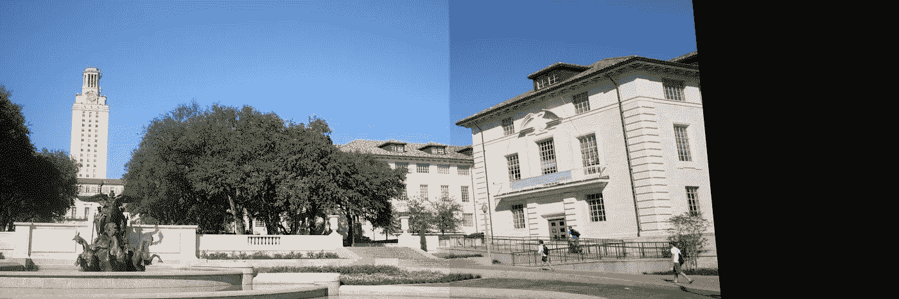

# 使用 OpenCV 进行图像拼接

> 原文：<https://towardsdatascience.com/image-stitching-using-opencv-817779c86a83?source=collection_archive---------2----------------------->

如你所知，Google photos 应用程序具有令人惊叹的自动功能，如视频制作、全景拼接、拼贴制作、根据照片中人的存在整理照片等等。我一直想知道为什么这些都是可能的。但是有一天，我觉得自己做全景拼接非常酷。



当我要做一个图像拼接的项目时，我感到非常兴奋。当我终于成功地建立了我自己的图像拼接器时，那是一个灵光一现的时刻:)。我在***Python***——我一直最喜欢的语言和使用 ***OpenCV 3.1.0*** 中做的。

尽管互联网上有很多这方面的资源，但今天我想和代码[一起展示我的工作。下面的代码和解释都是为了把两张图片拼接在一起。](https://github.com/vagdevik/Computer-Vision/blob/master/Assignment-3/3_image_stitch.py)

首先，让我们导入必要的模块。

```
import cv2
import numpy as np
import matplotlib.pyplot as plt
from random import randrange
```

正如我们所知，我们正在拼接 2 幅图像，让我们来阅读它们。



left.jpg and right.jpg

```
img_ = cv2.imread(‘right.JPG’)
img1 = cv2.cvtColor(img_,cv2.COLOR_BGR2GRAY)img = cv2.imread(‘left.JPG’)
img2 = cv2.cvtColor(img,cv2.COLOR_BGR2GRAY)
```

[cv2.cvtColor](https://docs.opencv.org/2.4/modules/imgproc/doc/miscellaneous_transformations.html#cvtcolor) 将输入的 RGB 图像转换成灰度形式。

对于图像拼接，我们遵循以下主要步骤:

1.  计算两幅图像的 sift 关键点和描述符。
2.  计算一幅图像中的每个描述符和另一幅图像中的每个描述符之间的距离。
3.  为图像的每个描述符选择前“m”个匹配项。
4.  运行 [RANSAC](https://www.learnopencv.com/image-alignment-feature-based-using-opencv-c-python/) 来估计单应性
5.  缝合时要对齐的经线
6.  现在把它们缝在一起

非常感谢…，

首先，我们必须找出两幅图像中匹配的特征。这些最匹配的特征充当缝合的基础。我们提取两幅图像的关键点和 sift 描述符，如下所示:

```
sift = cv2.xfeatures2d.SIFT_create()
# find the keypoints and descriptors with SIFT
kp1, des1 = sift.detectAndCompute(img1,None)
kp2, des2 = sift.detectAndCompute(img2,None)
```

kp1 和 kp2 是关键点，des1 和 des2 是相应图像的描述符。

现在，在一幅图像中获得的描述符也将在该图像中被识别。我们的做法如下:

```
bf = cv2.BFMatcher()
matches = bf.knnMatch(des1,des2, k=2)
```

[BFMatcher()](https://docs.opencv.org/3.0-beta/doc/py_tutorials/py_feature2d/py_matcher/py_matcher.html) 匹配更相似的特征。当我们设置参数 k=2 时，我们要求 knnMatcher 为每个描述符给出 2 个最佳匹配。

“匹配”是一个列表列表，其中每个子列表由“k”个对象组成。为了理解这一点，并更好地跟踪接下来的部分，请通过[这个](https://docs.opencv.org/3.1.0/dc/dc3/tutorial_py_matcher.html)。

通常在图像中，这些特征很有可能存在于图像的许多地方。这可能会误导我们在实验中使用琐碎的特征。因此，我们从所有匹配中筛选出最佳匹配。因此，我们使用上面获得的前 2 个匹配来应用比率测试。如果下面定义的比率明显大于规定的比率，我们认为匹配。

```
# Apply ratio test
good = []
for m in matches:
if m[0].distance < 0.5*m[1].distance:
good.append(m)
matches = np.asarray(good)
```

现在是对齐图像的时候了。如您所知，执行转换需要单应矩阵，并且单应矩阵需要至少 4 个匹配，我们执行以下操作。点击了解更多[。](https://www.learnopencv.com/image-alignment-feature-based-using-opencv-c-python/)

```
if len(matches[:,0]) >= 4:
src = np.float32([ kp1[m.queryIdx].pt for m in matches[:,0] ]).reshape(-1,1,2)
dst = np.float32([ kp2[m.trainIdx].pt for m in matches[:,0] ]).reshape(-1,1,2)H, masked = cv2.findHomography(src, dst, cv2.RANSAC, 5.0)
#print H
else:
raise AssertionError(“Can’t find enough keypoints.”)
```

最后是最后一部分，图像的拼接。既然我们已经找到了变换的单应性，现在我们可以继续将它们扭曲并缝合在一起:

```
dst = cv2.warpPerspective(img_,H,(img.shape[1] + img_.shape[1], img.shape[0]))
plt.subplot(122),plt.imshow(dst),plt.title(‘Warped Image’)
plt.show()
plt.figure()
dst[0:img.shape[0], 0:img.shape[1]] = img
cv2.imwrite(‘output.jpg’,dst)
plt.imshow(dst)
plt.show()
```

我们使用 matplotlib 绘制扭曲的图像，以便很好地可视化扭曲。

结果如下:

