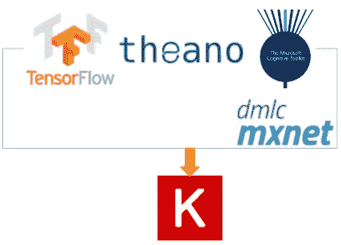

# TensorFlow 1.3 中使用 Keras 的图像标记

> 原文：<https://towardsdatascience.com/image-tagging-with-keras-in-tensorflow-1-2-bc43c1058019?source=collection_archive---------5----------------------->

我们已经了解了如何通过 TensorFlow 使用 [Scikit-learn，并大致讨论了 TensorFlow 的高级 API。TensorFlow 直接支持的另一个流行的高级 API 是 Keras。](https://medium.com/towards-data-science/from-scikit-learn-to-tensorflow-part-2-66c56985d6c7)

[TensorFlow](https://github.com/tensorflow/tensorflow/releases) 1.3 的发布让美国用户可以直接在 TensorFlow 中使用 Keras。 [Keras](https://keras.io) 是一个高级 API 规范，由[Fran ois Chollet](https://twitter.com/fchollet)积极构建，主要是为了降低开发机器学习模型的门槛，并提供一个单一的 API 来访问许多底层的机器学习工具包。Keras 的流行意味着许多模型的框架(代码+预处理)都是现成的，并且由社区很好地维护和改进。



Keras — supported ML toolkits [TensorFlow, Theano, MXNet and Cognitive Toolkit]

# 为什么对 TensorFlow 开发者很重要？

就提交、开发者和更新的数量而言，TensorFlow 是迄今为止开发最活跃的 ML 工具包。然而，随着*的积极发展，API 也发生了变化。另一方面，Keras 为底层的 ML 工具包提供了更高层次的抽象。因此，原型快速 ML 框架的可行性是不可知的变化酝酿之下。*

将 Keras 放在 TensorFlow 中还可以避免安装其他库。如果您以前使用过 Keras，在您的机器上安装 Keras 也意味着安装 Theano(直到最近才支持两个框架)。当只使用 TensorFlow 和 Keras 时，这是一个不必要的 Theano 安装，当您想要部署使用 Keras 开发的 ML 模型时，这也是一个需要关注的原因。

在过去的两篇博客中，我们一直在讨论如何从 Scikit-learn 迁移到 TensorFlow，以及如何将 TensorFlow 和 Scikit-learn 库结合起来开发我们的 ML 模型。将 Keras 集成到 TensorFlow 中带来了一个类似的特性，只是除了 TensorFlow 之外，不需要安装其他库。

# 为什么对 Keras 开发者很重要？

我们不得不承认，TensorFlow 正在成为集成新的 ML 函数和库的领导者。因此，在训练大型深度网络时，Keras 开发人员将极大地受益于 TensorFlow 的分布式训练。

Keras 开发者可以使用的另一个有趣的功能是 TensorFlow 的 [TensorBoard](https://www.tensorflow.org/get_started/summaries_and_tensorboard) 。TensorBoard 不仅提供了培训和评估的可视化，也是[可视化嵌入](https://www.tensorflow.org/get_started/embedding_viz)的简洁实现。

Keras 开发人员还可以访问 [TensorFlow Serving](https://www.tensorflow.org/deploy/tfserve) 和 [Google Cloud ML](https://cloud.google.com/ml-engine/) ，它们允许部署 ML 模型来对生产环境中的新数据进行推理。

# 用 5 行深 CNN 标记图像

深度卷积神经网络已经证明[在图像分类方面优于人类](http://karpathy.github.io/2014/09/02/what-i-learned-from-competing-against-a-convnet-on-imagenet/)。虽然训练这种深度模型所需的 GPU 和 CPU 资源是昂贵的，但推理在计算上并不昂贵。因此，我们看看如何利用不同的艺术级图像分类模型，在少于*五行*代码中对图像进行推理。

并且，为了使这样的推论成为可能，我们使用 Keras 来使这成为可能。以下几行显示了我们如何在 TensorFlow 1.2 中使用 Keras 实现这一点:

```
img = image.load_img('niagara.jpeg', target_size=(224, 224))
x = image.img_to_array(img)
x = np.expand_dims(x, axis=0)
x = preprocess_input(x)

preds = model.predict(x)
```

正如所承诺的，我们处理图像并在 5 行代码中推断其内容(*忽略导入，咄！*)。在上面的代码中我们还没有定义的一件事是*模型*。有两个非常好的深度 CNN 模型，其性能优于人类。我们对用于执行分类的[残差网络](https://arxiv.org/abs/1512.03385)和 [Inception v3](https://arxiv.org/abs/1512.00567) CNN 模型特别感兴趣。这两个模型都是深度网络，需要数周时间在 ImageNet 数据上进行训练。然而，我们将简单地*站在巨人*的肩膀上，下载这些模型并对我们的图像进行推理。我们如下初始化剩余网络(50 层深的 CNN ):

```
model = ResNet50(weights='imagenet')
```

我们可以类似地使用一个 Inception v3 模型来为我们的预测加载权重。我们如下初始化 Inception v3 模型:

```
model = InceptionV3(weights='imagenet')
```

我们对之前加载的图像进行推断，以获得我们预测的类别和概率，如下所示:

```
preds = model.predict(x)
```

我们可以如下解码来自模型的图像预测:

```
print('Predicted:', decode_predictions(preds, top=5)[0])
```

从图像加载到执行预测的端到端框架的笔记本可以在我的 GitHub 存储库中找到。《盗梦空间》v3 T1 和《T2》残网 T3 笔记本上市了。在我的 GitHub 上的 [Keras 资源库](https://github.com/karthikmswamy/Keras_In_TensorFlow/)中有一些更有趣的脚本，供那些想使用 Keras 探索其他 TensorFlow 应用程序的人使用。

在 TensorFlow 最近的更新中，使用最先进的深度 CNN 标记图像变得非常容易。Keras 作为高级 API，肯定降低了进入 ML 的门槛。查看我的 [Keras](https://github.com/karthikmswamy/Keras_In_TensorFlow/) ，了解更多使用 Keras 和 TensorFlow 构建的应用程序。

让我知道你想要建造什么。请在下一篇博文中留下您希望我讨论的内容！干杯！