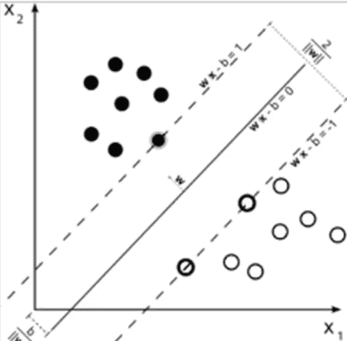

# 人工智能和机器学习对交易和投资的影响

> 原文：<https://towardsdatascience.com/impact-of-artificial-intelligence-and-machine-learning-on-trading-and-investing-7175ef2ad64e?source=collection_archive---------2----------------------->

Source: Wikipedia

以下是我几个月前在欧洲做的一次演讲的节选，当时我是一名受邀演讲者，面对的是一群低调但高净值的投资者和交易者。主题被主办方确定为关于人工智能和机器学习对交易和投资的影响。以下节选分为四个部分，涵盖了原演示文稿的 50%左右。

**1。人工智能和机器学习对交易的一般影响**

人工智能(AI)允许用机器代替人类。在 20 世纪 80 年代，人工智能研究主要集中在专家系统和模糊逻辑上。随着计算能力变得越来越便宜，使用机器解决大规模优化问题在经济上变得可行。由于硬件和软件的进步，如今人工智能专注于使用神经网络和其他学习方法来识别和分析预测器，也称为特征或因素，这些预测器具有经济价值，可以与分类器一起使用，以开发有利可图的模型。人工智能的这种特殊应用通常被称为机器学习(ML)。

基于人工智能开发交易策略的方法在短期和长期投资中的应用越来越受欢迎，有一些对冲基金在这一领域非常活跃。然而，由于各种因素，这种新技术的广泛接受是缓慢的，最重要的是人工智能需要对新工具和人才的投资。大多数基金使用基本面分析，因为这是经理们在 MBA 课程中学到的东西。单纯依靠 AI 的对冲基金并不多。人工智能在零售层面的应用越来越多，但大多数交易者仍然使用二十世纪中期提出的方法，包括传统的技术分析，因为它们容易学习和应用。

请注意，人工智能和 ML 不仅用于开发交易策略，还用于其他领域，例如开发流动性搜索算法和向客户建议投资组合。因此，随着人工智能应用的普及，参与交易和投资决策的人数减少了，这显然会影响市场和价格行为。现在推测这种新技术对行业的整体影响还为时过早，但人工智能的广泛使用可能会导致更有效的市场，在更长的时间内波动性更低，随后由于制度变化而偶尔出现波动性峰值。这是可能的，因为人类对信息的主观评估的影响将被最小化，并且相关的噪声也将被最小化。但这还有待实践检验。

**2。人工智能和机器学习对阿尔法一代的影响**

在这些采用人工智能技术的初始阶段，对于那些了解它并知道如何管理其风险的人来说，将会有机会。基于人工智能的交易策略的一个问题是，它们可能产生比随机模型更差的模型。我将试着解释我的意思:传统的技术分析是一种无利可图的交易方法，因为基于图表模式和指标的策略在任何交易成本之前从零均值分布中获得回报。有些交易者总是出现在分布的右尾，这给人一种错误的印象，认为这些方法有经济价值。我的研究表明，特别是在期货和外汇市场，无论使用哪种方法都很难实现长期盈利，因为这些市场旨在让做市商受益。然而，在较短的时间内，由于运气好，一些交易者可以在杠杆市场上获得高额利润。然后，这些交易者把他们的成功归因于他们的策略和技巧，而不是运气。

对于 AI 和 ML，还有额外的影响，如偏差-方差权衡。数据挖掘偏差可能导致策略过度适应过去的数据，但对新数据立即失效，或者策略过于简单，没有捕捉到数据中具有经济价值的重要信号。这种权衡的结果是比随机策略更差的策略，甚至在交易成本增加之前，这些交易者的回报分布也是负的。在后量化宽松时代，这为大型基金和投资者带来了获利机会。然而，随着比随机更差的人工智能交易者被从市场上清除，只有那些拥有稳健模型的交易者留下来，利润之战将变得激烈。现在猜测人工智能交易员或大型投资者是否会赢得这场战斗还为时过早。

我还想提一下这方面一个常见的误解:有些人认为值在使用的 ML 算法中。这不是真的。真正的价值在于所使用的预测因素，也称为特征或因素。最大似然算法无法在没有金子的地方找到金子。一个问题是，大多数 ML 专业人员使用相同的预测器，并试图以迭代的方式开发模型，这将产生最佳结果。这一过程受到数据挖掘偏见的困扰，并最终失败。简而言之，数据挖掘偏差是由对许多模型多次使用数据的危险做法造成的，直到结果在训练和测试样本中可以接受。我在这一领域的研究表明，如果一个简单的分类器，如二元逻辑回归，不能令人满意地与一组给定的预测因子一起工作，那么它很可能没有经济价值。因此，成功取决于所谓的*功能工程*，这既是一门科学，也是一门艺术，需要知识、经验和想象力来提出具有经济价值的功能，只有一小部分专业人士可以做到这一点。

**3。人工智能和机器学习对技术分析的影响**

我们必须区分传统技术分析和定量技术分析，因为所有依赖于价格和交易量序列分析的方法都属于这一范畴。传统的技术分析，即图表模式、一些简单的指标、某些价格行为理论等。，一开始就没有效果。除了一些范围和深度有限的不完整的努力，吹捧这些方法的出版物从未提出他们的长期统计预期，而只是承诺如果使用这种或那种规则，将有利润潜力。由于市场的利润和亏损遵循某种统计分布，总有人把他们的运气归功于这些方法。与此同时，整个行业围绕这些方法发展起来，因为这些方法简单易学。不幸的是，许多人认为他们可以通过更好地使用其他人都知道的方法来获利，结果是大量财富从这些天真的交易员转移到做市商和其他消息灵通的专业人士手中。

在 20 世纪 90 年代早期，一些市场专业人士意识到大量的散户在用这些幼稚的方法交易。一些人开发了算法和人工智能专家系统，以提前识别地层，然后根据它们进行交易，这导致了散户交易者(也称为弱手)无法应对的过程波动。从更根本的角度来说，传统技术分析的失败可以归因于从 20 世纪 90 年代开始的市场中高序列相关性的消失。基本上是高度的序列相关性提供了这些方法有效的错误印象。如今，除了少数例外，市场正在回归均值，没有给简单的技术分析方法留下空间。然而，一些定量的技术分析方法往往效果很好，如均值回复和统计套利模型，包括使用具有经济价值的特征的 ML 算法。

请注意，这种类型的套利不太可能在人工智能和 ML 的案例中重复，因为模型的种类繁多，而且大多数模型都是专有的，但这种新技术的主要问题不是确认偏差，就像传统技术分析的情况一样，而是数据挖掘偏差。

在我看来，观察市场，看图表，正在成为一个过时的过程。交易的未来是关于实时处理信息、开发和验证模型。未来的对冲基金将不再依赖图表分析。有些人仍然这样做，因为他们正处于新旧时代的交接点。许多不熟悉人工智能的交易者将发现未来很难竞争，并将退出。

**4。新交易技术的赢家和输家**

人工智能的应用将在许多方面改变交易，这已经在发生。投资者可能很快就会发现，在 QE 引发的当前趋势结束后，中期回报将远低于预期。如果这种情况成为现实，那么投资者将不得不回到老路上，寻找一位优秀的财务顾问，他可以建议投资组合，并挑选会升值的证券。在某些情况下，顾问将是一个人工智能程序，这个过程将在线执行。

交易者需要熟悉这项新技术。大多数交易者仍在旧方法中挣扎，只是希望“买入下跌”会奏效，并为未来几年提供利润。

其中一个问题是在过去的八年里，中央银行在金融市场的直接支持下培育的*道德风险*。许多交易员和投资者现在认为，熊市是不可能的，因为央行将把他们的损失重新分配给其他所有人，尽管他们可以保留自己的利润。因此，大多数市场参与者对下一次重大的市场机制变化毫无准备，可能会面临毁灭性的损失。

网上有关于 ML、AI 和交易的优秀资源。最好的学习方法是试图解决一些实际问题。但我认为，对大多数交易者来说，这种转变是不可能的。理解和应用人工智能所需的技能组合排除了 95%习惯于在图表上画线和观察均线的交易者。

投资者应该自己做研究，并咨询熟悉这些新发展的有能力的财务顾问。每个投资者都有不同的风险规避特征，很难提供通用的指导方针。机器人顾问很快就会激增，选择一个适合特定需求和目标的机器人顾问可能会成为一项具有挑战性的任务。

任何不熟悉 ML 和 AI 以及它们与交易和投资的关系的人可能会发现，向熟悉这一领域的专业人士咨询比开始阅读书籍和文章更有利可图，阅读书籍和文章可以在理解基础知识后进行。我希望我已经在这次演讲中提供了一个大概的想法，可以作为这个有趣且可能有回报的努力的起点。

***注来自《走向数据科学》的编辑:*** *虽然我们允许独立作者根据我们的* [*规则和指导方针*](/questions-96667b06af5) *发表文章，但我们不认可每个作者的贡献。你不应该在没有寻求专业建议的情况下依赖一个作者的作品。详见我们的* [*读者术语*](/readers-terms-b5d780a700a4) *。*

如有任何问题或意见，欢迎在推特上联系: [@mikeharrisNY](https://twitter.com/mikeharrisNY)

关于作者:迈克尔·哈里斯是一名交易者和畅销书作家。他也是 17 年前第一个识别价格行为无参数模式的商业软件的开发者。在过去的七年里，他一直致力于开发 DLPAL，这是一个软件程序，可以用来识别市场数据中的短期异常，与固定模型和机器学习模型一起使用。点击此处了解更多信息。