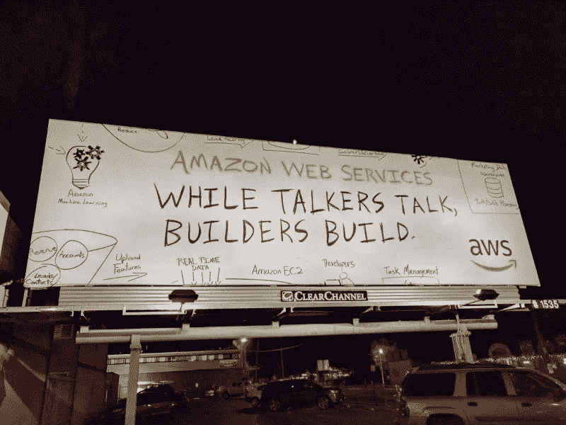
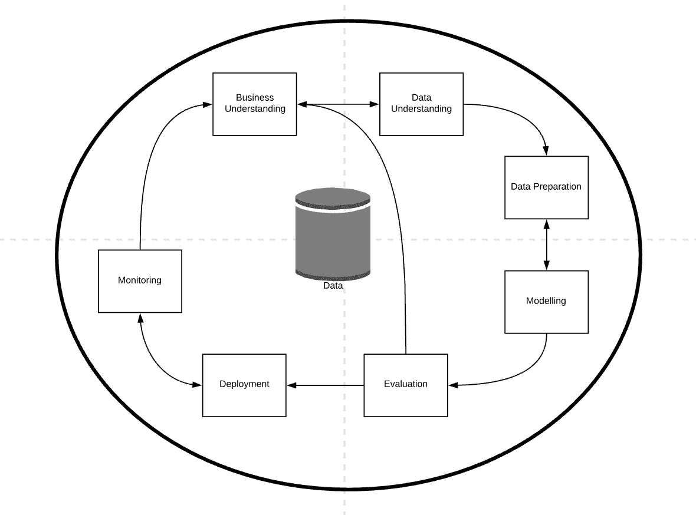
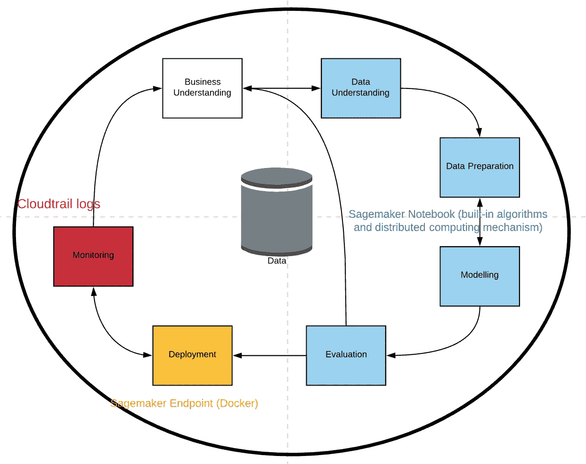
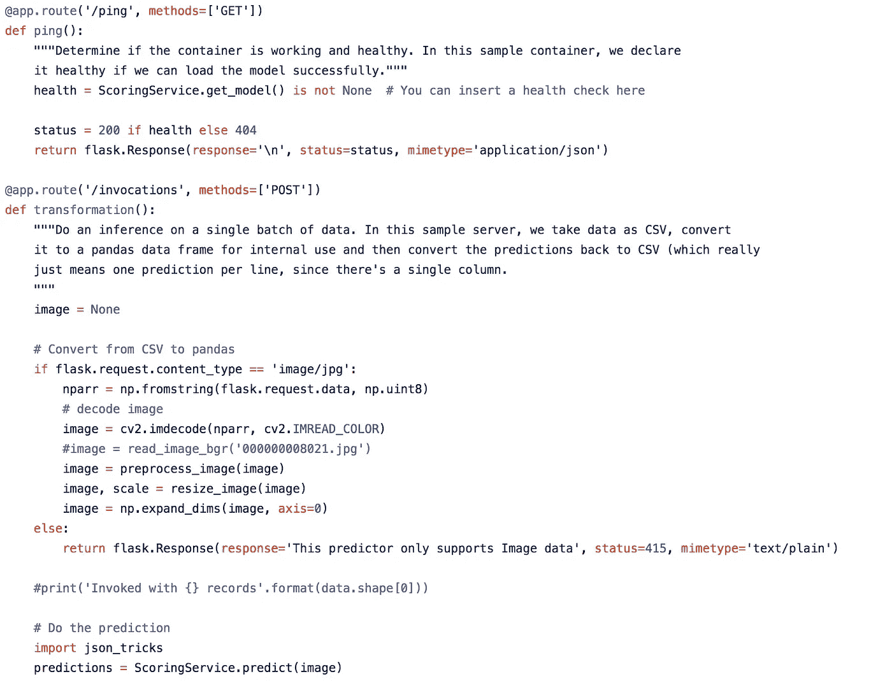
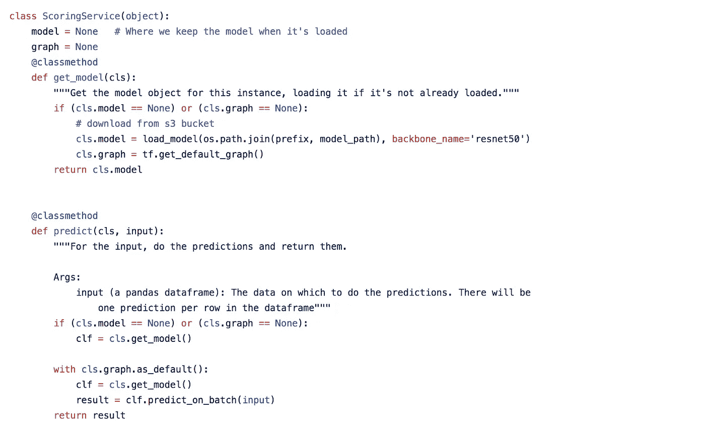
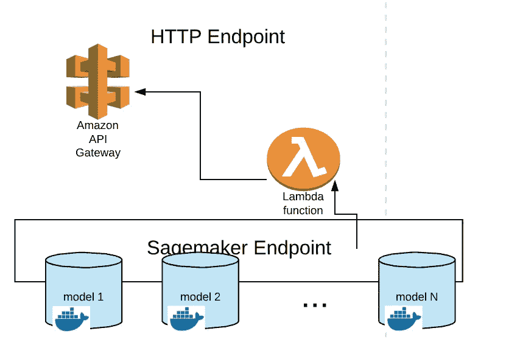
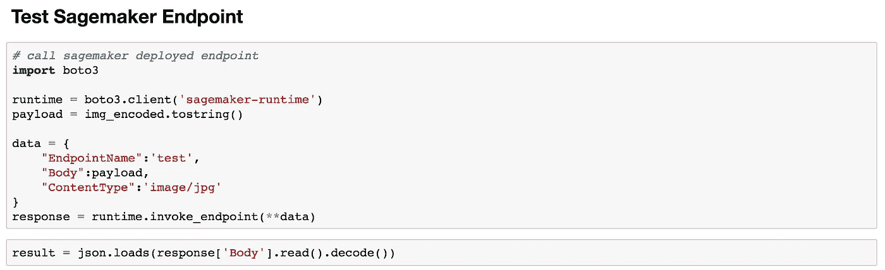

# 利用 AWS SageMaker 实现清晰的数据科学

> 原文：<https://towardsdatascience.com/implement-crisp-data-science-with-aws-sagemaker-59163a63b0ad?source=collection_archive---------6----------------------->

本文旨在展示 AWS 开发和托管行业标准机器学习产品和研究级算法的能力和敏捷性。

该概念通过使用“对象检测算法”示例([https://github.com/wutianchen/object-detection-algo](https://github.com/wutianchen/object-detection-algo))在 AWS 云上实施 CRISP 数据科学工作流得到验证。

# 数据科学中关注点的分离

CRISP(数据挖掘的跨行业标准流程)是一个敏捷的工作流或框架，它很好地捕捉了数据科学中关注点的分离。

CRISP Workflow

标准 CRISP 包括上述 7 个组件和 4 个阶段。

1.  形成业务问题并收集数据
2.  处理数据并基于数据建立模型
3.  将模型打包到数据产品中并部署
4.  监控模型并收集信息

过程中来来回回并不少见。例如，我们可能被迫收集某些数据来回答一个业务问题，或者尝试各种统计模型来提高模型的准确性。

# SageMaker—CRISP 的 AWS 实现

[SageMaker](https://github.com/awslabs/amazon-sagemaker-examples) 涵盖了从“数据理解”到“监控”的脆。前 SageMaker 时代的另一个类似工具是[钯](https://github.com/ottogroup/palladium)。

SageMaker and CRISP

**SageMaker 笔记本:** (Jupyter 笔记本)启用从数据处理到统计建模，从分布式模型训练到评估的所有数据科学工作。

SageMaker 既允许[定制算法](https://github.com/awslabs/amazon-sagemaker-examples/blob/master/advanced_functionality/scikit_bring_your_own/scikit_bring_your_own.ipynb)，也允许[内置算法](https://aws.amazon.com/blogs/machine-learning/amazon-sagemaker-now-supports-pytorch-and-tensorflow-1-8/)。

**SageMaker 端点:**利用微服务容器架构部署数据科学的成果。也允许在单个端点后部署集合模型(加权模型集合)。

**sage maker 和 Cloudtrail 的集成:**自动记录结果。监控对于数据科学非常重要，因为它可以检测模型在现实世界中的“真实”准确性和数据分布漂移，以支持下一次清晰迭代中的决策。

# 一个例子——检测图像中的对象

*   **我们来形成一个问题:**

用概率检测图像中预定义对象列表的位置和标签。

*   **问题需要算法:**

为了解决这个问题，我们借用 Keras RetinaNet 对象检测算法(后端 tensorflow)的[实现，在论文](https://github.com/fizyr/keras-retinanet)[密集对象检测的焦损失](https://arxiv.org/abs/1708.02002)中有详细描述。

使用快速 R-CNN 实现的以前版本的解决方案可以在这里找到(博客:[用更快的 R-CNN](https://softwaremill.com/counting-objects-with-faster-rcnn/) 计算对象)

可以在 [Pascal VOC 数据集](http://host.robots.ox.ac.uk/pascal/VOC/)以及 [MS COCO 数据集](http://cocodataset.org/#home)等上轻松训练模型。使用存储库中提供的脚本。然后在特定领域数据集上应用迁移学习来提高其回答特定问题的性能。

由于关注点的分离，模型可以在不涉及项目其他部分的情况下被改变和部署。

> 把算法的东西还给算法，把基础设施的东西还给基础设施。

*   **算法需要一个 web 服务器:**

为了在 AWS 上部署该算法，必须实现两个接口。

1.  web 服务器路由接口
2.  预测功能界面

(由于 AWS Lambda 的上传限制，以无服务器方式在 AWS 上部署机器学习算法仍然很困难。)

实现 web 服务器路由接口(/ping 和/invocations)

实现预测接口(get_model 和 predict 函数)

带有轻量级 python web 服务器 flask 和 docker 脚本的通用模板可以在[这里](https://github.com/awslabs/amazon-sagemaker-examples/blob/master/advanced_functionality/scikit_bring_your_own/)找到。

*   **服务器需要端点:**

使用 Sagemaker，有两种面向客户端的端点可能性

Build Endpoint for ML Model

1.  HTTP 端点([https://AWS . Amazon . com/blogs/machine-learning/call-an-Amazon-sage maker-model-Endpoint-using-Amazon-API-gateway-and-AWS-lambda/](https://aws.amazon.com/blogs/machine-learning/call-an-amazon-sagemaker-model-endpoint-using-amazon-api-gateway-and-aws-lambda/))
2.  SageMaker API 端点([https://docs . AWS . Amazon . com/SageMaker/latest/DG/API _ runtime _ invokeendpoint . html](https://docs.aws.amazon.com/sagemaker/latest/dg/API_runtime_InvokeEndpoint.html)

模型被打包到 docker 容器中，并自动部署到 AWS ECR 上。然后可以通过端点调用 predict()方法来提供推断。

*   **测试终点:**

我们可以用 Sagemaker Notebook 调用和测试已部署的 ML 端点，并可视化结果。

Invoke the Endpoint

在原始图像上绘制结果:

# 总结和下一次迭代

总之，AWS SageMaker 是目前市场上在敏捷框架下实现数据科学概念的最佳工具。它还集成了其他 AWS 本地服务，如 S3，红移，AWS Lambda，AWS IoT 等。很好。例如，结合 Kinesis KVS，我们可以将图像对象检测扩展到视频流中的对象检测。

因为这是敏捷的…所以我们从简单开始，经过多次迭代来添加特性。